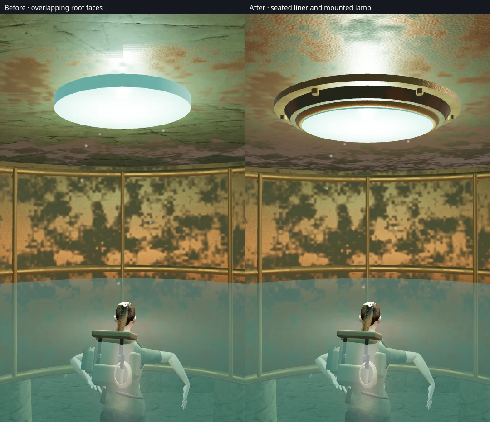
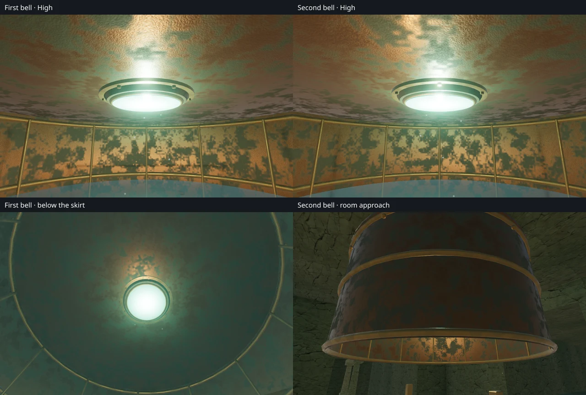

# Air-bell ceilings and lamp mounts

The two bronze air bells beneath the Drowned Kingdom now have ceilings that sit
inside the surrounding stone rooms. Their lamps have fitted bronze flanges,
tapered housings, rolled glass retainers and six visible fasteners.

The former bronze underside occupied exactly the same plane as the room's stone
ceiling. The renderer alternated between the two materials, producing rectangular
patches and bands most clearly visible near the lamp on Low. Upward raycasts
found both surfaces at the same height in both bells; a diagnostic render with
the stone backing hidden removed the patches.

Each bronze underside now sits **8 cm below the stone backing**. The cap remains
20 cm thick, so its upper portion embeds in the host structure. The skirt, trim,
lamp and falling drips derive their positions from this finished ceiling. Camera
and swimming clearance follow the cap and its flange, with a circular boundary
around the lamp housing. A box boundary was rejected because it blocked clear
space beside the round fixture.

The lamp's flange embeds in the bronze liner, the tapered housing overlaps the
glass, and the retaining rim meets both. The existing light remains below the
lens. These parts use the existing credited bronze material and batch with the
rest of the gallery; no new external asset or sound recording is required.

## Verification

The new geometry regression checks **96 upward rays** across both ceilings,
confirming separate bronze and stone surfaces and clearance beneath the rendered
underside. It also checks clearance beneath the lamp's actual glass face.

The rendered review covers **28 views**: both bells at High and Low, each from
the ordinary follow camera, four interior bearings, below the skirt and the
room approach. All observer positions are clear and all shaders link. The images
were reviewed in labeled sheets, with close views inspected at full resolution.

Both existing drip emitters retain their positions. Three listening positions
per bell produce gains of **0.2000, 0.1961 and 0.1832** as listener distance grows
from 0.28 m to 1.53 m and 2.62 m. All six checks retain an active, unobstructed
source. This verifies distance behavior, not subjective listening quality.

All **632 automated tests** pass. The production build succeeds with the
existing large-chunk warning.

The final assisted route check completes the entire memorial circuit with full
water and again with the harbor reservoir lowered by 1.8 m. Both runs use the
air bells, open the emergency gates, recover the memorial record, visit all nine
gallery areas and return to the surface with health at 100. Across **162 route
renders**, exterior culling and shadow state restore correctly. Moving to the
crystal chapter clears the gallery renderer state and links its shaders.

The final production build passes **four native input cases**: keyboard and
touch diving and resurfacing at each bell, using both unfinished and completed
gallery saves. Diving reduces the visible air counter to 31 seconds; resurfacing
restores 32. Health stays at the seeded 93. **Eight reloads** preserve every
normalized save field, including camera angles, except timestamps.

All eight production captures were reviewed. The checks also confirm the final
bundle names, absence of the development hook, no viewport overflow, and no
browser errors, warnings or failed requests. The tested JavaScript bundles are
`game-B9bq6CmM.js`, `index-rIcZK0Cc.js` and `three-DQZTZ_dW.js`.

## Scope

This repairs VA-14 from the [visual audit](visual-audit.md). It improves the two
air-bell interiors and their lamp construction. The wider audit remains open
for repeated court and station composition and continuous approach/return views.
Raw captures, diagnostic variants, profiles and disposable saves remain in
ignored local staging. The two images above are intentional public evidence;
existing [asset attribution](asset-credits.md) is retained. These checks do not
establish human chapter duration, consumer-device performance or AAA parity.
