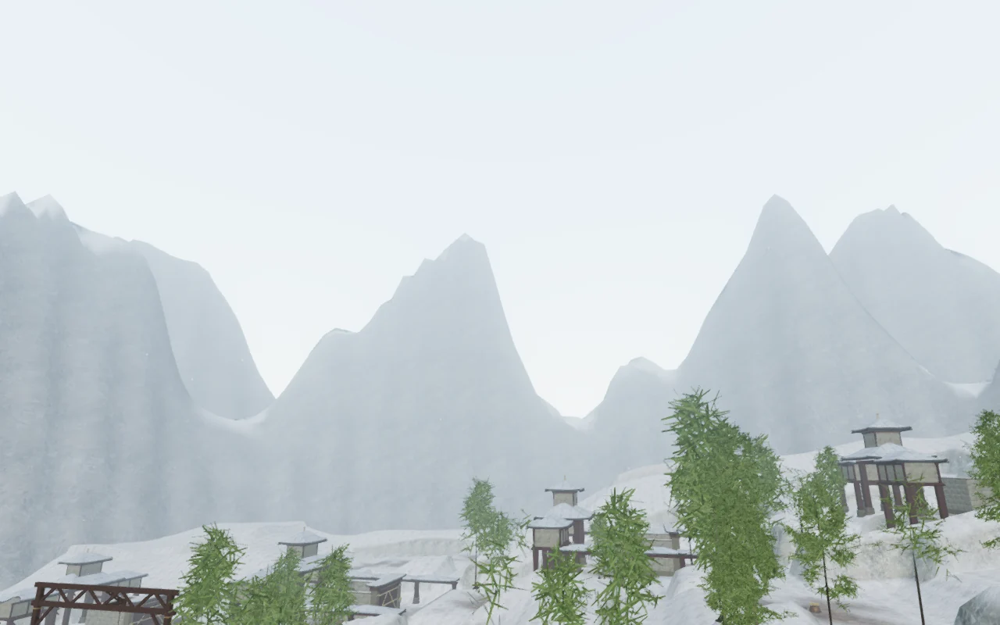
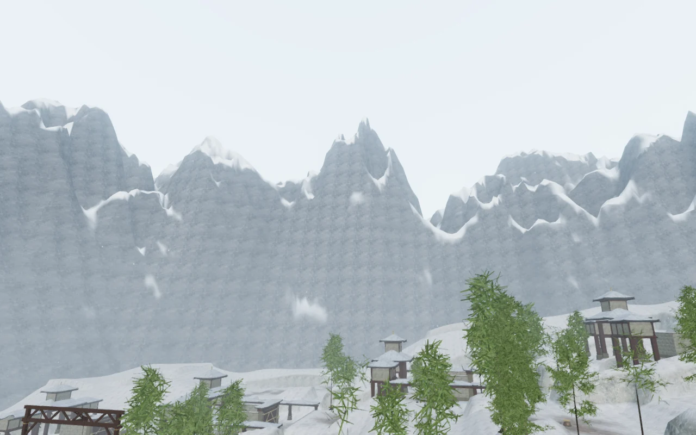
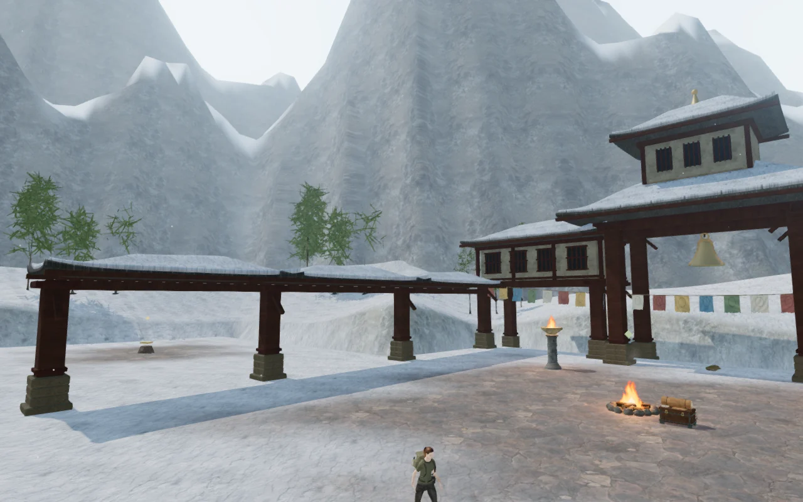
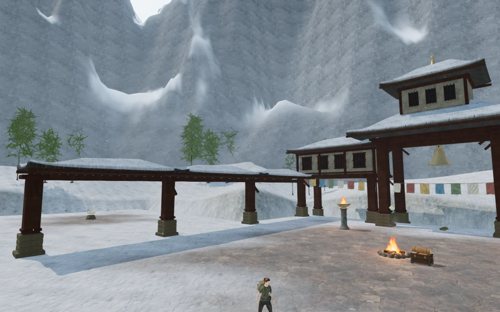
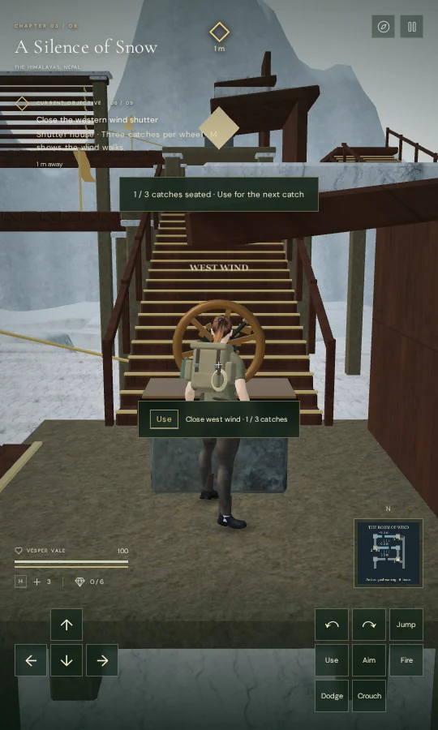
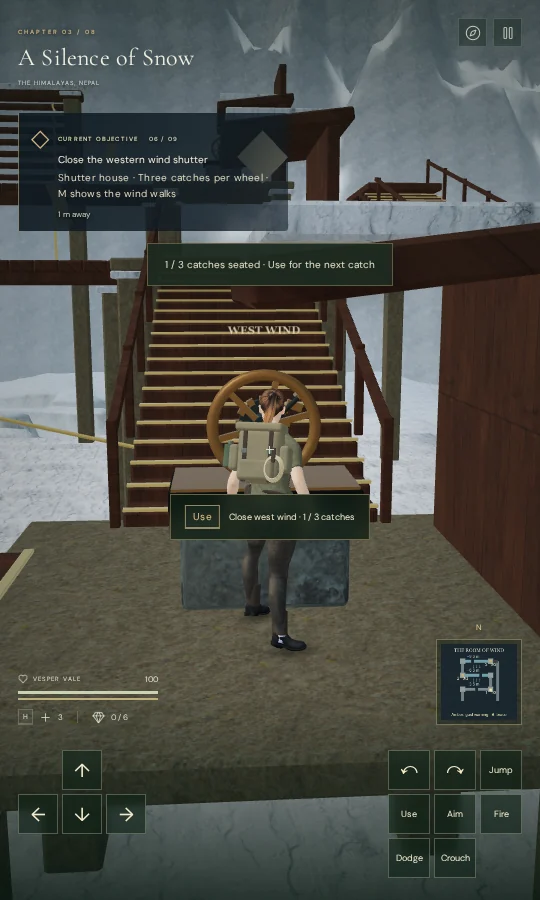

# Alpine ridges and readable objectives

**A Silence of Snow** now has two irregular connected mountain ranges in place
of the earlier repeating radial peaks. Broader slopes, broken crests and gullies
vary the silhouette; projected rock normals, snow-covered ledges and lighter
high-altitude haze give the faces more separation.

| Previous eastern view | Revised eastern view |
| --- | --- |
|  |  |

## Geometry, material and depth

Each range now contains **33,345 vertices and 65,536 triangles**, up from 11,877
vertices and 23,040 triangles. Together their position, normal, UV and index
arrays occupy 2,920,512 bytes, an increase of 2,073,936 bytes (about 1.98 MiB)
before renderer overhead. Source arrays also remain in CPU memory.

The inner feet remain outside the playable square. Each range extends outward
for 400 m; the second begins farther away to separate the silhouettes. Warped
Cartesian noise varies the crests and rock cuts continuously around each ring.
The seam positions and averaged normals match, and all faces point upward.

The material projects the existing Rock Boulder Dry color and normal maps in
world metres. Snow coverage depends on elevation, slope and irregular patches;
rock retains stronger surface normals while snow softens them. Distance haze is
denser near the foot of the range. No new texture, model, recording or dependency
is introduced. Attribution remains in [asset credits](asset-credits.md).

Both shells use a shared background depth interval, which preserves their
mutual ordering beyond the gameplay camera's 450 m far plane. The sky renders
first, and depth is cleared after the second shell before the playable world
renders. The original near-plane distance still clips the mountains in reflected
views. Both shells are excluded from the nearby contact-shadow buffer.

The [browser depth verifier](../scripts/verify-alpine-browser.js) compares both
shells together against a conventional 1,600 m camera in four directions at
512 × 320. All four ordinary comparisons are pixel-identical. Twelve foreground
probes at 3, 225 and 449 m remain visible and match their references exactly.
A 60 m oblique plane clips the range in every direction; at most six color
channels differ by more than one byte from the reference, with mean absolute
channel error below 0.0017. This checks projection and clipping in this renderer,
not support across all devices.

| Previous approach | Revised approach |
| --- | --- |
|  |  |

## Rendering cost

Four unobstructed matching High-quality views at 1280 × 800 keep the same
player/camera positions and scene time. Each submits two fewer draw calls and
38,912 additional triangles: the denser color meshes replace the earlier
meshes and their unnecessary contact-buffer submissions. A fifth captured view
was inside foliage and is excluded from the visual comparison.

| View | Calls before → after | Triangles before → after |
| --- | ---: | ---: |
| Arrival court | 354 → 352 | 993,726 → 1,032,638 |
| Wind house | 905 → 903 | 1,503,277 → 1,542,189 |
| Western wind walk | 598 → 596 | 1,340,610 → 1,379,522 |
| Eastern range | 639 → 637 | 1,723,407 → 1,762,319 |

A separate live-loop timing experiment used the eastern view, Chromium with
ANGLE/Vulkan, an AMD Radeon 780M, 1280 × 800 and pixel ratio 1. Each quality used
an old/new/new/old sequence, 1.3 seconds of settling and approximately 4.2 seconds
of measurement per case. The old and new ranges shared the rest of the scene.
GPU queries reported no disjoint events.

| Quality | Previous range, mean GPU ms | Revised range, mean GPU ms | Increase in pair mean |
| --- | ---: | ---: | ---: |
| High | 13.899, 13.898 | 14.918, 15.058 | 1.09 ms |
| Low | 6.933, 6.941 | 8.432, 8.394 | 1.48 ms |

High mean frame intervals ranged from 26.440–27.264 ms before and
23.409–27.625 ms after. Low ranged from 16.797–17.004 ms before and
16.800–16.867 ms after. These short, variable samples demonstrate an added GPU
cost, not a frame-rate improvement or a supported-device performance guarantee.
Low already omits the contact pass, so its range changes add 84,992 submitted
triangles without changing draw calls.

## Objective display and verification

The objective panel now has a dark translucent backing, padding and a thin gold
edge to separate its text from snow and timber. Portrait notifications sit at
least 12 px below the current panel, including after text changes or resizing.
The extra screen waypoint hides
within six metres; the nearby interaction prompt and world marker still identify
the object. More distant targets retain their screen waypoint.

| Previous portrait display | Revised portrait display |
| --- | --- |
|  |  |

All **551 automated tests** and the production build pass. Vite retains its
existing bundle-size advisory. Browser snapshots confirm that playable terrain
heights, water definitions, objective placement and obstacle data match the
previous version exactly.

The continuous assisted wind-house route crosses all three gaps, seats all nine
catches and returns down the eastern stair at 100 health. Its 67.35 simulated
seconds are an automation result, not a human completion-time estimate. High,
Medium and Low shaders link successfully. Changing chapters releases the tracked
119 geometries, 20 materials and 16 textures exactly once; both mountain shells
and all six shutter sources are removed.

Positioned wind and machinery voices, objective music changes and pause behavior
also pass. Offline stereo checks measure wind RMS of 0.115687 at 2 m, 0.057844 at
15.5 m and zero at 30 m. The drive measures 0.219191 at 2 m, 0.109596 at 11.5 m
and zero at 22 m. The middle samples are half the near amplitude. These checks
verify attenuation behavior; they do not establish subjective mix quality.

The final production build passes keyboard/touch interaction, map access and
local-storage reload checks at **1280 × 800, 540 × 900, 360 × 800 and 960 × 540**,
covering all three graphics settings. Saved chapter data matches after reload
apart from the visit timestamp. The panel stays on-screen and clear of the
interaction prompt and catch notification. Nearby screen waypoints hide, and a
separate entrance check confirms distant guidance remains visible. No browser
errors, warnings or failed HTTP responses were recorded; loaded bundles match
the production build and the development control hook is absent.

The initial layout run exposed the overlapping portrait notification. Its
landscape assertion also incorrectly treated vertically intersecting panels
as overlapping even when they were side by side. Notification placement and
the rectangle-intersection check were corrected, then all four screen sizes
and the distant-guidance case passed again on the final build.

The range and surrounding architecture still have visible procedural repetition.
Modern AAA graphics, approximately one-hour chapters, subjective listening
quality and broader device acceptance remain open requirements. Automated routes
and short renderer samples cannot establish those outcomes.
