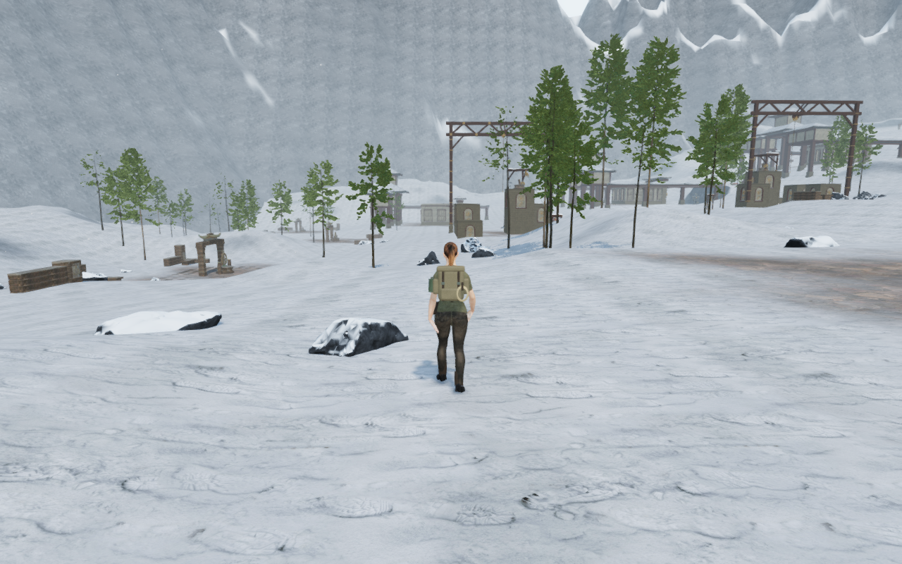
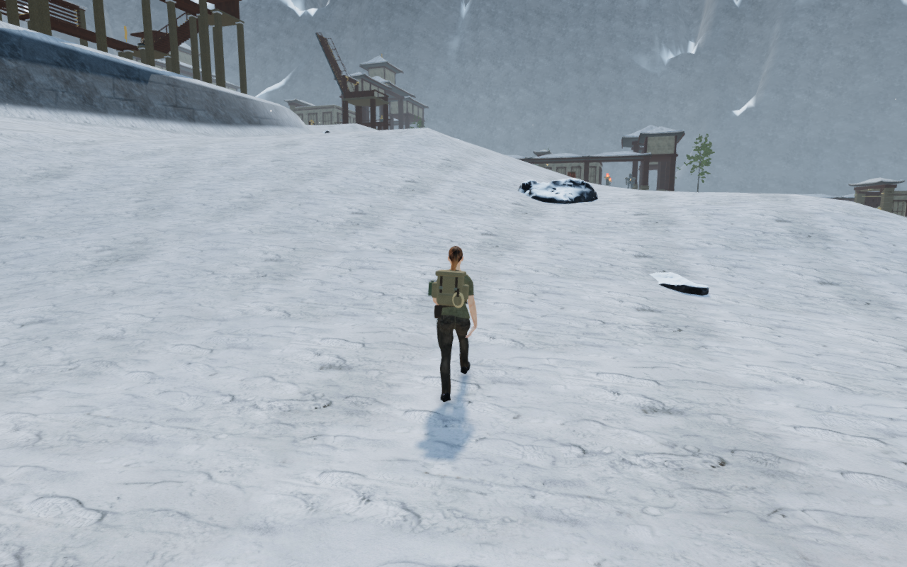
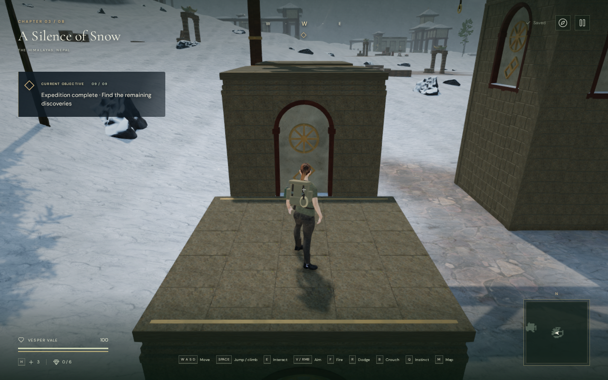
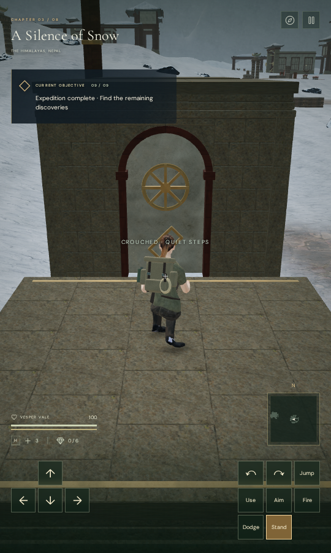

# Alpine rock variation

Walking between the Himalayan monasteries exposed a regular grid of repeated
rock blotches across the enclosing mountain faces. The range material now
blends three independently shifted samples of the existing colour and normal
maps. Fine rock detail remains, while the dominant repeated colour pattern is
reduced. Mountain faceting and angular snow boundaries remain visible and need
further art work; this is a scoped material improvement.

| Previous early-court view | Revised view |
| --- | --- |
|  |  |

## Finding and repair

An assisted ground circuit reached the early, middle and final courts and
returned to the arrival court: **1,044.303 m, 15,496 controller updates and 49
High-quality views**. The diagnostic replay reached two recorded views with
exactly matching player position, camera position, yaw, pitch and time.

At the middle-court view, removing custom normal mapping retained the grid.
Replacing the rock colour sample with a constant removed it, while replacing
the shader's broad colour noise, fine snow breakup and strata variation with
constants retained it. The source colour map's repetition was a principal
contributor. These controls did not establish that the geometry or snow outline
was finished.

`src/alpine-material.js` now blends three shifted samples per projection, using
shared triangular edge weights for continuous joins. Colour and normal maps
use the same shifts and weights. Explicit derivatives of the continuous
projection retain mip selection independently of the discrete sample offsets.
The material uses **eighteen texture samples instead of six**. No additional
map, geometry, draw call or dependency is introduced by this code. Existing
snow coverage, haze, background depth, collision, gameplay terrain and sound
code are retained.

An earlier blend over broad patches passed the HDR checks but still showed
regular repetition in the wider capture review. It was replaced before
publication. The final three-sample shader was then verified again.

| Previous middle-court slope | Revised slope |
| --- | --- |
|  |  |

## Final browser verification and rendering cost

The final shader preserves all **49 recorded controller and camera states**,
including yaw, pitch, elapsed time, health, grounding and root legality. All
131 controller batches match their preceding results exactly, and all four
legs arrive. Every recorded High view has finite pre-bloom HDR input, no GL
error and linked programs. All three graphics settings also pass at the final
arrival view. Low intentionally bypasses bloom; its normal scene draw is
additionally measured in a temporary half-float target and remains finite.
All 52 route/settings captures are reviewed.

The [GPU continuity verifier](../scripts/inspect-alpine-material-browser.js)
exercises the actual factory sampler on a patterned synthetic texture across
12 diagonal and six horizontal/vertical lattice edges. All 18 corrected
comparisons stay within **0.000188529** in the largest RGB component
change. Reversing the two upper-triangle weights produces jumps of
**0.098622–0.657052**; every failing control is detected.
All 72 small float-target renders remain finite with no GL error and linked
programs. The temporary maps, materials, geometry and target are released.
This catches the join error that finite-HDR checks alone missed.

The [background depth verifier](../scripts/verify-alpine-browser.js) compares
both mountain shells against a conventional long-distance camera. Four
projection comparisons and twelve foreground probes are pixel-identical.
Oblique clipping differs by more than one byte in at most six colour channels,
with mean absolute channel error below 0.0016 at 512 × 320.

The following fixed-frame experiment uses the actual final arrival view at
1280 × 800. Each row contains three timed normal renders, after a warm-up draw.
Materials alternate previous/current/current/previous separately for High and
Low. All 24 queries have no disjoint event or GL error, and all programs link.

| Quality | Material / order | Query mean ms | Query median ms | Draw calls | Submitted triangles |
| --- | --- | ---: | ---: | ---: | ---: |
| High | Previous / 1 | 901.014 | 851.395 | 486 | 1,222,964 |
| High | Current / 2 | 893.800 | 889.984 | 486 | 1,222,964 |
| High | Current / 3 | 911.168 | 920.226 | 486 | 1,222,964 |
| High | Previous / 4 | 853.511 | 843.015 | 486 | 1,222,964 |
| Low | Previous / 1 | 454.895 | 409.080 | 115 | 414,916 |
| Low | Current / 2 | 421.118 | 418.623 | 115 | 414,916 |
| Low | Current / 3 | 435.159 | 427.342 | 115 | 414,916 |
| Low | Previous / 4 | 430.584 | 431.145 | 115 | 414,916 |

This sandbox reports **ANGLE/Vulkan on Mesa llvmpipe**, a software renderer,
and uses the shared nine-of-sixteen CPU cap. The short, variable measurements
verify unchanged submissions and functioning queries. They do not demonstrate
a speed improvement, a consumer GPU cost or a frame-rate guarantee. Texture
sampling work increases even though geometry and submissions are unchanged.

Early combined verification stopped on an incorrect requirement for Low's
absent pre-bloom buffer. A short animation-loop timing attempt also lacked
sufficient frame intervals on the software renderer. The final run handles
Low's direct draw explicitly and uses fixed-frame queries; the incomplete
attempts are not counted as successful final runs.

All **32 focused regressions** pass, covering monastery construction and
cleanup, alpine seams, snow terrain, wind-house behavior, rendering settings,
audio behavior and campaign/storage logic. The production build passes with
its existing bundle-size advisory. This is not a new full campaign-suite run.

## Production input and saves

The final production bundle passes keyboard input at 1280 × 800 in High and
portrait touch at 540 × 900 in Low. Both climb onto the first pier roof at an
earned height of 2.8 m, retain it after reload, crouch, turn the camera manually
and return to soil at zero relative height and 100 health. Full non-camera
store data is preserved through arrival; complete departure saves match on
repeated reloads apart from the visit timestamp. Manual look is retained.

Both cases load the final built assets, expose no development hook and show
no horizontal overflow. No application errors or other warnings are recorded;
five screenshot-related ReadPixels driver diagnostics are retained separately.
All fourteen native captures are reviewed. The earlier material prototype's
production check was stopped after visual review found continuing repetition;
it is not counted as a final input check.

| Keyboard roof reload | Portrait touch crouch |
| --- | --- |
|  |  |

The six published witnesses are lossless WebP conversions of actual browser
captures, with decoded RGBA values and dimensions matching their originals.
All costly work runs serially inside the shared CPU cap. Test browsers,
verification workers and temporary servers are closed after their checks.

## Wider ground review

The initial survey also covers the jungle, desert and coast. All 190 recorded
High-quality views were reviewed; all sampled HDR inputs were finite, shader
programs linked, and the controller roots remained legal at 100 health.

| Chapter | Actual controller travel | Updates | Recorded views |
| --- | ---: | ---: | ---: |
| Jungle | 904.636 m | 13,560 | 43 |
| Desert | 930.218 m | 14,094 | 45 |
| Snow | 1,044.303 m | 15,496 | 49 |
| Coast | 1,118.888 m | 16,760 | 53 |

Each circuit starts at arrival and walks to three selected courts and back.
Gates are opened with temporary assisted progress; combat and enemy movement
are not stepped. Route selection uses dry ground, so this is a circulation and
visual survey rather than an unassisted objective playthrough. The inspection
helper can omit unobserved intermediate draws while retaining every controller,
camera and decoration update. Recorded views still use the normal rendering
pipeline. The final snow comparison checks preservation of the recorded states.

Repeated mechanism courts, sparse intervening ground and mountain faceting
remain visible. The other four chapters' ground circuits, raised traversal,
complete body contact, sound listening and wider device acceptance remain open.
This local texture repair does not complete the eight-chapter visual target.
