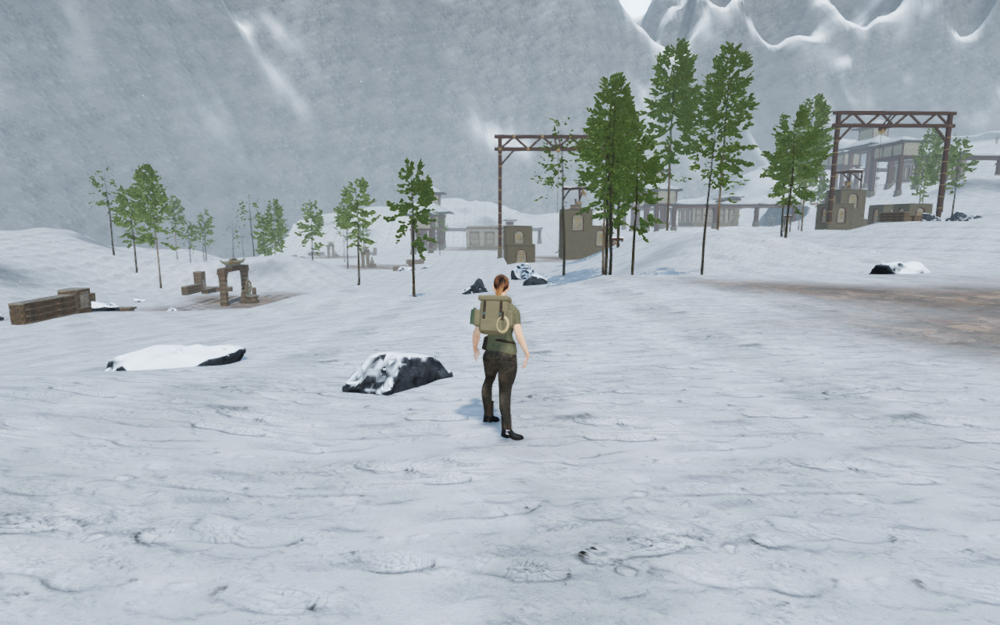
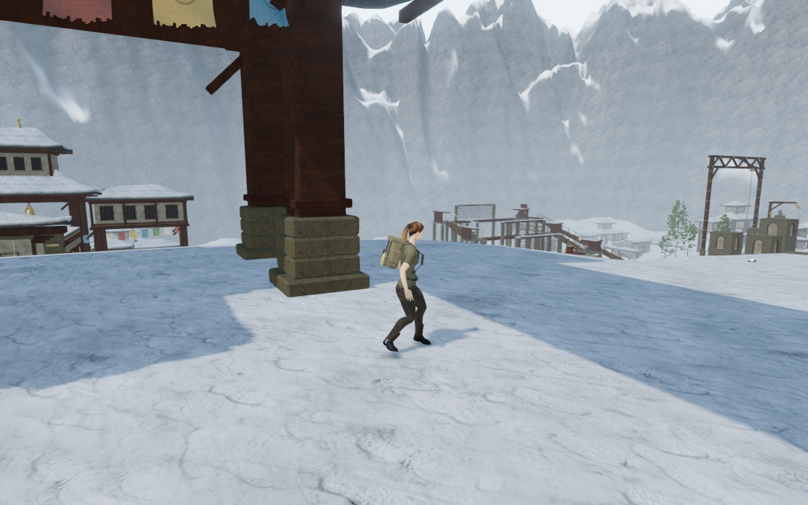
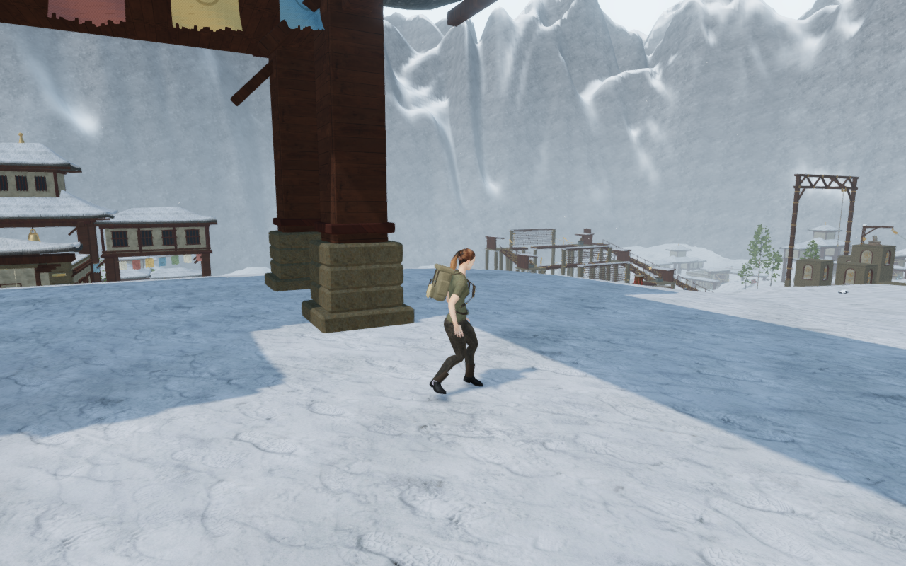
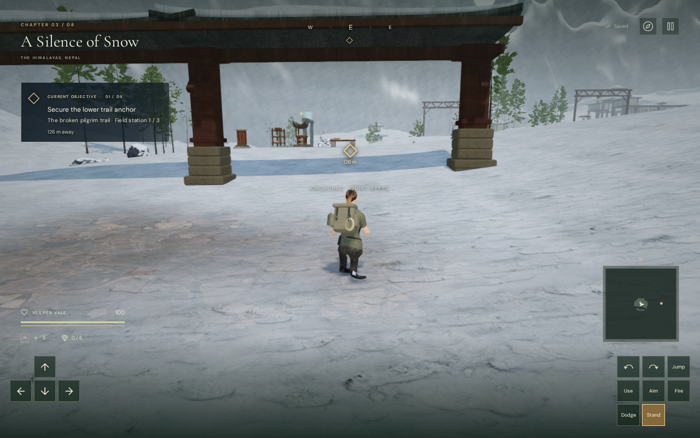
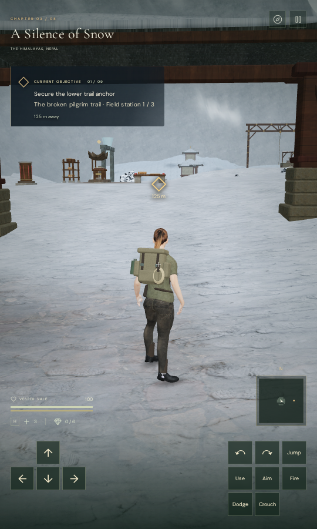

# Alpine peak shape and snow edges

The surrounding ranges in **A Silence of Snow** now have finer geometry,
continuous height-field normals and softer snow transitions. The matched views
show rounded snow shelves where the preceding mesh produced triangular white
teeth. This follows the [rock texture variation](alpine-rock-variation.md);
it changes the backdrop's shape and snow coverage.

| Previous early court | Revised early court |
| --- | --- |
|  |  |

The two background shells each use 768 angular segments and 96 radial intervals,
up from 512 and 64. Radial spacing falls from 6.25 to about 4.17 metres.
The high-frequency height-cut amplitude falls from 25 to 10 metres and the
broader cut from 115 to 98 metres. The broader peak distribution remains varied.

Lighting and snow coverage now use normals sampled from the continuous height
function in polar coordinates, transformed into world directions. They no
longer depend on the diagonal used to triangulate a cell. Duplicated seam
vertices receive exactly matching positions and normals. The inner and outer
aprons remain 18 metres below the world origin; both shells stay outside the
playable map and retain their existing background-depth interval.

The material widens the slope transition and reduces noise perturbations of
snow coverage. The existing projected colour/normal sampling, texture count,
altitude snowline, haze and background clipping remain unchanged. No external
asset, dependency, recording or saved-data field is introduced.

| Previous final-court view | Revised final-court view |
| --- | --- |
|  |  |

## Verification and cost

All **31 selected tests** pass, including normals checked against independent
Cartesian height derivatives, exact seam joins, bounded geometry, submerged
aprons, monastery construction, unchanged snow walking/foundation samples and
camera regressions. The production build passes with the existing large-chunk
advisory. This milestone does not claim a new full-suite run.

The assisted ground circuit reaches the early, middle and final courts and
returns to the entrance: **1,044.303 metres, 15,496 controller updates, 131
batches and 49 High captures**. All 49 recorded player/camera states and all
shared batch fields match the preceding snow circuit exactly. Every capture
has finite pre-bloom HDR, no GL error, linked programs, a legal grounded root
and full health. All 49 route captures, eight matched comparison captures and
three quality-setting captures are reviewed. Gates and field progress are
opened for this inspection; combat and AI are not advanced. This is not a full
human objective playthrough or a whole-body contact proof.

High and Medium pre-bloom buffers remain finite. Low's normal direct scene draw
is checked separately in a temporary half-float target because it bypasses
bloom. All three settings have linked shaders and no GL error. Four background
projection comparisons and twelve foreground probes are pixel-identical to
the conventional long-camera reference. Oblique clipping differs by more than
one byte in at most three RGB channels; the worst mean absolute channel error
is 0.000247 at 512 × 320. Both range geometries and their shared material dispose
exactly once when changing chapters. There are no application errors or other
console warnings in these development checks.

The final release also passes native keyboard/High at 1280 × 800 and actual
CDP touch/Low at 540 × 900: movement, crouch, jump, landing, map access and two
whole-store reload comparisons per case. Both retain full health and ground
height after landing, with no horizontal overflow or development hook. All
twelve native captures are reviewed, including the visible airborne poses.
There are no application errors, failed HTTP assets or other warnings; three
driver ReadPixels performance diagnostics are recorded separately.

The native checks load the exact final build files `index-gwY0urIY.js`,
`game-DuD5IwN3.js`, `three-CHpU4owG.js` and `index-DQyIEWDa.css`. The six public
lossless WebP witnesses retain every source RGBA byte and their original
dimensions. Verification browsers, workers and both temporary servers are
closed; the host process and port check confirms that none remain.

| Production keyboard / crouch | Production portrait touch / landed |
| --- | --- |
|  |  |

The two shells increase from 66,690 to 149,186 vertices and from 131,072 to
294,912 source triangles: **163,840 additional triangles**. Their source
attribute and index arrays increase from 2,920,512 to 8,312,896 bytes. The
larger meshes use 32-bit indices. These are CPU array sizes, not GPU memory
measurements. The two draw calls and eighteen texture reads per shaded pixel
remain unchanged. Geometry construction also samples the height function four
additional times per vertex to obtain the normal.

The matched High scene draws retain their call counts while submitting the
additional triangles. These counts include the whole scene's rendering work,
not just the mountains.

| Recorded observer | Calls before / after | Triangles before / after |
| --- | ---: | ---: |
| Early court / 4 | 1,445 / 1,445 | 2,704,169 / 2,868,009 |
| Middle court / 19 | 1,232 / 1,232 | 2,328,715 / 2,492,555 |
| Final court / 35 | 2,270 / 2,270 | 4,070,453 / 4,234,293 |
| Entrance / 48 | 482 / 482 | 1,219,532 / 1,383,372 |

The graphics checks use a software-rendered Chromium in this sandbox. Expensive
work runs serially through the shared nine-of-sixteen CPU budget, with at most
two test workers and one verification browser. Temporary files stay in the
ignored workspace staging directory.

This is a local backdrop improvement. Some narrow ridge and snow shapes remain,
and broader mountain composition, repeated courts, sparse floors, whole-body
contacts, listening and device review remain open. The automated evidence does
not establish subjective audio quality, hardware frame rates or AAA graphics.
