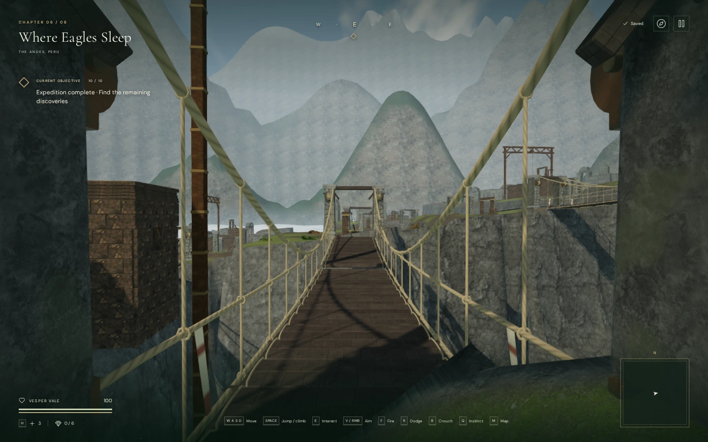
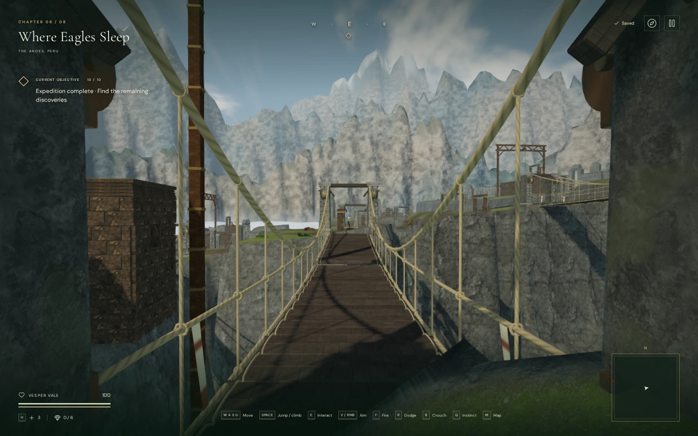
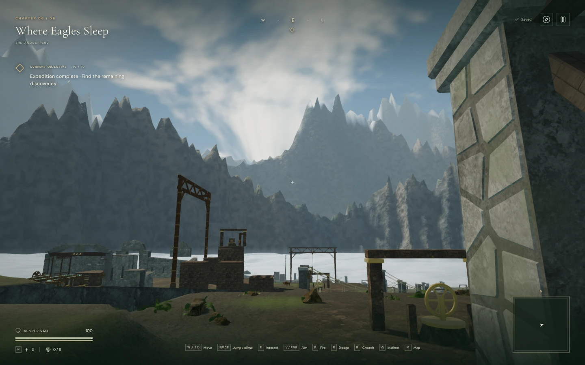

# Cloud-city mountain relief

The ranges around **Where Eagles Sleep** now have irregular crests, broader
shoulders, branching gullies and fractured rock surfaces. Baked sun visibility
and cavity shading distinguish exposed spurs from sheltered slopes. Cooler
distant ranges, snow patches and the existing valley mist separate the layers.

This is an original, Andean-inspired landscape, not a reconstruction of a real
mountain range. Its geometry and shading are in `src/andean-geology.js` and
`src/cloud-city.js`. Rock color and normal detail reuse the existing credited
local maps. No external assets, recordings or dependencies were added.

## Matched views

The preceding High-quality bridge view:

The same camera, quality, resolution and scene clock after this pass:

Looking toward the shaded side of the valley:

These are browser captures, encoded as WebP for documentation. They show the
implemented environment; modern AAA visual quality remains unmet.

## Rendering and integration

The three ranges now contain **112,640 triangles**, up from 64,512. Their three
meshes and the cloud bank's fourth mesh are retained. Including the bank, this
background totals 145,408 triangles. Geometry and baked illumination are built
when the chapter loads; there is no per-frame mountain geometry update or extra
directional shadow render. Each range bakes its own occlusion, so shadows between
separate ranges are an approximation.

The mountain color pass now preserves depth between overlapping faces. After
the last range, it clears only background depth, leaving its color behind the
playable world. This prevents rear slopes from painting over nearer rock and
keeps objects near the normal camera's far plane visible. The same ordering is
used when the scene is captured for local water reflections. The ranges remain
excluded from the contact-occlusion buffer.

Terrain heights, routes, bridge controls, clouds, reservoirs, persistence and
sound emitters retain their existing definitions. The original source textures
remain shared with the environment; disposing a range releases its own geometry
and material.

## Verification

All **428 automated tests** pass with two test workers (85.97 seconds). The
production build succeeds with Vite's existing large-chunk advisory. Its final
bundles are `index-CbJf-LhM.js`, `game-Qn9gLxKs.js`, `three-CJb2rOZj.js` and
`index-DYq9hjRy.css`.

Automated geometry checks cover finite upward-facing surfaces, matching positions,
normals and light at the circular seams, separation from every map corner,
unchanged playable terrain/map data, cloud clearance and world-space parallax.
A synthetic ridge blocks a low sun, clears illumination when the sun reverses,
and leaves all samples illuminated under an overhead sun.

Twelve browser views covered three bridge cameras and three additional headings
in High and Performance quality at 1440 × 900. All shaders linked. In the matched
bridge view, High submitted 1,387 calls / 4,197,183 triangles across rendering
passes; Performance submitted 568 calls / 1,595,673 triangles. Compared with the
preceding capture, both added exactly 48,128 triangles and no draw calls. These
are view-specific workload counts, not hardware frame-rate measurements.

The offscreen depth check reversed every mountain triangle's submission order:
all 128 × 128 pixels remained identical. A test card one metre before the normal
camera's far plane covered all 16,384 pixels, confirming that background depth
does not obstruct gameplay geometry. Changing chapters disposed the four
background geometries and four materials exactly once and retired the cloud-city
update reference. The initial synchronous diagnostic produced three GPU readback
stall warnings; the final helper uses asynchronous readback and passed without
console warnings or errors.

An assisted browser route crossed all eighteen bridges in both directions using
native movement/jump input, supplied steering directions and stepped simulation.
All 36 crossings finished at 100 health with the crosswinds active. All 59 sampled
feature approaches were clear. The brace check retained 0.17136 m of drift over
eleven simulated seconds; its standing counterpart was caught by the safety
tether. The route run reported no console warnings, errors or failed assets.

Four High-quality production cases passed: supported keyboard bracing,
muted portrait touch bracing, recovery from an airborne gap save, and migration
of an older route position. Each retained stage two, its field action, journal
discovery and 100 health. A paused reload restored the entire saved state exactly
apart from the expected `lastPlayed` timestamp. The production development hook
was absent; no console warnings, errors or failed assets were reported.

Use `cloudCityView(game, 8)` from `scripts/inspect-cloud-city-browser.js` for the
matched bridge camera. `andeanCompassView(game, heading)` and the asynchronous
`inspectAndeanDepth(game)` in `scripts/inspect-andean-ridges-browser.js` provide
the additional views and depth check. Run these in a paused development game
with its animation loop stopped. The views used deployed bridges.

Human chapter pacing, subjective sound/music review, broader browser/GPU testing
and AAA graphics remain open in [production status](production-status.md).
