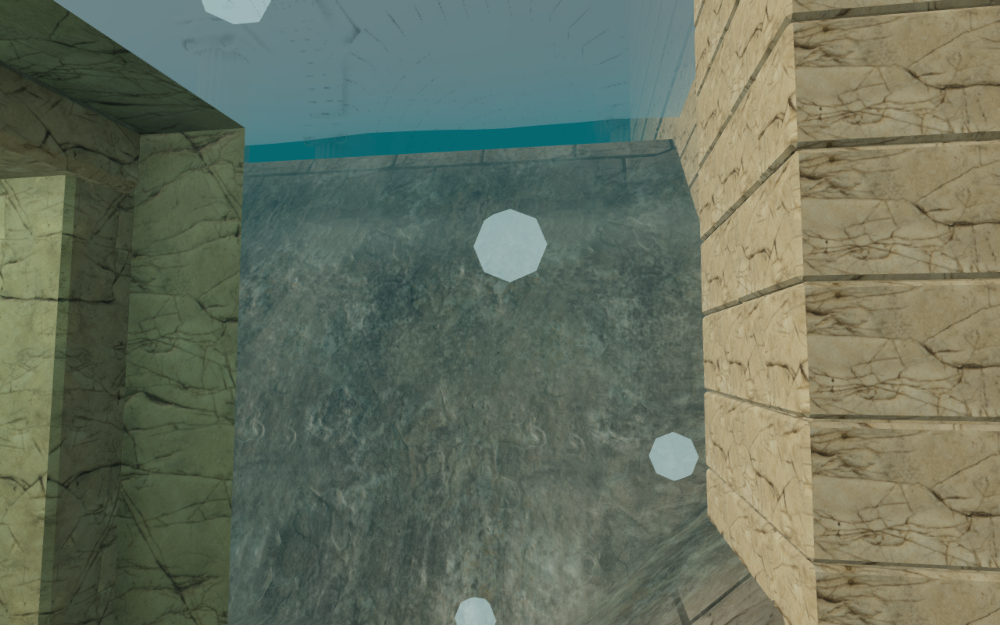
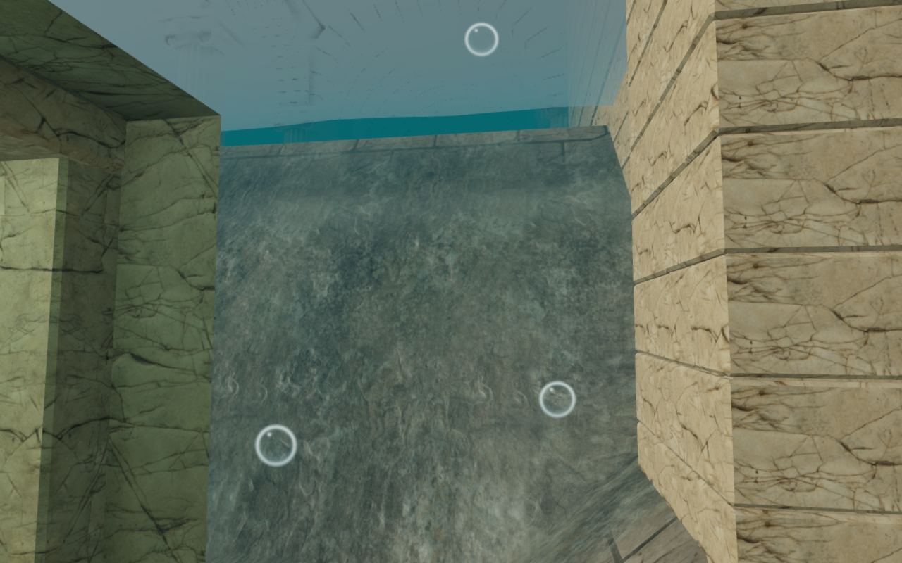

# Translucent guides to the tidekeeper's archive

The five submerged archive cases now release rounded, translucent bubble
trails. Their former low-sided spheres appeared as solid polygon beads when
the camera approached them. The revised effect has a clear center, a soft rim,
a restrained inner curve and a small highlight, allowing the surrounding stone
to remain visible through nearby bubbles.

Twenty instanced discs per well face the current render camera. Their centers
rise from the existing positioned bubble sound, with slight lateral movement
and variation in size and speed. Rise speed stays between approximately 0.72
and 1.01 metres per second across well depths. Bubbles expand as they rise,
fade in at the source and fade out below the current water surface. A fade
near the lens prevents the effect from filling the screen. Draining a well
shortens its trail; exposing a source suppresses it entirely.
The rise cycle uses the original well height, so lowering the surface after a
long session does not reshuffle bubbles farther down the water column.

The bronze floats still guide entry, and recovering a record removes its
plaque, float, bubbles and sound activity. All five records retain their
independent local-storage progress. The well architecture, collision, diving
controls, air supply and audio source positions are retained.

## Actual game comparison

These matched 1280 × 800 High-quality canvases use the same harbor camera,
water state and elapsed time. The before effect comes from published commit
`9eafb68`. Revised rise speeds and lifetimes change individual bubble positions.
The captures omit the HTML HUD and CSS vignette; lossless WebP conversion
preserves the captured pixels.

| Before | Revised |
| --- | --- |
|  |  |

Twenty matched pairs cover all five full and drained wells on High and Low.
Six additional pairs inspect a close approach and the surface float on High,
Balanced and Low. All shaders link and paired draw-call counts remain equal.
The bubbles remain stylized shader approximations; they do not refract the
scene or simulate fluid dynamics.

## Verification

All 494 automated tests passed in 145.0 seconds. The release build passed in
6.16 seconds with Vite's existing large-chunk advisory.

The final release passed native keyboard and muted portrait touch swimming,
camera movement, diving, record recovery and reload checks. Both runs kept
their recovered record and full health, resumed at the surface and continued
swimming. Saved data was compared in full except the last-played timestamp and
the arrival position, which was checked separately against the existing
collision-recovery rule. Loaded JavaScript and CSS matched the final build;
the release exposed no development hook. These checks reported no errors,
warnings, failed assets or horizontal overflow.

Three new behavior tests check submerged bounds after water changes, suppression
when a source is exposed, rise speed across depths and exact state at a paused
elapsed time. A one-hour elapsed-time regression reproduces and fixes a sudden
position change during drainage in the initial revised effect. The existing
archive test also verifies that recovered bubbles are hidden.

The [GPU verification helper](../scripts/verify-archive-bubbles-browser.js)
reads the actual delivered shader against a transparent target. In the middle
of a bubble's life, sampled center alpha is 6 and rim alpha is 119 on a 0–255
scale: the center has about one twentieth of the rim's opacity. A camera rotated
90° produces the same readings. Birth and surface endpoints have zero alpha;
at 0.2 metres from the lens, maximum alpha falls from 121 to 14. An opaque
occluder blocks the effect completely in the fixture.

All ten assisted archive dives, before and after drainage, recovered their
records and surfaced at full health. The assisted memorial route also opened
its gates, recovered the roll and returned at full health. These checks use
prepared entry positions and the game's movement/collision methods; they do
not establish blind exploration difficulty or duration.

After the final pause presentation frame, repeated paused frames preserve the
exact bubble transforms and lifetimes. Leaving the chapter disposes all five
bubble geometries and their shared material. The following jungle scene links
its shaders with no archive sites or bubble sources. The completed visual,
route, audio and cleanup checks report no browser errors, warnings or failed
assets.

The existing bubble sound measured RMS 0.013818 at 1 metre, 0.006909 at the
8.5-metre falloff midpoint and zero at 17 metres. Underwater filtering and
surface restoration passed at 22,050 and 48,000 Hz. These measurements verify
distance and immersion behavior; they do not establish subjective mix quality.

## Rendering and scope

Each bubble now submits two triangles instead of 36, reducing the five trails
from 3,600 to 200 triangles per pass when all are drawn. The matched harbor
dive keeps 556 draw calls and reduces submitted triangles from 1,067,318 to
1,066,638, because only its nearby trail is active. Surface reflections may
submit that trail again. The shader adds per-pixel rim/highlight calculations;
the geometry reduction alone does not establish a frame-rate improvement.
No textures, downloaded assets or dependencies were added. Existing world and
character attribution remains in [asset credits](asset-credits.md).

Modern AAA graphics, approximately one hour of human play per chapter,
subjective sound/music review and broader device acceptance remain unfinished.
See [production status](production-status.md).
