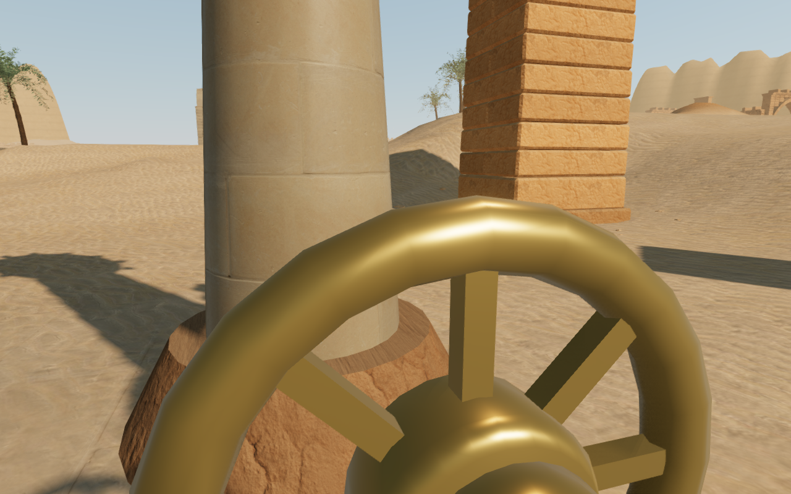
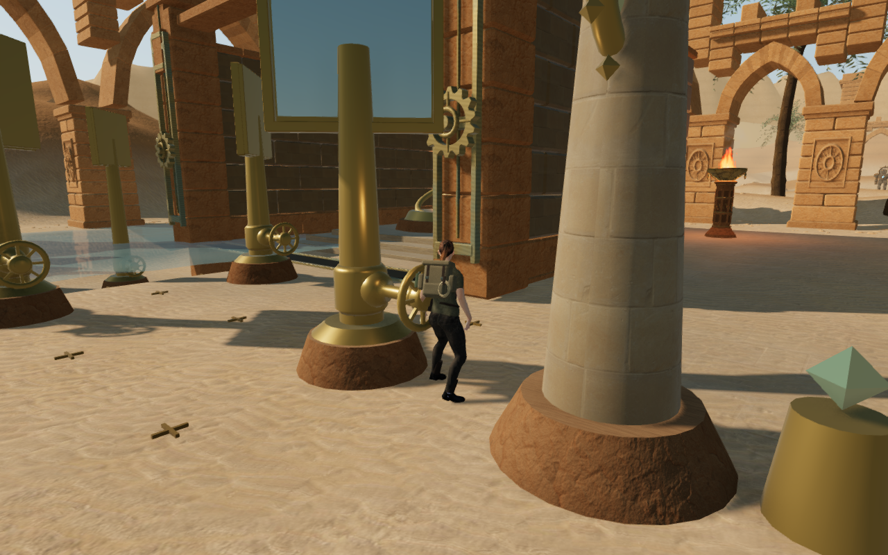
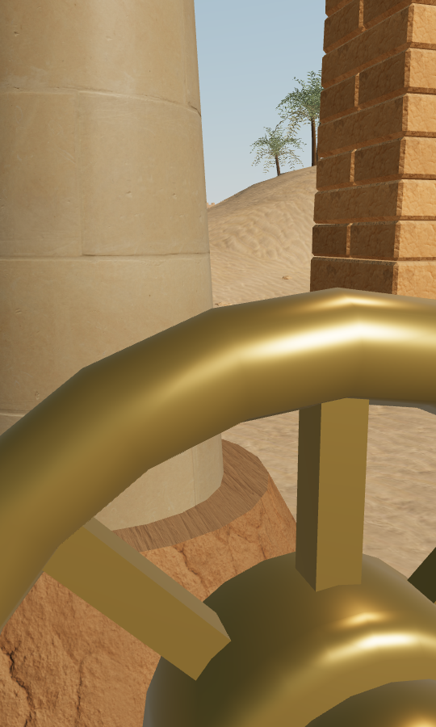
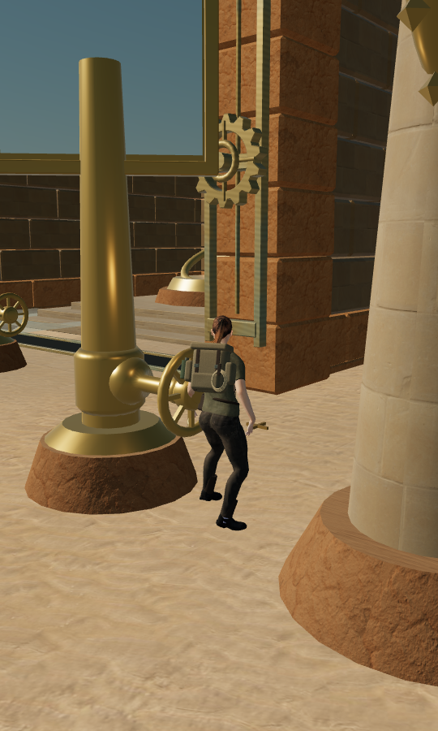

# Clear views when an expedition resumes

Each chapter now saves the camera's horizontal and vertical look angles. Loading
keeps that view when it has clearance. If nearby architecture, terrain or a
ceiling blocks it, the camera chooses a clear nearby orbit before play resumes.
Older saves work without camera data. Their initial view uses the current field
task or active mechanism; the old fallback always pointed toward the second room
after field tasks were complete.

## Comparison

These game captures use the same saved player position beside the last mirror in
the fifth solar chamber. The old camera retracted to 0.81 m from its target and
hid the character behind the handwheel. The new initial view has 5.33 m of follow
distance, with the character visible. The WebP conversions preserve the original
capture pixels losslessly.

## Behavior and verification

Camera selection runs on arrival. Normal camera input and its existing collision
sweep and smoothing continue during play. The search tries nearby headings at
the saved height, then neighboring heights if needed. If no full follow distance
fits, it chooses the best available constrained view. Terrain, map edges, cave
ceilings, gallery clearance and surface-water limits use the same checks as the
regular follow camera.

The optional camera record contains two finite angles. Normalization wraps large
horizontal angles, bounds vertical angles, and rejects malformed records. It
does not change the save version or grant progression. A corrected arrival after
an invalid saved position uses the current objective as its starting direction.

The baseline survey found a camera distance below 2.5 m at 29 of 77 solar controls.
All 77 had an unobstructed angle available. After the repair, all 154 desktop and
portrait control checks retained at least 5.1 m of follow distance, visible
characters and clear swept camera paths. A new game instance restored the exact
saved angles and camera position in the selected engine reload check.

The broader [arrival inspection helper](../scripts/verify-camera-arrivals-browser.js)
checked 304 ground approaches near field stations, mechanisms and camps, plus
105 supported traversal ledges across all eight chapters. No locations were
omitted; every sampled camera remained in valid space with a visible character
and a clear sweep. The shortest measured distance was 5.21 m. Ground approaches
use existing traversal entries where available, otherwise a clear point on a
ring up to 10 m from the feature. These are assisted arrival checks, not traversals
or full interaction-state coverage.

Thirty-six updated renders were reviewed: the reproduced desktop and portrait
views, a mirror control in each of the nine solar chambers in both formats, all
eight chapter entrances, and an elevated view in each chapter. All shaders linked
without browser errors or warnings. All 607 automated tests passed in 351.06
seconds; the production build passed in 8.07 seconds with its existing bundle-size
advisory.

Ten production-browser cases exercised real keyboard or canvas touch look input
at all eight chapter entrances and the close mirror control in both formats.
Keyboard E and touch Use turned the intended mirror and saved the partial puzzle.
After selecting a clear view, paused reloads retained the entire normalized save
apart from timestamps, including the look angles, position, progress, active time,
health and mix settings. The mirror cases used a post-combat fixture with the two
nearby guardians already defeated; these checks do not establish combat coverage.
Twenty before/reload renders and the two initial mirror views were reviewed.
The camera view persists; idle character poses and animated scenery can differ.

A deliberately blocked saved angle left only 1.29 m of camera clearance. Arrival
changed its heading by 15 degrees and restored a 5.33 m view. A targeted production
check confirmed that this correction retained every other normalized save field
apart from timestamps, then verified native turning and another exact reload.
All production cases retained 100 health, used the current built assets without
a development hook, and had no horizontal overflow, failed requests, browser
errors or warnings. Portrait cases used Performance graphics with audio muted.

This addresses VA-09 in the [playable-world visual audit](visual-audit.md). The
broader graphics and placement review remains open. This change adds no geometry,
textures or audio assets, and does not establish a hardware frame rate or a new
subjective audio-quality result.
