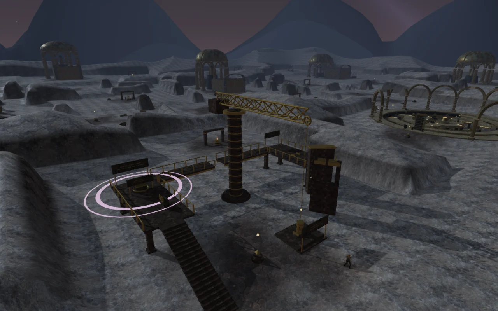
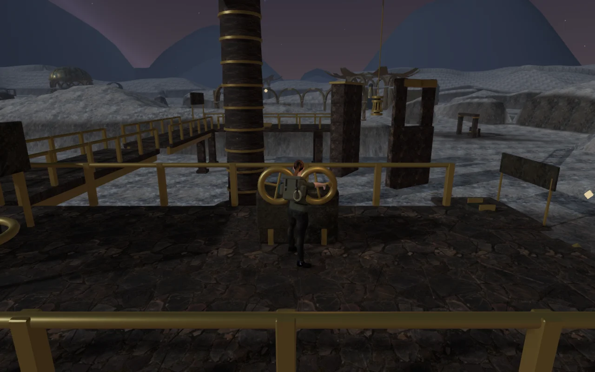
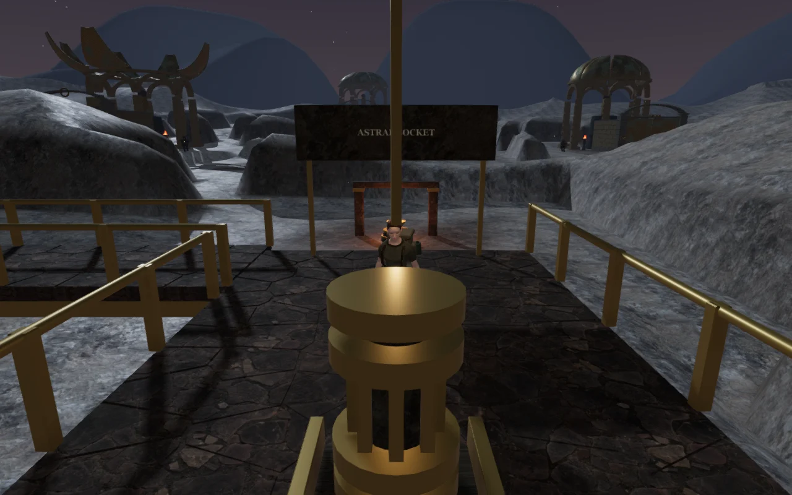

# The astral spindle crane

**The distance between stars**, the seventh objective in **The Last Meridian**,
now takes place in a crane yard. Recover the spindle from its loading cradle,
climb the west stair, read the inspection gauges and guide the suspended cargo
through two different clearance restrictions. Once it is seated, cross the
broken upper walkway to finish the installation at the east socket.

The three field-station identifiers are retained, so existing discoveries and
mission progress continue to load. The nearby floor cache remains accessible.

## Operating the crane

| Input | Action |
| --- | --- |
| E / Use | Take or release the west gallery controls |
| W / Up | Raise the spindle |
| S / Down | Lower the spindle |
| A / Left | Swing toward the loading cradle |
| D / Right | Swing toward the east socket |
| Space / Jump | Jump across the upper walkway after releasing the controls |

The inspection fork accepts the spindle base between **4.9 and 6.0 m**.
Beyond the fork, raise it to at least **8.4 m** to clear the counterweight wall.
Swing fully east and lower it into the socket at **4.2 m**. The drives brake
when input stops. The interaction prompt reports the current height and angle,
and explains a clearance restriction when the cargo reaches one.

The control camera initially faces the yard; normal look controls remain
available. The explorer's hands follow the two turning grips. Combat, aiming,
crouching and ordinary movement stay unavailable while holding the controls.

## Construction, saves and sound

The yard has a 21-tread stair, fitted gallery paving, columns, joists, rails,
a segmented mast, a lattice boom, counterweight, sheave, cable, sling and mounted
instruction plaques. The fork's split lintel leaves a slot for the cable.
The spindle collides with the player but cannot be used as a passenger platform.
The north walkway has a 2 m gap between its two spans.

The crane's angle, height and seated state persist in browser local storage.
Releasing the controls or pausing saves the current braked position. Loading
an interrupted operation restores the cargo while leaving the controls free.
Old completed missions restore a seated spindle; invalid clearance states
recover at the loading cradle. Completing the crane operation and installing
the spindle remain separate steps.

Three spatial sources follow the construction: slewing machinery at the mast,
a hoisting sound at the moving hook and wind at the mast head. The machinery
sounds follow actual drive motion and stop at rest. Operating the crane selects
the final chapter's existing lifting arrangement; independent music and ambience
mix controls remain available.

## Verification

- **525 automated tests pass.** The new checks cover drive clearances, long-frame
  collision protection, invalid inputs, save normalization, mission ordering,
  control lockouts, stair support, the upper jump, cargo collision and sight,
  and nearby feature preservation.
- An assisted browser route uses the normal movement, hazard and camera updates
  from one seeded mission entrance. It recovers the spindle, climbs, reads the
  gauges, operates the crane, pauses, crosses the gap, installs the spindle and
  returns to collect the nearby treasure. The route helper is
  [`scripts/verify-astral-crane-browser.js`](../scripts/verify-astral-crane-browser.js).
- Seven production browser cases pass with the development API absent. They
  exercise keyboard clearance rejection, interrupted angle/height reload,
  seating before installation, the upper jump, muted portrait touch operation,
  socket installation and legacy completion recovery. Saves match after reload
  apart from the last-played timestamp.
- The three source buffers render at half their near amplitude halfway through
  each configured linear falloff range, and at zero beyond that range. Live
  slewing and hoisting voices follow their respective inputs; pausing removes
  the crane voices. These are signal/behavior checks, not a subjective mix review.
- High, Medium and Low views compile and render. The gallery hazard uses the
  gallery's actual height. Changing chapters disposes all **56 geometries and
  8 materials** counted beneath the crane root and removes its three emitters.
- The production build succeeds. The checked files are `index-Bwsc_d0i.js`,
  `index-DYq9hjRy.css`, `three-Di8J68Pj.js` and `game-D0adywsL.js`. Browser checks
  reported no console errors, warnings or failed resource requests. Vite retains
  its advisory about chunks larger than 500 kB.

[Keyboard landing after the upper jump](images/astral-crane/jump.webp) ·
[Portrait touch controls after seating the spindle](images/astral-crane/touch.webp)

This authored sequence does not establish approximately one-hour chapter pacing,
modern AAA graphics, subjective sound quality or broad browser/device support.
