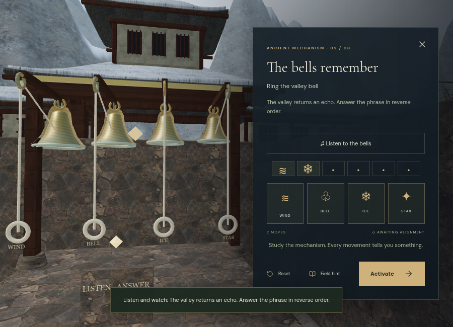
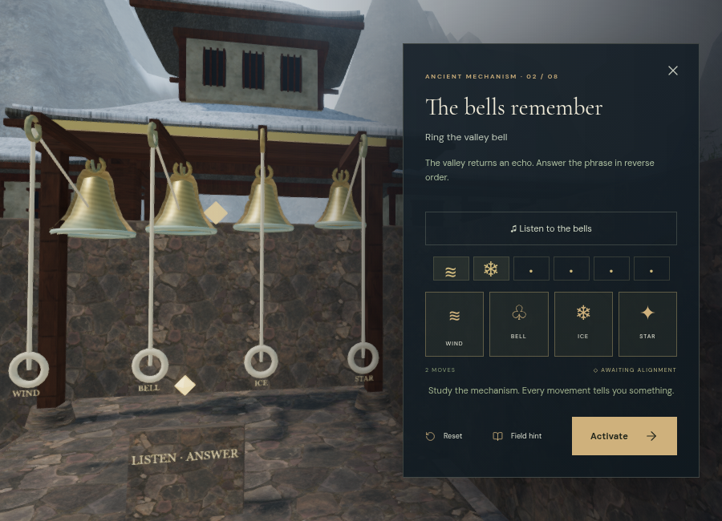
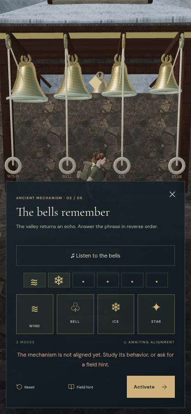
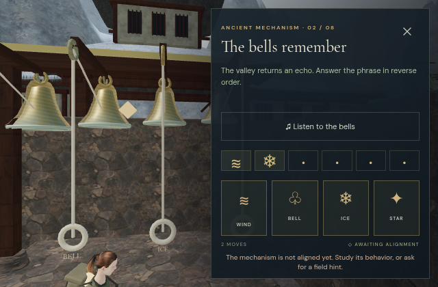
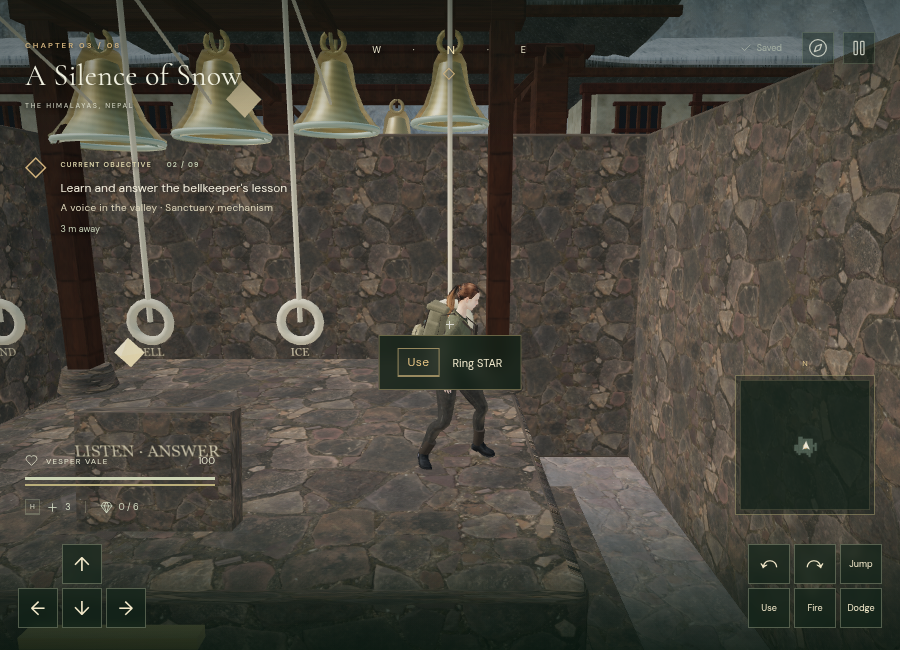

# A Silence of Snow: playable bell lessons

The mountain chapter now has **eight playable bell racks with 32 bronze bells and 40 controls**. The first rack stands beyond the counterweight tablet; the remaining seven occupy the existing raised mechanism platforms. Each bell has a suspension, swinging shell and clapper, forward pulley, moving rope, grip, and readable sign. Pulling a rope poses the explorer's hands toward its grip for a short interval; movement, climbing, dodging, or losing footing releases that pose.

The original platform mechanism decorations are hidden in those seven courts, leaving the rack and its tablet as the playable instrument. Existing platform climbing, sector gates, field routes, and counterweight requirements remain part of the approach. The new geometry reuses the project's bronze bell profile, patinated metal, monastery wood, and stone materials. No external art, recordings, or soundtrack were downloaded for this addition.

## Eight composed lessons

The previous random dialog sequences could produce long runs of one pitch. The new authored phrases contain every bell, use recognizable intervals, and introduce four response rules. Inputs require the right order; they do not require timed tapping.

| Lesson | Notes | Response |
| --- | --- | --- |
| The pilgrim's greeting | 5 | Repeat the phrase |
| The valley's answer | 6 | Reverse the phrase |
| The ascending prayer | 7 | Advance each sign once through WIND → BELL → ICE → STAR |
| The frozen stair | 8 | Repeat the paired notes |
| The remembered names | 5 | Reverse the phrase |
| The sheltered voice | 6 | Step each sign backward once |
| The summit signal | 7 | Advance each sign once |
| The final promise | 8 | Reverse the phrase |

After restoring the field stations, read the bellkeeper's tablet and choose **Listen in the court**. Watch and hear the phrase, then approach each named rope and press **E / Use** to answer. The tablet checks the answer, replays the lesson, or clears the entered notes. Its optional focused controls operate the same world bells and show the same instructions. Visual flashes and signs make listening optional.

Replaying preserves an unfinished answer. Every entered note, reset, and heard flag saves as `bells[stage] = { values, moves, heard }` in the existing `vesper-expedition-v1` record. Normalization restricts the eight stage keys, four possible signs, each phrase's maximum length, and bounded move counts. The values are copied independently; other chapters ignore the field. Existing main-stage progress is preserved.

## Spatial strikes and a quiet score

Bell strikes use four inharmonic sine partials, a short attack, and a 3.5-second decay. Their HRTF panners sit at the visible bells and fade linearly across **2–55 m** as the listener moves. Obstruction lowers and filters a strike. Up to **12 bell strikes** may overlap, with complete oscillator and graph cleanup; the existing environmental loops retain their separate 12-voice limit.

The mountain's sparse **46 BPM bell score** continues during exploration. Listening uses puzzle ducking and suppresses the score's melody so the lesson remains clear. Each lesson is scheduled against one audio-clock origin with **1.1 seconds between notes**. Browser inspection measured five successive intervals equal to 1.1 seconds within floating-point precision. Focused listening can animate while player physics, enemies, and expedition time remain paused. Resetting, closing the panel, pausing world playback, or changing chapters cancels the queued phrase.

An analyser connected to the effects input measured the following signal from isolated 392 Hz strikes. Each row used a fresh strike, a constant listening direction, and a short sampling delay. These measurements precede the overall mix and are not subjective loudness ratings or calibrated speaker measurements.

| Distance | RMS signal |
| --- | --- |
| 2 m | 0.07565 |
| 10 m | 0.06159 |
| 25 m | 0.04282 |
| 45 m | 0.01427 |
| 56 m | 0 |

Every inspected strike reported HRTF and linear attenuation, and no bell voices remained after cleanup. Broader listening and device evaluation remain necessary.

## Browser evidence

All **188 tests** and the production build pass. Twelve new tests cover composed lesson transformations, every three-note combination under each rule, malformed and independent saves, all 40 control positions at their supported heights, field/counterweight/reach restrictions, saved world input, positioned and scheduled strikes, moving rope endpoints, camera focus, paused presentation, cancellation, chapter cleanup, and bounded audio graphs.

Browser checks found clear sampled positions around all **40 controls**, clear sound paths from all **32 bells** to their controls, and clear approaches to all **54 original non-guardian features**. All **40 local routes** between tablets and ropes completed using actual character physics with the gates open. These assisted checks do not establish whole-chapter navigation, combat balance, or pacing.

Native E input restored partial `[0, 2]` and added STAR, saving `[0, 2, 3]` at move 3. Real focused-control clicks then entered `[1, 2, 0]`; Activate advanced the saved stage from 1 to 2. Player position and **0.011899999976158142 active seconds** stayed unchanged during the paused completion. A prior incomplete submission was rejected. Another assisted check supplied field work and solved counterweight positions, entered all **52 notes through the world interaction handler**, and used the actual tablet Activate button to advance all eight lessons to stage 8.

The chapter now has **999 captured camera surfaces**. A native interaction check exposed obsolete collision bounds left by the hidden pedestal: they reduced the follow distance to 0.279 m. Removing those bounds before rebuilding the index restored a 5.33 m follow distance, and a second native E check retained that distance while saving the expected third note. A regression test recreates the old pedestal and checks the camera ray through its former position. Its final focused Performance view submitted **317,599 triangles / 147 calls**, and High submitted **1,646,960 / 684** across its passes. Both shader sets linked. Bell details hide beyond 125 m and return within 115 m; a focused instrument remains visible. These workload counts are not supported hardware frame rates.

The focus camera frames the instrument beside the desktop panel and above the portrait panel. Portrait 390 × 844 and landscape 640 × 420 layouts retain the response rule and all four buttons with no horizontal overflow; the short landscape panel scrolls vertically.

A High production keyboard check moved the explorer from `(84, 56, height 0)` to `(84.29958534879974, 55.98423235006318, height 0)` and recorded **27.241600000023844 active seconds**. All nine monastery wood, plaster, and roof maps loaded with HTTP 200. The final release bundle (`index-CG3L-kZK.js`) restored the exact saved position and time in the pause panel, with High quality and no development hook. During reload a required texture was held until focus moved to another tab. This short movement is not evidence of sustained frame rate or chapter duration.

Loading the flooded palace cleared all bell courts, controls, focus, pull-pose references, and the seven active or scheduled bell voices, selected the water theme, and reported no asset errors. Development and production consoles had no warnings or errors. Both test origins were cleared afterward, with High quality restored.

Chromium used ANGLE/SwiftShader software rendering. Startup and some rendered frames were slow in that environment. These assisted checks do not prove sustained consumer-device performance, approximately one-hour chapter pacing, or modern AAA graphics. Those original requirements remain open.

Development review helpers are in `scripts/verify-bells-browser.js`: `inspectBells(game)` checks sampled control access, source paths and shader links; `walkBellRacks(game)` runs assisted local routes without saving.
