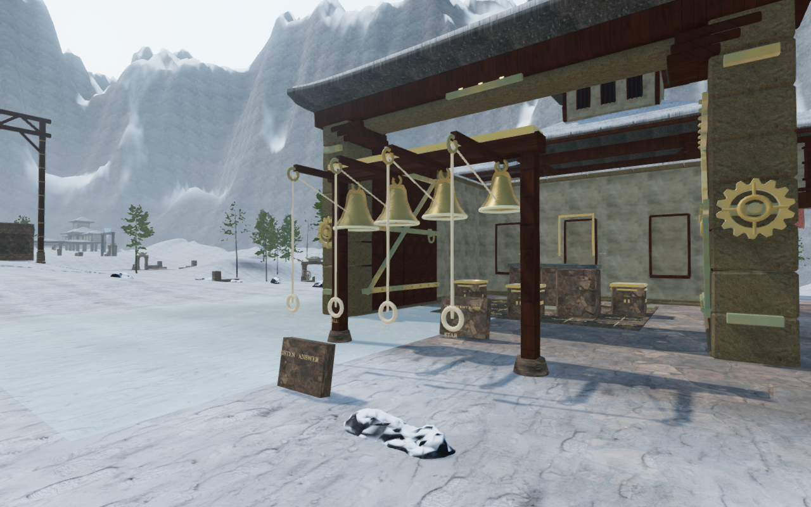
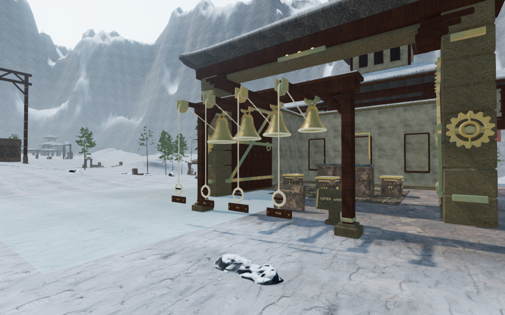
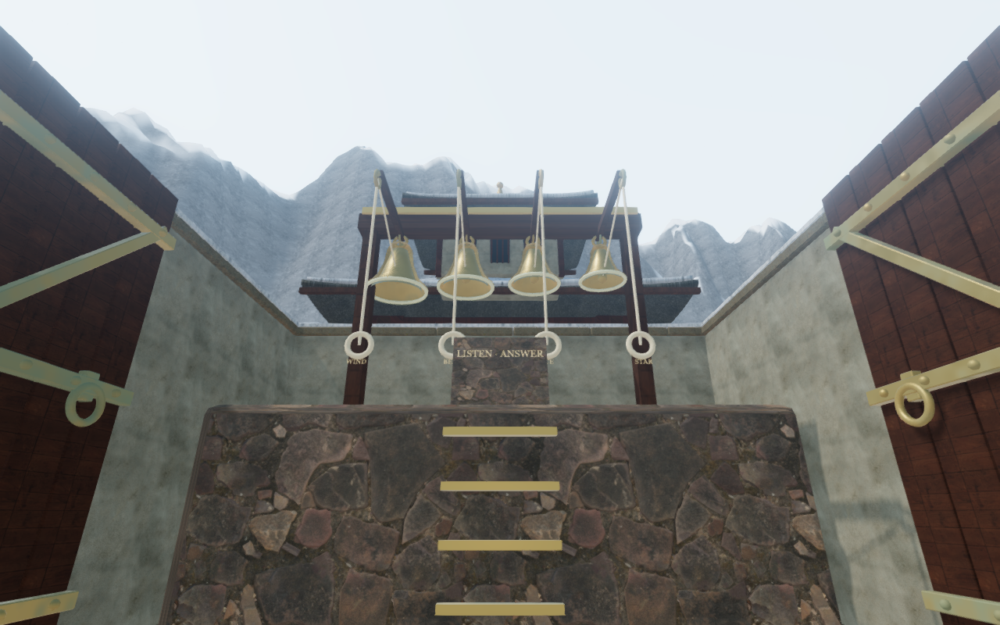
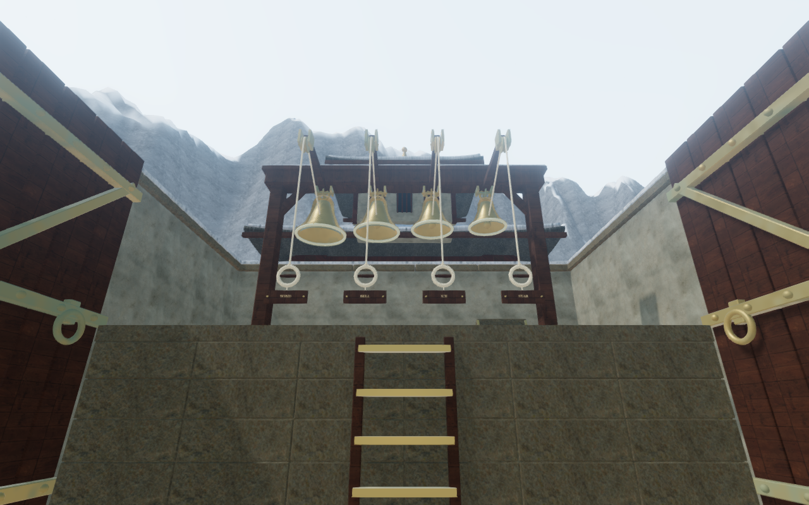

# Monastery bell racks

All eight bell racks now have fitted timber frames, supported stone feet,
bronze suspension bearings, grooved pulleys, braided hand loops and attached
nameplates. The seven raised racks sit on wider, closed masonry landings with
visible courses and timber runners behind the climbing rungs. Bell lessons,
control IDs, shell sizes and earned landing heights are preserved.

The first ground rack from a matching observer position, before and after:

The first raised rack, also from a matching position:

## Construction and placement

The earlier round feet extended beyond the edges of the raised platforms.
Ray checks at 208 lower-foot entries found 42 gaps over 10 cm, with a largest
recorded gap of 2.896 m. The revised 7.6 m landings carry the complete square
feet; ground footings and the landing cores extend below the surrounding
rendered terrain. The core sits beneath the cap without a coincident top face.

Moving the posts outward also gives the large outer bell room to swing.
Braces, clamps and through-pins connect the load-bearing members. A tangent
rope reaches each grooved sheave, passes over its crown and falls to the hand
loop. Its nameplate is attached to the moving grip. The rope geometry follows
the bell motion while leaving the axle and groove clear.

The lesson stand has a fitted stem, foot and tilted inscription behind the
frame. A front-side prototype intersected the inward-opening door sweep and
was moved before publication. Its final stand and movement proxy clear both
door leaves through 201 sampled positions per side at every raised rack.
Finite vertical solids give the posts and lesson stands their physical bounds.
The tablet control moves beside its stand; its ID and lesson text stay the same.

A native older-save check also found a generic traversal restoration bug:
occupied saved feet on a supported raised landing were rejected before nearby
arrival recovery, causing restoration at ground level. Restoration now searches
for clear supported space at the saved elevation first. Valid clear positions
retain their exact feet; unsupported airborne heights remain invalid.

## Verification

All **694 automated tests** pass. The production build succeeds with the existing
large-bundle advisory. New regressions trace the actual rendered foot geometry
against terrain and landing support, check the four bell shells throughout their
swing, and trace 2,400 rope-vertex rays at five ringing angles against the pulley.
They also cover the door sweep and generic raised-save restoration.

The local browser check finds all 40 bell/lesson controls and 32 bell-source
sightlines clear. All 40 computed local legs advance the real character movement
between the lesson and ropes. Seven front mantles are accepted and their 707
sampled body positions clear the finite furniture. Eight occupied arrivals move
to clear feet. All eight gate thresholds and 54 nearby feature approaches remain
clear. These checks use assisted local setups and open gates; they do not cover
complete chapter journeys.

The final assisted review covers **70 rendered views**: 32 High views of all
racks from their fronts, landings, backs and fittings; 16 Low front/landing
views; 12 ringing states; and ten door positions across the first and last
raised courts. All views are reviewed. The door observer was moved onto a clear
supported rear landing position after the initial ground angle hid the leaves.
All 528 checked lower-foot vertex entries have rendered support, with a maximum
measured gap of 2.75 mm. Shaders link without browser warnings or errors.

Six native production cases use real keyboard input at High and portrait touch
at Low in the first, second and last racks. Their **22 scenarios** exercise rope
interaction, lesson inspection, four climbs and six occupied older-save
recoveries. Health stays at 100. All **16 reloads** preserve the complete saved
state apart from timestamps. The touch climb check waits for elapsed time rather
than a fixed frame count before saving, so the animation can finish at different
frame rates. All 22 native captures are reviewed.

These are disposable verification saves with solved prerequisites and guards
removed to isolate the changed construction and controls. Each scenario checks
that it loads the final four JavaScript/CSS assets, without the development hook.
Lesson layouts have no horizontal page overflow. The final JavaScript bundles
are `index-BZCxMT-H.js`, `three-BDLjPWsr.js` and `game-BIkpRSnT.js`. Private saves,
logs, profiles and raw captures remain in ignored local staging.

The wind check finds a loaded, nonzero-gain voice in a running audio context.
Its calculated gains decrease from 0.6446 to 0.6018 to 0.5125 at increasingly
distant clear ground positions. The snow theme remains present; an actual
five-note bell phrase starts its sound handles and changes music from exploration
to the quieter puzzle state. All 32 bell-source sightlines remain clear and
five-pose gate checks find no furniture overlap. These establish playback,
source access and attenuation, without claiming subjective listening quality.

## Cost and scope

An isolated count includes eight complete racks and seven raised landings, with
the original delivered rounded plinths in the baseline. It excludes the
surrounding city, original climbing rungs and other chapter features.

| Measure | Before | After |
| --- | ---: | ---: |
| Meshes | 287 | 406 |
| Triangles | 81,828 | 267,320 |
| Instances | 0 | 384 |
| Captured camera surfaces | 63 | 70 |

Batching small assemblies reduces the first candidate's mesh count by 79 without
changing geometry. These are construction counts, not a device frame-rate claim.
Existing credited stone, timber, snow, bronze and rope materials are reused.
No external assets, recordings or dependencies were added. The four comparison
images are actual High game captures converted losslessly to WebP, with matching
observer positions and decoded pixel identity checked.

This extends the raised-instrument portion of VA-05. Court composition,
continuous routes and broader landscape integration remain under the open
[playable-world audit](visual-audit.md). Full journey coverage and AAA graphics
have not been declared verified.
