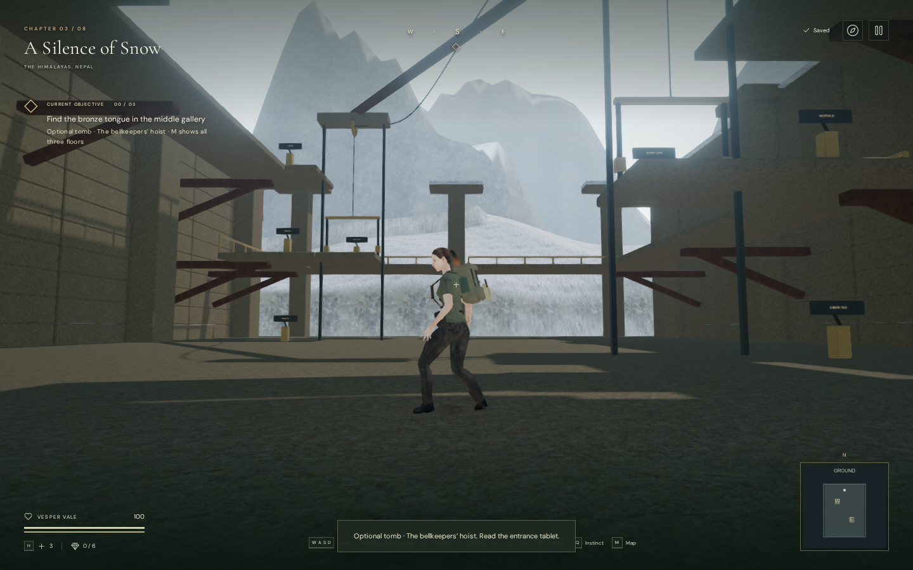
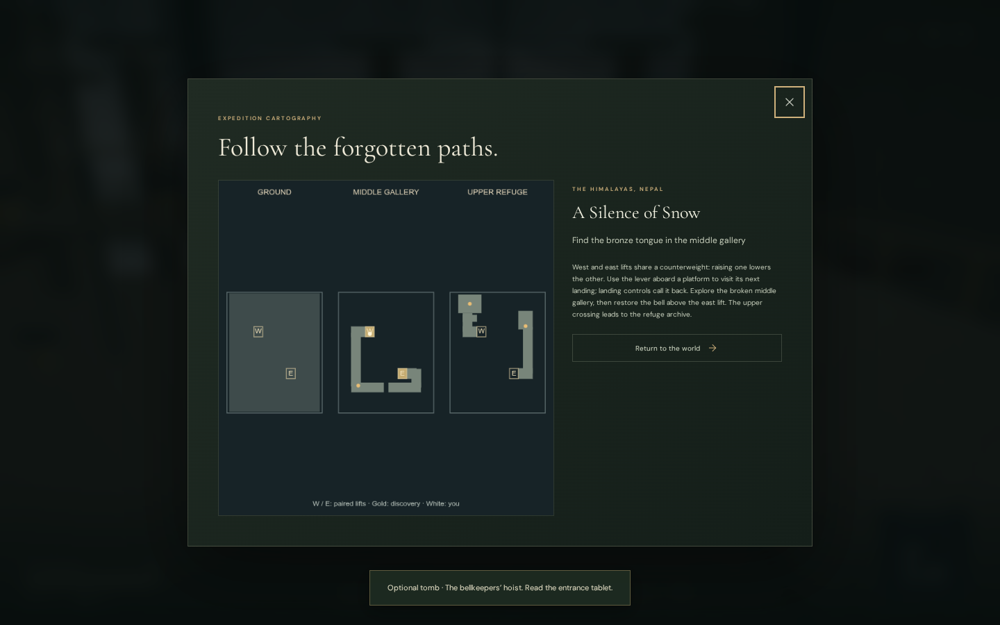

# The bellkeepers’ hoist

A new optional tomb branches east from the western library trail in **A Silence
of Snow**. Two counterweighted cargo lifts serve three floors. The broken middle
gallery holds a missing bronze bell tongue; the upper east bell opens a crossing
to a refuge archive. Its register adds a separate field-journal story about the
families who sheltered here when the mountain pass closed.

Board a platform and press **E / Use** to visit its next floor: ground, middle,
upper, then ground again. Raising one platform lowers the other. Landing levers
call either platform back, including after a fall or a trip across the upper
bridge. The middle gallery has a two-metre gap that requires **Space / Jump**.
Recover the tongue, fit it at the upper east bell, and read the register beyond
the opened archive grille. This tomb is independent of the chapter’s main bell
courts.

The entrance tablet explains the route. The local **M** map shows all three
floors, lift locations and discoveries; its small HUD version follows the
player’s current floor. The journal records discovery and completion.

## World and persistence

The retained shelf occupies previously unused map cells, appended after the
seeded campaign features. Its new trail joins the existing path, and the checked
original objective, room and side-room foundations retain their heights.
Wooden brackets support the elevated galleries. Snow caps, an exposed banner,
fixed sheaves, changing cable lengths, guide rails and moving cargo frames
accompany the lift motion. Surfaces reuse the credited monastery materials;
the geometry, maps and story are original project work.

The platforms support and carry a grounded rider continuously. Jumping or
leaving a platform releases that support. Elevated deck slabs and solid walls
block movement and sight at their actual height, preserving the routes beneath
the balconies. The two upper crossing leaves and archive grille open when the
bell is repaired. Thin grilles and overhead floors also obstruct positional
sound.

The mountain save stores the last completed lift stop, tomb discovery, bronze
tongue, repaired bell and recovered register. A save during travel places a
supported rider on the same platform at its last completed landing on reload.
Pause freezes the current journey in memory; continuing resumes it. Reload
rebuilds completed mechanisms and preserves elevated gallery positions.
Malformed progress is normalized and other chapters have no hoist state.

## Sound

Two drive emitters stay at the visible overhead sheaves. Their activity follows
lift motion and stops at rest or on pause. Wind comes from the exposed banner;
the repaired bell produces a positioned bronze strike. These use the existing
original hoist, wind and bell synthesis, HRTF positioning, linear distance
falloff, obstruction filter, independent mix controls and shared voice limit.

The mountain score continues quietly, selecting its lifting arrangement while
the cars travel and its resonance arrangement while exploring the tomb. No
additional recording or external music service is loaded.

## Verification

All **337 automated tests passed**; all six focused hoist checks also passed
after the final western bridge collision correction. The production build
passes with the existing Three.js chunk-size advisory. New checks exercise paired movement,
continuous rider support, jumping off, repeated/invalid commands, pause,
intermediate-save restoration, completion normalization, overhead clearance,
thin-wall sight obstruction and trail connectivity. A complete movement test
uses both lifts, jumps the middle gap, recovers both discoveries, calls the
western lift back to the upper floor, descends and exits.

A comparison with the previously published campaign preserved the original
feature IDs, coordinates, answers, rooms, side rooms, field sites, enemies and
spawn across all eight chapters. The new hall’s cells were previously unused.

A continuous assisted development-browser route started on the existing library
trail, entered the tomb, used native E/Space input through the same sequence and
returned to the trail at 100 health. Directions and the solution were supplied
by the check; this is not an unassisted playthrough or a pacing measurement.
High and Performance views rendered with linked shader programs. The guide,
three-floor map, archive dialog and 390 × 844 touch Use interaction were checked.

Live drive voices appeared during travel, disappeared at rest and on pause, and
matched their sheave positions exactly. The score changed between lift and
resonance states. An offline HRTF render of the actual generated hoist buffer
measured RMS 0.219206 at 2 metres, 0.109603 at 13 metres, and zero at 25 metres
with a 24-metre range. This verifies half amplitude at the falloff midpoint and
silence beyond range; it does not establish subjective sound quality.

Changing chapters disposed all 54 inspected tomb geometries and 15 materials,
cleared its runtime state and removed its three emitters. Completed development
checks reported no JavaScript errors, console warnings or failed assets.
Reusable assisted movement helpers are in
[`verify-bell-hoist-browser.js`](../scripts/verify-bell-hoist-browser.js).
Use a disposable save and stop the animation loop before running them.

In the final production build, native E input started a lift ride. Pausing and
reloading partway through restored its ground landing; completing the next ride
saved and restored the middle landing at 5.78 metres. A separate prepared upper
archive save retained the repaired bell and tongue, recovered the register with
native E, and restored the record and journal text after reload. Both fixtures
retained 100 health. The development hook was absent, with no JavaScript errors,
warnings or failed assets. These isolated fixtures verify production controls
and persistence; continuous movement was checked in the development world.
Checked bundles: `index-CFPv_x1M.js`, `game-D2C0SWvW.js`,
`three-CMMk0BZv.js` and `index-n9zm2e6h.css`.

This is additional prototype content. AAA visual quality remains unmet. The
approximately one-hour chapter target, full campaign balance, broader device
coverage and subjective music/sound review remain outstanding.
