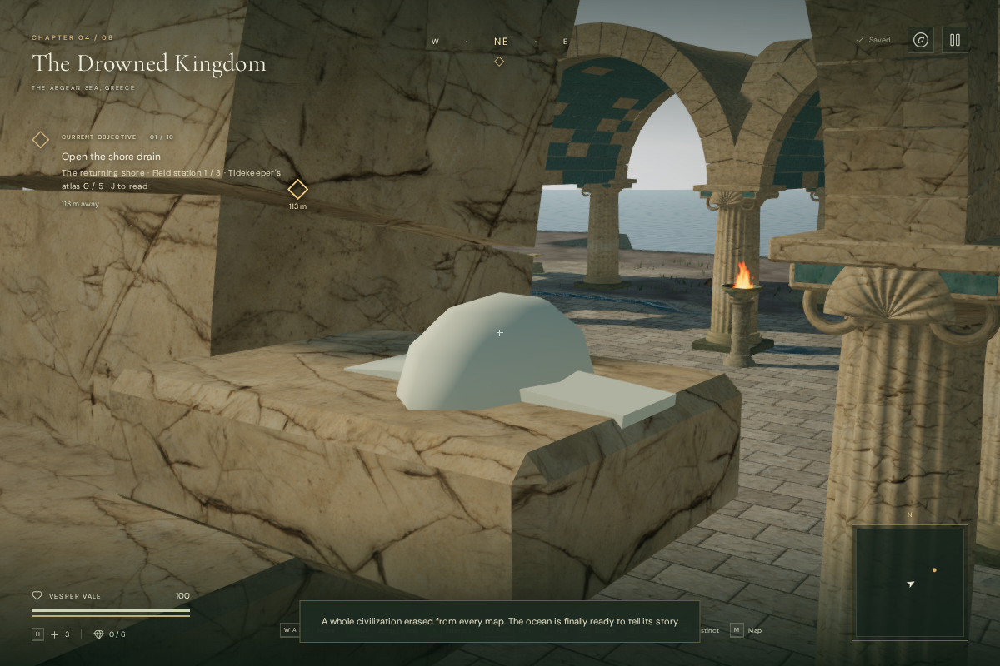
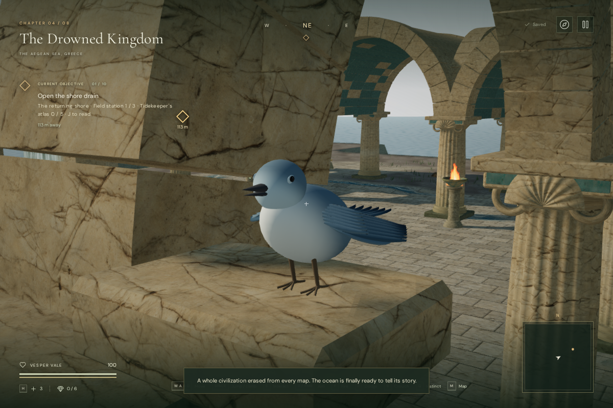
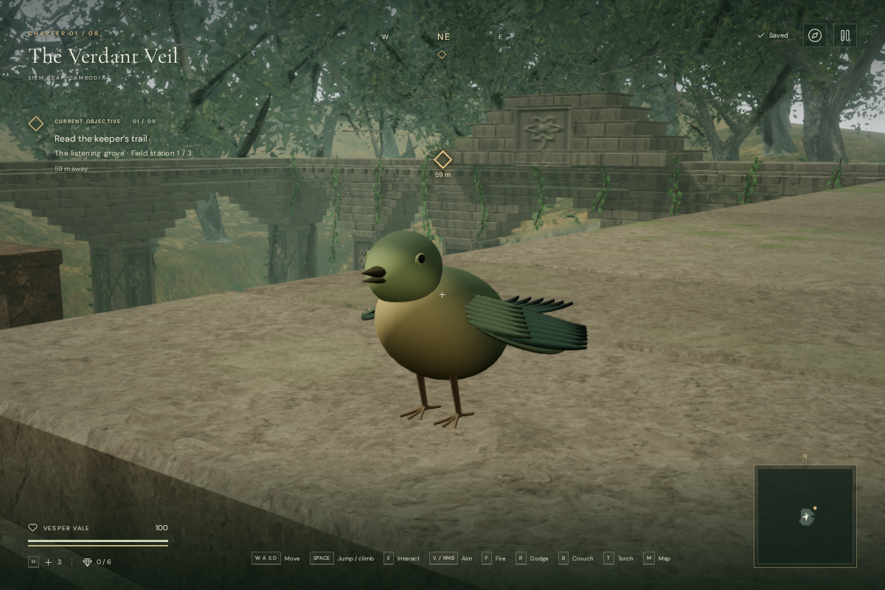

# Perched birds and sound landmarks

The 33 visible birds now have shaped heads and bills, dark eyes, planted toes,
layered wing and tail feathers, and regional colors and crests. They replace the
earlier sphere with two rectangular wings. The geometry, plumage shader and
animation code are original project work; the existing credited bird recording
continues to supply the positioned sound.

The placement review found seven jungle birds inside newer masonry. Jungle
perches now use a downward ray against structural stone, excluding decorative
foliage. Desert and coastal records described the surface itself, so their body
anchors now sit 0.18 m above it. Cloud-city anchors already included that offset.
Horizontal positions, source IDs and playback-rate variations are retained.

## Artwork and motion

The close review views use a 1200 × 800 High-quality browser render. Before and
after cameras use the same offset relative to the bird; their absolute height
changes with the corrected perch. The final views show an assisted wing-stretch
pose, with the character hidden to expose the construction.

Head turns, breathing, blinks, small bill movements, tail flicks and occasional
wing stretches have separate phases across the population. Feet and the body
bearing stay fixed while the upper body moves. Animation freezes on pause.
The first stretch review exposed wings rotating into the torso; the final
rotation opens them outward, with a regression check for tip clearance.

## Rendering costs

| Habitat | Birds | Nearby triangles per bird | Distant triangles per bird |
| --- | ---: | ---: | ---: |
| Jungle | 9 | 10,320 | 1,856 |
| Desert | 4 | 10,736 | 2,272 |
| Coast | 10 | 10,320 | 1,856 |
| Cloud city | 10 | 10,528 | 2,064 |

Eight articulated mesh parts share two materials and the same geometry within a
chapter. No texture files are added. The distant model removes fine feather,
eye and toe detail. The nominal switch distance is 20 m in High/Balanced and
12 m in Performance, with 2 m hysteresis. Visual culling occurs at 85/60 m;
culling does not remove the sound source. Both geometry tiers are collected for
disposal on chapter changes, including any tier absent from the rendered scene.

The coastal review rose from 540 draw calls and 1,120,056 submitted triangles
to 553 calls and 1,150,680 triangles across the High rendering passes. Its final
Performance view used 69 calls and 169,324 triangles. These are whole-scene
workload measurements; the corrected camera height also changes visible scene
coverage. They do not establish consumer-device frame rates.

## Verification

The full suite passed 390 tests. The three focused bird tests passed again after
the final wing-direction correction, including the new clearance assertion.
The final production build passed with the existing large-chunk advisory.

Final browser checks rendered all eight chapters in High and Performance with
linked shaders and no failed assets or console warnings/errors. All 33 bird
anchors matched their audio sources. Eight toe-end samples per bird met the
actual masonry within 0.0041 m: 264 samples across the four populated habitats.
All existing movement obstacles and objective positions matched the baseline.
Head/wing poses froze on pause, feet stayed planted through the detail changes,
and all four departures from bird-populated chapters disposed each of the 16
shared geometries and two materials exactly once.

In each populated habitat, an isolated clear-line-of-sight voice check recorded
gain 0.85 at 3 m and 0.425 at 25.5 m, with the voice released at 49 m. The panner
retains linear falloff, a 3 m reference distance and 48 m maximum distance.
These are voice-state diagnostics, not RMS measurements or a subjective listening
review. Music, the recording files and saved mix controls use the existing paths.

The final High-quality production build accepted native W input, moving from
approximately `(55.4137, 44.4678)` to `(62.0065, 41.9184)` at full health.
Pause/reload retained exact position, torch, supplies, checkpoint, all eight
chapter records, settings and creation time, excluding deliberate `lastPlayed`
refreshes. No development hook was exposed. The delivered bundles were
`index-D5wEYdTl.js`, `game-DsB7T8R1.js` and `three-CtDUNqUd.js`.

## Limits

These are stylized procedural birds, with a shared anatomy and scripted perch
motion. They do not fly, and bill movements are not synchronized to individual
calls in the field recording. This corrects visible placement defects and adds
environmental detail; it does not establish AAA wildlife art, subjective audio
polish, supported-hardware performance or approximately one-hour human chapters.
