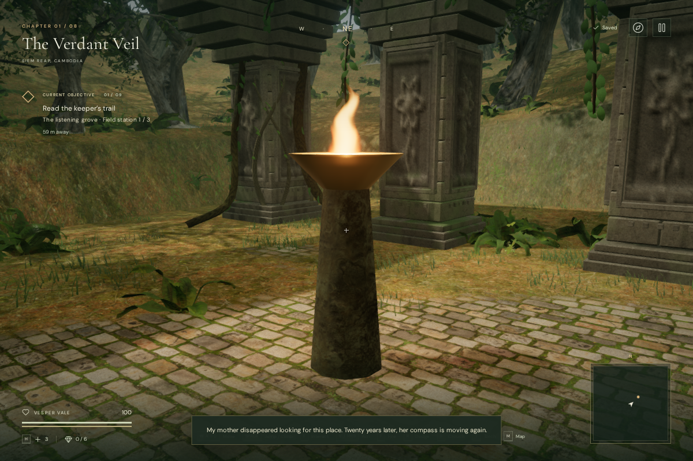
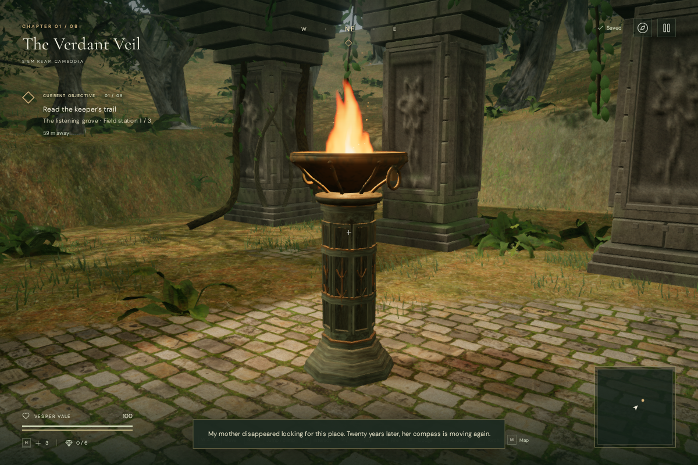
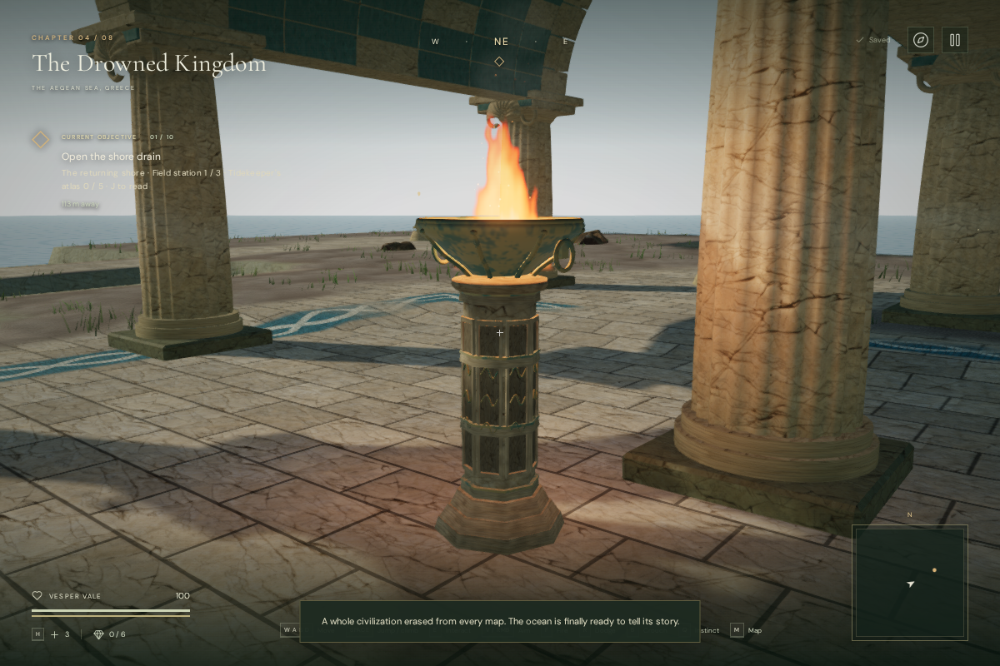

# Courtyard brazier artwork

All 154 courtyard braziers now have stepped stone feet, framed shaft panels,
regional metal motifs, thick basin walls, rolled rims, supporting ribs, rivets,
ring handles, grates and glowing charcoal. These replace the earlier tapered post
and plain bowl. Each chapter uses a distinct combination of motif, shaft section,
stone color and metal patina.

The models reuse the chapter's existing stone maps. The geometry, ornament,
weathering and fuel shading are original project code; no external model, texture
or recording files were added. [Asset credits](asset-credits.md) retain the sources
for the reused stone maps.

## Matched views

These assisted 1200 × 800 High-quality review cameras share the same position and
target. The character is hidden to show the construction. Additional views cover
all eight chapters in High and Performance.

## Rendering and sound

The nearby and distant models each use four material groups, instanced across the
chapter. Geometry changes per instance with a 300 ms dither transition and matching
shadow coverage. The ranges are 22/140 m in High, 16/119 m in Medium and 10/91 m in
Performance, with 2 m hysteresis. Distant models retain the pedestal, basin, rolled
rim and simplified fuel bed.

| Chapter    | Motif             | Nearby triangles | Distant triangles |
| ---------- | ----------------- | ---------------: | ----------------: |
| Jungle     | Branches          |           11,924 |             1,156 |
| Desert     | Solar mark        |           12,308 |             1,156 |
| Mountain   | Woven knot        |           11,540 |             1,156 |
| Coast      | Waves             |           13,460 |             1,156 |
| Volcano    | Vents             |            9,780 |             1,052 |
| Cloud city | Stepped chevrons  |           12,308 |             1,156 |
| Crystal    | Faceted mark      |           10,644 |             1,052 |
| Eclipse    | Cycle and horizon |           16,788 |             1,364 |

The flame, sparks, smoke and light flicker share a clock that freezes on pause.
The flame stays upright under an elevated camera. Each brazier has 24 sparks and
12 smoke particles, visible only nearby. The existing pool of four point lights
continues to serve nearby fires.

The original flame anchors, source IDs and positioned fire recordings remain
exactly aligned across all 154 locations. An isolated browser voice check measured
diagnostic gain 0.8 at 2 m, 0.4 at 12 m and release at 23 m, retaining linear
falloff with a 2 m reference distance and 22 m maximum distance. This checks voice
state under a clear-line-of-sight fixture, not signal RMS or subjective listening
quality. Chapter/objective music and mix settings continue on the existing path.

At the matched jungle view, whole-scene High rendering rose from 383 calls and
2,282,454 submitted triangles to 403 calls and 2,356,614 triangles. The coastal
view rose from 414 calls and 883,842 triangles to 437 calls and 998,988 triangles.
These counts include the scene's rendering passes and establish workload changes,
not consumer-GPU frame rates.

## Gameplay and verification

The supports now have solid footprints, 0.64 m from their centers along each
horizontal axis and 2.87 m high. Camera bounds cover the complete basin and shaft.
Existing safe-arrival logic recovers older saves made inside a new footprint.
All objective positions, existing obstacle records and courtyard fire sources
matched the baseline after excluding the newly added support obstacles.

All 387 tests and the production build pass. Three new tests cover all 154 builds,
finite geometry and bounds, grounded plinths, four approaches per support, camera
clearance, old-save recovery, distinct motifs, shared textures, positioned sound,
pause and per-instance detail transitions. The full suite also covers the existing
campaign mechanisms, traversal, combat, audio and persistence rules.

The browser checked all 616 approaches in the actual built worlds, linked shaders
in both quality settings, and used native W input with assisted simulation to walk
toward a support in each chapter. Every approach stopped outside the support at
full health. Seven chapter transitions released each observed resource exactly
once: 62 or 68 geometries, 15 materials, eight instance buffers and three
shared textures. Scene cleanup now deduplicates shared texture disposal.

In the final High-quality production build, a prepared older save at `(48, 47)`
inside the first jungle support recovered to `(48.75, 47)` at ground height.
Native W input then moved Vesper to approximately `(55.4137, 44.4678)` at full
health. Pausing and reloading restored the exact position, carried torch, medical
supplies, checkpoint, all eight chapter records, settings and creation timestamp,
excluding only deliberate `lastPlayed` refreshes. The release exposed no
development hook and recorded no failed asset requests or console warnings/errors.
It loaded `index-XzFgmuMv.js`, `game-DzkuLMtn.js` and `three-BO_Srq6n.js`.

## Limits

The braziers remain a shared architectural kit with regional ornament and finishes.
Their flame is a shader card, and smoke uses particles. These changes improve
repeated environmental artwork; they do not establish AAA graphics, supported
hardware performance, subjective audio polish or approximately one hour of human
gameplay per chapter.
