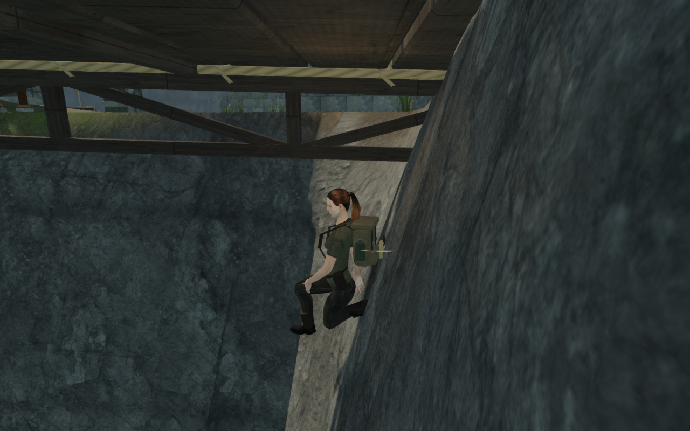
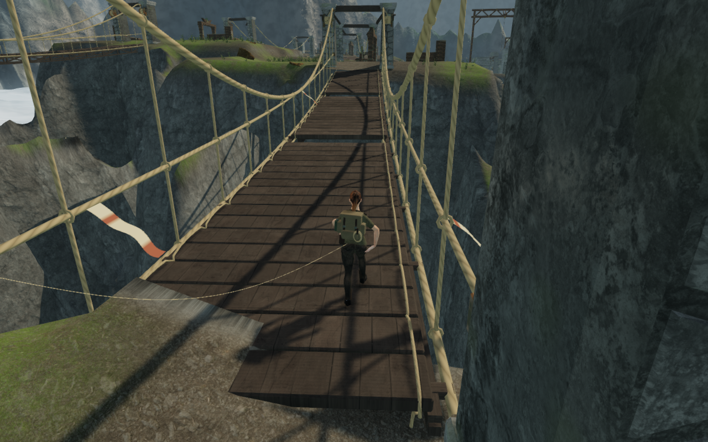
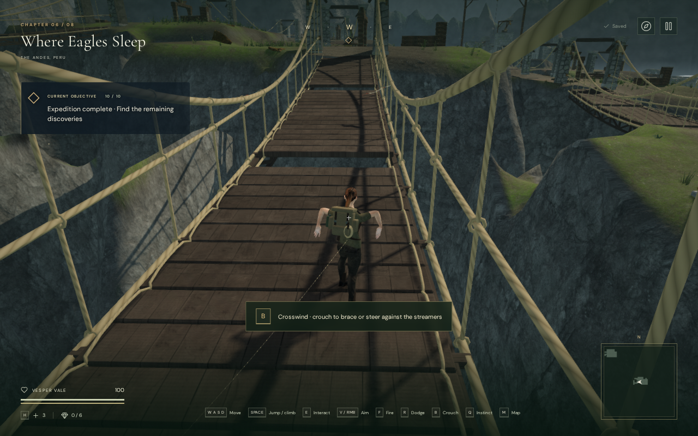
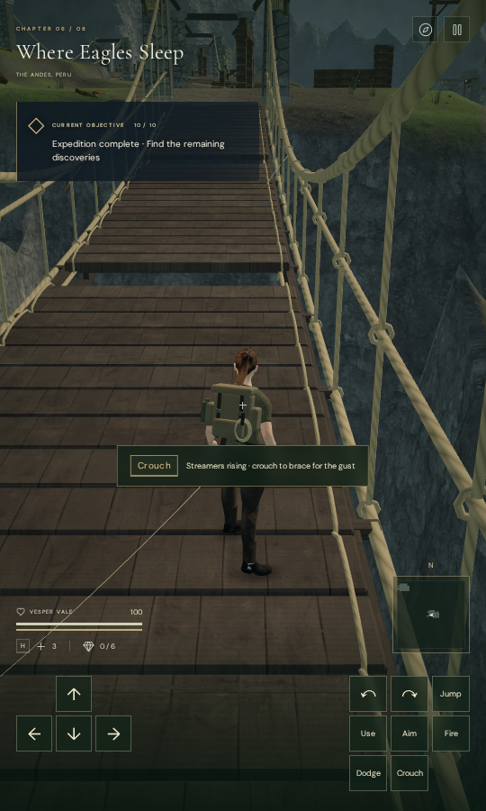

# Supported cloud-bridge approach steps

A recorded return walk reaches a bridge edge about 30 cm above the bank. The
controller permits steps up to 45 cm, but its floor query only searched 20 cm
above the preceding feet. The explorer therefore stayed on the excavated ground,
walked beneath the boards and descended through the cliff before the safety
tether returned to a bank. A continuous actual-controller baseline completes
678 updates with 124 nearby contact samples. Nineteen sampled updates embed
soles more than 15 mm into the rendered terrain, reaching 1.577 m.

Grounded movement now searches the complete permitted step height before
choosing support. The existing rise limit remains 45 cm. Airborne movement keeps
its preceding landing window. Terrain, bridge construction and save records
retain their existing formats and dimensions.

The repeated actual-world walk reaches its endpoint in 749 updates, with health
100. Across 142 nearby sampled updates, every queried sole point stays above the
rendered cliff; minimum clearance is 4.009 mm. Another 4,016 successful sole rays
against the rendered deck have minimum clearance 6.476 mm. All sixteen baseline
and twenty revised route images are reviewed. The unbraced observer later
invokes the normal safety tether after drifting toward a deck edge in the wind;
it resumes from the bank and completes the return. The measurements repair the
recorded cliff contact. They do not establish full-body clearance everywhere.

The new delivered-map regression checks the recorded approach through 120
updates, one step above 20 cm, matching bridge feet, normal movement and no
tether recovery. It fails against the preceding published movement helper.
A separate airborne case retains its upward arc beneath the deck. Existing
carrying-speed crossings of all eighteen spans in both directions still pass.
All 793 campaign checks across 122 files pass with no failures, cancellations
or skips. The production build passes with the existing bundle-size advisory.

Keyboard/High and touch/Low production cases walk from the bank onto the deck,
then exercise crouching and manual look. Both retain health 100, progress and
previously revealed map cells. Complete-store reloads match apart from chapter
timestamps, with no arrival-camera correction; the second reload is stable.
All six native captures are reviewed. Loaded JavaScript and CSS match the
revised build, with no failed resources, browser errors, warnings or overflow.

All five complete cloud climbing loops pass on the revised movement helper.
Each uses one supported initial placement, then normal approach, mantles, jump
gap, rope catch/release, summit, animated return cable and ground return,
without position or progress resets between those legs. All retain health 100
and camera opacity across 7,758 updates; all 130 final route captures are
reviewed. These completed-expedition fixtures do not advance enemy AI or combat
and do not establish a human campaign playthrough.

Wider landscape and court composition, campaign routes, subjective listening
and device acceptance remain open. The earlier [camera repair](climbing-turn-camera.md)
retains its separate evidence and scope; this change addresses the observed
bank-to-deck support mismatch.

The first two captures use the same return waypoints on their respective
runtimes. Controller elevation, wind response and camera framing change after
the supported step; they are not identical-position camera comparisons.
