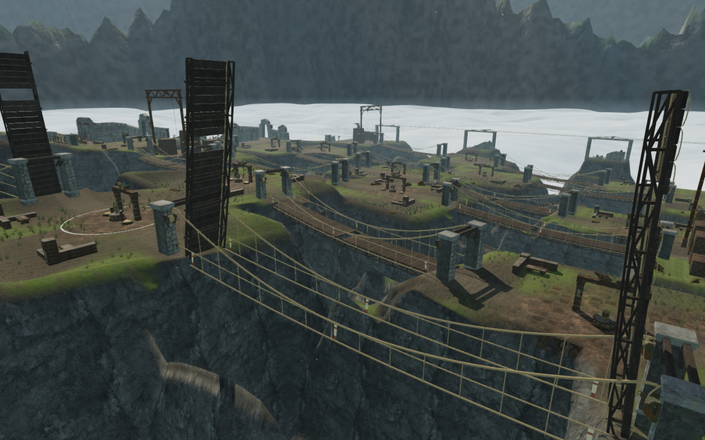
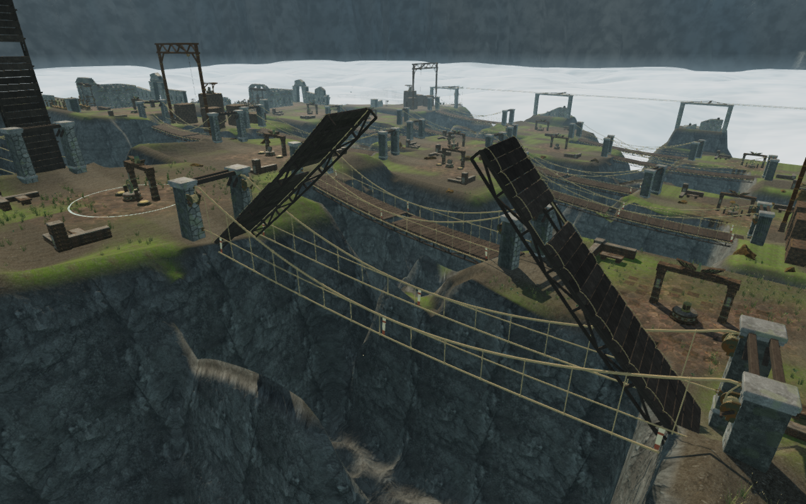
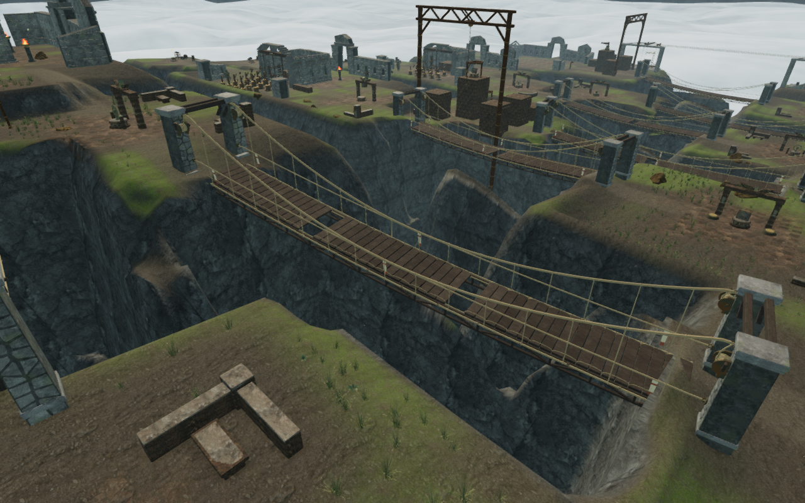
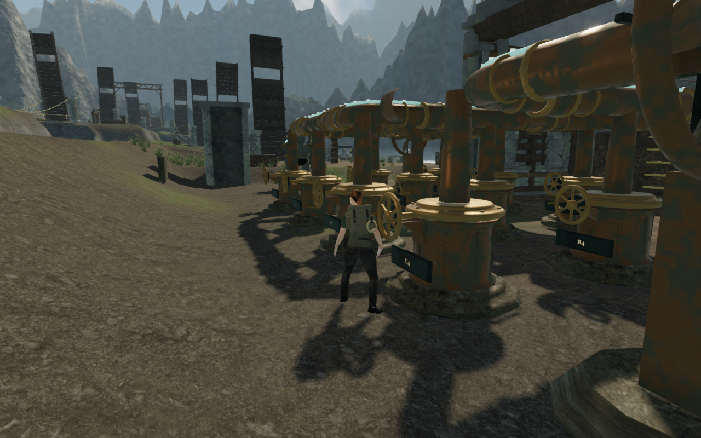
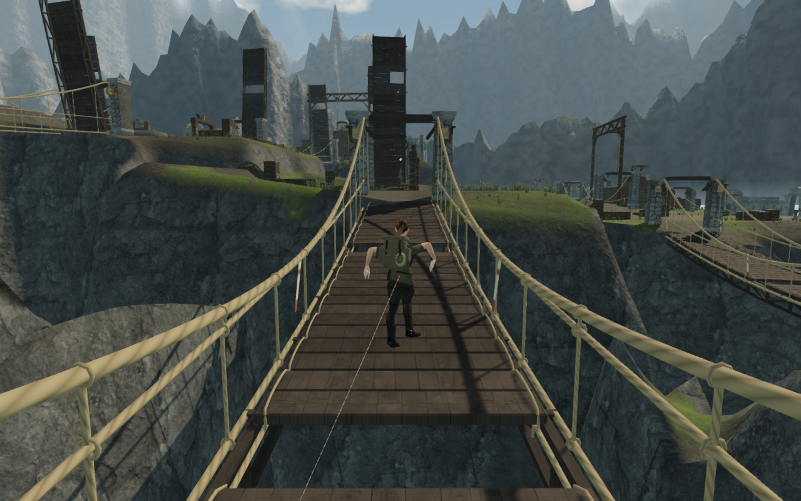

# Folding bridge deck frames

The distant panels recorded as VA-40 were pieces of raised timber bridges.
Missing boards divided each half into separate patches, while its thin rope
lashings disappeared beyond their detail range. Two continuous timber trusses
now join the boards of each folding half, so its construction remains visible
through the missing-board gaps and at distance.

The repair covers all eighteen sky spans. Each frame follows the sagging deck,
seats its upper chord against the plank underside and connects that chord to
lower timbers with posts and alternating diagonals. The side frames clear the
existing lashings and suspension lines. They fold with the same bank pivots as
the boards, remain below the walking face and leave the centre of each jump gap
empty. Bridge movement rules, deployment requirements and the save format are
unchanged. A separate station-gust correction found during production
verification makes its existing bracing hint work.

The geometry uses the existing monastery wood maps, timber grain and weathering.
Longitudinal texture coordinates follow each piece of stock; its cut ends retain
nonzero mapped area. Each half adds one rendered batch. The camera retains the
individual moving timber bounds captured before batching, rather than treating
the entire curved frame as a solid box.

These three images use assigned observer positions and deck poses. They show
construction; they are not screenshots of three independently earned winch
states.

## Source identification

A restored, earned stage-5 save reproduced the original wind-engine observer.
Screen rays identified the panels as `Weathered bridge timber` in
`sky-span-5-1`, `sky-span-5-2`, `sky-span-6-1` and `sky-span-6-2`. One ray met a
board at 38.584 m above a terrain height of 19.910 m; the sampled panels were
approximately 65–178 m from that camera. The objects were neither stone fragments
nor gates. Their raised position followed the saved bridge deployment rules.

The [original distant image](images/wind-working-framing/distant-court.webp)
retains the defect before this repair. The same state and observer are reviewed
again after adding the frames in both quality settings.

## Geometry and movement checks

- The full suite passes **731 tests** across two completed batches: 730 tests
  with the long accepted-turn regression omitted, then that one regression
  separately. An additional targeted run passes the final frame camera checks.
  The production build passes with the existing large-chunk advisory.
- The new frame regression ray-checks both side chords throughout all 36 halves
  at folded, intermediate and deployed poses. It checks seating beneath the
  boards, moving camera contact, rope/lashing clearance, mapped triangle area,
  survival of distance culling and the empty centre of every missing-board gap.
- Existing bridge checks retain all eighteen two-direction controller crossings,
  gust/bracing behavior, missing-board support, fall recovery, deployment order,
  plank-height agreement, bridge saves and older-route migration.
- All **108 High/Low construction views** are reviewed: eighteen spans, two
  quality settings and three poses. Shadows and cinematic rendering match the
  requested quality setting, and all recorded shader programs link.
- The final bridge geometry contains **723,528 triangles and 432 meshes**, of
  which the new frames account for 28,512 triangles and 36 meshes. The unframed
  baseline contains 695,016 triangles and 396 meshes. Aligning chord joints with
  braced bays removes 17,280 triangles from the first frame draft; the enforced
  aggregate budget rises from 700,000 to 725,000 triangles to accommodate the
  measured structural addition. These are geometry counts, not device frame-rate
  measurements.

The full-world browser sweep also completes all **36 directional crossings**,
measuring **1,666.696 m over 23,724 controller updates**, with health 100 in every
case, no recorded steps over 1 m and a largest step of 0.391 m. Its initial
bank-route search finds complete paths for all 54 approach legs. Each crossing
starts at an assigned supported bank in a disposable restored-progress scene;
position and progress are not reassigned during that crossing. This sweep is
separate from the continuous earned route below. All 36 completed-crossing
captures are reviewed.

## Earned continuous route

The inspection resumes the earned save after engine index 4 and advances the
next sector using the delivered controller, camera, winches and wind machinery.
No player positions or objective state are assigned after loading that save.

It reaches all three winches, crosses both repaired long-gust spans with their
four missing-board jumps, makes sixteen legal wind-wheel turns and activates
engine index 5 to reach stage 6. The route measures **323.373 m over 5,487
controller updates**, with health 100, no recorded steps over 1 m, no stalls at
completion and a largest step of 0.310 m. All **59 route captures** are reviewed.
Enemy AI, combat and station hazards are not advanced by this inspection.

## Station gust bracing

A native second-winch check exposed the explorer drifting out of Use range with
no movement keys or touch direction held. The live crosswind channel applied
3.5 m/s sideways movement while the assisted route left hazards idle. Its hint
already recommended bracing, but station gusts did not check crouching. Grounded
crouching now reduces that push to 3.5% of its standing force, matching the
existing bridge-gust scale. Airborne bodies retain the ordinary push; collision,
warning particles, stamina cost and disabling the restored station are retained.
A sustained-gust regression verifies these cases.

## Native production input and persistence

Four cases load earned approaches to the first two winches in this sector: each
uses keyboard input in High quality or touch input in Low quality. They brace
with B / Crouch, use the winch, advance at least 4.2 active seconds, move away,
pause, reload and resume. All 28 captures are reviewed. The saved data matches
exactly across reload apart from `lastPlayed`; resumed positions remain within
5 cm, with the saved floor height and field work retained. The native game runs
station hazards and guardians. Actual first-winch health is 86 in the keyboard
case and 72 in the touch case after combat damage, and reload preserves those
values. Both second-winch cases retain health 100.

The initial second-winch run failed because the standing explorer drifted out of
Use range during an active gust. A running development trace reproduces that
3.5 m/s movement with no keys or touch direction held; the final native cases
verify the advertised bracing control. Production contains no development hook,
loads the current JavaScript/CSS bundles, fits the compact viewport and reports
no failed assets, console warnings or JavaScript errors.

## Remaining review

The frame repair resolves the disconnected raised-board construction. The wider
court landscape still repeats and has sparse stretches and abrupt ravine shapes
recorded in the visual audit. Crowded wind-engine approach views also remain;
this sector's next engine supplies further examples of the open camera review.
These local checks do not establish a completed eight-chapter visual audit,
consumer-device performance or subjective sound quality.
