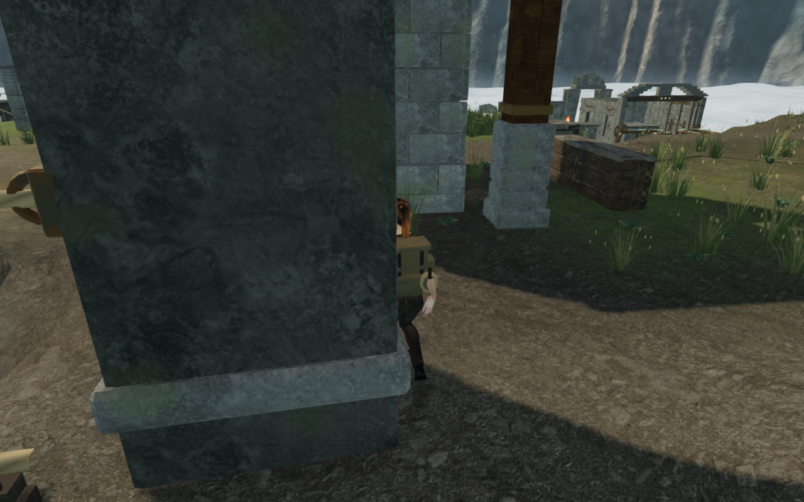
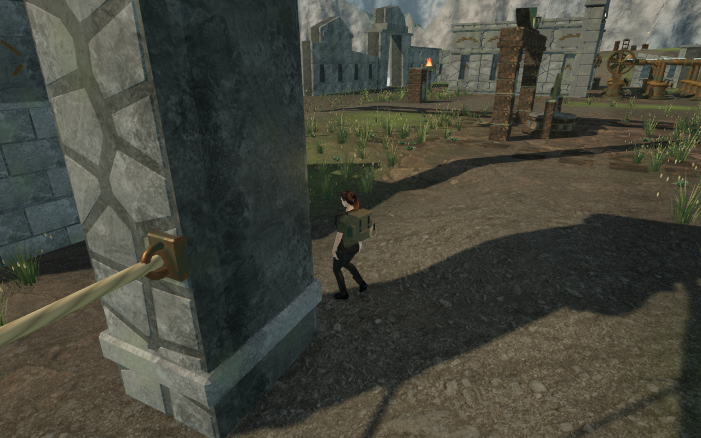

# Cloud bridge post clearance

On the last cloud climbing approach, a bridge post hid much of the explorer
while the camera retained full opacity. Reconstructing the recorded idle pose
with the delivered body and equipment found 429 of 1,012 sampled vertices
behind granite. Of those samples, 146 actually entered the post's closed stone
backing by more than 15 mm, reaching 120.042 mm. The old movement query still
accepted the explorer's position.

The collision record used an axis-aligned rectangle around each post's center.
Its small footprint did not follow the bridge rotation or reserve body space.
Each of the 72 posts now caches the horizontal and vertical bounds of its
actual column and three trim meshes before batching. Movement transforms the
query into that bridge's frame and checks the applicable height bands with a
40 cm rounded body margin. The world-space envelope also follows the rotation
for planting and sound approach checks. Rendered stone, terrain, bridge heights
and the walking controller remain the same.

The explicitly captured lower and upper trim meshes were also too small for
the camera's default surface filter. Their captures now opt into small
surfaces, adding the 144 missing trims. The camera-follow algorithm is
unchanged. Two regressions fail against the previous implementation: the
occupied standing position must be rejected, and an actual low-body ray
through the base trim must participate in camera collision. A nearby supported
standing position remains permitted.

All 800 campaign checks across 122 files pass without failures, cancellations
or skips. The production build passes with its existing bundle-size advisory.
All five continuous cloud climbing loops complete at health 100 without camera
fades across 7,758 updates. Each uses one supported starting placement, then
continuous controller movement through the approach, mantles, jump, rope,
summit, animated return cable and ground return. These completed-expedition
fixtures do not advance enemy AI or combat. All 131 route captures are reviewed.

A second full last-course route samples the delivered body and equipment at
87 walking poses near the affected post. All 88,044 vertex observations clear
the conservative column and trim bounds by the 15 mm contact tolerance. This
does not mean every vertex is visible: 87 sight rays across four poses meet
foreground geometry, including handrails and a higher deck viewed from its
lower bank. The forty shoe samples behind that deck remain before its edge
and at least 13.184 mm above actual terrain triangles. All 34 additional route
views are reviewed.

Both keyboard/High and touch/Low production cases load an older save at the
occupied position. The existing arrival recovery moves it 75 cm sideways onto
clear ground. Since that displacement exceeds the existing saved-camera
tolerance, both initial views use the independently verified default heading
and pitch. Native look and crouched movement then preserve health, progress
and explored cells, and complete-store reloads are stable apart from chapter
timestamps. All six native views are reviewed. Loaded assets match the final
build, with no browser errors, warnings, failed resources or horizontal
overflow.

The 79 retained cliff stones still pass 36,464 independent underside rays per
progress state. The 12,727 meadow plants pass 3,105,936 root rays per state,
with rock and plant transforms unchanged after restoring nine open gates.
Nine gate thresholds, 59 feature approaches, eighteen discovery stances and
eighteen gate sound fronts remain reachable. All 119 wind-control movement
legs and all 249 potentially audible wind-source fronts remain clear. Eleven
fixed bearings keep their previous occlusion results and emit no turning voice.
Distance attenuation and the quiet themed score retain their behavior.

These lossless High captures use the same initial setup, target and 268
controller updates. The corrected collision changes the walking path, so the
resulting position, facing and camera differ. They are route comparisons,
rather than a claim that the camera alone clears an identical pose.

This fixes the recorded body overlap in VA-67. Whole-campaign visual acceptance,
wider court and course composition, subjective listening and device coverage
remain open. The preceding [cloud-stone fitting](cloud-cliff-stones.md) and
[bridge-side path grading](bridge-side-paths.md) retain their separate placement
and terrain-contact evidence. Existing [asset attribution](asset-credits.md)
is preserved; this change introduces no external artwork.
