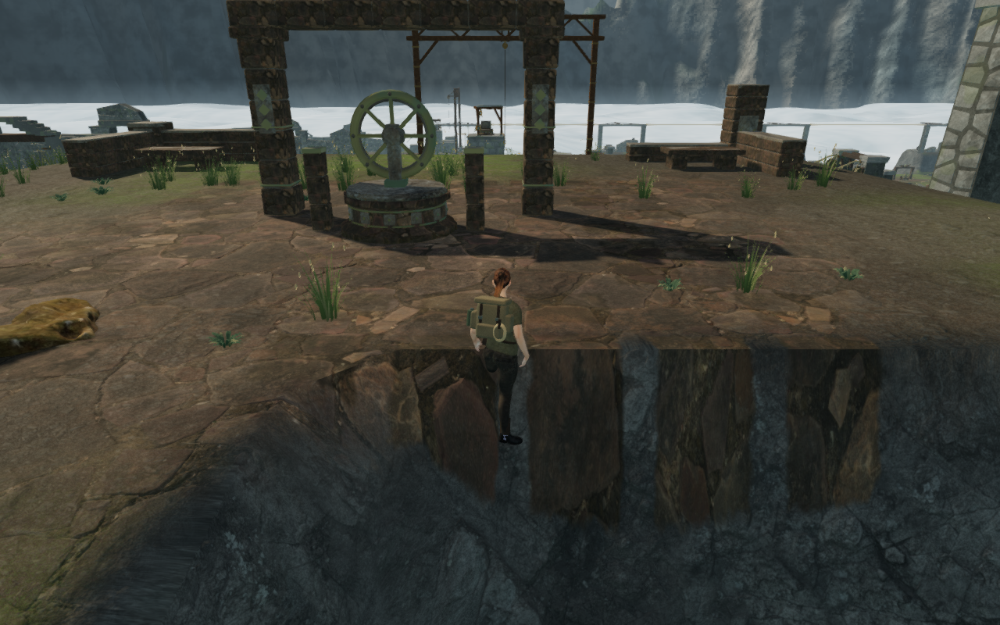
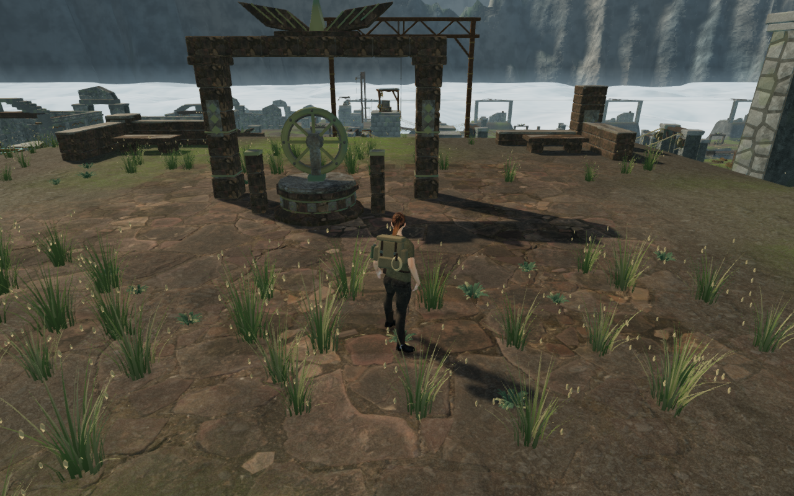

# Supported paths beside cloud bridges

A bridge's outer excavation fringe overlapped a parallel walking path in the
cloud chapter. The explorer stood on a legal center point, but turning placed
boots and legs inside the adjacent steep triangles. The recorded return stance
reaches 749.28 mm of sole penetration. A continuous controller walk completes
412 updates, with 55 of 92 nearby contact samples embedding queried soles more
than 15 mm into the rendered ground.

The sky terrain now grades that outer fringe against the walking footprint.
It retains the original excavation inside the 4.5 m crossing corridor,
then blends toward the path's ground between 4.5 and 6.5 m across the span. Beyond
6.5 m, the walking cells and a 0.75 m foot margin keep their original cap; the
protection fades outside 2.5 m from the walking footprint. This applies to all
eighteen bridges. Other chapter terrain and the movement controller retain
their existing behavior.

The terrain comparison against `ee5e4bf` records 7,763 changed refined vertices.
Of the 3,159 changed walking vertices, 3,115 rise and 44 neighboring erosion
samples lower slightly. The largest overall rise is 26.670 m; the largest
erosion decrease is 0.219 m. The eighteen complete bridge records, three water
records, 4,779 working-pad samples and 82,606 walking vertices beyond the affected
fringes retain their previous values exactly. The complete excavation term remains inside the
4.5 m corridor; neighboring interpolation changes some of its outer ground.
Terrain samples along all eighteen deck centerlines and both 2.3 m deck edges
retain their previous heights at 0.25 m intervals. The wider rock shoulders and deep ravines remain.

The actual-world comparison repeats six recorded positions in three facing
directions. All eighteen poses are grounded and legal, all queried soles clear the
rendered terrain by at least 6.429 mm, and none of 54,252 sampled body/equipment
vertices embeds more than 15 mm. The repeated 412-update return walk also clears
all soles across its 92 nearby contact samples, with minimum clearance 3.779 mm.
All seventeen baseline and 26 final contact images are reviewed.
The new delivered-model regression fails against the preceding terrain and
passes with the revised grading.

The regenerated meadow contains 12,537 plants in 376 batches. Every sampled
root remains below the actual terrain triangles across 3,059,172 rays per
progress state. The placement remains identical after restoring all nine open
gates, with no machine or door-envelope exclusions failing. Plant counts change
because the graded surface affects the existing slope and placement filters.

All 797 campaign checks across 122 files pass without failures, cancellations
or skips, and the production build passes with its existing bundle-size advisory.
All eighteen spans pass actual-controller crosswind crossings in both directions:
23,724 updates, health 100, and no recorded recovery-sized steps. The 54 bank
route searches also complete. All five complete cloud climbing loops pass with
health 100 and no camera fades across 7,634 updates. Each uses one supported
initial placement, then normal approach, mantles, jump gap, rope catch/release,
summit, animated return cable and ground return without resets between those
legs. The completed-expedition fixtures do not advance enemy AI or combat.

Both keyboard/High and touch/Low production cases verify manual look, crouched
ground movement, full health, retained progress and explored map cells, and
complete-store reloads apart from chapter timestamps. The second reload is
stable, with no arrival-camera corrections. Loaded assets match the final build;
there are no browser errors, warnings, failed resources or horizontal overflow.
All 78 final bank views, 129 final loop captures, 36 final crossing images and
six native captures are reviewed.

Gate checks retain nine clear thresholds, 59 feature approaches, eighteen
discovery stances and eighteen reachable sound fronts. All 119 wind-control
movement legs pass. All 249 potentially audible wind-source fronts are clear.
The observer now distinguishes eleven fixed bearings that never emit a turning
voice; their occlusion results remain recorded. Those eleven results are the
same with the preceding terrain and the revised surface. Runtime sound sources,
distance falloff and the themed scores retain their existing behavior.

Bank review also identifies a pointed rock silhouette hanging over the cliff
beside span 13. Its support and placement need a separate review; the current
contact measurements concern the explorer and planting.

These standing comparisons use the same horizontal root coordinates, facing
and normal animation updates on their respective terrain versions. The root
height, planted scenery and follow-camera position change with the surface.
They do not establish full-body clearance throughout the chapter. Broader
landscape and court composition, campaign routes, subjective listening and
device acceptance remain open. The earlier [bridge approach step repair](bridge-approach-steps.md)
retains its separate controller evidence.
