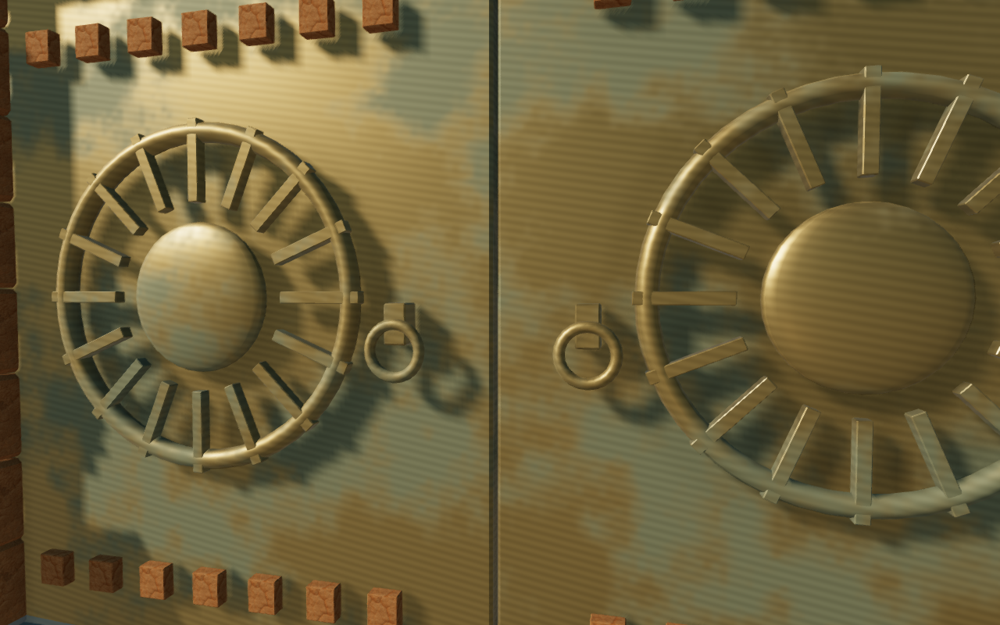
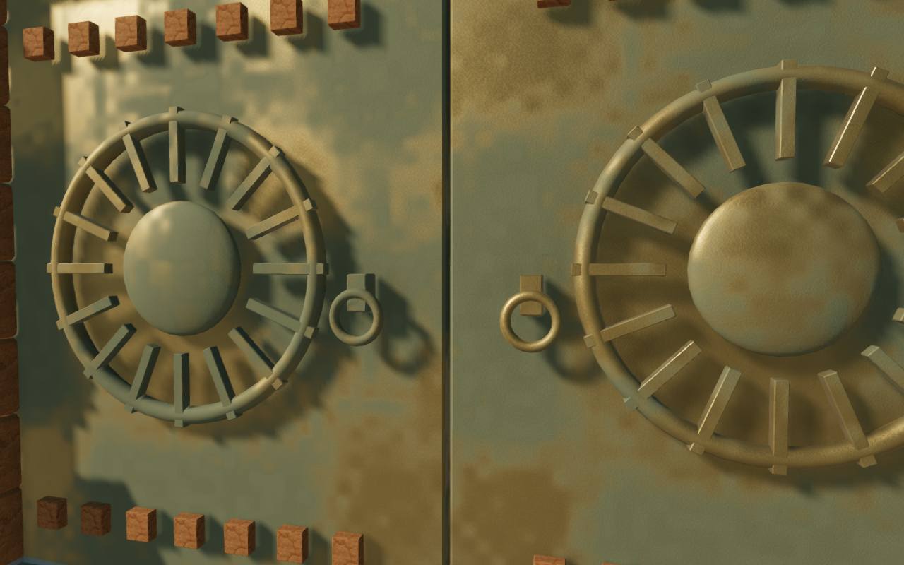
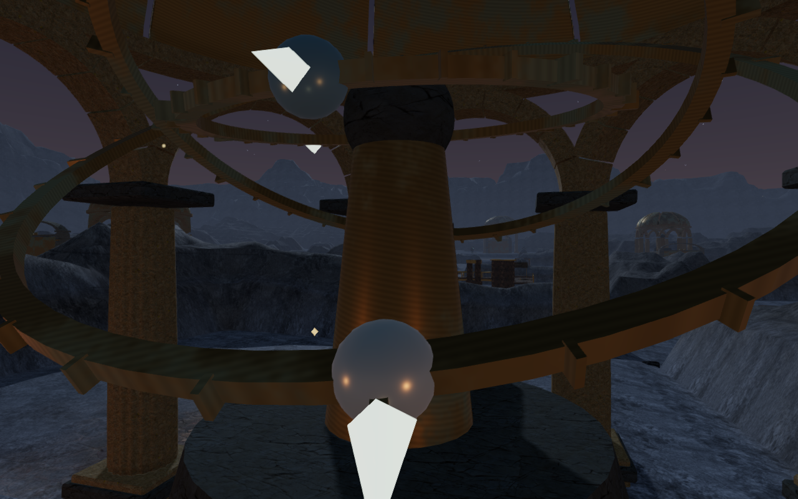
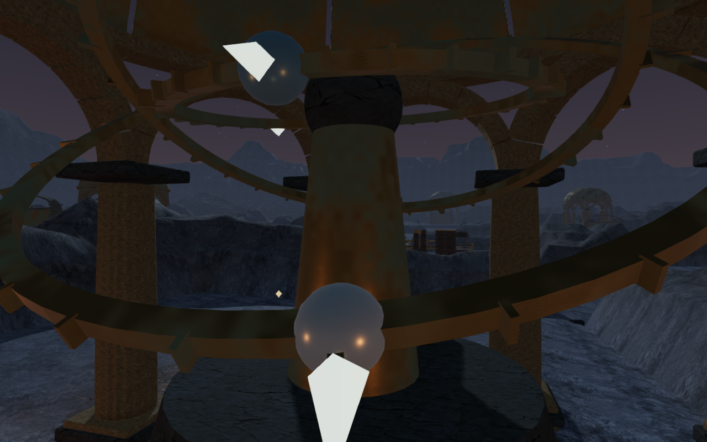

# Bronze without repeated stripes

The shared gate and instrument bronze now uses irregular oxidation, roughness
variation and shallow pitting. The previous shader multiplied its color by a
fixed sine wave, leaving closely spaced diagonal bands across doors, rings and
shafts. Removing that term also removes its regular stripe pattern. The new
noise fields fade toward their average when their detail becomes smaller than
a pixel, reducing distant surface shimmer.

This material appears in the jungle, desert, snow, coast, crystal and eclipse
chapters: their sanctuary gates, monastery bells, hydraulic and resonance
fittings, the coral pump, observatory instruments and orbit vault. The volcanic
and sky gates use separate materials. Other metals, including the desert mirror
handwheels and guardians, have their own shaders.

## Matching game views

These are actual game renders from matching cameras and lighting. Their WebP
conversions preserve the decoded source pixels losslessly.

## Controlled material measurements

The development-only [material review helper](../scripts/verify-bronze-browser.js)
renders a bronze panel with fixed lighting and an orthographic camera. Before
and after comparisons used a 1280-by-800 canvas, three view scales and a second
view shifted vertically by 2.5 mm. These twelve controlled renders supplement
the game views; they are not a measure of overall image quality.

For the closest panel view, eighteen image columns were analyzed with a
Hann-weighted Fourier measurement at the old stripe frequency, about 50.93
cycles per image. Its average amplitude dropped from 4.26 to 0.62 in 8-bit
luminance units, an 85.5% reduction. The peak-to-neighbor ratio dropped from
152.7 to 1.34, consistent with the absence of the old periodic line pattern.

For the 2.5 mm camera shift, the panel crop's mean absolute RGB difference fell
from 0.563 to 0.092 at four times the view height, and from 0.581 to 0.080 at
twelve times the view height. These values use 0–255 channels. They describe
these small, controlled shifts only; they do not establish artifact-free motion
on every device or viewpoint.

## Rendering cost

A fixed desert gate view was measured with hardware GPU timer queries, using
before/after/after/before material order in each graphics setting. High samples
averaged 25.11–26.85 ms before and 27.06–28.15 ms after. Low samples averaged
14.10–14.12 ms before and 14.63–14.64 ms after. The new shader's additional cost
was about 1.6 ms on High and 0.5 ms on Low in this scene. A short image-conversion
task overlapped the start of this run; the timing ranges include run variation.

Triangle and draw-call counts were unchanged: 2,523,911 triangles / 1,258 calls
on High and 1,040,214 / 532 on Low. The queries completed without disjoint or
unfinished samples. These are local GPU render timings with simulation frozen,
not a consumer-hardware frame-rate guarantee.

## Verification

All 608 automated tests passed in 247.72 seconds. The production build passed
in 5.28 seconds with its existing bundle-size advisory.

The initial game review covered 86 views across the six affected chapters in
High and Low graphics, including early, middle and final gates and the other
material users. Follow-up renders inspected each chapter's first gate at five
opening positions, four small camera shifts beside desert/eclipse doors, and
eight direct hydraulic/resonance fitting views in High and Low. Four additional
rear fitting views were obscured by court walls; the direct control views
resolve that coverage gap. All these captures and the twelve controlled panel
renders were reviewed, with every shader linked and no browser errors or
warnings.

All 52 gates had clear sampled open thresholds through the existing
[assisted gate inspection](../scripts/verify-gates-browser.js). Of 104 exterior
source rays, 92 were clear; six jungle rays and six crystal rays met existing
occluding geometry. This shader change does not move sources, change occlusion,
or alter distance falloff or music. This is a local graphics review, not a new
listening assessment or a declaration that every part of those chapters is
visually complete.

Two production cases operated the coral pump with native keyboard and portrait
touch input. Both installed the recovered impeller, walked between the bronze
controls, and restored flow using the two valid valve configurations (2/0 and
3/2). The fixture starts beside the pump with the first two field actions
complete. It does not substitute for a full chapter playthrough.

Four paused reload comparisons preserved the entire normalized save apart from
timestamps, including the installed impeller, unfinished settings, completed
field action, position and camera angles. Both completed cases retained 100
health. The four gameplay captures were reviewed. The portrait case used Low
graphics with audio muted. Both used the current production assets, without
development hooks, horizontal overflow, failed requests, browser errors or
warnings.

This resolves VA-06 in the [playable-world visual audit](visual-audit.md). The
waterfall and court-composition findings and broader route coverage remain
open. These local checks do not establish commercial AAA graphics.
