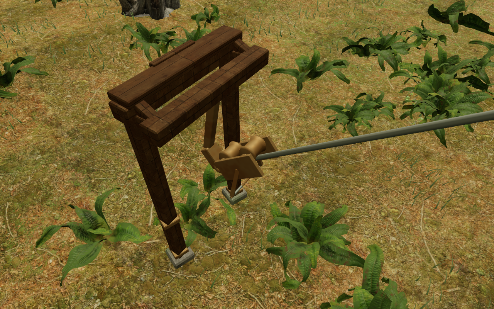
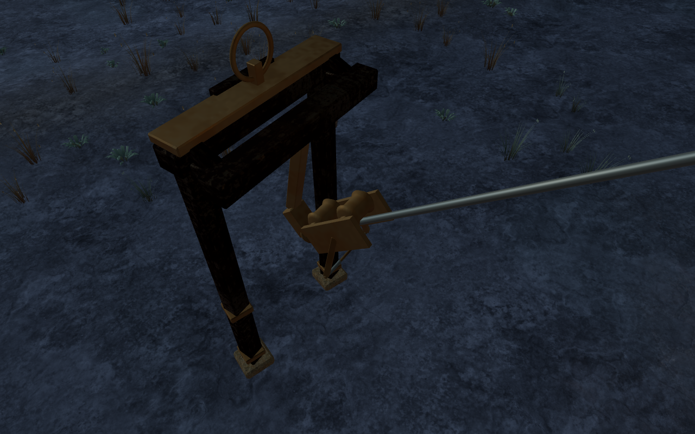

# Return-cable geometry verification

The sheave-clearance regression could pass with no terminal pieces to inspect.
Its world fixture rebuilt camera surfaces before reading their pending records,
and that rebuild releases the records. The sampled wheel-vertex count remained
correct even though the geometry comparison was empty.

The replacement observes material batching independently of camera capture.
It retains each source piece's identity and transform, verifies every expanded
vertex against the final rendered batch, then extracts that piece directly
from the delivered buffer. Small parts omitted by camera filtering, wire leads,
regional ornament and the rotating winch construction are included. The
temporary observer restores the removal method immediately after construction
and releases its copied geometries and material after the check.

Closed pieces use independent two-sided triangle crossings with deduplicated
hits. Position-welded edge ownership checks their closure first. Open decorative
geometry, including uncapped motif tubes, uses a different clearance proof:
its complete bounds must remain disjoint from the complete sheave bounds.
Bounds only prune the interior rays for closed pieces. Separating primitives
prevents overlapping backing and facing from cancelling one another's parity.

A regression with three small rotated blocks proves that the observer retains
real geometry after both batching and camera rebuild, detects their interiors
and leaves empty space clear. Every campaign course also moves a copied closed
piece onto an actual delivered sheave vertex. All 21 deliberate overlaps are
detected before the copied observer transform is restored.

The focused fixture builds the shipped return-cable component using the
campaign's actual plans and terrain profiles. Both final focused checks pass
in 5.081 seconds. The remaining climbing-art test file passes its syntax check.
This milestone does not claim a new full campaign-suite run or production build;
the preceding production evidence retains its documented scope. Application
source and delivery assets have no changes in this verification milestone.

## Actual browser worlds

The same observer passes in all eight loaded game worlds, including their real
terrain and material setup. Both sheaves are inspected at 33 sampled positions
along each of the 21 cable paths.

| Chapter | Courses | Terminal pieces | Sampled sheave records |
| --- | ---: | ---: | ---: |
| The Verdant Veil | 1 | 84 | 13,200 |
| Beneath the Sands | 2 | 204 | 26,400 |
| A Silence of Snow | 4 | 432 | 52,800 |
| The Drowned Kingdom | 2 | 176 | 26,400 |
| A Heart of Embers | 1 | 99 | 13,200 |
| Where Eagles Sleep | 5 | 420 | 66,000 |
| The Night Below | 4 | 328 | 52,800 |
| The Last Meridian | 2 | 180 | 26,400 |
| Total | **21** | **1,923** | **277,200** |

All 277,200 records clear the observed terminal construction. Of the 1,923
pieces, 1,625 have closed position-welded topology; all 298 other pieces remain
disjoint from the sheave bounds at the sampled poses. Only two ordinary
vertex/closed-piece bounds comparisons need triangle rays; both place the
vertex outside the piece. All 21 deliberate overlap controls also pass in
the actual worlds.

All sixteen browser captures are reviewed: a High departure and Low arrival
observer in each chapter. Some departure headers obstruct the wheel view;
these photographs illustrate construction and do not replace the independent
vertex/triangle check. Shader programs link, with no reported browser warnings,
errors or failed assets. The two illustrations below are lossless WebP
conversions of actual Low arrival captures, preserving dimensions and decoded
RGBA pixels.

All 1,923 temporary observer geometries emit disposal events matching their
captured resource set. Tests, browser work and image conversions run in sequence
on the shared nine-of-sixteen CPU set with lower scheduling priority. The browser
and development server are closed, both preview ports refuse connections, and
a native host check finds no remaining verification workers, browsers or servers.
Staging, fixtures, raw captures and dependencies remain excluded from publication.
No external assets, recordings or dependencies were added; existing attribution
is preserved.

This verifies sampled sheave vertices and complete bounds for distant open
ornament. It does not establish every mesh intersection between samples,
full explorer-body contact, encounter balance, human playthrough quality or
listening/device acceptance. The broader playable-world visual audit remains
open, with no minimum chapter duration or commercial AAA claim.
