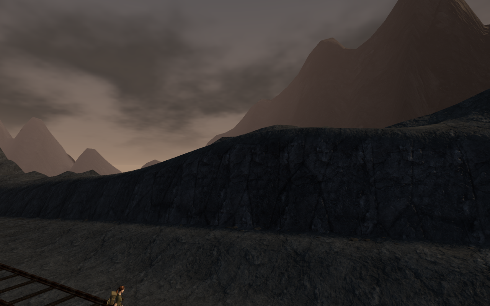
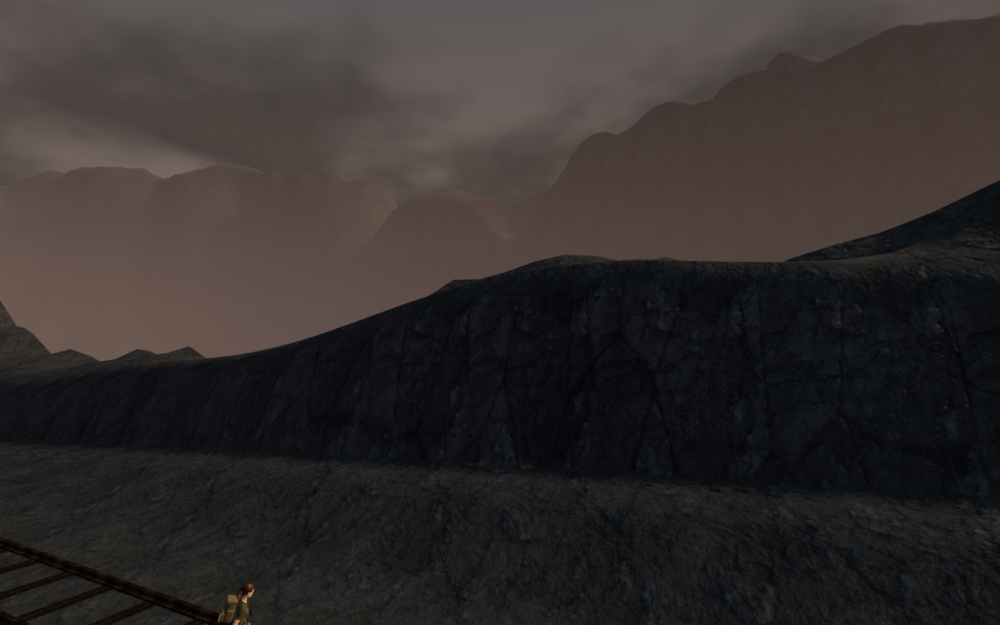
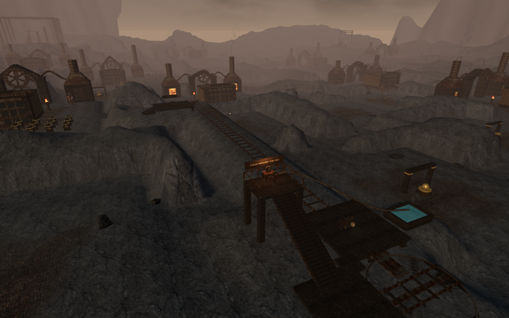
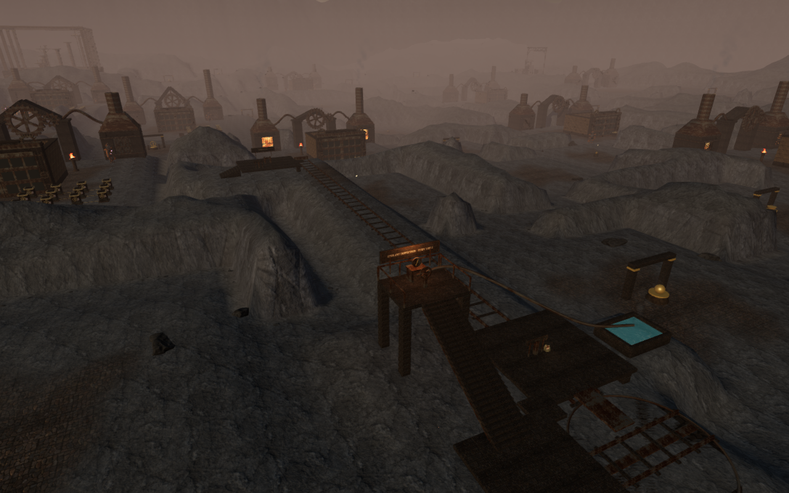
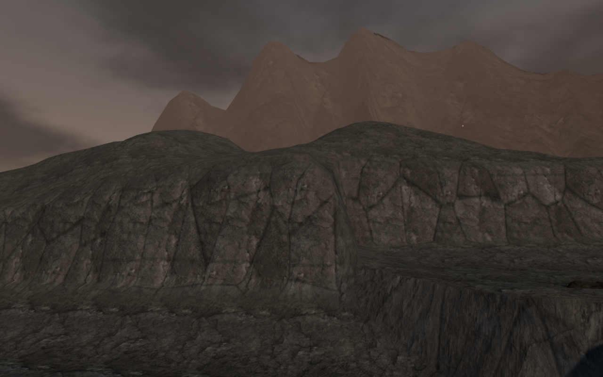
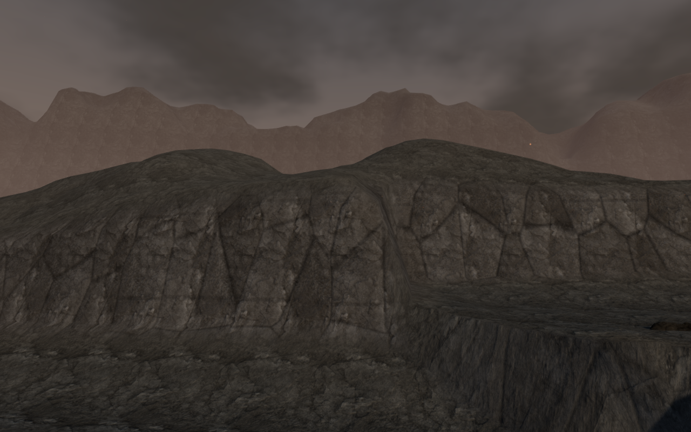

# A continuous volcanic skyline

The skyline around **A Heart of Embers** now uses a broad, irregular caldera
rim with eroded shoulders, broken crests and ash-covered rock faces. The earlier
largely straight slopes produced conspicuous triangular peaks. World-space rock
projection also replaces the stretched texture coordinates on those slopes.

| Previous railway view | Revised railway view |
| --- | --- |
|  |  |

## Geometry and distance

The revised heightfield uses warped Cartesian noise to vary its slopes and
crests without repeating radial stripes. It has 33,345 vertices and 65,536
triangles, up from 8,381 vertices and 16,128 triangles. Vertex and index arrays
occupy 1,460,256 bytes, an increase of 1,095,296 bytes (approximately 1.04 MiB)
before renderer overhead. The source arrays also remain in CPU memory.

The ring starts outside the playable square and extends outward for 230 m.
Its sampled elevations run from −16 m to approximately 145.8 m. Seam positions
and normals meet, and the heightfield faces upward throughout. Playable terrain
heights, water definitions, discoveries, obstacles and fitted fragments match
the previous version exactly in the browser snapshots.

The material projects the existing forge rock color and normal textures along
three world axes at a consistent scale. Broad flow bands, cooler rock tones and
matte ash vary its surface. Height-sensitive distance haze softens the enclosing
rim. No new textures, external art or dependencies are added; the existing
Rock Face 03 attribution is retained in [asset credits](asset-credits.md).

The previous rim also crossed the gameplay camera's 450 m far plane, producing
abrupt vertical cutoffs in wide views. The revised rim uses the existing
cloud-city background technique: its overlapping faces occupy a separate depth
interval, then only that depth is cleared before the playable world renders.
The ash sky renders first. This keeps the full silhouette behind gameplay
geometry without extending the gameplay camera's range.

The shader retains the original near-plane distance before remapping depth.
That also preserves the oblique clipping used by planar water reflections.
The rim is excluded from the nearby contact-shadow pass.

| Previous wide view | Revised wide view |
| --- | --- |
|  |  |

## Rendering checks

Five matched High-quality captures at 1280 × 800 keep the same player position,
camera position and scene time. Each submits one fewer draw call and 33,280
additional triangles. The denser color mesh replaces the previous color mesh
and its unnecessary contact-buffer submission.

| View | Calls before → after | Triangles before → after |
| --- | ---: | ---: |
| Railway bank | 166 → 165 | 319,767 → 353,047 |
| Southern ridges | 1,831 → 1,830 | 1,993,559 → 2,026,839 |
| Entry bank | 206 → 205 | 387,195 → 420,475 |
| Forge court | 1,653 → 1,652 | 1,812,249 → 1,845,529 |
| Western cut | 728 → 727 | 778,985 → 812,265 |

A separate timing experiment at the railway view used Chromium, ANGLE/Vulkan
and an AMD Radeon 780M at 1280 × 800, pixel ratio 1. Each quality setting used
an old/new/new/old sequence, 1.3 seconds of settling and approximately 4.2 seconds
of measurement per case. The entire previous rim geometry and material were
swapped against the revised rim; all other scene content was shared. GPU timer
queries reported no disjoint events.

| Quality | Previous rim, mean GPU ms | Revised rim, mean GPU ms | Increase in the pair mean |
| --- | ---: | ---: | ---: |
| High | 10.536, 10.506 | 11.470, 11.446 | 0.94 ms |
| Low | 4.440, 4.376 | 5.995, 5.547 | 1.36 ms |

Mean High frame intervals ranged from 23.861–25.694 ms before and
26.683–27.041 ms after. Low ranged from 16.666–16.732 ms before and
16.798–17.564 ms after. The revised rim therefore has a measured cost in this
view despite removing one High draw call. Low omits the contact pass already,
so its call count stays constant and submitted geometry increases by 49,408
triangles. These short, variable samples do not establish sustained performance
elsewhere in the chapter or on other devices.

The reusable [browser depth verifier](../scripts/verify-caldera-browser.js)
compares the background to a conventional perspective camera with a 1,600 m far
plane in four directions. All four ordinary comparisons are pixel-identical
at 512 × 320. Foreground probes at 3, 225 and 449 m remain visible and match
their unobstructed reference at every sampled center pixel. A 60 m oblique
plane cuts the range in each direction; those comparisons differ by at most
six color channels by more than one byte, with mean absolute channel error
below 0.0002. This is a bounded projection/clipping check, not broad device
certification.
Run the pixel-read diagnostic separately from frame-timing samples: its
readbacks synchronize the GPU and can produce driver stall warnings.

| Previous entry view | Revised entry view |
| --- | --- |
|  |  |

## Play verification and remaining work

All **519 automated tests** and the production build pass. Vite retains its
large-JavaScript-chunk advisory. A continuous assisted railway route completed
loading, the inspection climb, turning, delivery and the exit stair with live
hazards and enemies; the vent caused 20 damage, leaving 80 health. High, Medium
and Low shaders linked successfully. The final gameplay run reported no page
errors, failed assets or console warnings.

The existing machinery emitters and lifting score followed operation and pause.
Offline HRTF rendering retained half amplitude at each emitter's distance
midpoint and silence beyond range. Changing to the desert disposed the caldera's
geometry and material and removed its mesh from the new chapter.

Seven production keyboard/touch/save cases pass with the development hook
absent: loading and eastbound travel, interrupted travel, interrupted and seated
table turns, muted portrait touch travel and delivery, a returned cart after
completion, and legacy completed progress. Entire saves match across reloads
apart from their last-played timestamp; loaded bundle names match the final
build. The portrait page has no horizontal overflow. This verifies continued
playability and persistence, not a blind human playthrough.

Modern AAA graphics remain unmet. The rim still needs further art direction,
and repeated older buildings and several local ground transitions remain
visible. This skyline pass does not establish one-hour level pacing or
subjective audio quality. Human playthroughs, listening review and broader
browser/device coverage remain part of the [production requirements](production-status.md).

The comparison images are unretouched running-game captures encoded as lossless
WebP files.
