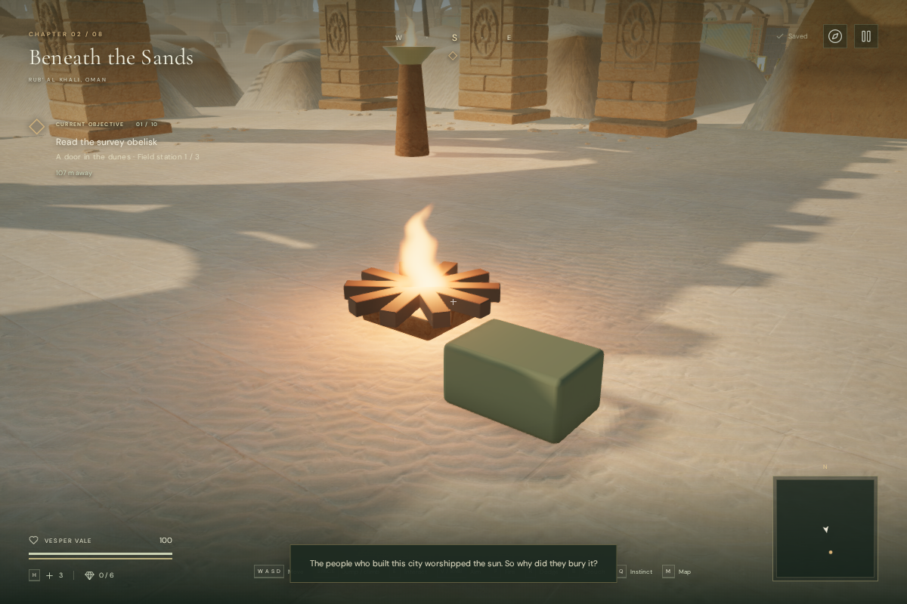
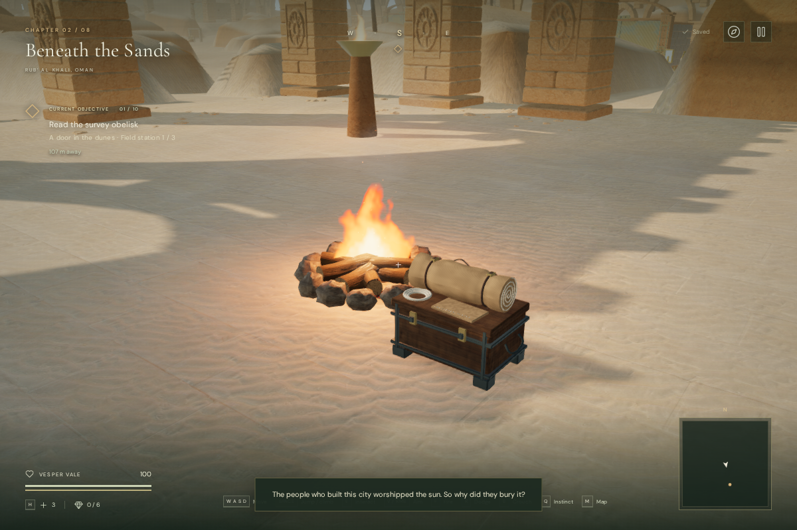
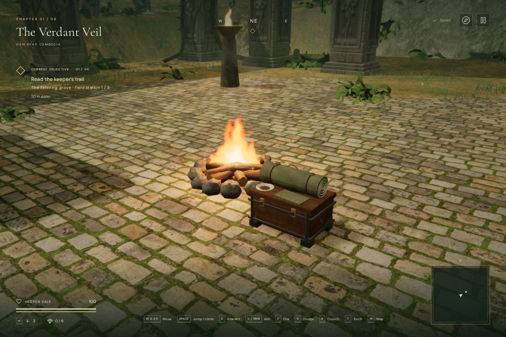

# Base-camp artwork

The 28 camps across the eight chapters now have irregular stone fire rings,
charred timber with cut ends, glowing coals, fitted supply chests, rolled bedding,
straps, buckles, stitching, rope and a small kettle. Cloth colors vary by chapter.
The kit keeps the supply box's existing location, two metres to the right and one
metre behind the camp origin. Ash follows the terrain; stone undersides and the
chest's four pads are fitted to its height.

The camp fire has its own turbulent flame shader, 24 drifting sparks and 12 light
smoke particles. The flame stays upright as the camera moves around it. The fire,
particles and camp-light flicker share a clock that freezes when play is paused.
The existing four-light pool still serves nearby flames.

## Matched views

These are assisted 1200 × 800 review cameras at the first desert and jungle camps.
The character is hidden so the camp geometry can be inspected. The before and
after desert views share the same camera, feature positions and fire origin.

Additional High-quality views were inspected in the snow, coastal, volcanic,
cliffside, crystal and eclipse chapters. Their camp shaders linked without
console errors or warnings under each chapter's lighting and fog.

The geometry and shaders are original code. Wood, bark and stone use the already
bundled, credited Poly Haven maps. The fabric, stitching, cut grain and soot
variation are procedural. No new external models, textures or recordings were
introduced; [asset credits](asset-credits.md) retain their sources.

## Gameplay and sound

The camp's interaction origin and flame anchor remain unchanged. Native Use/E
still restores health, stamina and supplies and saves the current position as the
checkpoint. Jungle camps still light the carried torch with T. Each flame retains
one positional fire voice at its actual world position, 0.75 m above the camp.

The replacement chest now has a solid footprint, extending 0.66 m and 0.43 m from
its centre along the horizontal axes. Older saves inside that footprint use the
existing safe-arrival search to recover on nearby clear ground. No other obstacle
bounds or feature positions changed in the matched jungle/desert comparisons.
All four sampled approaches, 1.8 m from each camp centre, remain clear in all 28
rendered camp locations.

The browser audio check selected the existing fire voice with clear line of sight.
Its diagnostic gain was 0.8 at 2 m, 0.4 at 12 m, and the voice was released at 23 m.
The panner retained linear falloff, a 2 m reference distance, 22 m maximum distance
and rolloff 1. These are voice-state measurements, not signal RMS or a subjective
listening assessment. The chapter/objective scores and saved mix controls remain
on the existing audio path.

## Rendering and verification

Each camp has 27,520 solid/detail triangles, batched into 14 material draws before
shadow and other rendering passes. The main props remain within 100/85/65 m and
small fittings within 38/30/23 m in High/Medium/Performance respectively. Smoke and
sparks use shorter ranges. The camp marker remains available beyond the prop range.

The matched whole-scene review frames measured:

| Scene       | Quality     | Calls before → after | Triangles before → after |
| ----------- | ----------- | -------------------: | -----------------------: |
| Desert camp | Performance |            308 → 302 |        676,102 → 701,414 |
| Desert camp | High        |            712 → 706 |    1,842,139 → 1,919,467 |
| Jungle camp | Performance |              82 → 92 |        463,757 → 490,585 |
| Jungle camp | High        |            372 → 396 |    2,331,509 → 2,411,865 |

The desert's draw reduction includes the new distance culling of remote camps;
it does not mean the nearby camp became cheaper. The added geometry raises the
triangle count in every matched view. These workload figures do not establish
consumer GPU frame rates. All reviewed shaders linked without warnings/errors.

Three new tests inspect all 28 camp builds, finite geometry and bounds, clear
approaches, chest collision and safe arrival, torch and rest behavior, the retained
fire voice, pause, distance visibility and resource ownership. All 380 tests and
the production build passed; the build retains the existing large-chunk advisory.

The browser loaded all eight chapters, checked 112 approach points and one fire
emitter per camp, and used native E to rest at each first camp from an assisted
starting position. Every rest restored 100 health, 100 stamina and three medical
supplies and saved the correct checkpoint. Native T lit the jungle torch. Each
chapter change released exactly 57 or 76 camp geometries, 19 or 21 materials and
nine textures, depending on whether the departing chapter had three or four camps.

In the High-quality production build, native T lit the jungle torch and native E
restored a prepared save from 37 to 100 health and from zero to three medical
supplies. A paused reload restored the exact record, lit torch, checkpoint,
position `(54.2, 56)` at ground height, all eight chapter records, settings and
creation timestamp, excluding only deliberate `lastPlayed` refreshes. The release
exposed no development hook and recorded no failed asset requests or console
warnings/errors. It loaded `index-CEJoqLed.js`, `game-Xvi7FqOn.js` and
`three-BO_Srq6n.js`.

## Limits

The camps use a repeated expedition kit with regional fabric colors. The flame is
still a shader card and smoke uses particles, rather than a volumetric simulation.
These changes improve the repeated camp scene but do not establish AAA graphics,
subjective audio polish, supported-device performance or approximately one hour
of human gameplay per chapter.
