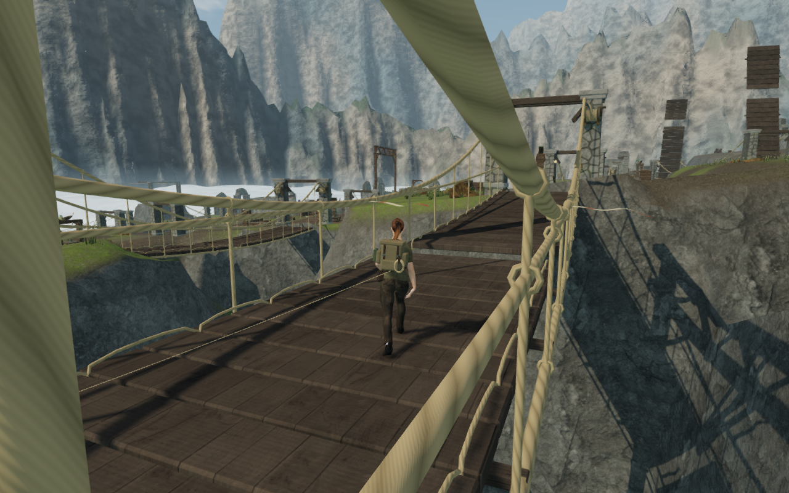
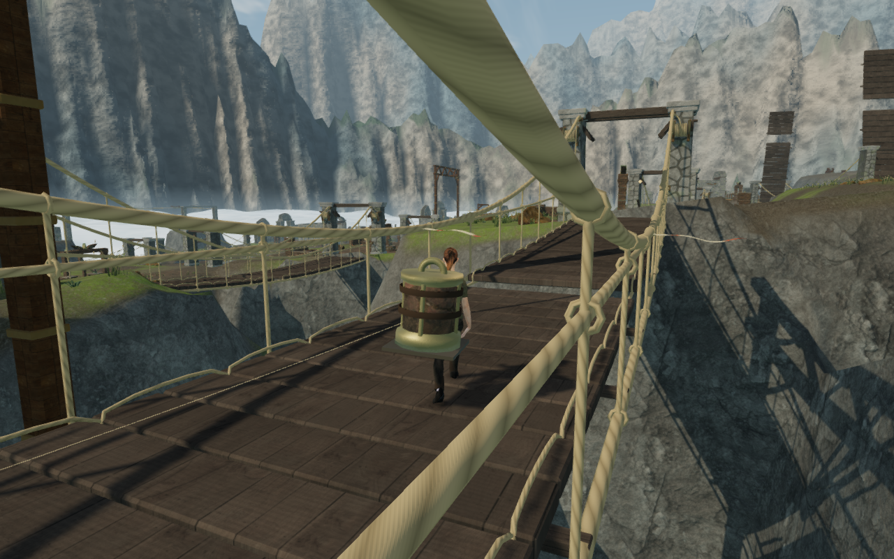
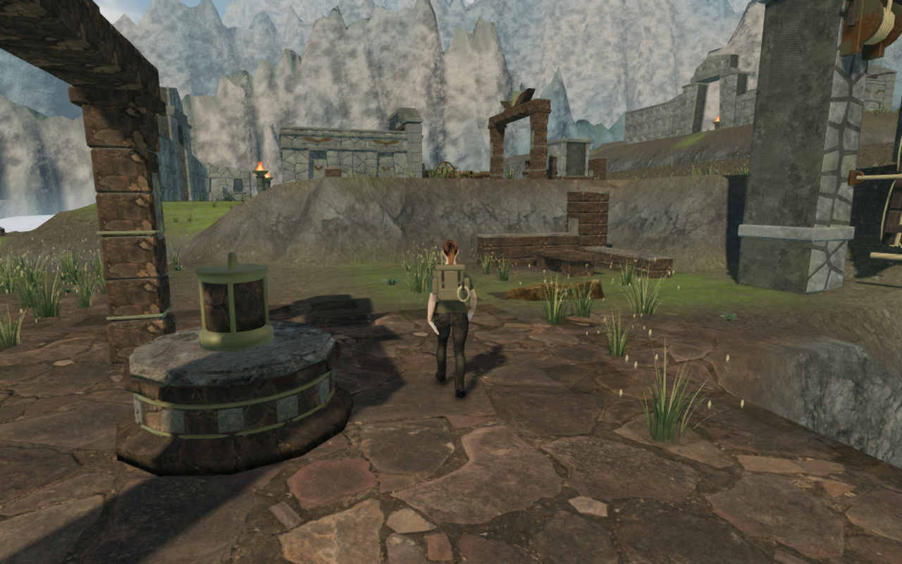

# Recovered fittings on the expedition pack

Recovering the observatory pendulum previously removed it from its source
station, but the explorer crossed both bridges without a visible object. The
twenty regional cartridge fittings now travel on the explorer's pack until
delivery. Their geometry, size, chapter materials and oxidation match their
source stations.

A metal seat supports each cartridge's closed bottom. Two stays connect the
seat to the lower pack mounts, while leather bands retain the fitting sideways.
Four mounting shoes fit the actual curved backpack surface. The complete
assembly follows the backpack's spine bone through the existing animations.
Its surfaces use the explorer's close-camera coverage mask independently of
the station materials.

Existing saved field progress selects the carried fitting on initial load and
removes it when delivery or sector advancement ends the carrying task. The
source, carried copy and installed destination update together, avoiding a
missing or duplicated component immediately after an interaction. The save
format and existing movement rules are retained.

These captures show the same observatory route before and after the change;
they are separate assisted runs, rather than an identical-camera comparison.

## Coverage and verification

| Chapter | Regional carried fittings |
| --- | ---: |
| The Verdant Veil | 3 |
| Beneath the Sands | 3 |
| A Silence of Snow | 3 |
| The Drowned Kingdom | 1 |
| A Heart of Embers | 2 |
| Where Eagles Sleep | 3 |
| The Night Below | 3 |
| The Last Meridian | 2 |
| Total | **20** |

The pump impeller, tempering-cart blank and crane spindle have their own
mechanical assemblies and are outside this regional cartridge pass. The
existing installation rules prevent an additional cartridge on the explorer
when those mechanisms handle their component.

- All **727 tests pass**. The production build succeeds with the existing
  large chunk advisory.
- The twenty fitting cases check recovery, restored progress, delivery and
  sector advancement. Source/carried visibility changes in the same world
  update. Geometry, transforms and surface properties match their source
  meshes, while actor materials and geometry are independent copies.
- Every cartridge bottom meets the bearing seat. Rays through all four
  mount centers meet the delivered backpack, and 360 idle, walking, running
  and turning samples retain the same contacts within one micrometre without
  changing spine-bone positions or scales.
- Eighty reviewed observer captures show rear and side views of all twenty
  fittings at High and Low quality across all eight chapters. Each capture
  checks the actual saved quality, shadow and cinematic settings, legal
  standing position, expected fitting identity and finite transforms. These
  use assigned observer positions and field states on disposable progress.
  The reusable setup and measurements are in
  [inspect-carried-fittings-browser.js](../scripts/inspect-carried-fittings-browser.js).
- The continuous assisted observatory route starts at a previously earned
  fifth-sector save, recovers the pendulum, crosses both damaged spans, surveys
  the mount, installs the fitting and performs fourteen legal wind turns. It
  activates the fifth engine and reaches the next sector with health 100.
  The route covers **323.549 m over 5,749 player updates**, with a largest step
  of **0.215 m**, no steps over one metre and no stalls. All 57 final captures
  were reviewed, and carried visibility matches progress at every snapshot.
  It advances the delivered controller, camera and machinery with scripted
  steering; enemy AI and combat are not advanced.
- Four production cases load earned pickup/delivery approach saves and use
  native keyboard controls at 1280 × 800 in High or native touch controls at
  540 × 900 in Low. They perform the interaction, walk, pause and reload. The
  complete localStorage record matches after reload apart from `lastPlayed`;
  after resuming, actual saved feet remain within 5 cm and progress and health
  remain intact. All twenty native views were reviewed. Every case loads the
  current production bundles without a development game handle or overflow.
- Final browser runs report no errors or warnings, and shaders link. The
  three documentation images are actual game captures converted losslessly
  to WebP, with decoded RGBA identity checked.

## Remaining visual review

The final wind control in this route still produces an obstructed camera view.
At engine index 4, duct 11, the approach arm measures 1.349 m and the turning
arm 0.205 m; explorer coverage is zero in both recorded views. That working
composition needs a separate repair. Later routes, repeated courtyards and
terrain shoulders, other chamber interiors and custom component handling
remain part of the [open visual audit](visual-audit.md).

The carrier uses original construction and existing credited assets. Existing
positioned environmental sounds, mechanism sounds and chapter music remain in
use. This pass adds no subjective listening assessment, consumer hardware
performance measurement, human chapter-duration measurement or AAA claim.
