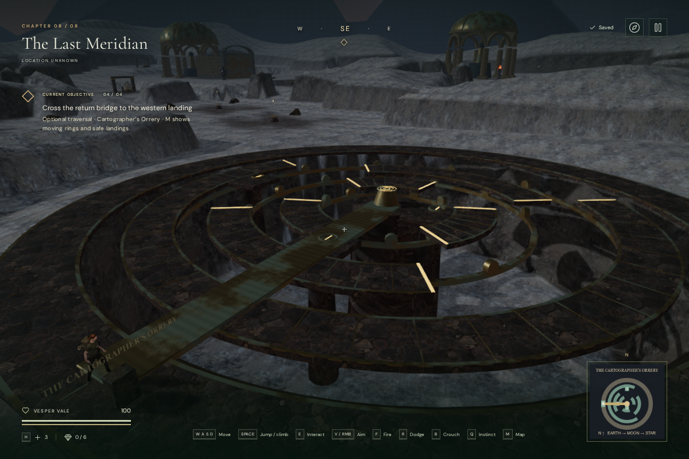
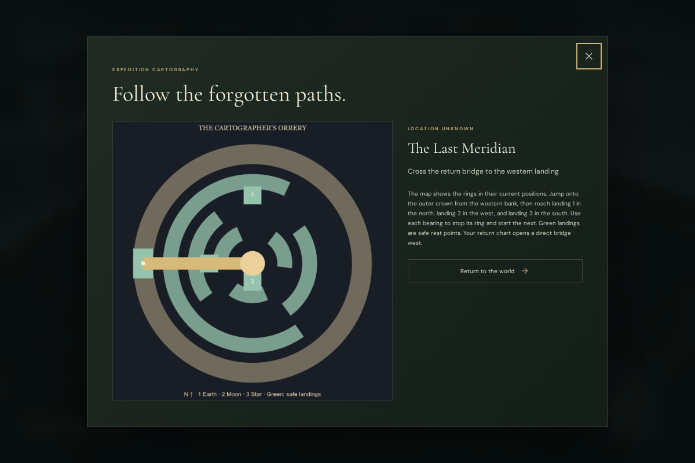

# The Cartographer’s Orrery

**The Last Meridian** now has an optional traversal court beside the cache west
of its entry area. Three concentric stone crowns rotate above a ten-metre well.
Walking changes the explorer’s place on a crown; standing still carries her with
it. Fixed landings separate the moving sections and provide safe recovery points.

Read the western tablet with **E / Use** to start the outer Earth ring. Jump
across the entrance gap, then reach the **northern Earth bearing**, the **western
Moon bearing**, and the **southern Star bearing**, in that order. Each calibration
stops its ring and starts the next. The Moon and Star rings turn in the opposite
direction to Earth and have different arrangements of open sectors. Bright edges
mark the ends of each walkable section.

After all three calibrations, recover *The map that brought them home* at the
centre. A direct bridge opens to the western landing. The chapter’s existing
observatory objectives remain independently playable.

**M** shows the crowns at their current angles, numbered landings, the active
rotation direction and the explorer’s position. **J** retains the instructions,
calibration count and recovered chart. Text and map clues support muted play.
The bearing controls also accept the touch **Use** button.

## Motion and persistence

Only the currently selected ring turns. Its rendered geometry, walkable surface,
camera obstruction and machinery source follow the same angle. The character
controller carries a grounded rider around the centre; airborne motion and fixed
landings remain independent. The existing boot grounding follows these surfaces.
Pausing freezes the crowns and silences their machinery activity.

Each newly reached landing saves progress. Saves made during a ride, jump or fall
return the explorer to the last safe landing, preserving calibrations and saved
angles. Stable landing and bridge positions can restore directly. Unsupported
older arrivals within the new well recover to a landing. A missed crossing also
returns there and costs eight health. Recovery does not grant a calibration.

The court is added after the chapter’s deterministic feature generation. Its
terrain is recessed beneath the crowns, and nearby decorative rocks reserve the
footprint. Existing feature locations remain outside the reserved court. The
western approach connects to the chapter’s walkable map.

## Sound and artwork

Three machinery emitters follow the rotating crowns. Only the active ring emits;
it uses HRTF panning, the existing obstruction filter and linear attenuation from
2 to 30 metres. The sources sit above the crowns so each deck does not muffle its
own approach. They share the existing twelve-voice limit. The final chapter’s
50 BPM choir score uses its machinery objective arrangement here. Persisted mix
controls and reading/pause ducking continue to apply.

The crowns, bearing tracks, rollers, fixed piers, central chart and bridge are
original project geometry. They reuse the existing stone and patinated-bronze
materials. Deck faces use planar paving coordinates; cut edges unwrap along arc
length and height to avoid stretched texture stripes. Engraved labels and the
map are generated locally. No external assets, recordings or dependencies were
added. The return bridge currently appears when the chart is recovered; its
deployment and the bearing interactions still need further animation work.

## Verification

All **415 automated tests passed**, followed by all **14 affected tests** after
the final edge-texture correction. The six new tests cover jumping to and from
the moving outer crown, support and camera gaps, closed geometry and usable UVs,
rider transport, pause, ordered/repeated controls, save normalization, chapter
isolation, fall/arrival recovery and terrain clearance. The production build
passes with the existing large-bundle advisory.

An assisted browser route used native held movement, Jump and E with supplied
headings and stepped simulation. Starting beside the western cache, it crossed
all three rings, calibrated every bearing, recovered the chart and returned west
in **47 movement segments at 100 health**. This is a route check, not a timed
human playthrough. All five interaction approaches were clear. The court contains
**21,370 triangles in 24 meshes**, excluding the rest of the chapter; those counts
do not measure device frame rates.

A two-second grounded ride moved the explorer **2.637 m** around the Earth ring
without input. The inspected boot clearances remained between **0.0063 and
0.0138 m**, and pausing held both rider and ring still. A transit save selected
the western landing. The portrait map and journal fit the tested 540 × 900
viewport, and touch Use calibrated a bearing.

Live browser voice diagnostics measured effective source gains of **0.036 at
2 m** and **0.018 at 16 m**. At 31 m the source was retired. Each ring’s own
listening approach was clear; a path through its deck was obstructed. These are
source diagnostics before the overall mix, not measured playback loudness or
subjective listening scores. Changing chapter released all **44 inspected
graphics resources** once, removed the orrery’s sources and retained none of its
90 moving camera surfaces.

Five High-quality production cases passed native input and exact whole-save
reload comparisons, excluding last-played timestamps:

| Starting save | Native action | Restored result |
| --- | --- | --- |
| Western tablet, instrument not started | E | Earth ring started |
| One calibration, beside the Moon bearing, muted at 540 × 900 | Touch Use | Second calibration |
| Three calibrations, beside the central chart | E | Recovered record and return bridge |
| Save captured during a ride | Move away from the well, pause | Safe landing arrival and newly walked position |
| Older unsupported position in the well | Move away from the well, pause | Recovered landing and newly walked position |

All retained 100 health and unchanged main objective progress. The production
build exposed no development hook and reported no failed assets or console
warnings/errors. The final bundles were `index-Bl4V3hst.js`, `game-DmD_T3Cx.js`,
`three-CJb2rOZj.js` and `index-DYq9hjRy.css`.

The views below use a browser inspection camera. This addition does not establish
one-hour chapter pacing or AAA graphics. Human exploration and difficulty review,
subjective listening, broader browser/device coverage and substantial further
artwork remain required.

