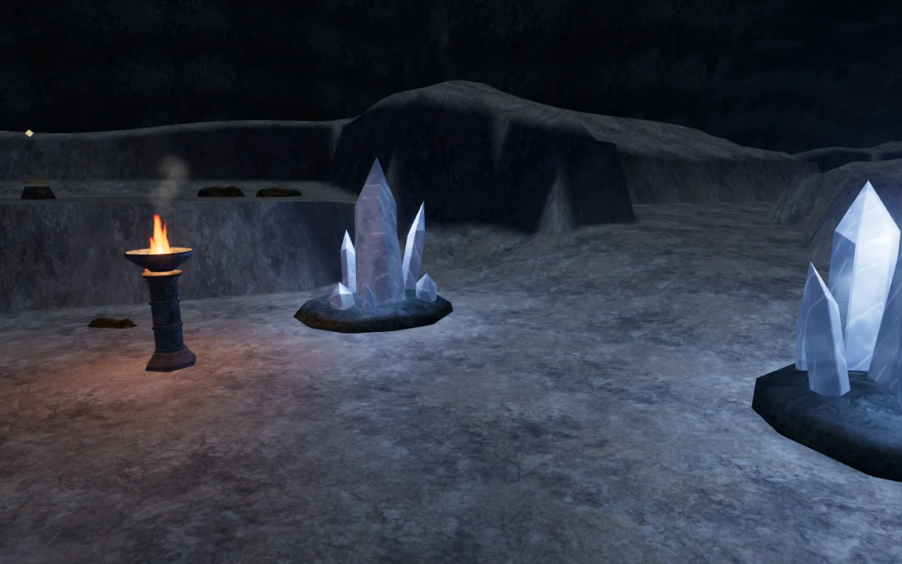
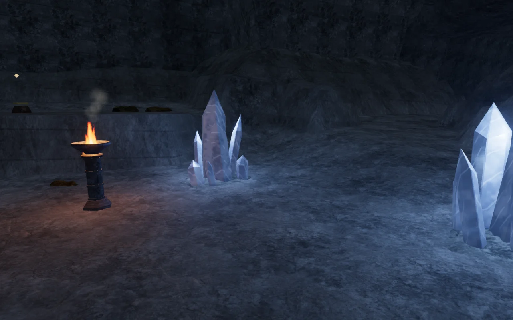
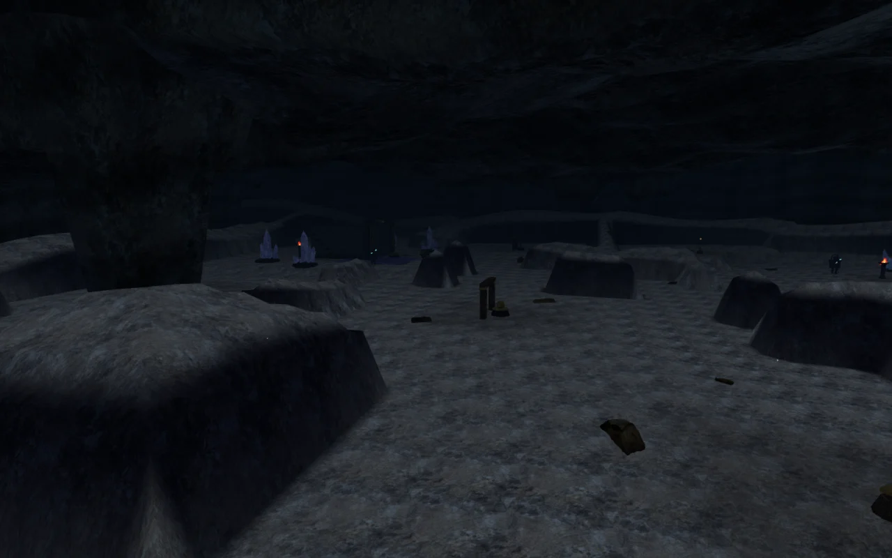
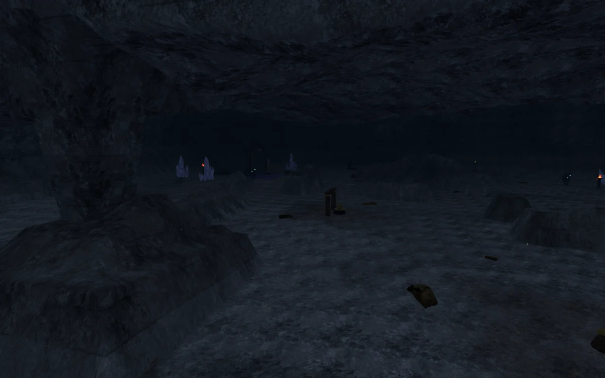

# Cavern banks and mineral beds

**The Night Below** now has more irregular enclosing banks and a shared
limestone treatment across the floor, vault, mineral beds and listening-gallery
walls. Uneven shelves replace the earlier bank shoulders. Broken bedding seams,
pale mineral deposits, surface relief and restrained damp patches give the rock
more variation under the existing crystal lights.

The 33 crystal formations now grow through shallow, irregular stone beds.
Their outer rims tuck below the sampled ground, replacing the thick rounded
bases. The quartz geometry, optical material, light settings and recorded
resonance progress retain their previous behavior.

## Shape and surface

Only bank vertices outside the walking cells receive the new height treatment.
The 1.75 m grid aligns with the closed boundaries of those cells, preserving
both vertices and interpolated heights throughout the walking floor. Wider
reservations protect mineral roots, water, the Listening Gallery, resonance
courts, elevated field stations and the Echo Causeway. The continuous roof
follows the revised surrounding ground while retaining its sealed boundaries.

Noise varies the width and height of the shoulders. Tilted shelves introduce
smaller changes in their silhouette. The shared material evaluates interrupted
seams and mineral deposits in world coordinates; thin details fade as they
become smaller than a pixel. Normal relief, tint and roughness use the same
surface fields. The existing credited rock maps provide their grain, with no
new textures or material slots.

## Rendering cost

Five matched 1280 × 800 High views retain the same call counts. Submitted
triangles increase as follows; these are whole-scene counts across the render
passes, not frame-rate measurements.

| View | Calls, before / after | Previous triangles | Revised triangles |
| --- | ---: | ---: | ---: |
| Entry chamber | 256 / 256 | 370,005 | 372,885 |
| Causeway crossing | 736 / 736 | 1,121,633 | 1,132,433 |
| Eastern bank | 453 / 453 | 806,647 | 820,915 |
| Mineral formation | 150 / 150 | 252,067 | 254,947 |
| Middle gallery | 1,141 / 1,141 | 1,291,887 | 1,303,407 |

Terrain vertex count remains **64,009**, and the roof retains **102 chunks**.
Each mineral bed grows from 80 to 320 triangles, adding **7,920 triangles**
across the 33 formations before repeated rendering passes. The grounding
sampler accepts 99 loose rocks in the revised terrain, up from 95.

The terrain keeps two additional 60,025-element float arrays for refined
heights and exposure, retaining the original height sampler. This adds
**480,200 bytes** of profile data. Its new vertex attribute adds **256,036 bytes**
of CPU data and the corresponding GPU buffer. The expanded mineral-bed
geometry adds approximately **760,320 bytes** each to position/normal/UV data
on the CPU and GPU after static batching. Camera collision data also grows;
these figures are not a complete process-memory measurement.

A bounded GPU comparison uses the entry-chamber view on an **AMD Radeon 780M**
through Chromium ANGLE/Vulkan. Eight alternating runs provide two measurements
per version and quality, each after warm-up and a 4.2-second sample window.
Every run records more than 120 completed GPU timer samples, with no disjoint
queries. The table averages each pair.

| Quality | Previous terrain/rock GPU time | Revised terrain/rock GPU time | Difference |
| --- | ---: | ---: | ---: |
| High | 23.127 ms | 22.908 ms | −0.219 ms |
| Low | 13.742 ms | 13.175 ms | −0.567 ms |

The comparison switches terrain and roof shapes plus the terrain and cavern
rock materials. Revised mineral-bed geometry, loose-rock placements and other
props are fixed in both versions; their changes are outside this timing
comparison. Submitted calls and triangles match between each pair. The lower
measured times apply only to this view and device and do not establish a general
performance improvement or a supported frame rate.

## Verification

- **542 automated tests pass**, using `node --test --test-concurrency=2 tests/*.test.js`.
  The new checks cover walking-cell boundaries and interiors, foundations,
  water margins, deterministic bank shapes, shared mesh edges, material
  ownership and closed, ground-fitted mineral beds. Existing checks cover
  cavern headroom, sealed edges, collision, camera rays and all causeway moves.
- Matched browser snapshots retain the same objective transforms, water
  definitions and collision obstacle data.
- All **33 mineral-bed rims** pass **6,336 perimeter probes** against both
  the visible terrain triangles and sampled floor. A 7 mm exposed rim found
  during the final check was corrected by deepening the buried edge.
- All **99 loose rocks** pass **3,934 underside probes** against the visible
  triangles and sampled ground. Their footprints pass the existing reservations.
- The assisted causeway route reaches all three relays and returns to the
  entrance trail at full health, using normal movement, guardians, hazards and
  following-camera updates after one seeded entrance. This does not establish
  a blind human playthrough or chapter pacing.
- All **33 mineral emitters** retain clear inward approaches. Causeway voices,
  attenuation, the resonance music task and pause behavior pass. Sound settings
  and recordings are unchanged; subjective audio quality remains unverified.
- High, Medium and Low shaders link successfully. Leaving the chapter disposes
  all **211 tracked terrain/cavern resources** exactly once and clears the
  causeway's separate geometry, materials and emitters.

Seven final production cases use keyboard and touch input with the development
hook absent: opening a relay, jumping and recovering from an expired first
crossing, restoring a save from a moving stone, recovering from the rising
crossing, muted portrait touch movement/map use, finishing the chamber relay,
and restoring a completed mission from an older save. Each case reloads and
compares persisted progress. All pass without browser errors, warnings or
failed HTTP responses.

The production build succeeds with Vite's existing large-chunk advisory. The
browser run loads the exact final output: `index-BLNQPf-Q.js`,
`game-CkIkR8Lj.js`, `three-PnK6XMTC.js` and `index-DYq9hjRy.css`.

This is original project geometry and shading, reusing the existing credited
**Rock Boulder Dry** maps and loose-rock scans. No external assets or
dependencies were added. The images are actual game captures converted to WebP.
Modern AAA graphics, approximately one-hour chapters, listening acceptance and
broad device coverage remain open production requirements.
