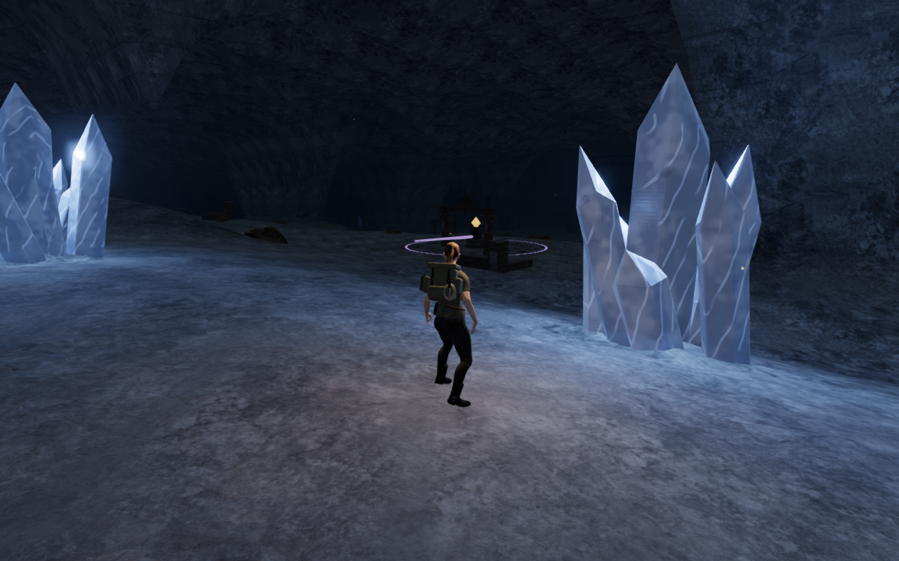
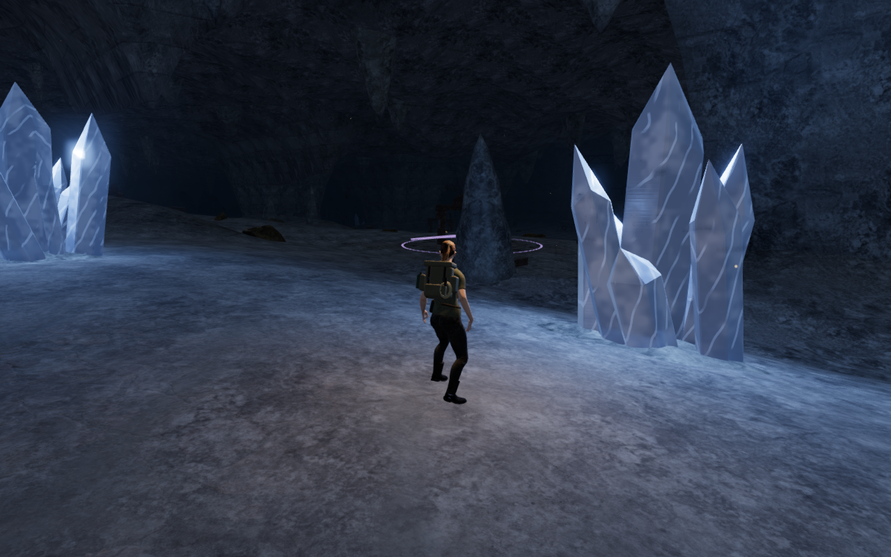
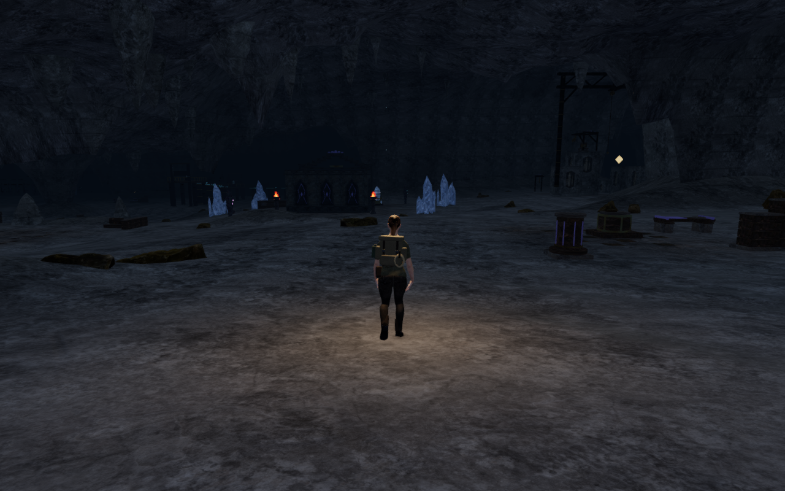
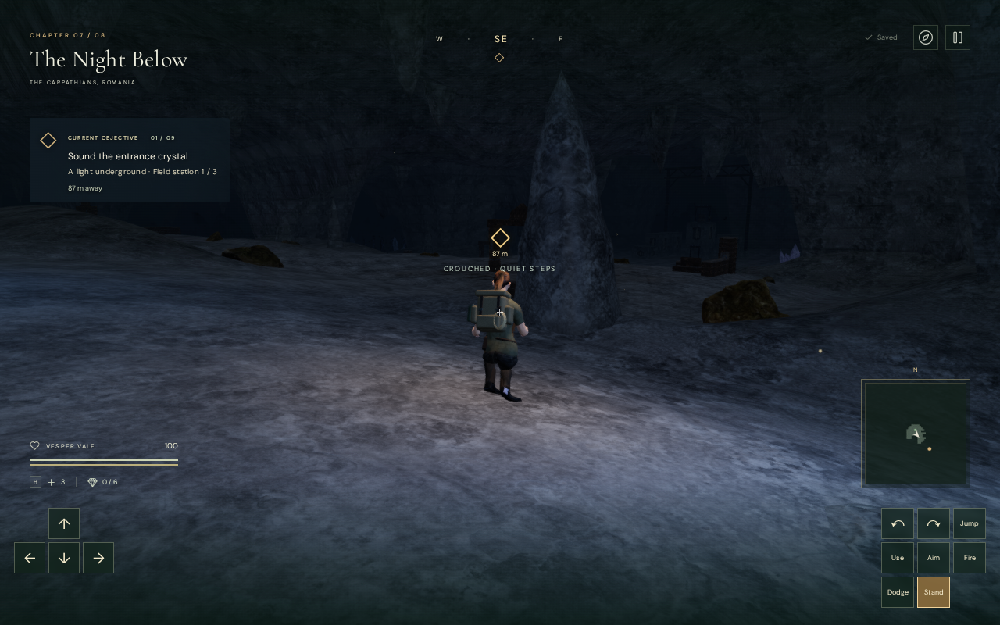
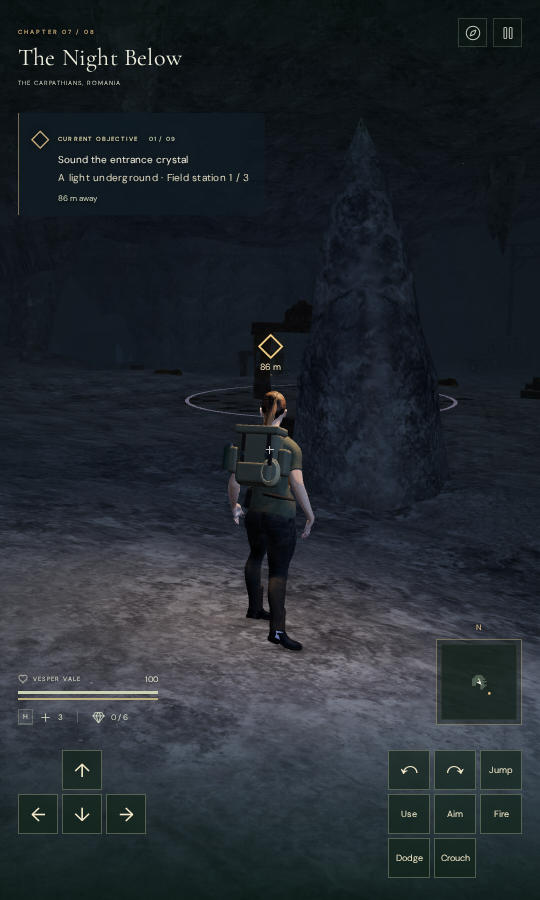

# Cavern limestone formations

**The Night Below** now has irregular limestone lobes along its banks and
calcite pendants across the vault. The formations add silhouettes between
the existing crystal clusters and chamber structures. They share the existing
world-space limestone material, so its grain and seams continue through their
roots. Broad empty floors and repeated installations remain visible; this is
a partial environment improvement.

The layout has **32 floor lobes and 214 roof pendants**. Their seeded shapes
vary in width, height, asymmetric outline and growth direction. Floor roots
follow the lower of the sampled ground and rendered terrain triangles, with
their rims buried into the surface. Roof roots embed into the continuous
vault. Each formation is a closed mesh with outward faces.

The full floor footprints stay outside carved walking cells, including an
additional clearance margin. Roof pendants leave more than nine metres of
sampled headroom. Reservations protect climbing stations, objective approaches,
guardian spawns, water, mineral sound fronts, the Listening Gallery and the
Echo Causeway. Movement can pass beneath high pendant bounds. Ground-rock
placement also checks a scan's actual height before reserving space beneath
a pendant; formations reaching the ground retain their reservations.

## Placement and movement verification

The focused tests check closed topology, non-degenerate outward triangles,
finite positions and normals, deterministic placement and embedded roots.
All **53,136 root probes** remain below the floor or above the rendered vault.
The **53,628 formation vertices** retain the walking-cell exclusions or roof
clearance. **54,324 movement comparisons** preserve standing, crouching and
jumping clearance on the sampled walking cells.

The final assisted browser circuit reaches the early, middle and final courts,
then returns to camp: **908.038 metres across 13,651 controller updates**.
All **43 captured states and 115 controller samples** preserve the preceding
route's player position, following camera, look angles, elapsed time, health,
grounding and position legality. Waypoints remain identical; the planner's
exploration counts change. Every leg arrives at full health, and all 43 views
have been reviewed.

This ground inspection marks the field work complete to open the gates and
does not advance combat or enemy AI. It establishes sampled movement and
rendering behavior, rather than an unassisted chapter playthrough or complete
body-contact acceptance.

All **75 selected regression tests** and the production build pass. High,
Medium and Low shaders link. The High and Medium checks inspect the entire
half-float input before bloom; Low uses a separate half-float direct-scene
target because its normal pipeline bypasses bloom. All three are finite with
no GL errors, and all three captures have been reviewed.

## Rendering and resource cost

The formations add **106,272 source triangles**. Spatial groups retain local
culling, and groups with at least three parts merge their static geometry.
The resulting **161 geometry resources** hold **6,118,400 bytes** of CPU
attribute/index arrays. Rendering also requires GPU buffers for visible and
shadow-casting geometry; actual GPU memory was not measured. The CPU figure
excludes objects, camera bounds and other scene memory.

In one fixed middle-chamber camera, hiding and showing only the new formation
groups gives the following whole-scene submissions:

| Quality | Calls, hidden / shown | Triangles, hidden / shown |
| --- | ---: | ---: |
| High | 2,141 / 2,372 | 2,640,908 / 2,822,348 |
| Low | 1,446 / 1,600 | 1,775,063 / 1,896,023 |

The surrounding scene and ground-rock layout remain fixed in this comparison.
These are draw submissions, including repeated render passes, rather than
frame-rate measurements or a comparison of complete application versions.
The extra geometry costs rendering work; supported-device performance remains
unverified.

Switching to another chapter disposes all **161 new geometry resources exactly
once** and clears formation metadata. The checks run serially under the shared
60% CPU limit. Browser processes and temporary servers are closed after use.

## Production controls

The final production build passes keyboard/High at **1280 × 800** and actual
browser touch/Low at **540 × 900**. Both cases exercise movement, crouching,
jumping, landing, map use and two complete saved-store reload comparisons.
Health remains 100, saved ground height remains zero and the viewports have
no horizontal overflow. All **12 native captures** have been reviewed.

The development hook is absent, and the browser loads the exact final output:
`index-BalAV6pm.js`, `game-CjSSsfTV.js`, `three-CHpU4owG.js` and
`index-DQyIEWDa.css`. There are no application errors, other console warnings
or failed HTTP responses. Three ReadPixels driver performance diagnostics are
recorded separately. The build retains Vite's existing large-chunk advisory.

After verification, a host inspection confirms no remaining project browser,
worker or temporary server, with ports 5174 and 5180 closed. A thread-level
inspection during the production check confirms that all 139 owned threads
share the same nine-CPU set out of 16 available CPUs.

## Scope and provenance

This is original project geometry using the existing credited **Rock Boulder
Dry** maps and cavern material. No external assets, recordings or dependencies
were added. The documentation images are lossless conversions of actual game
captures, retaining their dimensions and RGBA values.

The wider survey now includes seven ground circuits with **319 reviewed views**
and a separate sky opening climb/rope/winch/bridge/return circuit with
**63 reviewed views**. The latter covers **567.200 metres and 8,356 controller
updates**, with all three opening field actions used, four bridge crossings,
full health and finite pre-bloom input. A general ground walker could not
complete the sky chapter's jump transitions; those incomplete attempts are
excluded from completed-route coverage.

Repeated courts and installations, sparse floor stretches, abrupt terrain
shoulders, mountain faceting and snow boundaries still need work. Broader
contact, landscape, listening and device acceptance remain open. The graphics
and soundscape are not being declared finished.
