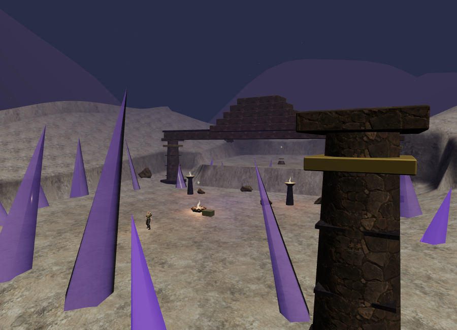
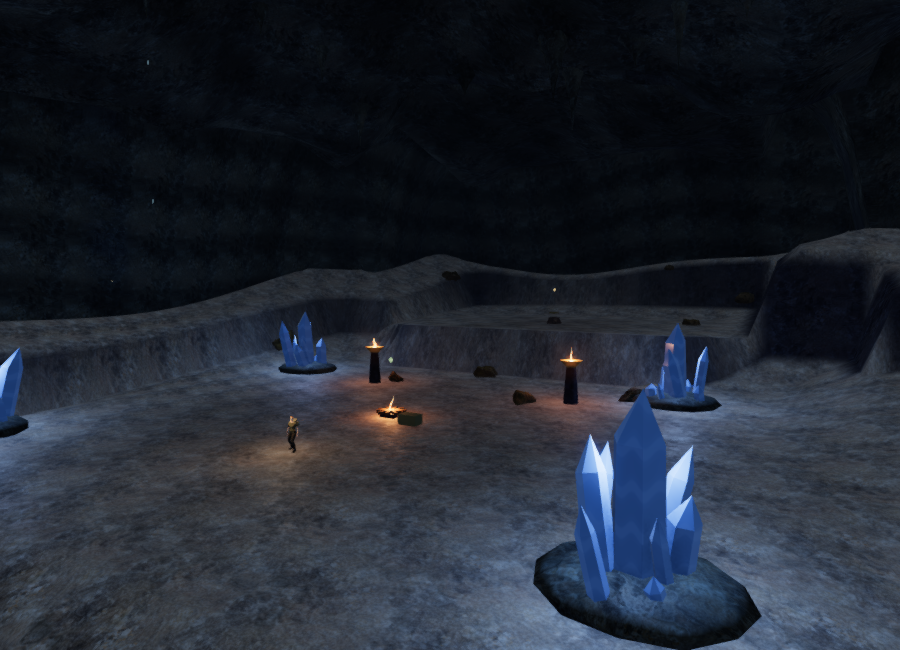
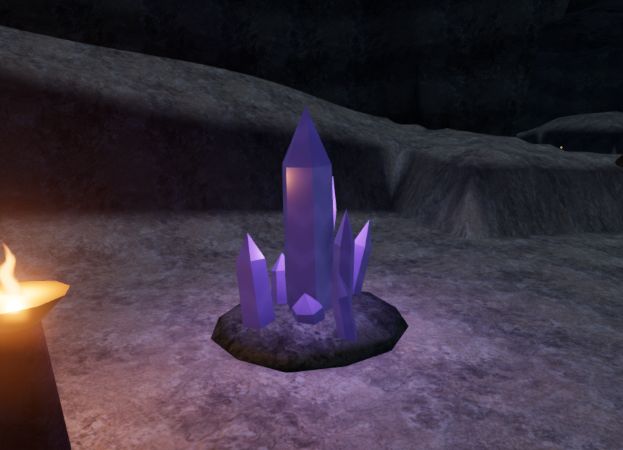
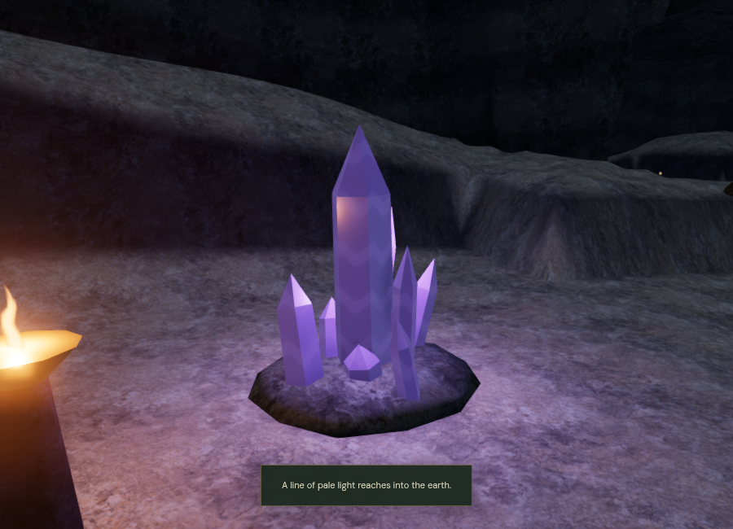

# The Night Below: enclosed caverns and resonance

The crystal geometry and materials in this original environment milestone have since been refined. See [quartz art notes](mineral-art.md) for the current facets, optical material, rendering costs and verification.

The crystal chapter now takes place beneath a continuous rock enclosure. Vaults rise over its nine main chambers, narrow into connecting tunnels, and close against the existing terrain beyond the routes. This replaces the open-air temple frames, distant mountains, and freestanding cone crystals. The map's objective identifiers, route topology, discoveries, and progress schema remain unchanged.

The interior roof has **97,238 triangles in 102 spatial chunks**. Its triangle-height sampler also constrains the explorer's headroom, camera, and sight checks. Shared boundary vertices agree between chunks. The roof seals at all four map boundaries; a first-render opening there was caught and corrected. Sampled route clearance ranges from **14.88 to 40.32 metres**. Separate vaults clear the climbing stations' tall rope anchors and crossbeams as well as the player.

Wet, layered rock uses the existing local color, normal, and roughness maps with projection on three axes. Strata and damp patches vary the surface response. Smaller stalactites interrupt the ceiling silhouette while staying above the routes. This remains procedural environment art, rather than a scanned or individually sculpted cave.

The later [cavern banks and mineral beds update](cavern-banks.md) refines the
enclosing shelves and shared rock material and replaces the rounded crystal
bases with shallow, ground-fitted formations. Its notes contain current
geometry, rendering and verification measurements.

## Mineral formations, light, and objective response

There are **36 mineral clusters**, containing **324 six-sided quartz prisms**, with varying heights, tilted shafts, and offset terminations. They sit on irregular rock beds. Opaque physical materials use hard facets, restrained internal bands, clearcoat, and emissive edges. Cluster placements leave at least seven metres to objective centres. Their collision beds and captured camera surfaces keep the explorer and camera out of the formations.

The chapter has a dim enclosed reflection capture, cooler ambient fill, and no outdoor sunlight. Four non-shadowing point-light slots select nearby visible mineral formations; the existing torch lights remain separately budgeted. Blue, violet, and teal clusters give chambers different lighting accents.

Saved field work supplies a shared restoration value for mineral glow, point-light intensity, and hum activity. Partial work fades toward its new value during play. Loading a saved chapter restores that value immediately, including earlier sectors represented by the saved main stage.

Assisted calls through the interaction handler completed the first sector's three resonance stations. After four simulated seconds per action, the affected chamber's restoration value reached **0.33322**, **0.66655**, and **0.99989**. Hum activity reached **0.59993**, **0.79993**, and **0.99993**; the sanctuary gate rose to 8 m. Reloading retained all three actions and the recorded 30 seconds, restoring the two linked entrance chambers to value 1 and leaving later chambers at 0.

## Positional sound

Every mineral cluster has its own emitter. Each is positioned just beyond the solid mineral bed on the face toward the chamber. This keeps a nearby formation audible from its inward approach, with rock and architecture still able to obstruct other paths. Two initial test approaches incorrectly faced outward beyond the route; the emitter faces now follow the chamber's geometry. The final browser check found all **36 inward approaches clear**.

Nine larger dripping stalactites have visible falling streaks and expanding impact rings. Their sound comes from the impact, rather than an unrelated point above the room. Rings and emitter heights follow a reservoir's water surface; after it drains below the ground, both settle onto the exposed floor.

The **45 mineral/drip sources** share the existing **12-voice** spatial limit with torches, water, mechanisms, and other effects. Minerals use 3–34 m linear attenuation; drips use 2–28 m. HRTF direction and obstruction filtering remain active. The chapter retains its quiet 48 BPM glass arrangement, objective-specific voicing, longer cave reverb, and reading/puzzle ducking. Default music, ambience, and effects levels remain 32/80/75 and persist in local storage.

With the browser AudioContext running, isolated voices reported the following effective gains. Activity was fixed at 1 and occlusion disabled to separate distance from other effects. These are voice diagnostics before the overall mix, not recorded loudness measurements.

| Source | Distance | Effective gain |
| --- | --- | --- |
| Primary mineral | 2 m | 0.32000 |
| Primary mineral | 12 m | 0.22710 |
| Primary mineral | 25 m | 0.09290 |
| Primary mineral | 33 m | 0.01032 |
| Primary mineral | 35 m | Retired |
| Drip impact | 2 m | 0.50000 |
| Drip impact | 8 m | 0.38462 |
| Drip impact | 16 m | 0.23077 |
| Drip impact | 27 m | 0.01923 |
| Drip impact | 29 m | Retired |

Secondary clusters use a lower maximum gain of 0.22. All inspected panners reported HRTF and the configured linear distance model. Subjective listening and mix evaluation on more devices remain necessary.

## Browser views

The first three images use the same 900 × 650 camera and viewport. They are actual browser renders, with the main HUD hidden. The final image retains the objective-completion toast.







The selected Performance view changed from **116,888 triangles / 50 calls** to **87,542 / 57**. The High view submitted **166,985 triangles / 122 calls** across its passes, and the closer mineral view submitted **165,521 / 102**. There are **804 captured camera surfaces**, in addition to the continuous roof sampler. These are selected rendering-work measurements, not supported hardware frame rates.

## Verification and limits

All **158 tests** pass, including eight new cavern tests covering deterministic enclosure, route and gantry headroom, sealed boundaries, triangle winding and seams, raycast/collision agreement, camera and sight limits, closed quartz geometry, cluster approaches and emitter placement, saved resonance response, moving drip impacts, and chapter cleanup. A shader helper declaration-order error was caught in the first browser render and fixed; the final Low/High programs linked successfully.

Assisted full-world browser checks found clear sampled approaches to all **54 non-guardian features**, including elevated mechanisms and climbing entries/summits. All **72 routes** from chamber interiors to clear points along their edges completed through the character physics at 4.6 m/s without stalling. Those checks opened the existing sanctuary gates and used computed movement directions. They do not establish an ordinary-control chapter playthrough, encounter balance, or pacing.

Switching to the sky chapter cleared every cave roof, patch, light slot, emitter, drip reference, and collision sampler. Sky sunlight and shadows returned, its eighteen bridges loaded, and its audio theme replaced the cave theme, with no asset errors.

The final release build passes with the existing Three.js chunk-size advisory. In High quality, production opened the crystal briefing at zero play time and exposed no development hook. The three reused rock maps loaded with HTTP 200: color **859,211 bytes**, normal **802,497**, and roughness **668,127**. Native keyboard input changed the saved position from `(56, 63, height 0)` to `(56.02970203422758, 63.033002260252864, height 0)`. Pause recorded **8.984800000011921 active seconds**. On reload, holding the required rock-color request until another tab gained focus allowed preparation to finish paused; that exact position and elapsed time were restored. Final development and production console checks reported no warnings or errors. Test saves were cleared from both origins, restoring High quality.

Browser verification uses Chromium ANGLE/SwiftShader software rendering. The brief input check travelled only a small distance and does not establish sustained responsiveness or consumer-GPU performance. The environment still has repeated, procedural forms. Modern AAA visual quality is unmet, approximately one-hour chapter pacing remains unverified, and the original production goal remains open.

Development review helper:

```js
const review = await import("/scripts/verify-caverns-browser.js");
review.inspectCaverns(__vesper.game);
review.cavernView(__vesper.game); // changes the review observer/camera without saving
review.cavernView(__vesper.game, 1, true); // closer mineral view
```
