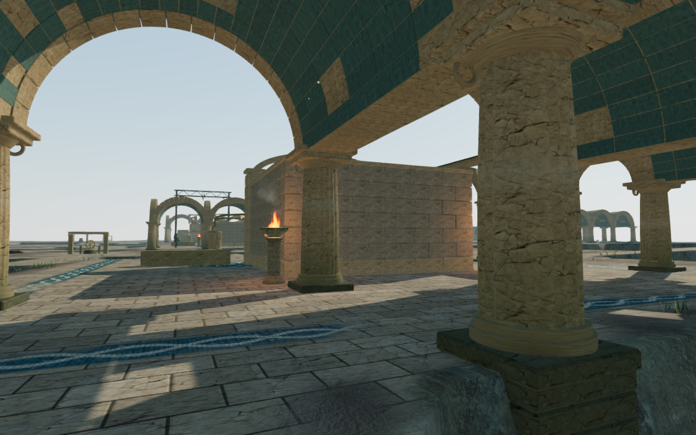
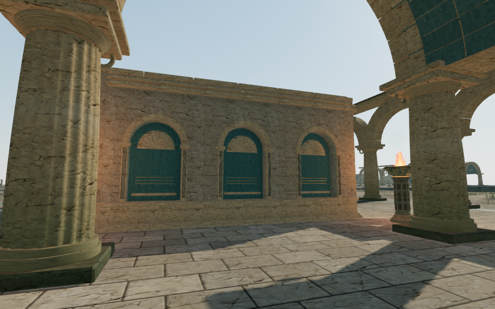
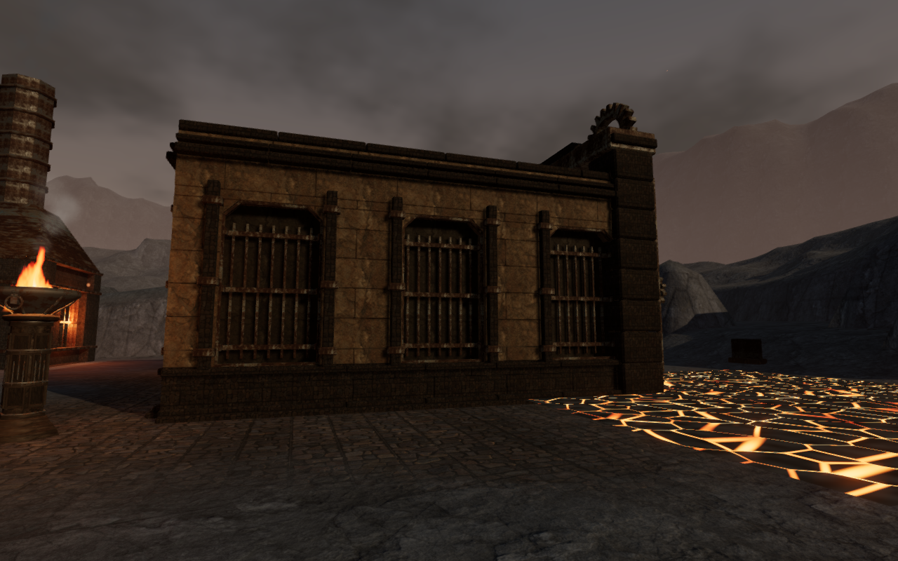
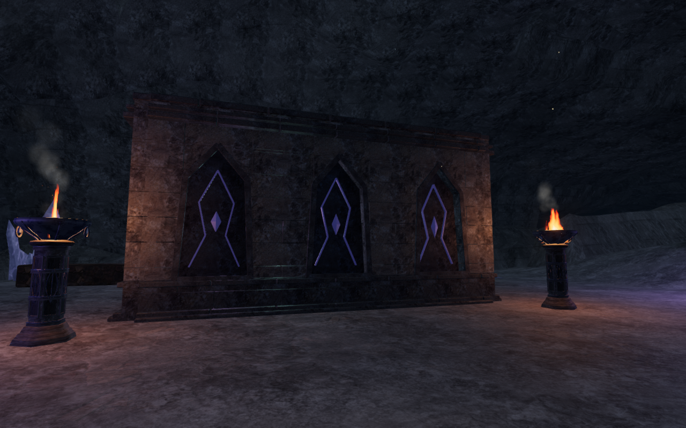
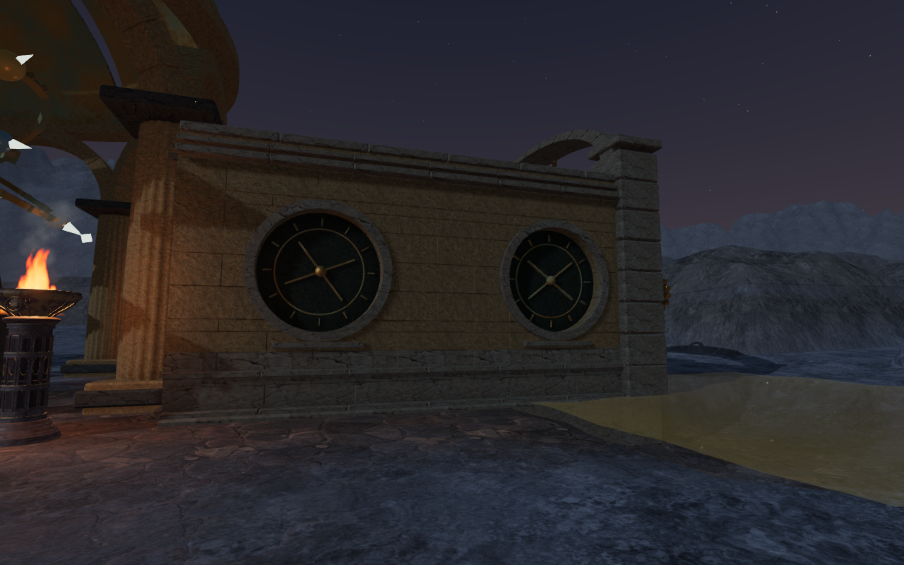

# Regional gate chambers

The palace, furnace, crystal and eclipse chapters now carry their architectural
identity around the sides and backs of their gate chambers. Across 35 chambers,
105 walls replace the repeated plain face with 320 recessed bays, dressed stone
surrounds, plinths and cornices. Bay spacing varies with the chapter, stage and
wall. The inner rear faces have smaller framed panels around the working area.

| Chapter | Chambers / exterior walls | Construction |
| --- | ---: | --- |
| The Drowned Kingdom | 9 / 27 | Blue plaster blind arcades, shell reliefs, fluted jambs and segmented arches |
| A Heart of Embers | 8 / 24 | Clipped furnace bays, iron grilles, brackets and banded stone ribs |
| The Night Below | 8 / 24 | Tapered pointed recesses, mineral inlays and small faceted stones |
| The Last Meridian | 10 / 30 | Circular stone surrounds, bronze divisions and astronomical axes |

The earlier palace enclosure, seen through its surrounding vaults:

The updated palace masonry from a closer inspection position:

These views use different framing. They show the construction change, rather
than a pixel comparison. The other regional walls use their chapter lighting:

## Geometry and clearance

The outer coursed face sits 56 cm in front of its closed backing, or 39 cm
beside hinged door leaves. The thicker side-wall backing encloses the opened
leaf backs so bronze cannot show through the exterior inset panels. Each course
is clipped to the aperture silhouette; narrow joints reveal the deeper wall
instead of exposing daylight. Segmented arches and circular surrounds have
physical depth. Iron grille brackets reach their frames. The inner plaster
panels have stone borders, and the palace adds smaller shell reliefs.

The furthest upper moulding is 74 cm from the wall centerline, within the
existing 85 cm movement half-width. Footings extend across a 1.6 m footprint
and sample the terrain beneath their complete width. Coastal footings keep
their coursed submerged construction. The gate's inward faces and mechanism
space remain inside their established clearance envelope.

Camera surfaces are captured before material batching, including the recessed
backs and projecting surrounds. The batched rendering retains those transforms.
The inspection helper is
[inspect-chamber-walls-browser.js](../scripts/inspect-chamber-walls-browser.js).

## Verification

All **612 tests** and the production build pass. The
[gate regressions](../tests/sanctuary-gates.test.js) check all 69 restored
thresholds, both opening motions, saved field progress and moving camera
surfaces. The new regression checks every bay in all 105 changed walls for a
sealed recess and retained camera depth, plus **1,575 footing samples** across
the full width. Browser preparation caught an unbound terrain-method call;
the corrected code and test fixture now use the game's actual terrain method.
Opening-state review also caught bronze leaf backs appearing through thin
side-wall panels. A dedicated ray regression checks 2,889 samples across all
19 affected hinged gates at closed, intermediate and open positions.

The final assisted review covers 164 wall/interior views: all 105 exterior
faces, 35 open chamber interiors, 12 Low views and 12 intermediate-state
interior views. A further 40 entrance views show the first and last gates of
each affected chapter at five opening positions. Ten closer eclipse rear
views supplement the overview angles obstructed by observatory pedestals.
Foreground observatory columns remain in some close views. These captures
use temporary development placements and include inactive future chambers;
they do not establish complete chapter playthroughs.

Eight production keyboard and portrait-touch cases exercise short exterior
movements in the four affected chapters. The keyboard cases use High graphics;
touch uses Low with mute enabled. All 16 reloads preserve the complete normalized
save apart from `lastPlayed` timestamps, retain 100 health and avoid horizontal
page overflow. The browser loads the current production assets without a
development handle, console errors or warnings. These cases start from prepared
completed-chapter saves with defeated encounters; they verify local input and
persistence, not unassisted chapter progression or native threshold crossings.

All **218 local route legs** arrive through the actual movement system:
36 palace, 110 furnace, 41 resonance and 31 observatory legs. The inspection
also retains 230 sampled objective/discovery approaches and all 35 restored
thresholds in the affected chapters. Hydraulic, thermal and resonance control
and source-attachment checks pass.

All 70 gate-drive emitters have reachable, unobstructed listening positions
within their nearby 3–7 m ring. Six straight-ahead crystal drive rays are
occluded; every affected drive has at least 29 clear sampled alternatives.
The positional audio system retains its distance falloff and occlusion
behavior, and the chapter/objective scores remain in use. This is a geometry
and access check, not a new subjective listening evaluation.

## Cost and remaining scope

Material batching adds one or two rendered mesh batches per chamber. Across
each chapter's complete set of gates, triangle counts change as follows:

| Chapter | Before | After |
| --- | ---: | ---: |
| Palace | 209,332 | 444,724 |
| Furnace | 165,824 | 284,832 |
| Crystal | 120,256 | 176,056 |
| Eclipse | 179,200 | 396,300 |

An isolated Node benchmark of 1,000 camera queries, averaged over five measured
passes after warm-up, increases from roughly 5–7 microseconds per query to
30–59 microseconds in the final run. More detailed camera surfaces account for
that increase.
These measurements concern the gate geometry and CPU queries; they are not a
consumer-device frame-rate guarantee. The build retains its existing large
chunk advisory.

This addresses the plain wall treatment within VA-05. The repeated chamber
footprints, sparse court surroundings and broader playable-world coverage keep
VA-05 and the [visual audit](visual-audit.md) open. The overall graphics target
has not been declared complete.

## Assets

The new geometry is original project code in `src/chamber-walls.js`. It uses
existing credited stone, blue plaster and forge textures, the project bronze
shader and original shell relief geometry. No external asset or dependency is
introduced. Documentation images are browser captures converted losslessly to
WebP. See [asset credits](asset-credits.md).
