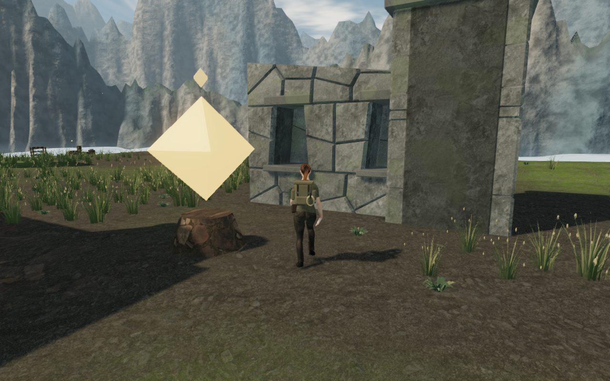
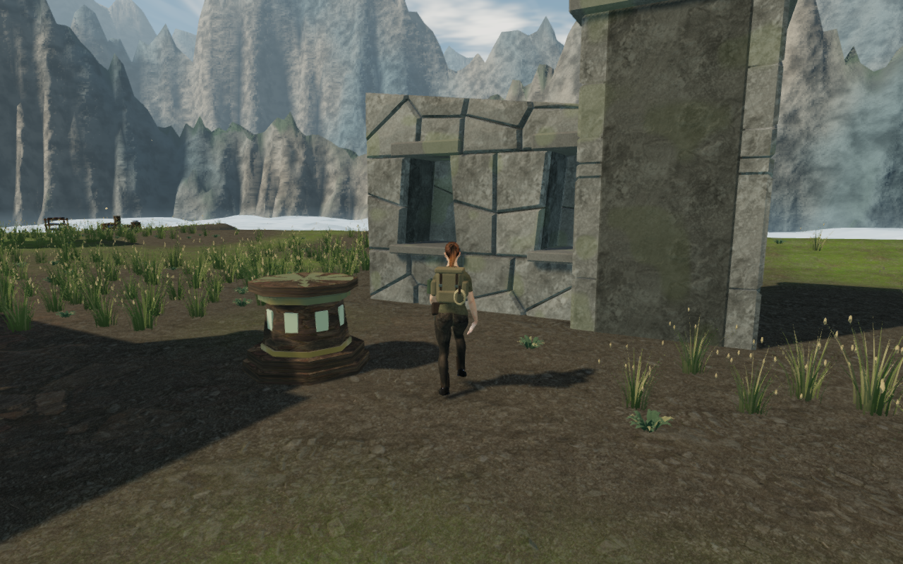

# Chapter relics

The earned final cloud-city approach exposed the same floating, glowing
octahedron used for every chapter reward. Eight original models now represent
the named artifacts. Each rests on a solid, terrain-fitted stand; collecting it
leaves that stand in the world. The original pickup IDs, locations, mechanism
requirements, rewards and save format are retained.

| Chapter | Artifact and construction | Reviewed High capture |
| --- | --- | --- |
| The Verdant Veil | The Verdant Compass: a tilted jade instrument with engraved ticks, a bronze needle and a bearing cradle | [Compass](images/chapter-relics/verdant.webp) |
| Beneath the Sands | The Eye of Noon: a bronze solar disc with sixteen rays, an inset eye and a supported stem | [Solar eye](images/chapter-relics/sands.webp) |
| A Silence of Snow | The Winter Chime: three silver bells, suspended clappers and a bronze frame | [Chime](images/chapter-relics/frost.webp) |
| The Drowned Kingdom | The Pearl of Tides: a nacre pearl held by eight bronze petals | [Pearl](images/chapter-relics/tides.webp) |
| A Heart of Embers | The Ember Heart: a bevelled obsidian heart with restrained glowing seams and bronze bearers | [Heart](images/chapter-relics/embers.webp) |
| Where Eagles Sleep | The Feather of Stone: carved stone vanes joined by a bronze shaft and fine veins | [Feather](images/chapter-relics/sky.webp) |
| The Night Below | The Memory Prism: a six-sided crystal with a pointed crown, bronze collars and fine stays | [Prism](images/chapter-relics/crystal.webp) |
| The Last Meridian | The Atlas of Dawn: an enamel globe with twenty-four stars inside three crossing armillary rings | [Atlas](images/chapter-relics/eclipse.webp) |

The table captures use assigned progress and observer positions. They inspect
the rewards in their actual chapter environments; they do not represent eight
independently earned completions.

## Construction, interaction and saved state

Each foundation fits the sampled ground across its complete footprint, rather
than placing its centre alone. The masonry shaft, bronze collars and inset
chapter panels remain visible and physical in locked and completed progress.
The artifact and its objective beacon appear only after the chapter's final
mechanism. They disappear when its pickup ID or completion flag is saved.
Separate finite body solids and captured camera bounds remove the collected
artifact's obstruction while retaining the stand.

Older completion records may omit the relic's pickup ID. They retain an empty
stand and cannot collect that reward again; neither presentation nor repeated
Use adds a missing ID to those saves. Courtyard construction also now explicitly
selects grounded field stations, so the new solid relic stands cannot be
mistaken for field machinery during chapter startup. The first draft's browser
gallery exposed that classification failure before publication.

The models reuse credited stone and rock maps and the existing worn bronze
shader, with original geometry and material colors. They add no downloaded
model, texture, music, audio or dependency. Positioned environmental sounds and
the chapter scores are retained.

## Geometry and visual checks

The three relic regressions cover all eight chapters on their actual terrain:
seated sockets, bounded silhouettes, finite mapped geometry, foundation burial,
clear collection approaches, unlock/collection visibility, camera and body
obstruction, and older completion records. The largest stand and artifact has
**7,280 triangles**, below the enforced 12,000-triangle per-reward limit.
The courtyard regression also constructs a field yard beside a relic stand and
confirms that the relic and raised stations receive no ground courtyard.

All **735 named tests pass** across four completed batches: 694 tests without
"wind" in their names, 39 wind-named tests apart from the two longest cases,
then the accepted-turn and delivered-hand regressions separately. The second
batch's reporter also counts 98 files with no matching test; those are excluded
from the 735 specification count. Earlier suite/accepted-turn processes ended
with termination signals and no completed totals, so the final checks replace
those incomplete runs. The production build passes with the existing
large-chunk advisory; the new model and regression files pass formatting.

All **64 High/Low observer captures** are reviewed: locked, available, oblique
and collected views in each chapter and quality setting. Their recorded shaders
link, the camera observers remain clear, and the quality flags match their
requested shadows and cinematic rendering. The gallery reports no JavaScript
errors or console warnings.

## Earned final cloud-city sectors

The continuation loads the previously earned stage-6 save, then advances through
the remaining three sectors using the delivered controller, camera, field
tasks, ropes, return cables, bridge jumps and physical wind-wheel turns. Player
position and objective state are not assigned after loading a sector save.

| Loaded stage | Field work and legal wind turns | Distance / controller updates | Reviewed route captures |
| --- | --- | ---: | ---: |
| 6 | Two climbing courses, both return cables, one winch; 18 turns | 471.610 m / 7,660 | 110 |
| 7 | Three winches; 24 turns | 339.361 m / 6,126 | 76 |
| 8 | Recover, survey and deliver the eagle seal; 14 turns, then relic collection | 361.213 m / 6,320 | 60 |

Each sector crosses its two long-gust bridges, including their missing-board
jumps. These three runs finish with health 100, no recorded steps over 1 m,
linked shaders and no browser errors or warnings. They inspect the deck-frame
milestone before the relic replacement. All **246 captures** are reviewed.

Repeating the last sector with the new artifact reaches and collects it over
**361.201 m and 6,320 controller updates**. All **60 final route captures** are
reviewed. The runs use assisted steering, route planning and legal puzzle
solutions; enemy AI, combat and station hazards are not advanced by the route
helper. They establish controller continuity and earned objective progression,
not human playthrough duration or native encounter difficulty.

## Native production collection and persistence

Keyboard input at 1280 × 800 in High quality and touch input at 540 × 900 in Low
quality both load the earned final approach, collect the Feather of Stone,
close its completion panel, walk away, pause, reload and resume. Their saved
data matches across reload apart from `lastPlayed`, including completed progress,
the relic ID, field work, wind turns, counterweights and health. Resumed feet
remain within 5 cm of the saved position and floor height. Measured native
walking distances are **2.700 m and 2.400 m**.

Two further cases restore those completed saves with only the relic ID removed,
representing older completion records. Keyboard and touch Use cannot collect
again or open a completion panel. The missing ID stays missing, completion
remains true, and both subsequent reloads preserve the complete saved data
apart from `lastPlayed`. All four cases retain actual health 100. These are
native game updates, with guardians and station hazards enabled, rather than
the route helper's restricted updates.

All **16 production captures** are reviewed. The current JavaScript/CSS bundles
match the built files, the compact viewport has no horizontal overflow, and the
production game exposes no development hook. The four completed cases report
no failed assets, JavaScript errors or console warnings.

Earlier native checks include a stopped preview server, a terminated browser
process and a loader wait that exceeded the helper's 120-second bound. The
final checks use the confirmed preview server and log the actual environment
and first-view preparation stages. A prior touch walking probe also rejected
3.900 m against an arbitrary 3.2 m harness bound despite successful collection;
the final touch hold uses three observed frames and verifies the measured walk
and reload. No loading or movement implementation was changed to satisfy those
helper limits. These runs are functional checks, not loading-time or frame-rate
benchmarks.

## Remaining review

The relic replacement resolves the shared floating reward. It does not finish
the wider eight-chapter visual audit. The stands retain a common construction
pattern, and the world still has the recorded repeated court layouts, sparse
stretches, abrupt banks and crowded wind-engine approaches. Other chamber
interiors and custom carried components still need inspection. The captures do
not establish consumer-device performance or subjective audio and music
quality.
