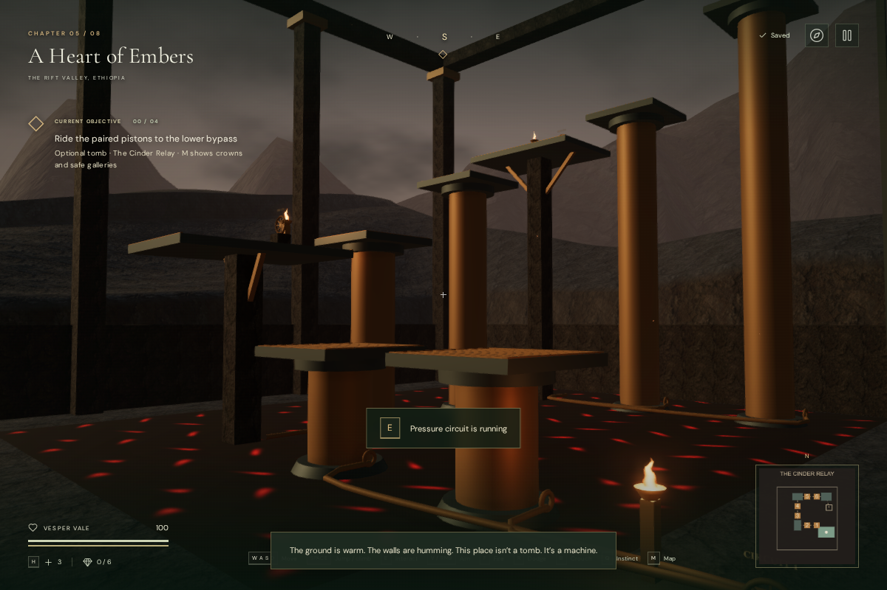
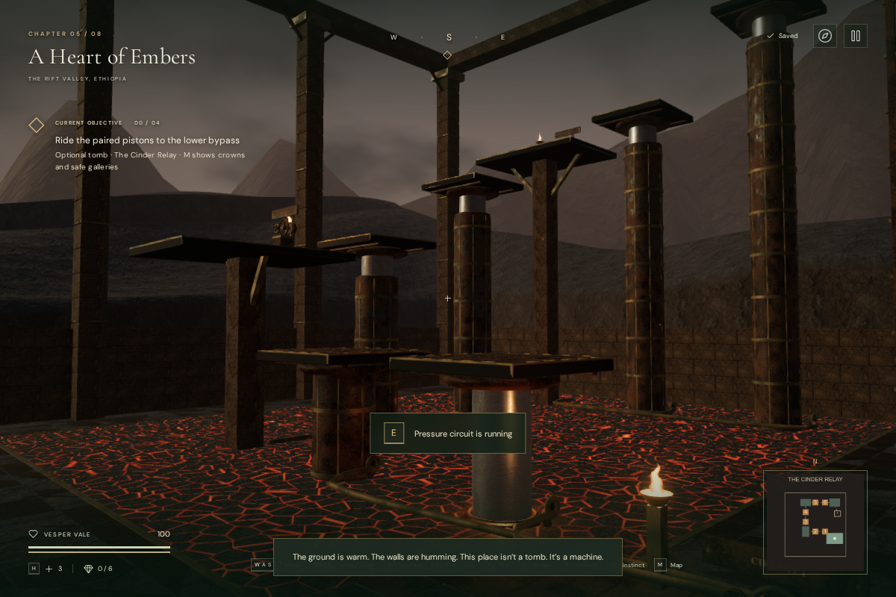
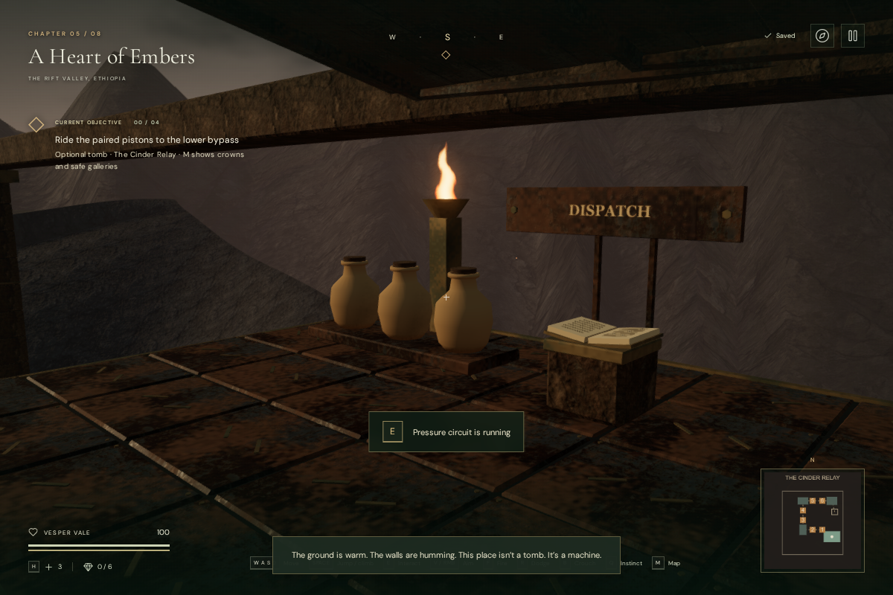

# Cinder Relay foundry artwork

The volcanic chapter's [Cinder Relay](cinder-relay.md) now has dressed basalt
piers, coursed walls, fitted paving, worn iron decks and a fractured settling bed.
Fixed pressure housings surround six machined rams; flanges, fasteners, pipe
outlets and ochre crossing marks make the moving crowns easier to distinguish.

Before, at the intake:

After, from the same camera:

## Machinery and the dispatch gallery

The rams have constant 4.65-metre lengths and slide inside the fixed housings.
Their ends remain attached beneath the crowns throughout travel. The platform
kit uses 260 individual panels, shallow joints over a closed backing plate,
modeled tread ribs, edge bands and fasteners. The support heights, transfer
windows and crossing footprints retain the original playable route.

Rounded valve spokes, hubs, stems, backed inscriptions and pressure gauges
replace the simple wheel outlines. Needles follow their associated piston.
The return lift now has guide rollers, moving posts, bracing, a grooved sheave
and a cable attached above the car. Cable length and roller/sheave rotation
follow the car; pause freezes them. An entrance tablet has a physical stand,
and the chamber title is mounted on the lintel.

A sloping metal canopy shelters the dispatch desk. Water jars and cargo chests
connect the space to the ledger's account of the last refuge delivery. The
furnishings have body collision, and the larger jar stand also has a captured
camera bound. These remain clear of the tested ascent and return route.

The iron uses the existing forge metal maps; procedural wear, oxidation and
machining vary its finish. The dressed stone and paving use the existing forge
rock and tile maps. A new fractured-slag shader replaces the earlier repeating
glow pattern; edge smoothing conserves brightness as the cracks become small
on screen. Two hot-bed positions participate in the existing two-light forge
pool. No extra point-light slots or external assets were introduced.

The six steam outlets and moving drive sources retain their original positions,
activity and attenuation. Steam and machinery stop on pause, and the volcanic
score retains its quiet lifting arrangement. This art pass adds no recording or
new musical composition.

## Persistence and verification

An older save can occupy a newly furnished part of a gallery. Such an arrival
now moves to the clear center of that same recorded gallery before general
ground-level recovery runs. Valid clear positions and all circuit, record and
lift progress remain intact. This protects elevated saves from being sent to
the chamber floor by a later scenery update.

The full **400-test suite passed**, followed by all ten focused relay tests after
the final scenery adjustments. Added checks cast rays
onto the rendered decks at four piston phases, verify constant ram length and
housing overlap, keep cargo clear of lamp supports, follow the return cable and guide rollers, and restore older
saves occupied by cargo. The complete ascent, ledger recovery, return lift and
exit still pass through the ordinary character movement controller.

A continuous browser route used native W/E/Space input with assisted directions
and timing. It crossed all six pistons, recovered the record, descended and
exited at 100 health. Portrait touch Use and simultaneous held forward/Jump
also passed. A separate fall recovered at the intake with 88 health. These
are assisted checks, not human playthroughs or pacing measurements.

All eight chapters rendered in High and Performance. Existing chapter feature
positions and obstacle records matched the preceding milestone. Matching chamber
views also retained all original controls, decks, emitters and solid bounds;
six additional solids cover furnishings and the car's moving posts. Chapter
departure disposed all 260 inspected geometry, material and texture resources
exactly once. Steam falloff still reported gain 0.12 at 2 metres, 0.06 at
12.5 metres and release beyond its 23-metre range. Plume positions, paused motion
and the fixed light-pool size were checked. This establishes audio behavior,
not subjective sound quality.

In production, native E opened the second circuit from a prepared lower-gallery
save and read the recovered ledger from a saved return journey. A third fixture
placed an older save inside the new upper cargo footprint; it recovered at the
dispatch gallery's clear center, retained 100 health and opened the ledger with
native E. All three complete saves restored exactly apart from last-played
timestamps. The development hook was absent. Completed browser checks reported
no JavaScript errors, console warnings or failed assets.

## Rendering cost and remaining work

The finished chamber's meshes contain **129,120 triangles**. Small tread and trim
pieces use simple faces; larger castings retain their beveled edges. Static
parts are merged by material, while working parts remain attached to their
moving parents.

Matching 1200 × 800 High views measured the following total rendering work,
including surrounding scenery and additional rendering passes:

| View | Before calls / triangles | After calls / triangles |
| --- | ---: | ---: |
| Overview | 379 / 162,571 | 494 / 403,993 |
| Intake | 319 / 147,383 | 359 / 363,955 |
| Upper gallery | 245 / 144,227 | 253 / 323,939 |

The extra detail increases rendering cost. These measurements use a Vulkan/ANGLE
browser automation environment and do not establish a consumer-GPU frame rate.
The production build passes with the existing large-chunk advisory. The same final overview in Performance reported 230 calls and
162,988 submitted triangles. Checked production bundles are
`index-8GnTOLY4.js`, `game-B34aMQWK.js`, `three-CJb2rOZj.js` and
`index-DYq9hjRy.css`.

This remains procedural game artwork. The wider landscape, repeated
construction, simple flame and jar shapes, and lift-control interaction still
need work. The subsequent [valve interaction pass](cinder-relay-hands.md) adds
two-hand contact and a cancellable turn to the three circuit valves. The requested AAA graphics, subjective mix
quality, broader hardware coverage and approximately one-hour human chapter
pacing remain open production targets.
