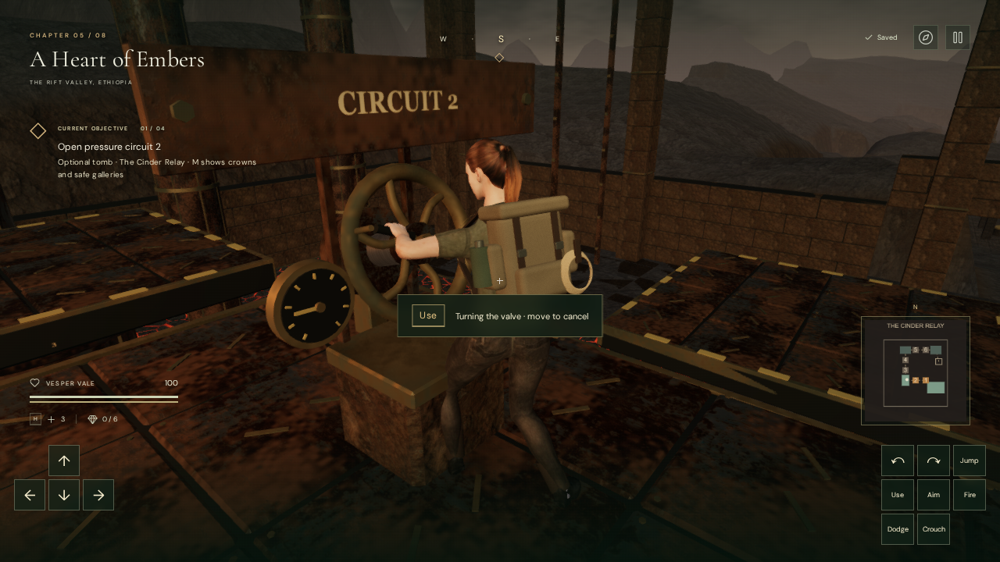

# Cinder Relay valve operation

The three circuit valves in **A Heart of Embers** now have a visible two-hand
operation. Stand on the gallery in front of a wheel and press **E / Use**.
Vesper steps into position, reaches for both grips, closes her fingers, turns the
wheel a quarter turn and releases it. The circuit opens when the turn reaches
its stop. The wheel stays in its open position after completion and reload.

Movement or **Space / Jump** takes control immediately and cancels an unfinished
turn. A canceled wheel returns to its closed stop. Moving after completion
preserves the open circuit. Repeated Use does not queue turns. Pause freezes
position, wheel motion and operation time, and silences the valve source.
Aiming, firing, crouching and torch handling cannot take over the hands during
the operation. The entrance tablet and contextual prompt explain cancellation.

The action lasts about 1.85 seconds from its standing pose, with additional
alignment time for a more distant approach. Alignment checks the whole path for
body clearance and gallery support, and caps its peak speed at walking speed.
The valves use two 38 mm cylindrical grips, fitted finger poses and the existing
explorer rig. Raised plaques clear the tilted wheels; their spindles share the
wheel axes. Existing console footprints and route geometry are retained.

## Persistence and sound

A completed quarter turn saves the circuit immediately. Partial arm poses,
wheel angles and operation timers are transient: reloading before completion
restores a closed valve on the supported gallery; reloading after completion
restores it open. The existing gallery and transit recovery rules still apply.

A quiet mechanical source sits at each wheel's actual world position and plays
only while that wheel turns. Its linear distance range runs from 1.5 to 12 m;
pause and cancellation stop its activity. A short click marks completion. This
reuses the existing mechanical synthesis and quiet volcanic lifting arrangement.
It adds no new external model, texture, recording or music file.

## Verification and limits

All 402 automated tests passed, including 12 focused relay checks. The
production build passes with the existing large-chunk advisory.
The focused relay tests cover the complete ascent and return, movement and jump
cancellation before/after completion, repeated Use, blocked rear approaches,
clear supported stances at all three valves, action conflicts, paused sound and
operation state, and save restoration on both sides of completion.

The browser check inspected the delivered skinned hand surfaces independently of
the pose solver at three points during each valve's turn. Across nine turning
frames and 108 hand-surface region measurements, the nearest surface clearances
ranged from −0.000457 to +0.002470 m. No inspected hand vertex penetrated a grip
by more than 2 mm. Additional frames covered release. All three operating
stances were clear and supported, with health remaining at 100. The image above
is an inspected browser capture, with touch controls visible.

Native keyboard checks covered repeated Use, cancellation, pause, completion
and jumping away. Portrait 540 × 900 touch input both canceled a turn with held
movement and completed another turn. Unfinished and completed browser saves
restored exactly apart from last-played timestamps, with no live operation and
the expected closed/open wheel. The live voice reported gain 0.021 at 1.5 m,
0.0105 at 6.75 m and release beyond its 12 m range. Its panner used linear
falloff and the expected volcanic lifting music arrangement.

A continuous browser route used native movement, Use and Jump with supplied
directions and simulation timing. It crossed all six crowns, opened all three
circuits, recovered the ledger and returned by lift at 100 health. It does not
establish human completion time or difficulty. Development checks reported no
failed assets, JavaScript errors or console warnings; sampled shaders linked.

The final production release exercised four prepared saves: an unfinished
intake turn, a lower-gallery circuit, a return-lift transit save and an older
occupied dispatch position. Native E completed both valve turns and opened the
ledger from both upper-gallery restores. All four retained 100 health and
restored the complete save exactly apart from last-played timestamps. The
development hook was absent, with no failed assets, console warnings or errors.
Checked bundles: `index-BMzcyeUT.js`, `game-CzKaV5O1.js`,
`three-CJb2rOZj.js` and `index-DYq9hjRy.css`.

This is a valve interaction milestone. The return lever still uses its existing
instant action. The character's stance and transition quality, wider scenery,
human chapter pacing and subjective audio mix need further production work.
These checks do not establish AAA graphics or consumer-device performance.
