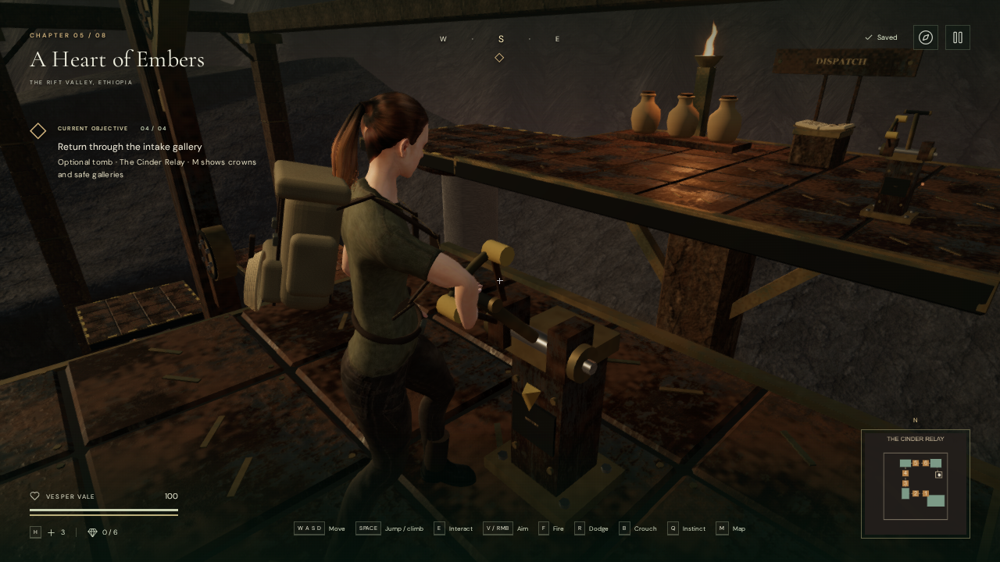

# Cinder Relay lift controls

The return car and both landings now have physical pull levers. After recovering
**The last delivery**, approach a lever and press **E / Use**. Vesper steps into
position, reaches with her right hand and pulls the handle to its stop. The
completed pull starts the lift; the hand releases as the car begins traveling.

Move or jump to cancel an unfinished pull. Once travel has started, releasing
the control preserves the journey and lets you move freely. Repeated Use cannot
queue commands, and landing levers stay inactive while the car is traveling or
already at their landing. The onboard arrow indicates the current travel
direction, or the next journey while stopped. Pause freezes the car, handle,
character action and mechanical source activity.

The levers reuse the valve action's reach, grasp and release timing, with a
1.85-second action plus extra alignment time for longer approaches. Their grips
are 38 mm in diameter. Fixed quadrants, stops, axle bearings, housings and floor
plates make the action visible. The operating stance leaves room for the boots;
the lower landing control sits west of its label, clear of the eastern pier.
The center of the car stays open for boarding and walking across it.

## Motion, collision and persistence

The onboard action's alignment frame follows the car vertically, so its hand
and body remain attached during release. Housing body bounds, the camera sweep
and the sound source follow the same frame. Small solid housings explicitly opt
into camera capture; the usual scenery filter remains in place for other props.

A completed pull starts the existing eight-second journey. The saved lift stop
changes on arrival. An unfinished pull or interrupted journey reloads at a
supported location with the last completed stop retained. The upper car uses
the last safe gallery for reloads; a completed lower landing can retain the
explorer's position aboard the car. Handles return to neutral after release and
reload. Existing gallery recovery also protects older saves occupied by new
hardware; ground-level recovery finds a clear nearby position.

Each lever has a quiet mechanical source at its actual hinge. The onboard
source follows the car. The sound is active during the pull and uses linear
falloff between 1.5 and 10 m. A short click marks the completed command. Existing
lift machinery, environmental sources and volcanic lifting music remain part
of the scene. All geometry and action code are original project work using
existing credited materials, the explorer rig and mechanical synthesis.

## Verification and limits

All 404 tests passed with `node --test --test-concurrency=2 tests/*.test.js`,
including 19 focused relay/camera checks. The production build passed with the
existing large-chunk advisory. The initial full-suite process terminated before
completion; the final complete run used two workers.

The focused relay and camera tests cover both travel directions, cancellation
before/after a completed pull, pause during release on the moving deck, saved
transit state, locked controls, clear boarding lanes, and matching housing/body/
camera/source frames. Existing tests retain the full ascent, three circuit
valves, ledger, gallery saves and return journey.

Browser checks exercised the onboard lever in both directions and both landing
levers. Independent measurements of the delivered skinned right-hand surface
covered 12 pulling frames and 72 palm/finger regions. Nearest surface clearances
ranged from −0.000457 to +0.002469 m; no inspected vertex penetrated a grip by
more than 2 mm. Across 24 reach, pull and release samples, boot sole clearances
ranged from 0.0063 to 0.0138 m, and no inspected shoe vertex penetrated the
pedestal or its floor plate. The image uses an inspection camera with the
context prompt hidden to show the hand.

Native keyboard input verified repeated Use, cancellation and pause while the
car starts moving. Portrait 540 × 900 touch input canceled one pull and completed
another. Unfinished, traveling and arrived saves restored exactly apart from
last-played timestamps. The lever voice reported gain 0.015 at 1.5 m, 0.0075 at
5.75 m and release beyond its 10 m range. This checks behavior, not subjective
mix quality.

A continuous browser route crossed all six crowns, opened the three circuits,
read the ledger and descended. It then started the car upward, stepped off,
called it back with the lower lever and exited at 100 health. The 32 movement
and jump actions used native inputs with supplied directions and simulation
timing; this does not establish human completion time or difficulty.

Older occupied upper and lower saves recovered on clear supported floors at
100 health. Chapter exit disposed all 297 inspected geometry/material/texture
resources once and removed relay sound sources and camera references. The final
chamber contained 133,280 rendered-mesh triangles and 230 meshes in the checked
browser world. This is geometry accounting, not a consumer-device frame rate.

The final production build accepted native E at the lower landing, upper
landing and onboard lever and completed each requested journey. Two further
fixtures read the ledger after occupied-gallery recovery and opened the next
saved circuit valve. All five restored the complete save exactly apart from
last-played timestamps, retained 100 health and had no development hook. Final
development and production checks reported no failed assets, console warnings
or JavaScript errors. Checked bundles: `index-GUlLNF8D.js`, `game-BEzqllpl.js`,
`three-CJb2rOZj.js` and `index-DYq9hjRy.css`.

This is another interaction and machinery-detail milestone. Broader scenery,
character transitions, encounter variety, human chapter pacing and subjective
audio review still need production work. AAA graphics and a confirmed eight-hour
campaign remain unfulfilled targets.
