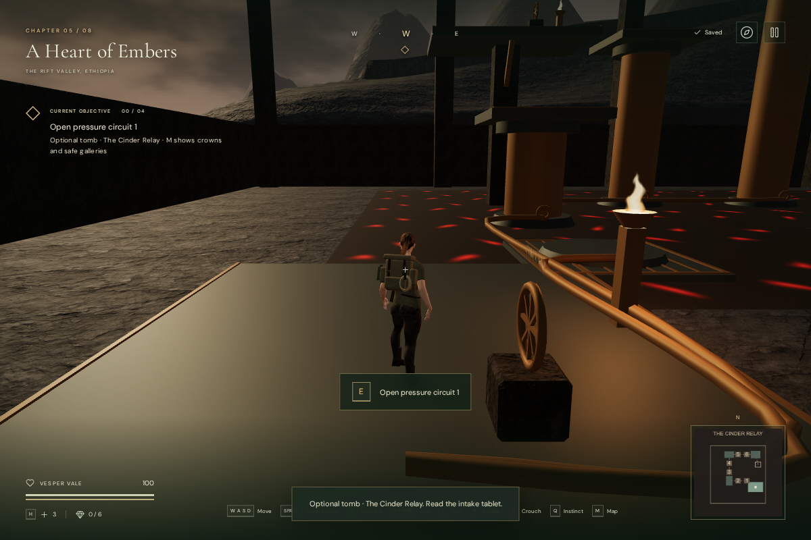
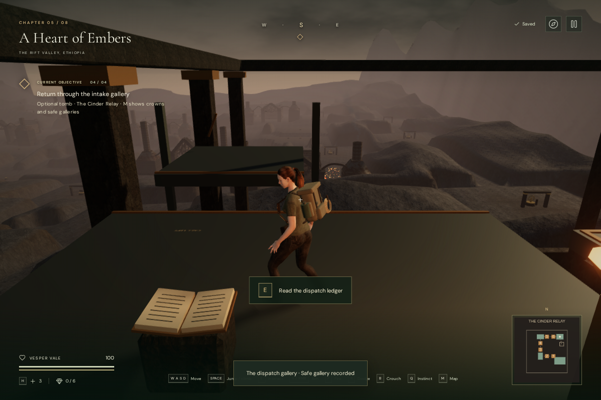
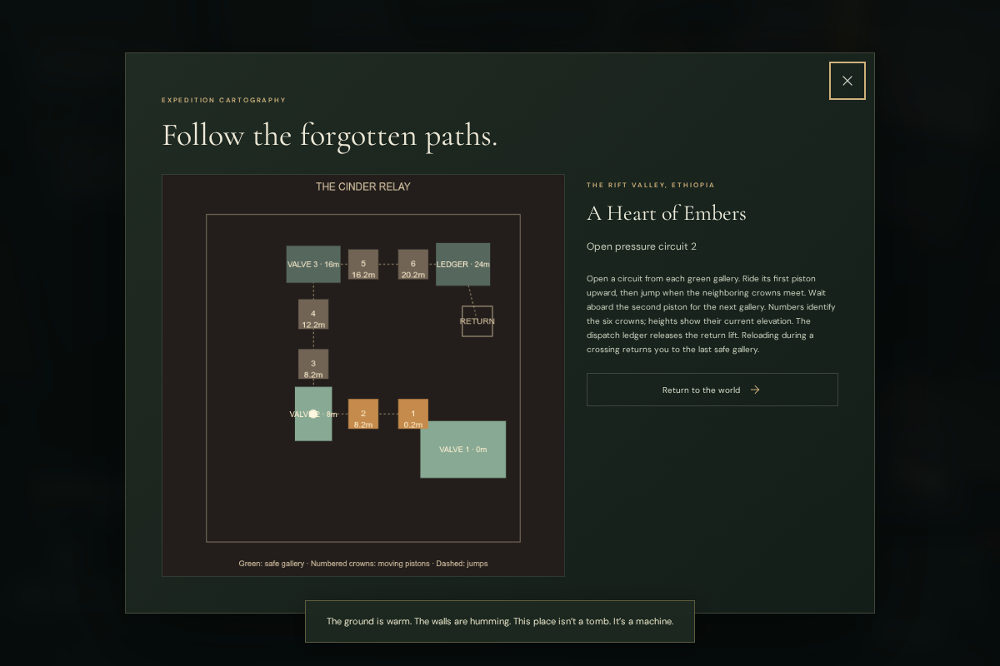

# The Cinder Relay

An optional tomb in **A Heart of Embers** branches west from the obsidian-hub
station in Black Glass. Six pressure pistons climb around a hot settling floor
in three paired banks. The upper dispatch gallery holds **The last delivery**,
a separate journal record about the forge crews diverting their final pressure
reserve to carry refuge supplies. Recovering it releases an eastern return lift.

## Route and controls

Read the entrance tablet, then open the intake valve with **E / Use**. Board the
first crown, ride upward and jump from its edge when the neighboring crown meets
it. The second piston carries you to the next safe gallery. Open that gallery's
valve to start the next pair. The route first travels west, then north, then east,
reaching galleries at 8.2, 16.2 and 24.2 metres above the chamber foundation.

Each activated pair follows a twelve-second cycle, with smooth travel and dwell
windows for transfers. **Space / Jump** uses the ordinary character movement and
collision controller. Leaving or jumping from a crown releases its support.
The galleries provide room to wait, plan and save. A fall onto the glowing floor
returns the explorer to the last gallery and costs 12 health; the eastern aisle
remains cool. Main chapter objectives remain independent of this optional tomb.

At the summit, use the open ledger on the dispatch console. Jump to the eastern
return car and use its lever to descend. A second use raises it again, and call
controls on both landings recall it when the car is elsewhere. Each journey takes
eight seconds. Pause freezes travel; continuing resumes the same journey.

The HUD tracks gallery and record progress. **M** shows the chamber's numbered
crowns, current elevations, safe galleries and return car. **J** records discovery
and retains the recovered story. Touch Use and Jump share the keyboard actions.

## Persistence and physical behavior

The volcanic chapter's local save stores discovery, opened circuits, the highest
reached gallery, the recovered record and the last completed return-lift stop.
Saves during a jump or ride use the last visited safe gallery. Reloading rebuilds
the opened circuits from a consistent starting phase and restores that gallery;
it does not attempt to resume a midair jump. Supported stationary gallery saves
retain their positions. Missing or malformed fields normalize to valid progress,
and other chapters do not acquire relay progress.

Moving crowns carry grounded riders. Their deck and shaft bounds move with the
geometry, and slabs and solid walls block bodies, camera rays and positional
sound at their actual heights. The new chamber and connecting trail are appended
after the seeded campaign layout. A baseline comparison preserved existing
rooms, side rooms, field sites, features, enemies and spawn across all eight
chapters; the other seven maps remained identical. Rendered feature positions and
existing obstacle records also matched the preceding milestone.

## Sound and effects

Six visible outlets emit steam beside the piston beds. Their positioned hiss and
the moving drive emitters follow piston speed. Steam plumes use the same activity
and a clock that freezes on pause. The return car has a moving drive source;
the settling bed and four gallery lamps provide quieter lava and fire sources.
These use the existing Web Audio synthesis, bundled fire recording, HRTF spatial
positioning, linear distance falloff, occlusion filtering and shared voice cap.

The volcanic score selects its existing quiet lifting arrangement while the
explorer is in the chamber. Music and ambience retain the independent persisted
mix controls. This addition includes no new external audio files.

## Verification and limits

All **397 automated tests passed**, including seven relay tests covering the
complete ascent/return, phase windows, jumping, rider support, pause, heat
recovery, lift calls, supported reloads, collision and save normalization. The
production build passes with the existing large-chunk advisory.

A continuous development-browser route began at the Black Glass field station,
used native W/E/Space input with supplied directions and timing, crossed all six
crowns, recovered the ledger, descended by lift and exited at 100 health. The
guide, map and record dialogs were inspected. This was an assisted check, not a
blind playthrough or a chapter-duration measurement.

All eight chapters rendered in High and Performance with linked shaders. The
1200 × 800 overview reported 381 calls / 165,707 submitted triangles in High and
170 calls / 43,838 triangles in Performance. These are totals for that particular
view and rendering passes, not just the chamber. The Vulkan/ANGLE automation
environment does not establish consumer-device frame rate or AAA image quality.
Changing chapters disposed all 173 inspected geometry, material and texture
resources exactly once and removed the chamber from the scene.

Actual-world reloads restored the lower gallery and a saved return journey onto
clear supported decks at 100 health. At 540 × 900, native touch Use opened the
intake circuit; simultaneous held forward and Jump moved 1.5 metres and landed
safely. A separate fall through the regular player update recovered at the intake
with 88 health.

All six steam sources matched their visible plume origins exactly. An isolated
live steam voice reported gain 0.12 at 2 metres, 0.06 at 12.5 metres and was
released at 24 metres, beyond its 23-metre range. Its panner used linear falloff.
Pausing held plume time, opacity and platform heights while silencing mechanical
activity. These checks establish positioning and attenuation behavior, not
subjective soundscape quality or a listening evaluation.

In the final production build, native E opened circuit two from a prepared lower
gallery save. A second fixture restored a mid-return save to the dispatch gallery
and opened the recovered ledger with native E. Both retained 100 health and
restored the complete save exactly apart from last-played timestamps. The
development hook was absent. Development and production checks reported no
JavaScript errors, console warnings or failed assets. Checked bundles:
`index-DocUG3WN.js`, `game-qWwo162C.js`, `three-CJb2rOZj.js` and
`index-DYq9hjRy.css`.

The chamber still uses simple procedural architecture, metal surfaces and
character interactions. Bespoke machinery art, hand contact, more environmental
storytelling, blind route testing and difficulty tuning remain necessary. The
requested AAA graphics and approximately hour-long human chapter pacing remain
unfulfilled production targets.
