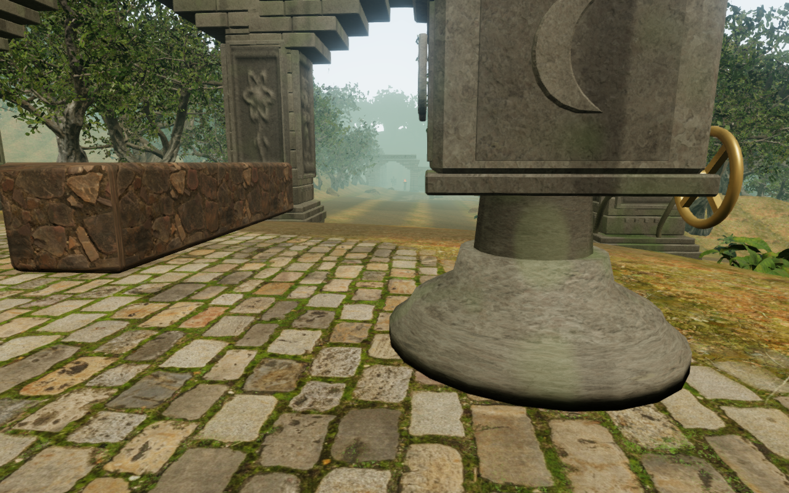
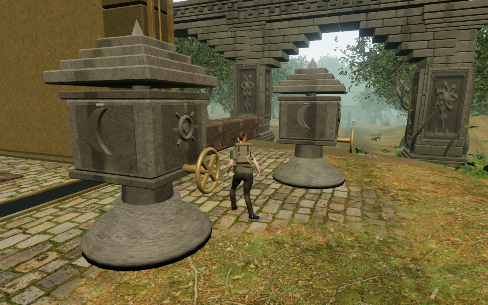
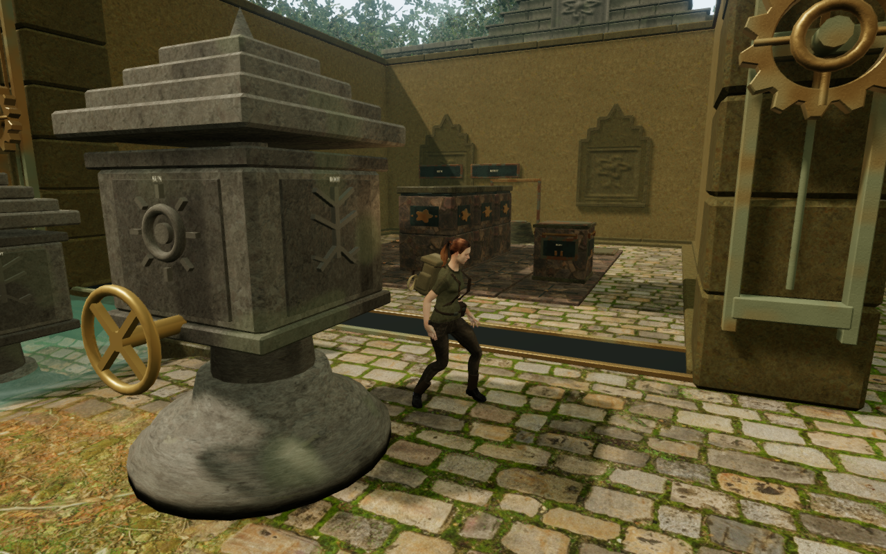
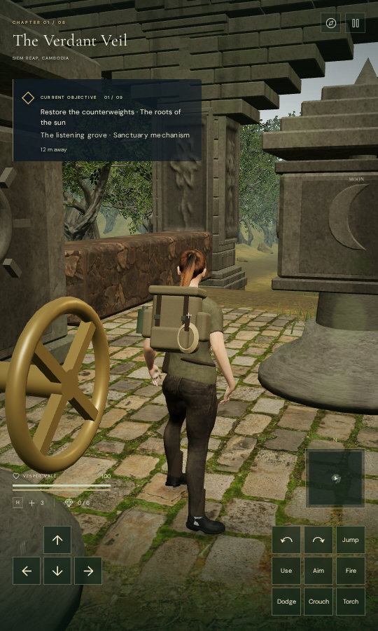
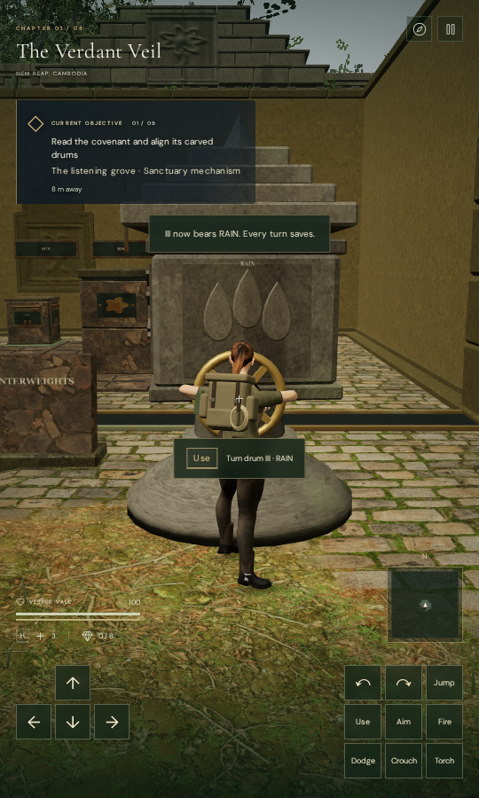
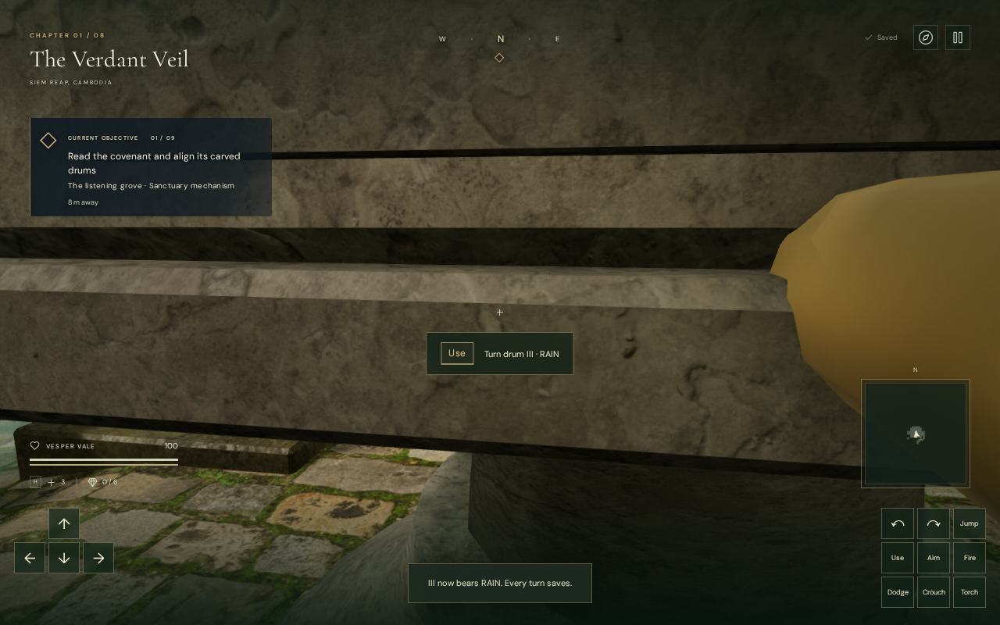

# Camera clearance beside the jungle's carved drums

The initial inscription-to-counterweight walk no longer fades the explorer in
the three recorded jungle frames. The cipher assembly's camera bounds now
follow its separate pedestal, rotating stone, capital, spindle and bronze drive.
The repeated eight-chapter stone solutions retain full character opacity over
all 15,706 observed camera frames. This repairs the recorded entrance failure;
close views at the working controls still need further attention.

## Comparing the bounds with the delivered geometry

The previous **2.04 × 3.55 × 2.08 m** box covered the entire drum assembly.
At jungle walking frames 73 and 118, independent replays matched the recorded
camera exactly: its arm fell to zero and 0.01277 m respectively. Both central
sight rays cross no delivered opaque cipher mesh. At frame 73, however, two
parallel rays offset by 15 cm do strike the actual handwheel rim. Clearing
the central ray alone would leave that wheel unprotected.

The fixed pedestal, collar, capital, finial, spindle and inscription masonry
now register their component bounds before render batching. Round parts use
rounded cylinder queries; small and thin stone parts retain their own bounds.
The wheel and its shaft have separate bounds along their actual shaft axis.
The rotating drum uses a circular envelope derived from every delivered opaque
vertex after batching. Its height and radius cover complete and intermediate
turns, and the envelope is parented to the fixed body rather than a removed
face group. These camera surfaces add no visible mesh.

The existing walking-camera recovery then finds a clear nearby view beside
the protected components. At the two recorded poses, the recovered arms are
5.314 m and 4.896 m. The original requested arms remain obstructed by the
wheel's margin or the rotating stone's envelope; the repair does not pretend
that every ray beside a drum is free.

The earlier entrance view:

The same player pose after the component-bound repair:

The second recorded pose:

## Verification

All **752 campaign checks** pass on the final runtime source. The exhaustive
shards comprise 732 non-wind tests and two disjoint groups of ten wind tests,
with no failures or skips. The 26 focused cipher and camera checks also pass.
The production build passes with the existing bundle-size advisory.

Two new regressions compare the recorded central rays with actual meshes,
follow both camera poses for 120 frames each, and preserve player position,
selected look and progress. They also compare camera bounds against **2,688
actual rotating-stone intersections and 336 handwheel-rim intersections** at
all 42 drums, through legal and intermediate turns. Running these regressions
with the previous court construction fails for the reproduced short camera
arm and for the uncovered wheel rim.

The repeated browser stone solutions complete all **121 moves**. They observe
9,293 walking frames and 6,413 grip, slide and release frames. The new jungle
run has zero fades across 1,669 frames, including 927 walking frames; the
previous run had three. The other seven chapter runs also retain full opacity.
Feet, yaw, pitch and final solved records match the preceding milestone exactly
in every observed frame. All 64 final stone-solution captures are reviewed.

The full jungle world also checks all **50 controls**, their supported working
positions and local physics approaches, plus 42 clear nearby machinery sound
paths. A wider camera observer samples 16,188 frames at those controls and
performs a real quarter-turn at every drum. All 2,688 turning frames retain
full character opacity, with a minimum arm of 3.921 m. Every sampled camera
arm remains clear of the registered solids, and health stays at 100. The
48 representative approach, turning, reverse and overhead captures are
reviewed. The wider observer also records the remaining fades below; solid
clearance alone is not a complete visual acceptance check.

These are assisted checks: field progress and control poses are assigned for
inspection. They do not establish a continuous earned jungle playthrough,
all water or swimming states, supported-device performance, or human pacing.

## Native production input and saves

Six cases use the production build without the development hook: both recorded
entrance poses and the first court's third wheel, each with keyboard in High
quality and portrait touch in Low quality. Native look restores the recorded
heading and pitch, an additional manual turn remains usable, and movement saves
the new position. Native E and touch Use each turn the wheel once and immediately
save the exact drum value and move count. Health stays at 100.

The four entrance cases reload with complete stores unchanged apart from
last-played timestamps, including their chosen look angles. The two wheel cases
walk closer to the drive and require arrival-camera corrections on reload.
Independent queries of the unchanged arrival policy reproduce both chosen
angles exactly: the requested arms are zero, while the selected arms clear
5.381 m and 5.334 m. Every other saved field remains identical; a second reload
retains the corrected look exactly. This is an obstruction correction, not
evidence that arbitrary close wheel views preserve their saved angles.

All 26 native captures are reviewed. The expected release resources are
`game-BTbbZMMi.js`, `index-DclxTCqP.js`, `three-mu_AYolc.js` and
`index-CQBT4VmC.css`; the cases observe those exact resources, no development
hook, no horizontal overflow, and no console errors, warnings or failed assets.
An initial wheel setup used absolute terrain height in the private save fixture;
the game's save format expects an elevation offset. That fixture error was
corrected before the two wheel cases were completed.

## Remaining close views

The wider observer finds **3,000 faded reverse-view frames**: looking directly
toward the solid drum or tablet from each of the 50 working positions retracts
the camera throughout its 60-frame sample. A separate comparison using both
the previous and current court construction reproduces short reverse arms
at all 50 controls. The component repair retains those obstructions and can
retract farther because the drive is now protected.

Two of the later drum approaches also retain 25 faded frames each, at drum VI
in court seven and drum V in court eight. The native third-wheel cases expose
a close, obstructed view after walking about 0.45 m forward from the working
stance. Their subsequent reload recovers a clear view through the arrival
policy, but the walking view itself remains poor. These observations are
recorded as **VA-48**, with the camera margins, working stance and actual
drive geometry still to be compared before selecting a repair.

VA-47's recorded entrance is repaired. Broader camera composition, repeated
courts, landscape integration and continuous routes across all eight chapters
remain open. The existing distance-sensitive sources and quiet thematic scores
are retained; this camera pass does not establish subjective audio quality or
complete the game's visual acceptance audit.
