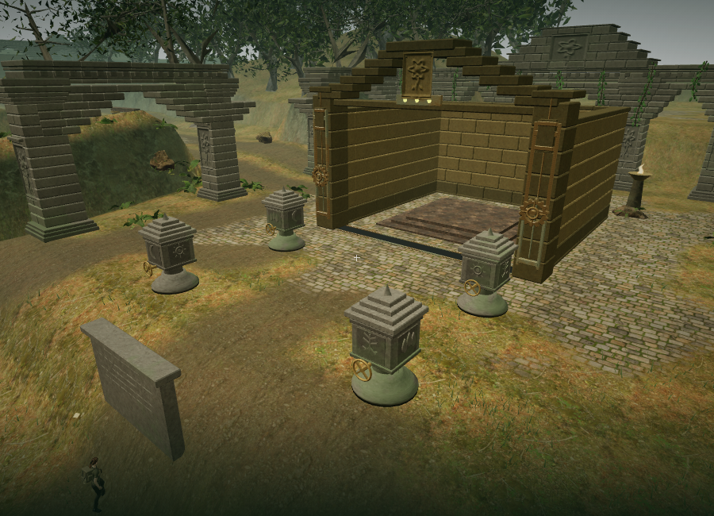
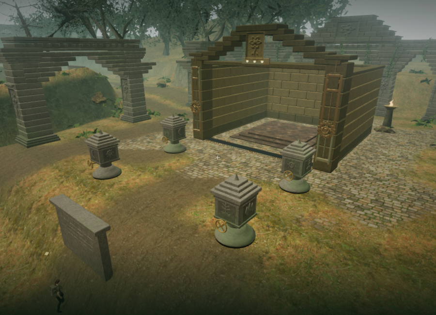
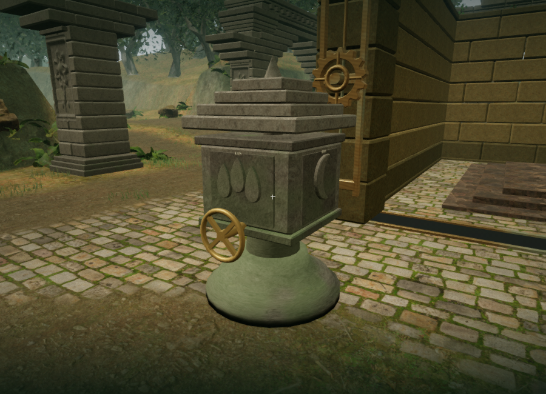
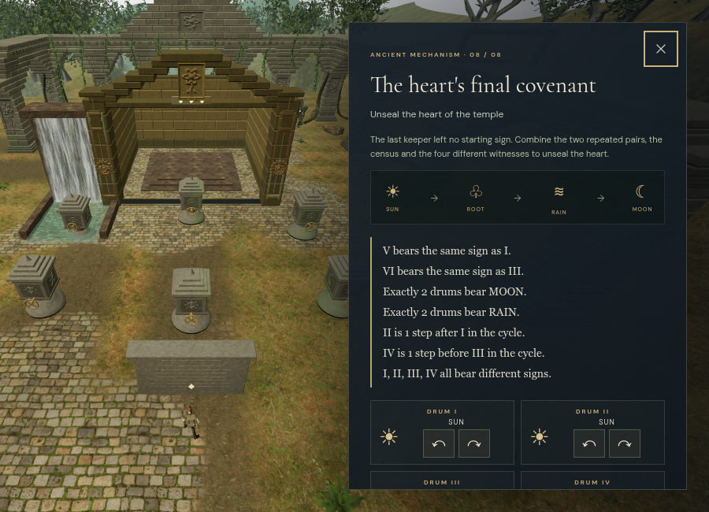
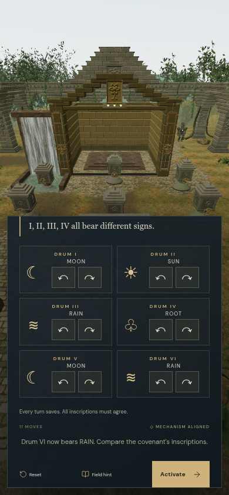

# The jungle's keeper covenants

The jungle's eight main mechanisms now have authored deduction puzzles and
physical carved drums. The former four-ring dialog sequence has been replaced by
42 four-faced drums across eight different forecourt layouts. Every court has an
inscription tablet and each drum has a handwheel, relief signs and its own number.

SUN, ROOT, RAIN and MOON form a four-sign cycle. Press E / Use to turn forward;
Shift + E turns backward. The sign facing the handwheel is the selected sign.
The entrance tablet supplies the complete inscriptions, optional focused controls,
reset and activation. Both interfaces share the same state and save every turn.
All inscriptions must hold before activation advances the chapter.

| Covenant | Drums | Deduction | Arrangement |
| --- | ---: | --- | --- |
| The keeper's first covenant | 4 | A named starting sign and successive steps | Shallow arc |
| The rootbound promise | 4 | Four different signs and relationships read out of order | Opposed pairs |
| The rainkeeper's census | 5 | Exactly two roots and a matching pair | Alternating procession |
| The reflected garden | 5 | A repeated rain sign and a four-sign group, without a starting sign | Mirrored banks |
| The eastern witnesses | 6 | Two repeated pairs, two counts and a forbidden sign | Three double rows |
| The moonlit procession | 6 | Matching roots and moons, relative steps and an exclusion | Two staggered banks |
| The inner sanctuary's oath | 6 | Matching ends, opposed inner signs, counts and an exclusion | Branching array |
| The heart's final covenant | 6 | Two repeated pairs and a census, with no named starting sign | Six-point enclosure |

`src/cipher-rules.js` describes the inscriptions as constraints. Exhaustive
enumeration of each court's four-sign assignments finds exactly one answer.
The state machine validates input indices and directions; save normalization
rejects malformed values, bounds counters and isolates covenant records to the
jungle chapter. Old saves retain chapter progress and start any unfinished
covenant from its default signs; the previous cipher did not store partial turns.

## Construction and presentation

The signs are original extruded relief geometry: a sun disc and rays, branching
roots, three drops and a crescent. Four signed faces rotate together on a square
stone drum. Beveled bands, a shaped pedestal, a central spindle, stepped capital
and a bronze drive connect it to the surrounding temple architecture. The existing
local temple texture set supplies stone color, normals and roughness, with the
temple's damp and moss shader. No new downloaded art or audio is required.

Each complete drum surface is combined into three material draws. Shared
handwheel geometry and one padded inscription atlas avoid separate sign textures
or canvas repaints for every turn. Fixed masonry and inscriptions are combined
per court. Moving detail has distance visibility with hysteresis; foundations,
collision supports and sound coordinates retain their world positions.

Handwheel height follows its standing apron where the ground slopes below the
pillar. When the explorer is within touching distance, each quarter-turn chooses
the appropriate pair of grips and briefly tracks them with the hands. Broader
keyboard/touch interaction margins remain usable without stretching the arms.

All 42 drives have a positional stone-machinery source. Its activity follows
visible rotation and falls to zero at rest. The source fades linearly between
1.2 and 20 m, uses the existing occlusion path and shares the twelve-loop limit
with birds, water and other environmental sources. A short local contact sound
accompanies each turn. The quiet jungle score uses its existing lifting accent
while the mechanism moves and leaves its melody out of the focused puzzle view.

The final Performance and High court views, followed by the carved relief:

The repeatable 900 × 650 cameras are in `scripts/inspect-cipher-browser.js`.
The court submitted 227 calls / 639,523 triangles in Performance and 626 calls /
1,910,282 triangles in High. The High close-up submitted 465 calls / 1,330,214
triangles. These are whole-scene ANGLE/SwiftShader workloads, including the extra
render passes, and do not establish supported-hardware frame rates.

## Verification and limits

The full suite passed 276 tests. After the final handwheel, grip, focus-camera and
feedback refinements, all 25 affected covenant, puzzle and character tests passed
again. The production build passed with the existing large Three.js chunk advisory.

In the final High production build, native E changed the first drum from ROOT to
RAIN and immediately saved its second turn. Native movement saved the new player
position. A paused reload then restored every chapter field except its expected
last-played timestamp, plus the exact settings: position, drum values and move
count, health, active time, stage and field progress all matched. No development
hook, failed assets or console warnings/errors were present. The checked release
bundles were `index-B_uFqPqz.js`, `game-tt4VPhAO.js`, `three-0KZjNg1c.js` and
`index-CwPoLOYg.css`.

An isolated stereo render of the actual machinery sample and HRTF panner measured
RMS levels of 0.00079119 at 1.2 m, 0.00039560 at 10.6 m and zero at 21 m. The
midpoint amplitude ratio was 0.49999996, matching the linear distance model.
This verifies signal behavior, not subjective sound quality.

The final six-drum focused panel had no horizontal page overflow at 900 × 650,
390 × 844 or 844 × 390. Its controls remain reachable by scrolling the panel.
Actual button clicks at the portrait size saved all eleven forward turns; the
landscape Activate button advanced and saved stage eight and cleared the focus
camera. These were assisted, known-answer checks. The screenshots show the
initial desktop inscription and the portrait panel scrolled to its controls;
the world animation loop was stopped for this UI inspection.

The five new tests cover unique solutions for all eight authored covenants,
reversible and invalid inputs, partial save round trips, malformed/cross-chapter
saves, all physical control positions and nearby approaches, finite relief
geometry, shared inscription textures, locked controls, focused changes, resets,
motion-driven sound, silence at rest and removal of old chapter references.

In the final full browser world, all 54 original feature approaches, eight gate
thresholds, 50 covenant controls and their 50 local physics walks remained clear.
All 42 nearby drive listening paths were unobstructed. Low and High shaders linked.
The delivered explorer was also sampled through forward and backward quarter-turns
at every drum: 13,440 hand-joint comparisons stayed within 1 mm of the selected
grips. This verifies joint targeting, not finger articulation or a captured hand
animation library.

Assisted world input completed all eight covenants and advanced through their
eight mechanism states. Their forward-only solve counts from default signs were
6, 6, 7, 8, 8, 10, 9 and 11 turns. These counts exclude deduction, travel, field
work, combat and reading, and are not evidence of human playthrough duration.

A browser chapter change released all 193 observed court geometries, four
materials and four textures, including the shared inscription atlas. The desert
chapter retained no cipher sites, sources or active cipher voices.
Temporary browser test saves were cleared and High quality restored on both
development and production launchers.

This expands the jungle's puzzle variety and adds physical presentation and
persistence. It does not establish roughly one hour of human gameplay for this
or another chapter. Blind playthroughs, broader listening/device review and
substantial further art and animation work remain necessary; the original AAA
graphics requirement remains unmet.
