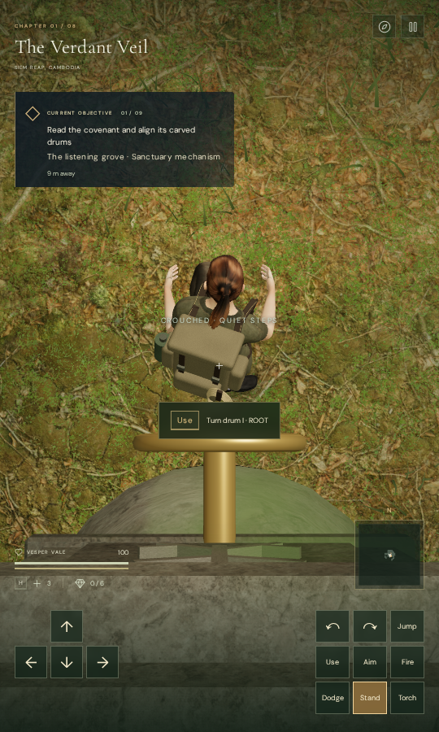
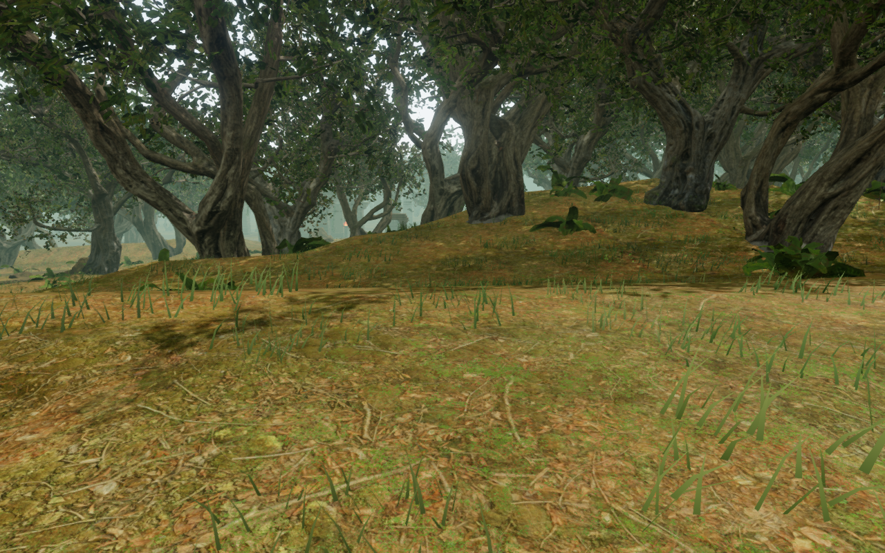
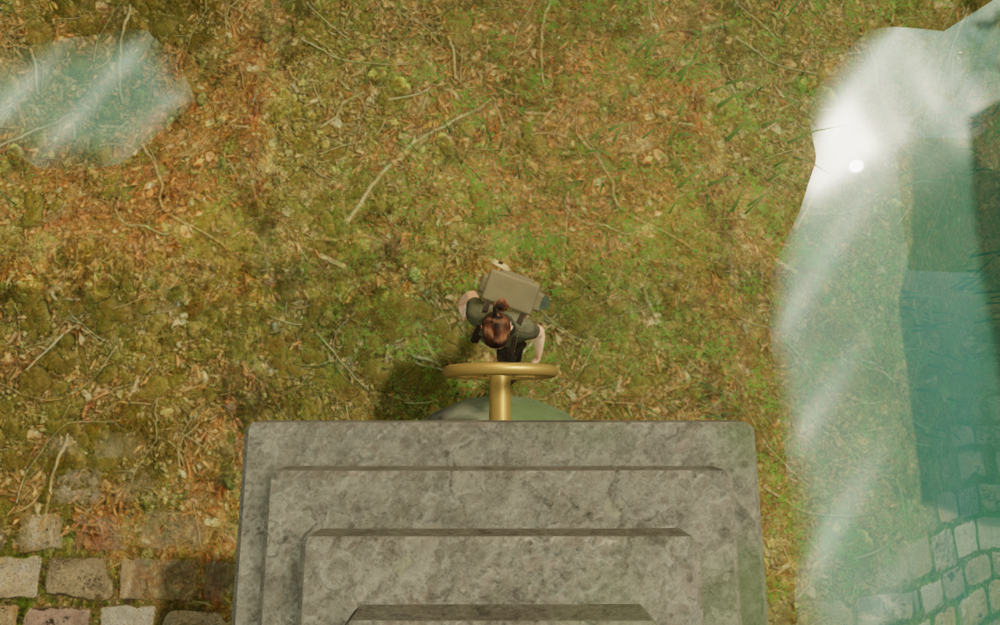
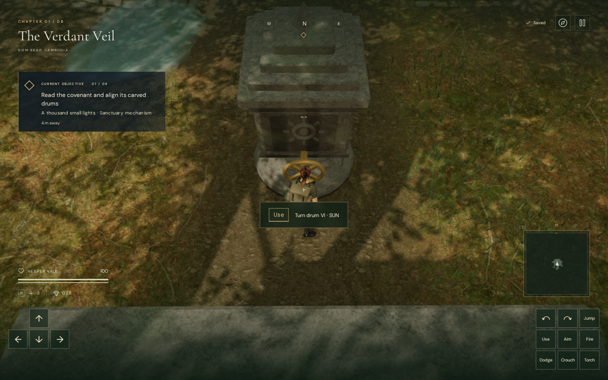

# Walking views at the cipher controls

Turning the camera behind a jungle drum now raises the nearby view over its
crown before the stone can retract the arm far enough to hide the explorer.
The two rear centre controls with an inscription close behind them also use
the raised view during a forward approach. Moving away restores the ordinary
walking composition.

The character stays framed during this recovery, including while crouched.
The chosen heading and pitch remain the player's input and saved look;
collision response changes the camera's position and composition.

## The recorded obstruction

The earlier 50-control observer recorded 3,000 faded reverse frames and
25 approach fades at each of court seven's drum VI and court eight's drum V.
The separate [drive and footing repair](cipher-footings.md) had already stopped
walking through the handwheels and supported their working ground.

These images show the same first-wheel reverse stance in the physical-control
observer. The earlier image comes from the footing milestone's observer;
the updated image uses the final follow camera.

## A continuous path over the stone

A nearby control contributes a smooth influence around its working stance.
Reverse headings shift the collision target up to 1.3 m toward the explorer's
front and smoothly raise the drawn pitch toward 1.05 radians. Only the two
narrow rear-centre placements also raise forward headings.

The swept arm still respects the delivered stone and drive bounds. An
additional 22 cm tube around the explorer's actual chest prevents a shifted
clearance ray from crossing their body sightline. The existing bounded camera
recovery receives the drawn pitch when considering nearby alternatives.

The camera faces the actual chest when its clearance target is shifted.
This keeps the explorer within the picture rather than pushing their feet
below the screen. The raised composition is intentionally an overhead close
view; the normal third-person view returns outside the control's vicinity.
Other camera modes, including aiming, swimming, climbing and cable travel,
retain their existing policies.

Arrival uses the same bounded clearance search at a recovered cipher stance.
A clear view keeps the saved heading and pitch. Other locations or arrivals
that cannot fit a comfortable recovered view retain the ordinary arrival policy.

## Verification and limits

- All 761 campaign checks pass, including 44 focused camera, aiming and cipher
  checks. The production build passes in 5.55 seconds, with the existing
  chunk-size advisory.
- The delivered runtime completes both full camera orbits at all 50 controls:
  100 cases and 24,000 frames at approximately 1.57 radians per second.
  There are no character fades, solid-camera violations or blocked sampled
  body sightlines. The largest step is 0.50 m and the shortest arm is 3.01 m.
- All 100 reverse views project every delivered visible character vertex
  inside the canvas: 4,809,500 vertex projections. Nine actual opaque-stone
  body sight rays per view are also clear. The 16 representative standing
  renders are reviewed.
- Crouched clockwise orbits add 50 cases and 12,000 frames with no fades or
  blocked sampled body sightlines. All 16 crouched renders are reviewed.
  The largest step is 0.97 m while a tablet-side arm shortens for collision.
  The tests retain feet and chosen look, and check head/foot canvas placement.
- The standing geometry regression also checks 100 saved reverse arrivals
  with retained angles and 900 clear arrival body sight rays.
- The repeated physical-control observer samples 16,188 frames with no fades,
  turns all 42 drums and reaches all 50 controls along their front approaches.
  All 42 positioned machinery listening paths remain clear; all 48 observer
  captures are reviewed.
- Six native keyboard/touch motion cases at the first wheel and the two rear
  controls cover 2,784 actual game-loop frames at desktop High and phone Low.
  There are no fades or solid-camera violations, and each native turn retains
  feet and chosen look. The largest step is 0.83 m; all 18 captures are reviewed.
- Six production keyboard/touch cases verify the occupied reverse arrival,
  crouch/stand, a physical drum turn, manual look and 0.50–1.45 m departures.
  Every occupied arrival retains the canonical fixture's complete store apart
  from timestamps. Every moved save reloads twice with complete stores retained
  apart from timestamps, including the chosen camera angles. Crouching retains
  progress while playtime advances normally. All 36 captures are reviewed.
  There are no reported browser errors, warnings, missing resources, horizontal
  overflow or development hook; all four loaded bundles match the final build.
- All eight stone-board routes complete 121 moves over 15,712 camera frames
  with no character fades. Feet, chosen look and solved records match the
  footing milestone's trace exactly. Their 64 final rendered views are reviewed.

The control checks use scoped field progress; the native motion fixtures also
clear guardian encounters. They do not establish an earned campaign playthrough,
consumer-device performance or subjective audio quality.
The existing distance-sensitive machinery sources and quiet jungle music remain
in use. Wider route composition, repeated scenery, placement review and listening
acceptance across all eight chapters remain open.
