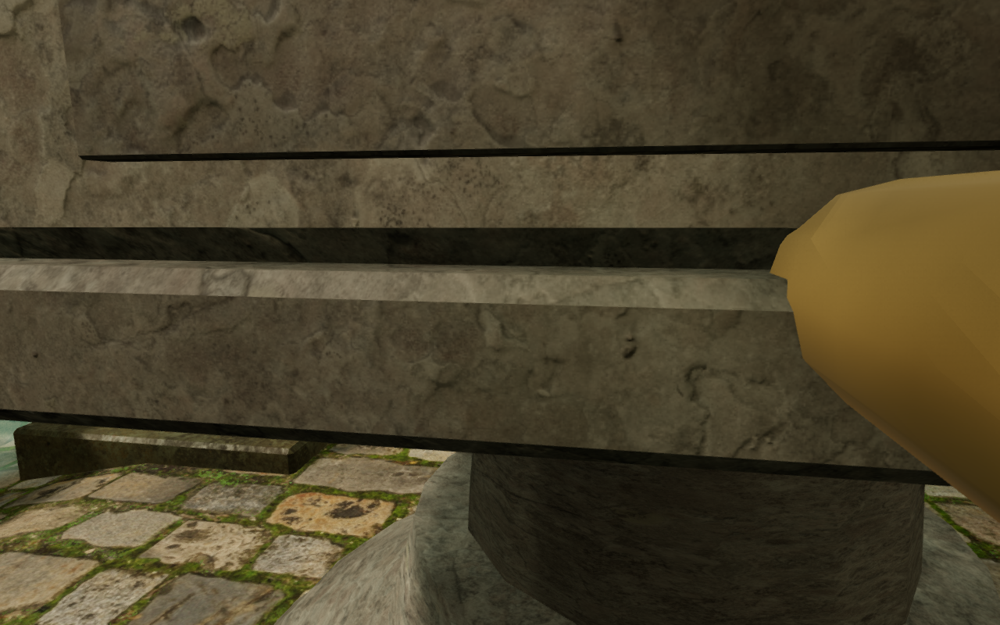
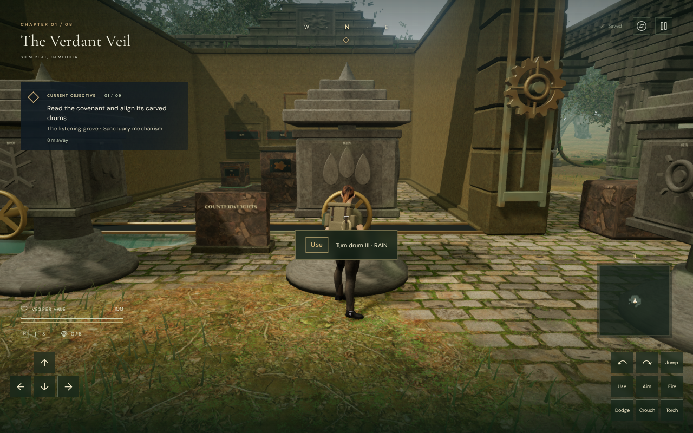
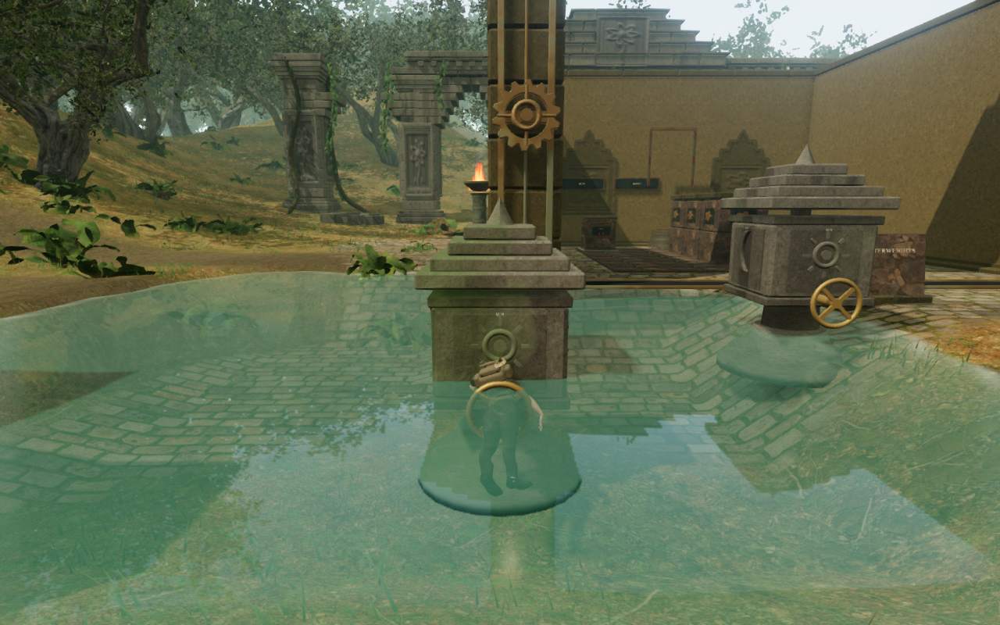
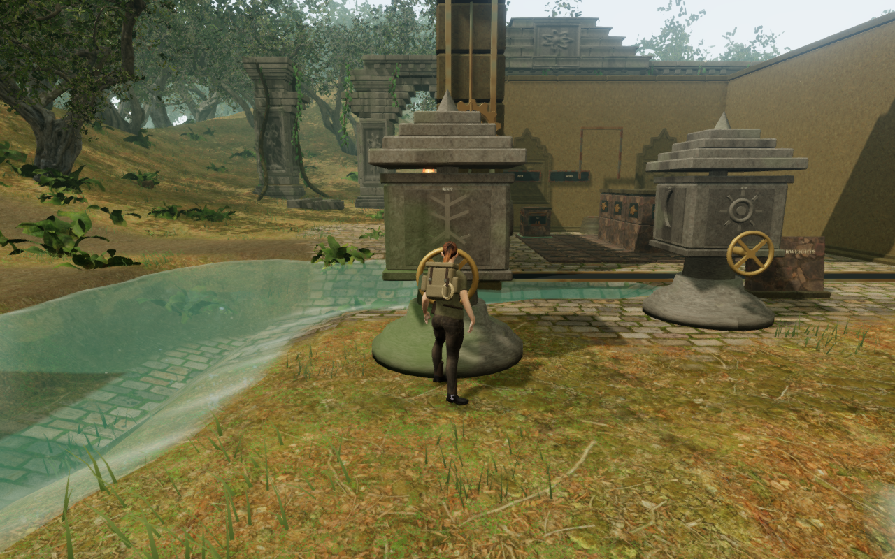
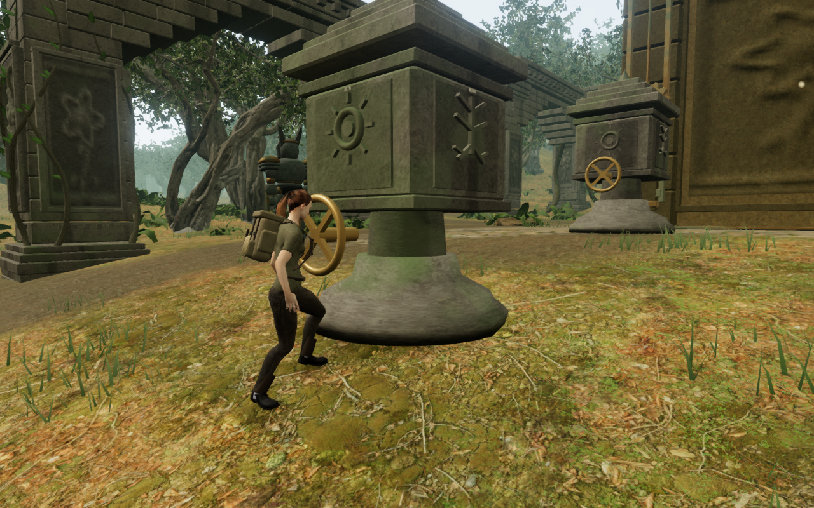
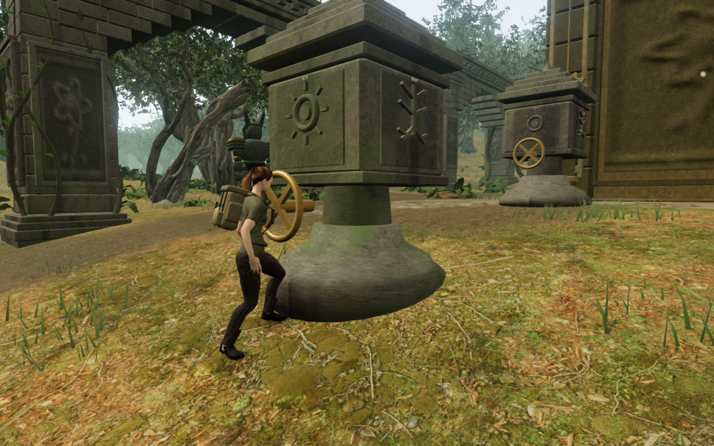

# Supported cipher wheels and fitted stone bases

The jungle's cipher handwheels now stop forward walking at the supported
working stance. Ground beneath each drum and its front approach remains clear
of reservoir excavation, and each pedestal's lower stonework extends beneath
its complete terrain footprint. These changes repair physical access and
placement failures found while investigating the remaining close camera views.

## Walking into the drive

The recorded keyboard and touch walks from the first court's third wheel
entered space occupied by the delivered handwheel. The old spindle obstacle
ended behind the drive. Replaying those saved positions against the actual
rendered meshes found clothing, body and pack vertices inside the wheel; its
rim also intersects the camera's near sight rays. Removing the camera bounds
would leave that physical overlap in place.

The drive now has a separate finite movement solid derived from the delivered
wheel and shaft geometry. Its 32 cm body margin retains the authored standing
point, 32.5 cm ahead of the wheel's front face. It remains active independently
of render distance and supplies physical cover and sound occlusion through the
existing station queries. The handwheel is not a landing or mantle target.

Sustained forward movement stops at the working stance. Turning and stepping
away remain available. Older saves inside the new drive solid use the existing
nearby arrival recovery instead of restoring an occupied position.

## Dry working ground beside reservoirs

After 180 actual controller updates, six working wheels left the explorer
swimming about 1.09 m above their supported stance: court one drum I, court
three drums I and II, court five drum I, and court seven drums I and II. The
interaction's 80 cm vertical reach correctly rejected the turn. Native keyboard
input operated only **36 of the 42 wheels** in that diagnostic setup.

Reservoir grading now protects a finite apron around every authored drum,
including the base, standing point, front approach and surrounding terrain
cells. The mask blends back into the basin outside that apron and joins beyond
the existing working core. The original main and field working-core terrain
hashes remain unchanged. Dedicated waterfall receiving basins retain their
separate excavation.

Repeating the same settled-controller check operates **42 of 42 wheels** on
supported feet, with no swimming and no browser errors or warnings. The setup
assigns the current court's prerequisite progress and the already verified
balanced first stone board; it is an access check, not an earned full chapter
playthrough.

## Stonework meeting the slope

Seventeen pedestal rims had sampled terrain gaps greater than 1.5 cm. The
largest was about **21.6 cm**, beneath the second court's third drum. Two-sided
rendered views confirm the exposed underside.

Each shaped pedestal now receives its own fitted geometry. The bottom ring and
cap extend beneath the lowest covering terrain cell, with a 25 mm burial
margin. The upper profile and hardware keep their authored shape; the lower
skirt retains its original vertical texture density. Actual rays against the
merged opaque stone verify **3,024 bottom samples across all 42 footprints**.
All eight before views and 84 final views, from both sides of every base, are
reviewed.

## Campaign and control verification

All **756 campaign checks pass on the final source**: 736 non-wind checks and
two exhaustive ten-test wind groups. All 56 focused cipher, terrain, water,
station-solid and camera checks pass. The production build succeeds with the
existing bundle-size advisory. Replaying the earlier construction makes the
occupied-save and pedestal-bottom regressions fail at their recorded physical
conditions; replaying the earlier hydrology fails the working-ground check.

All eight counterweight puzzles still solve in **121 moves**. The replay
observes 9,299 walking frames and 6,413 grip/slide/release frames, with full
character opacity throughout. The jungle walk takes six additional frames
around the protected drive. The other seven chapters retain identical feet and
look traces; all eight retain identical solved records. All 64 final solution
captures are reviewed.

The repeated 50-control observer verifies walking access, all 42 quarter turns
and all 42 machinery source sight lines. Its 2,688 turning frames retain full
character opacity. All 48 representative control captures are reviewed. The
observer still finds 3,000 faded reverse-view frames and 25 approach frames
each at court seven drum VI and court eight drum V. **VA-48 remains open** for
those views; the native forward penetration has a physical repair. The wider
scenery, continuous routes and listening/device audit also remain open.

Twelve native production cases cover the two recorded entrance poses, the
first court's third wheel, two formerly submerged wheels, and both older
occupied drive saves. Keyboard uses High graphics at 1280 × 800; touch uses Low
at 540 × 900. Six wheel cases hold forward for 24 browser frames and move at
most 7.2 mm, then accept a manual look change and backward movement. All eight
wheel/save cases register their quarter turn. Both older occupied saves recover
75 cm away, preserving every other normalized field except their camera and
timestamp. Both initial headings independently match the existing objective-facing
arrival rule after recovery moves the feet more than 25 cm. Their next reload
is exact apart from the timestamp. All twelve
post-movement stores reload exactly apart from timestamps, with no camera
correction, health loss, horizontal overflow, missing resource or browser
warning/error. All 62 native captures are reviewed. Fixtures restore scoped
progress; input and rendering use the release application without a development
hook.

The checked release resources are `game-D_0TcexK.js`, `index-AsldL3hc.js`,
`index-CQBT4VmC.css` and `three-mu_AYolc.js`.

The distance-sensitive sources and quiet thematic scores are retained. Sound
sight-line and signal checks establish behavior, not subjective mix quality.
No external asset or dependency was added. Documentation images are actual
game captures converted losslessly to WebP, with decoded RGBA identity verified.
