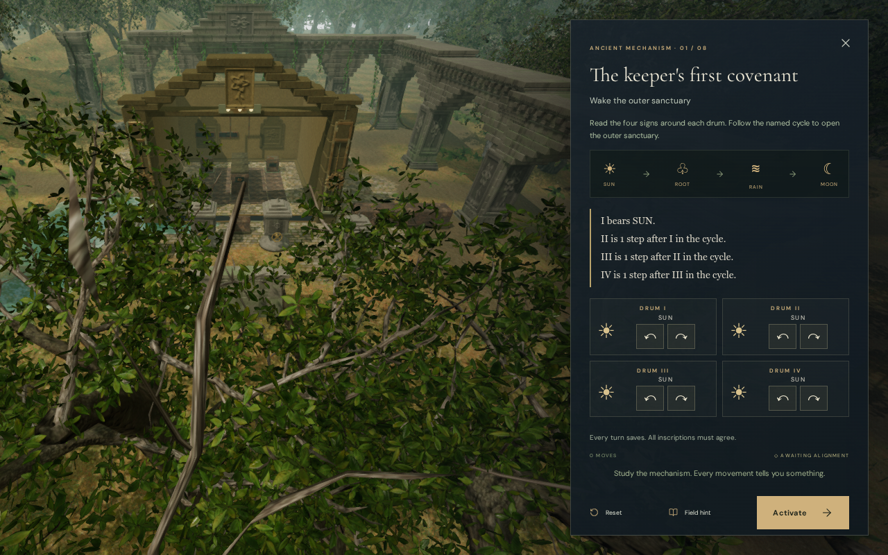
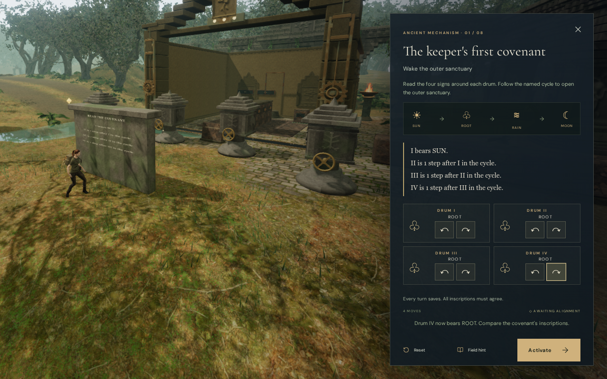
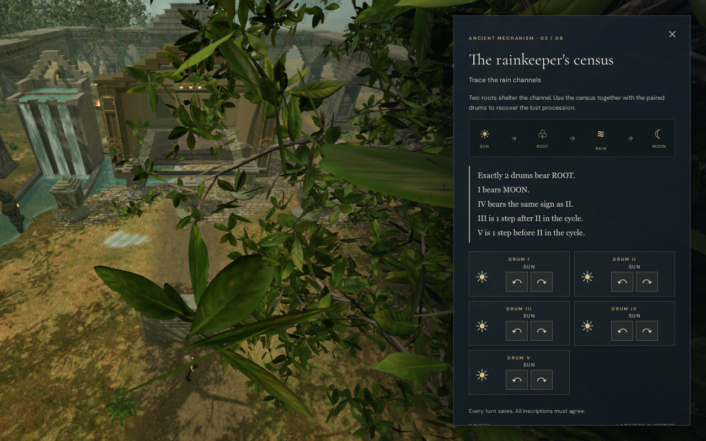
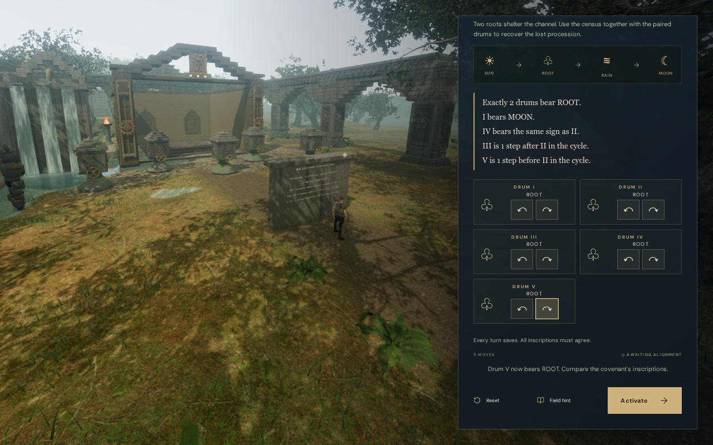
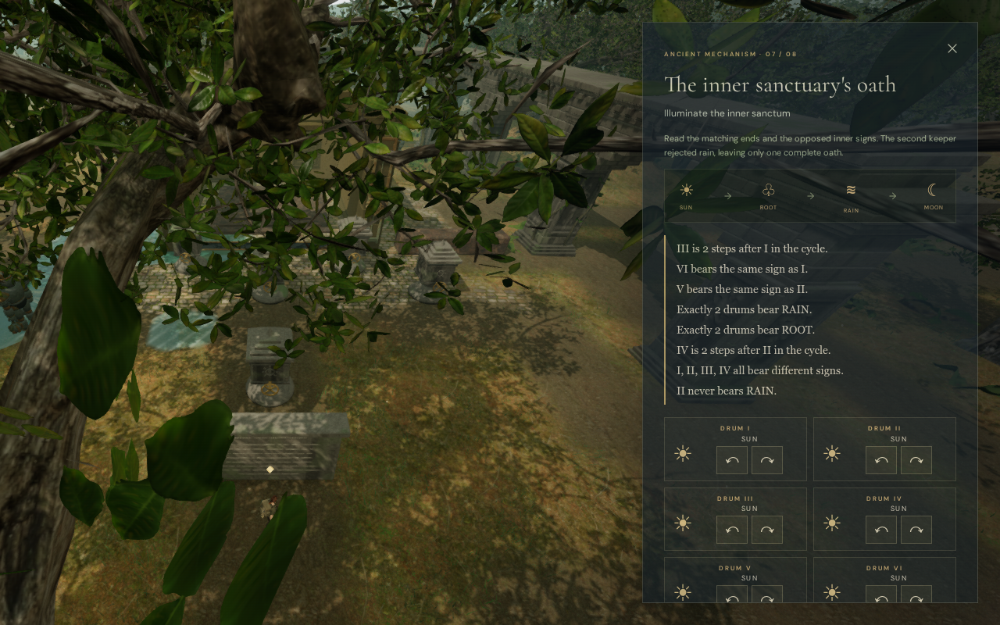
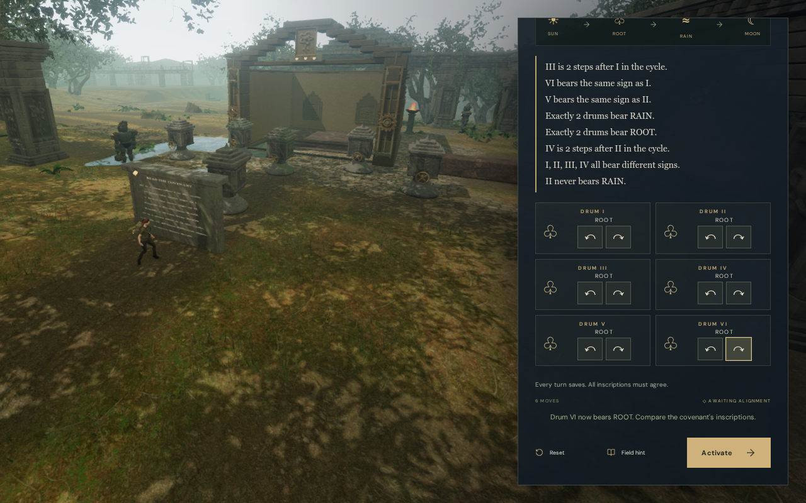

# Clear cipher inspection views

Inspecting the jungle's carved drums now frames the entire court beside the
desktop controls or above the portrait controls. Reviewed lower side views
clear the foreground branches that obscured the first, third and seventh
inspections. The eight covenants retain their physical arrangements, clues,
turn rules and saved progress.

## The recorded obstruction

The actual inscription flow reproduced the problem: read the tablet with Use,
then choose **Inspect the carved drums**. The earlier camera used one central
position and a fixed lens for every court. In three courts it looked through
nearby trees, hiding much of the array. The same obstruction appeared at High
desktop and Low phone quality.

The baseline images are actual native inscription captures. Some baseline
panels were captured during their entry transition; the obstruction described
here is the foreground foliage in the world view. Updated images show each
drum advanced once, so their visible signs and movement counts differ.

## Fitting the delivered court

Each court caches a world-space envelope of its delivered fixed and detailed
meshes. The rotating drum contributes its complete circular sweep, derived
from the actual opaque vertices. This includes intermediate turns rather than
only the square's settled orientations. The cache has a 12 cm framing margin.
It adds no rendered mesh or collision surface.

The inspection camera projects that envelope and chooses its lens and view
offset to fit the available canvas area. Desktop uses the space to the left
of the panel. Phones and portrait tablets up to 900 pixels wide use the space
above it. The available region comes from the actual panel rectangle and
keeps a 16 pixel inset. Resizing recalculates the composition.

Four authored views separate the inscription from the rear drums and clear
the canopy; the remaining courts share a central lower view. The first
court's camera was refined again after a desktop render exposed a large leaf
over its rightmost drum. Its final closer view clears all four drums in both
reviewed desktop and phone compositions.

## Verification and limits

- The geometry regression covers all eight courts at eight legal/intermediate
  orientations each. Every delivered vertex lies within the cached envelope.
  Projected envelope corners fit outside the panel in four viewport formats.
- The final development browser check opens all eight inspections at
  1280 × 800 High, 960 × 540 High, 540 × 900 Low and 820 × 1180 High. Its
  32 cases use native buttons for 336 forward/backward turns and resets.
  Every delivered court vertex fits outside the actual panel during these
  checks, including moving drums. There is no horizontal overflow.
- Closing each inspection restores the normal 58-degree lens, zero film
  offset and ordinary follow view. Feet, chosen look, field progress and
  counterweight records stay unchanged through the inspection flow. Native
  buttons immediately persist the expected signs and move counts.
- All 16 baseline and 32 final inspection captures are reviewed. Six selected
  before/after images are encoded losslessly, with decoded RGBA identity
  verified. Candidate viewpoint images remain private staging evidence.

- All 757 campaign checks pass, including the 12 focused cipher checks. The
  production build passes in 2.91 seconds, with the existing chunk-size advisory.
- Six final production cases open the first, third and seventh inscriptions
  at desktop High and phone Low. Native forward/backward turns, reset, return,
  manual look and departure preserve the expected progress. Departure covers
  0.60–1.57 m in the measured cases. All 30 native captures are reviewed.
  The release has no development hook, missing resources, horizontal overflow,
  reported browser errors or warnings; all four loaded code/style bundles
  match the final build.
- Five complete stores reload exactly apart from timestamps. The first
  desktop departure invokes the existing arrival camera policy: its saved
  0.16005-radian heading changes to 0.68365 radians, with pitch unchanged.
  Independent queries of the actual scene show a shortened 4.71 m preferred
  arm and a clear 5.33 m selected arm; the policy selects the recorded heading
  exactly. Every other saved field stays unchanged. A second reload is exact
  apart from timestamps in all six cases.

The checks use scoped field progress and a legitimately solved counterweight
board to reach the inscriptions. They do not establish an earned campaign
playthrough, subjective sound quality or consumer-device performance. Existing
positional machinery sounds and quiet jungle music remain in use.

The later [cipher walking-view repair](cipher-follow.md) addresses VA-48 at
all 50 controls and the two narrow rear approaches. Its raised path and body
framing retain chosen look angles through continuous rotation. Broader route
composition, repeated spaces, placement review and listening/device acceptance
remain open.
