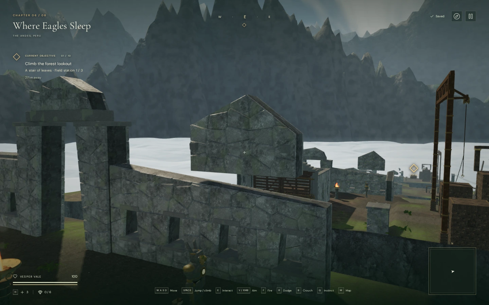
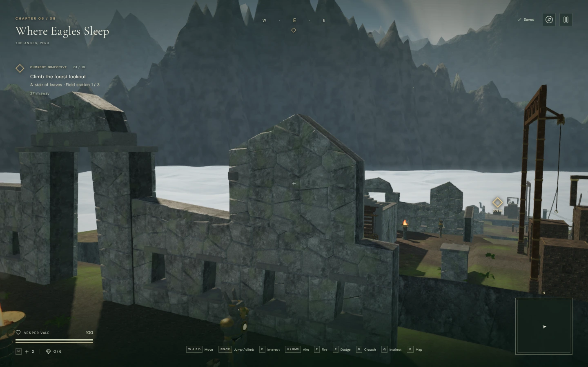
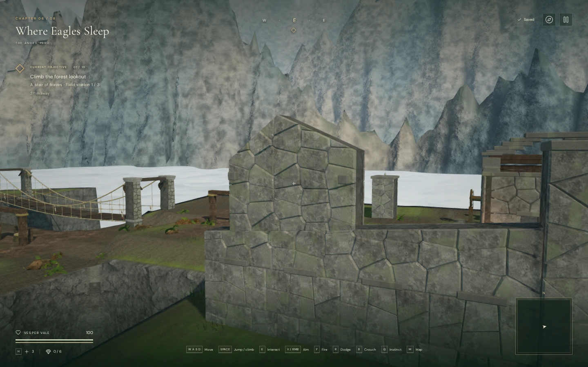

# Continuous citadel masonry

The cloud-city ruins now join their upper tower masonry to the walls below.
Previously, six towers had flat bases above sloping broken wall tops, leaving
daylight gaps up to about 1.2 metres. Intact walls also sloped slightly beneath
their level coping stones. Those gaps made solid masonry appear suspended.

The wall builder now supplies its actual top profile. Each tower's lower edge
follows that profile with a small bedding overlap through the wall's thickness.
Intact walls have level top courses beneath their coping. The broken silhouettes,
gateway openings, niches and bird perches retain their established layout.

## Matched views

Before, in High quality:

The same view with continuous masonry:

The repaired wall from behind:

These are 1440 × 900 browser captures encoded as WebP for documentation. The
change is in the modeled masonry, including its rear face and camera bounds.

## Geometry and checks

The ten citadels contain 4,090 stones/caps and **176,840 source triangles**, an
increase of 43 stones and 1,888 triangles. They still batch into twenty meshes
using the same two shared materials. This pass adds no external art, audio,
runtime downloads or dependencies; the original local rock and temple maps
retain their [existing attribution](asset-credits.md).

The diagnostic samples the actual batched meshes from both sides across nine
tower bearings and ten intact northern cap courses. Before the correction,
1,822 of 4,810 samples passed through a gap. Afterward, all 4,810 met stone.
Both the Node test and the browser run use these surface intersections. These
samples establish continuity in the checked bands, not a structural engineering
simulation or an exhaustive proof of every surface in the city.

Eight matched High/Performance views cover two damaged towers, the rear of one,
and an intact tower. All shaders linked without console warnings, errors or
failed asset requests. Existing tests also retain clear feature approaches,
central gateways, recessed niches, camera obstruction and supported bird perches.

The final browser world retained all 119 dry, clear wind controls and all 260
sampled unobstructed wind-source approaches. Assisted character-physics routes
reached all 119 controls; swept route searches completed all 54 bridge-bank
approach legs. All 59 sampled feature approaches remained clear. Native **E**
turned and saved ducts at stages one and eight. These are assisted checks, not
blind playthroughs or measurements of chapter duration.

Changing to the crystal chapter disposed all twenty citadel geometries, two
shared materials and six textures exactly once. Citadel and perch references
were cleared. The integration run reported no console warnings, errors or
failed assets.

All **429 automated tests** pass with two test workers (89.52 seconds). The
production build succeeds with Vite's existing large-chunk advisory. Its final
bundles are `index-DNyIwCkV.js`, `game-B3cThEqp.js`, `three-CJb2rOZj.js` and
`index-DYq9hjRy.css`.

Two High-quality production cases exercised native duct turns and movement:
desktop **E** at stage one, and **Use** on a muted 540 × 900 touch viewport at
stage eight, followed by keyboard movement in both cases. Both saved the new
duct value and move count at 100 health. Reloading while paused restored the
entire save exactly apart from `lastPlayed`, including field actions, journal
discovery, position and settings. The final release checks had no development
hook, failed assets, console warnings/errors or horizontal layout overflow.

`scripts/inspect-citadel-supports-browser.js` provides `inspectCitadelSupports(game)`
and `citadelBearingView(game, roomIndex, side)`. The comparison uses room eight,
side one; side minus one gives the rear view. Stop the development animation loop
and pause before using the inspection helpers.

AAA visual quality, approximately one hour of human gameplay per chapter,
subjective sound/music review and broader browser/GPU coverage remain open in
[production status](production-status.md).
