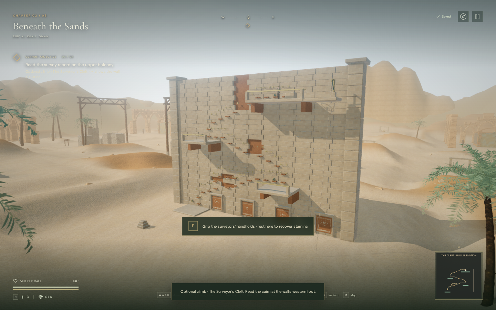
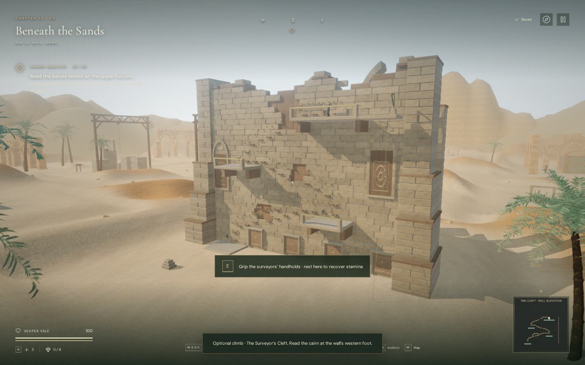
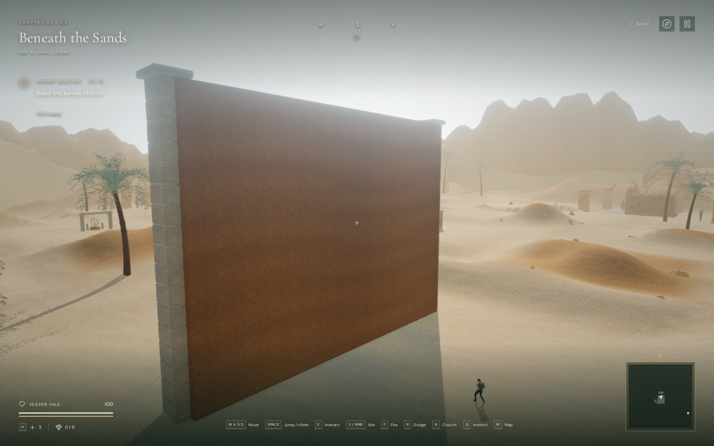
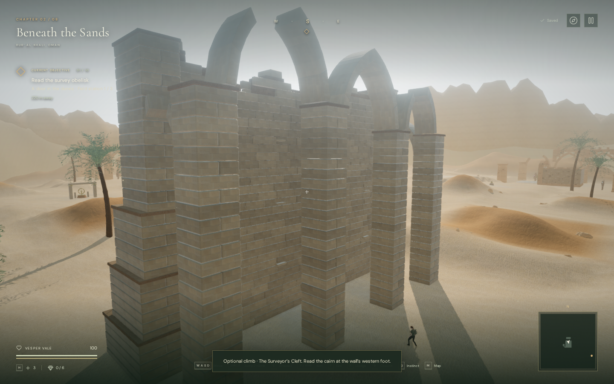

# The ruined survey house

The Surveyor's Cleft now occupies the front of a roofless survey house. Stepped
buttresses give the face depth, broken side and rear arches reveal an open court,
and uneven upper courses break its former straight outline. Both sides have
individual masonry courses, with recessed solar panels and exposed floor sockets.
The handholds, terraces, survey record and return line retain their positions.

This is original procedural geometry using the existing local sandstone textures.
The masonry remains stylized and repeated; it is not a scan, a structural
simulation or AAA-quality environment art. Human chapter duration, subjective
listening and wider browser/device coverage remain open.

## Matching views

These images record the original art milestone. The subsequent
[desert daylight calibration](desert-daylight.md) changes the building's
illumination; its geometry remains the same.

Actual 1440 × 900 High-quality development-browser views compare the published
`64b903e` structure with the revised masonry. The camera, observer and chapter
time match, and the explorer settles on a supported floor before capture.
These are assisted art-review positions. Lossless WebP conversion preserves
every decoded image pixel without retouching.

| Quarry face, before | Quarry face, revised |
| --- | --- |
|  |  |

| Rear, before | Rear, revised |
| --- | --- |
|  |  |

## Collision, route and persistence

All 475 automated tests passed in 164.3 seconds, including the two new masonry
checks and the existing campaign, traversal, audio, terrain and asset checks.
The release build passed with the existing large-chunk advisory.

Masonry piers, arch stones and buttresses have movement, sight and camera bounds.
The projecting base reliefs now block movement and sight. Rear passages remain
open below the arches. Pier bases
sample nearby terrain so that their undersides sit below the slope. Each
buttress tier starts at the previous shoulder, and facing triangles buried in
the core below the broken roof are omitted to reduce hidden geometry.

Two new automated checks cover obstructed piers, open rear passages, camera
rays beneath and through the surviving crown, ground contact on an uneven
surface, isolated masonry materials and the visible recess at the draft source.
The existing full climb, missed catches, stamina recovery, safe arrivals,
record persistence and hand-contact checks remain applicable.

Browser comparisons retained all 284 chapter obstacle records, 59 feature
heights, five reservoir records and 155 sound-source positions. All 37 handholds
and the five deck records matched, with clear climbing connections and the
western approach. The cleft's separate solid bounds increased from 18 to 134
to cover the new structure and existing projecting reliefs. Movement and
occlusion queries therefore have more bounds to inspect.

The assisted browser ascent used native keyboard events with manually stepped
simulation through 34 transfers, all three upper terraces, record recovery and
the return descent. It finished at 100 health. A separate rear-court walk
travelled 9.6 metres at full health. These checks do not establish an unassisted
human playthrough or chapter duration.

In the release browser, native E/W input climbed from a prepared upper-terrace
save and reduced stamina to 93.71%. Pausing mid-climb and reloading restored
the supported position at x=209, z=219.2, height=6, with the recovered survey
record retained and readable in the journal. Health remained 100. The loaded
JS/CSS filenames matched the new build, the development hook was absent, and
the three sand texture files matched their recorded byte counts and SHA-256
hashes. No browser error, warning or failed asset was reported.

Separate release cases travelled 4.360 metres with keyboard sprinting and
1.093 metres with portrait two-finger movement/crouching. Both finished at
100 health and retained the full local save after reload, apart from the play
timestamp. The touch case retained its muted setting and stayed within the
viewport. Both loaded the new bundles without a development hook or browser
errors, warnings or failed assets.

## Sound and lifetime

The existing wind source remains in the visible central fracture. Its diagnostic
gain measured 0.0336 at 3 metres and 0.021 at 12 metres, both unoccluded. It was
culled below the quiet-voice threshold at 24 metres and remained absent beyond
its 27-metre range at 32 metres. Climbing selected the traversal arrangement;
resting selected the quieter survey arrangement. The rope and grip sounds
retain their existing positions and behavior.

These are source-state and arrangement-selection checks, not rendered loudness
measurements or subjective listening results. Changing chapters released all
nine inspected cleft geometries and five materials, detached the old structure
and cleared the climbing state.

## Rendering cost

The following measurements describe the original survey house art milestone.
A subsequent [quarry depth optimization](quarry-rendering.md) preserves its
appearance and reduces GPU shading cost in a separately measured close view.

A fixed quarry overview on Radeon 780M at 1280 × 800, pixel ratio 1, compared
four-second before/after/after/before samples for each quality. Both variants
used the current game loop, terrain, lighting and sun-shadow settings. The
baseline used the archived builder and swapped only the quarry structure;
the fixed-camera GPU check does not measure moving-camera collision costs.

| Quality | Mean GPU time before | Mean GPU time revised | Change |
| --- | ---: | ---: | ---: |
| High | 15.270 ms | 18.681 ms | +22.3% |
| Low | 6.800 ms | 9.833 ms | +44.6% |

Values average the two sample means per variant. Mean frame intervals were
37.36 → 33.93 ms in High and 17.26 → 19.95 ms in Low, with substantial sample
variation. They do not establish a general FPS improvement or supported-device
performance. All eight samples had valid hardware GPU queries, zero disjoint
events and no browser errors or warnings.

Building each buttress tier separately and omitting buried facing triangles
avoids 13,882 extra triangles per Low comparison view. The current structure
still has a material rendering cost. It uses existing texture files and adds
no texture download, audio asset, dependency or render pass.
The two local masonry material copies preserve the existing sandstone shaders
and keep their color variation scoped to this building.

All eight matching Low/High art views linked their shaders without browser
errors, warnings or failed assets. The final Low quarry overview submitted
788,240 triangles / 300 calls, compared with 756,306 / 298 before. High submitted
2,385,033 / 764, compared with 2,289,231 / 758. These include render passes,
rather than describing unique scene triangles or draw calls from this building
alone. The revised building adds 31,934 triangles per Low comparison view.

See [asset credits](asset-credits.md) for existing sandstone attribution and
[the climbing guide](surveyors-cleft.md) for controls, recovery and the original
traversal implementation.
