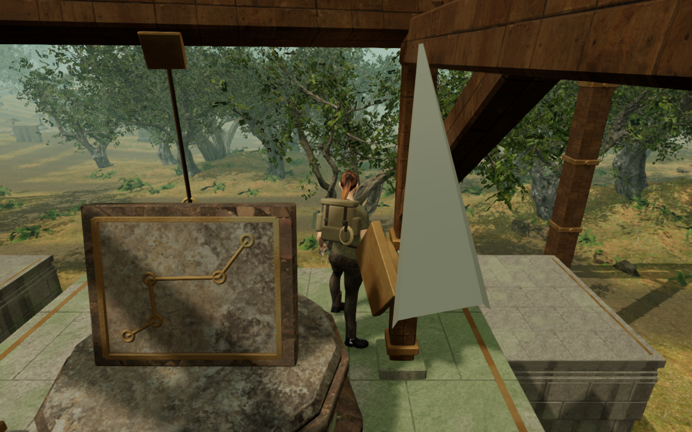
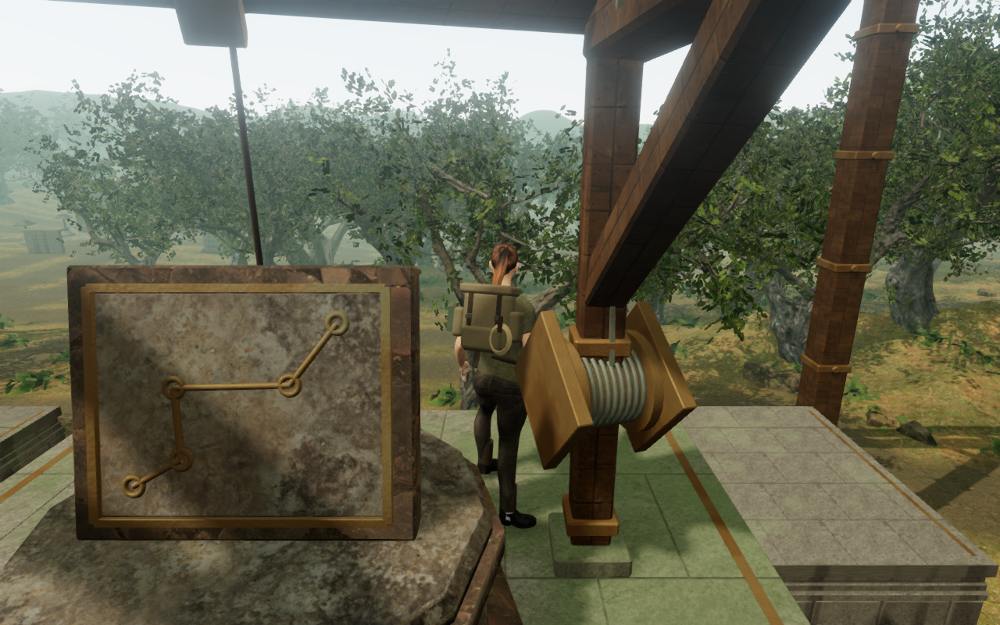
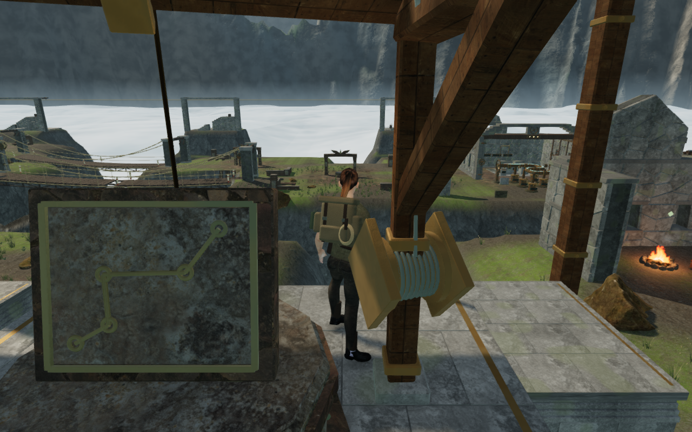
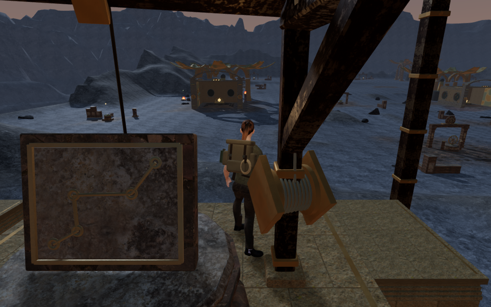

# Summit winch leads and camera clearance

A wider review of all 21 climbing courses exposed large silver triangles in
four summits' reading and boarding views. These were the 25 mm winch leads seen
very close to the lens. Their thin dimensions excluded them from the camera's
usual surface filter, even though their long diagonal spans cross the summit
follow-camera path.

Actual rendered-triangle measurements reproduced the problem at eight saved
route positions in the jungle, coastal, cloud-city and meridian chapters.
After sixty normal camera updates, the steel lay only 6.6–9.1 cm from the lens.
Four boarding views also had steel across their central body ray within 22 cm
of the camera. The defect remains in a settled view; it is not just a single
moving frame.

The 21 long leads now contribute their oriented bounds to camera collision
before architecture batching. Their geometry, materials and world positions
are retained. The normal length filter still applies to the short lead beside
each drum. Capturing both leads with the small-part override caused three
close boarding views to retract to a few centimetres; that candidate was
rejected before publication.

The final replays retain the same feet, chosen yaw, pitch and field records.
Normal camera response clears the eight affected views, leaving the nearest
steel 28.47–30.10 cm from the lens and no central steel intersections. All 42
saved summit-view replays across the eight chapters retain camera arms of at
least 3.278 m, with no recorded browser errors or warnings. The eight baseline
and all 42 final settled-view captures are reviewed.

The construction regression rotates three observed reading and close boarding
positions through all 21 courses. It measures the actual merged fixed-steel
triangles independently of the camera bounds, requiring at least 28 cm of
clearance and a 3.2 m camera arm in all 63 views. Its original-code negative
control reproduced insufficient clearance in all 21 first-position views.

All 782 campaign checks pass in four bounded batches, accounting for every
one of the 122 test files exactly once, with no failures, cancellations or skips.

The production build passes in 19.37 seconds with the existing bundle-size
advisory. Six native production cases cover keyboard/High at 1280 × 800 and
touch/Low at 540 × 900. Four reading cases in the affected chapters exercise
manual look, crouching and movement on the summit; two cloud-city cases board
the return trolley and land at its expected ground exit. All retain health 100,
other progress and previously revealed map cells.

Complete-store reloads retain the saved state apart from chapter timestamps
and six arrival-camera adjustments. Each adjustment is independently checked
against the actual scene and existing arrival policy: the preceding obstructed
arms measure 2.608–2.946 m, and the selected clear arms measure 5.372 m.
A second stable reload matches the complete store apart from timestamps.
All twenty native captures are reviewed; movement and landing captures include
the ordinary pause-panel opening used to inspect the saved state.

These cases use keyboard or DOM/CDP touch input without a development game
handle. Loaded JavaScript and CSS match the final production build, with no
failed resources, browser errors, warnings or page overflow. Existing positioned
winch sounds and quiet themed music are retained; this pass adds no subjective
listening evidence.

Before: the original follow camera settles beside the diagonal lead.

After: the same feet and chosen look retain a clear foreground through the
ordinary camera response.

These four images are lossless WebP conversions of actual game captures;
decoded RGBA pixels and dimensions match the originals exactly.

The preceding wider course review completes all 21 assisted crossings through
the two initial mantles, jump gap, rope catch/release, summit and animated
return cable. All 432 captures are reviewed. Its approach and return walks
have five navigation exceptions under investigation. Larger bounded searches
complete several winding routes, while the cloud-height fixture needs to
respect raised bridge support. This evidence does not establish 21 complete
continuous approach/crossing/return routes.

This pass also recorded snow and crystal summit views with a post or winch in
front of the explorer, despite a clear camera arm. The subsequent
[regional cable-terminal repair](climbing-terminals.md) addresses those six
recorded standing views and the sheave/frame intersections at both cable ends.
Repeated course forms, continuous campaign routes and subjective audio/device
acceptance remain open in the [visual audit](visual-audit.md). These scoped
repairs do not establish AAA graphics, consumer-device performance or human
playthrough quality.
