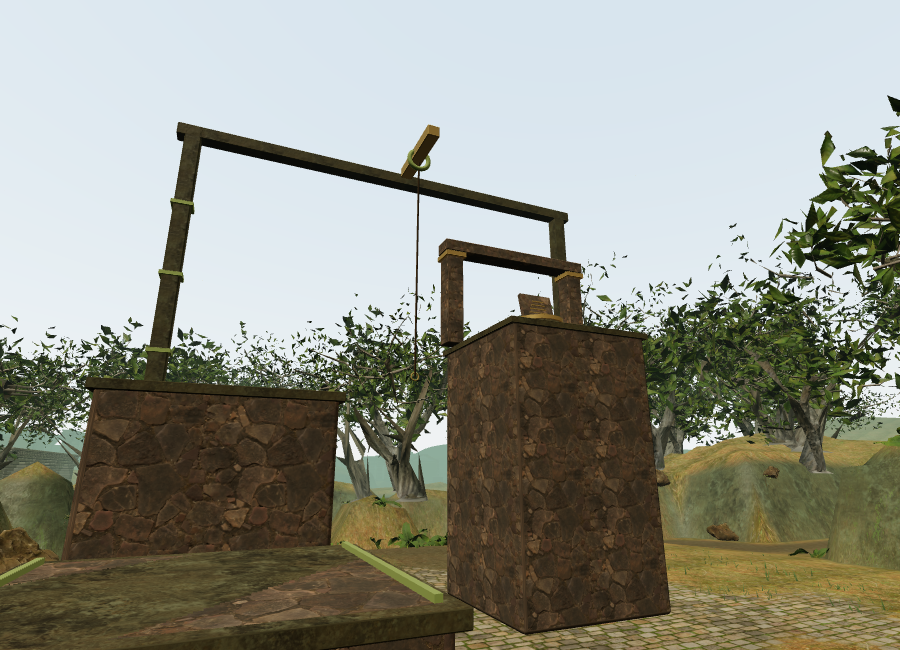
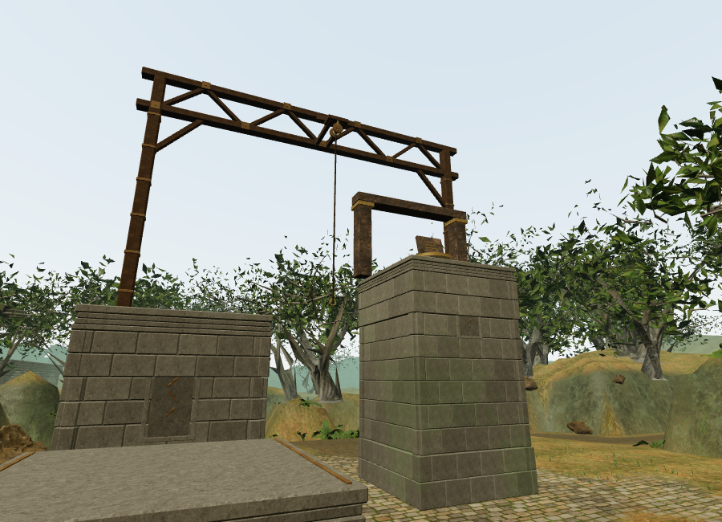
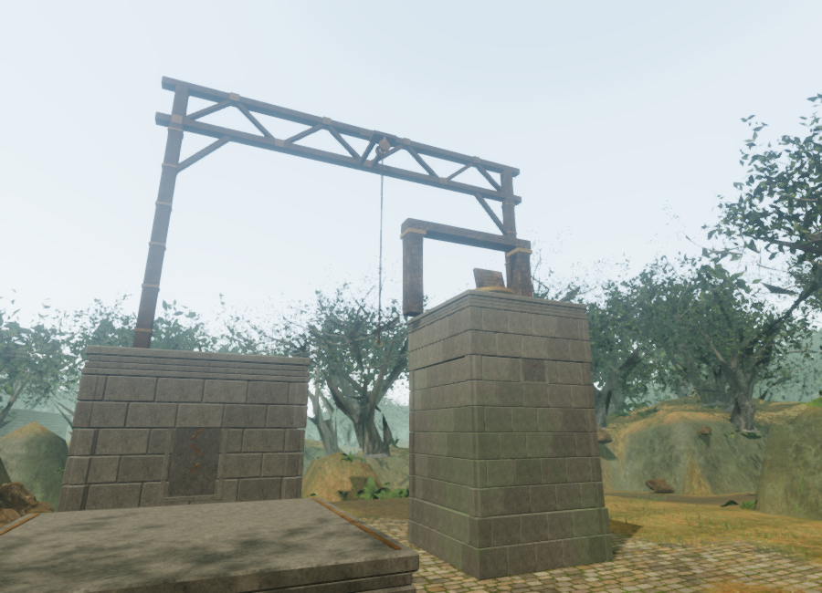
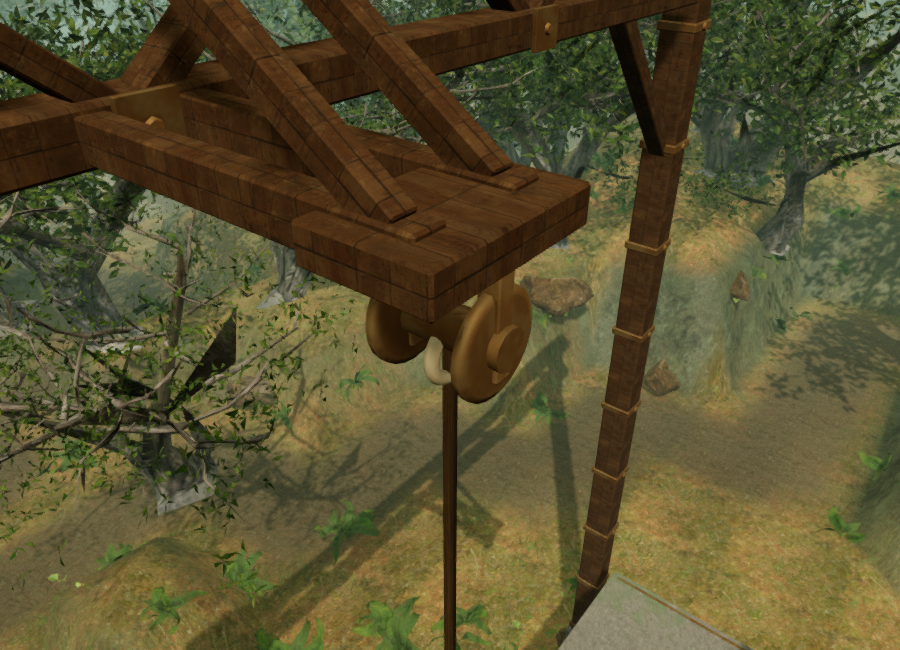

# Climbing piers and rope hoists

The campaign's 22 elevated field routes now use fitted masonry piers and braced
hoist frames. The previous tall textured boxes and single crossbar have been
replaced by bonded stone courses, recessed panels, stepped cornices, flat
capstones, bronze ledge marks, timber or iron posts, straps, fasteners, two
crossbeam chords and a triangular truss. Paired stays support the forward rope
anchor. A crosshead carries fixed bearing cheeks; the suspended eye swivels
about their axle to follow the pendulum direction.

Eight construction profiles vary stone course size, recess depth, cornice bands
and frame materials. The jungle uses the sanctuary's weathered temple stone;
other chapters retain their existing regional masonry. Wooden frames use the
locally bundled monastery timber; the forge, caverns and observatory use the
existing metal texture set. Bronze fittings share the wind mechanisms' patina
and casting-grain material, with surface coordinates retained through batching.
All new geometry is original code-built work and
requires no additional downloads or attribution changes.

The five ledges in each route retain their planned locations and support heights,
along with the same jump gap, swing pivot, rope length and return cable. The top
slab has an exact flat surface at the physical landing height. A separate solid
camera envelope spans each pier's mortar joints, and captured beam bounds follow
their actual orientation. Fixed masonry, frame members, small fittings and the
moving yoke are batched by material. Tall piers use a bounded number of stone
courses; the delivered art tests cap each route at 180,000 vertices.

Each hoist now has a world-positioned rope-friction loop at its anchor. The loop
follows angular speed, fades linearly from 2 to 28 metres and goes silent below
the resting threshold. It uses the soundscape's existing HRTF positioning,
occlusion and shared twelve-loop limit. Existing occasional anchor creaks,
positioned cable-ride sounds and the quiet climbing music arrangement remain
active.

The hoist has its own synthesized friction bed with energy throughout the loop,
so a short movement does not begin inside a long silent interval. The physical
motion envelope controls its silence at rest. A half-second window test checks
the entire normalized buffer for finite samples and adequate signal energy.

## Verification scope

The added geometry tests cover all 110 pier tops in all eight chapters, finite
mesh data, bounded geometry and batches, solid camera envelopes, and alignment
of every swiveling eye with five pendulum angles. Ray probes verify that the rope's
swept path clears the fixed frame. Sound tests cover motion, rest and removal of
the previous chapter's source references.

The full suite passed 279 tests before the final bearing and friction-bed
refinements. All 14 affected construction, traversal and sound tests passed after
those refinements, including the new continuous-energy test. The final production
build passed with its existing large Three.js chunk advisory.

The final HRTF audio render measured RMS levels of 0.00062961 at 2 m,
0.00031480 at 15 m and zero at 29 m: exactly half amplitude at the midpoint.
This is signal evidence, not a subjective listening evaluation.

The full browser worlds completed all 22 routes through their five ledges, jump
gap, swinging rope and unlocked return cable. All eight Performance-quality
views linked their shaders without failed assets or console warnings/errors.
The following whole-scene workloads were observed at 900 × 650; they include
surrounding architecture, terrain and effects and are not device frame rates.

| Chapter | Routes exercised | Draw calls | Submitted triangles |
| --- | ---: | ---: | ---: |
| Jungle | 1 | 364 | 947,417 |
| Desert | 2 | 426 | 637,316 |
| Snow | 5 | 279 | 787,041 |
| Coast | 2 | 284 | 546,474 |
| Forge | 1 | 61 | 119,826 |
| Cloud city | 5 | 651 | 1,595,061 |
| Caverns | 4 | 539 | 635,102 |
| Observatory | 2 | 42 | 120,888 |

After the final crosshead and bronze refinements, the jungle view submitted
355 calls / 947,189 triangles in Performance and 1,379 calls / 4,834,951 triangles
in High. The High bearing view submitted 1,019 calls / 3,801,534 triangles. The
High views include shadows and post-processing; these ANGLE/SwiftShader workload
figures do not establish playable performance on consumer hardware.

The same jungle approach before the change, followed by the final Performance
and High versions, and the final bearing close-up:

The browser inspection helper is `scripts/inspect-climbing-browser.js`. Its route
exercise uses the delivered world and movement simulation, while setting field
progress and initial player positions for known routes. These checks do not
measure human route difficulty, chapter pacing or supported-hardware frame rates.

An instrumented browser chapter load released all nine observed geometries, six
materials and nine textures used by the jungle course. The next chapter retained
no old climbing-material object, jungle course, source or active voice.

An assisted source-selection check at a desert rope position selected the hoist
at 11.03 m with gain 0.01948, no obstruction, and one voice within the shared
twelve-voice limit. Setting its motion to rest removed that voice. The audio
context was suspended and its spatial-update clock was advanced explicitly for
this selection check; the separate offline render above verifies its signal.

In the final High production build, native W and Space recorded the first secure
ledge. The later paused position was just beyond its edge. Reloading returned to
the ledge centre at x 270, z 274 and height 2.8, as the existing traversal recovery
rules specify. All other chapter fields except the last-played timestamp matched
exactly, including 93 health, field progress and 448.2752 seconds of recorded
active wall time; settings also matched. The software-rendered interaction check
was slow and its elapsed time is not human playthrough evidence. No development
hook, failed assets or console warnings/errors were present. The checked release
bundles were `index-DSmw2Vws.js`, `game-xscqdGZt.js`, `three-0KZjNg1c.js` and
`index-CwPoLOYg.css`.
Temporary browser test saves were cleared and High quality restored on both
development and production launchers.

The construction improves the climbing routes' presentation. The campaign's
roughly one-hour chapter duration remains unverified, and its real-time graphics
remain below the requested AAA target.
