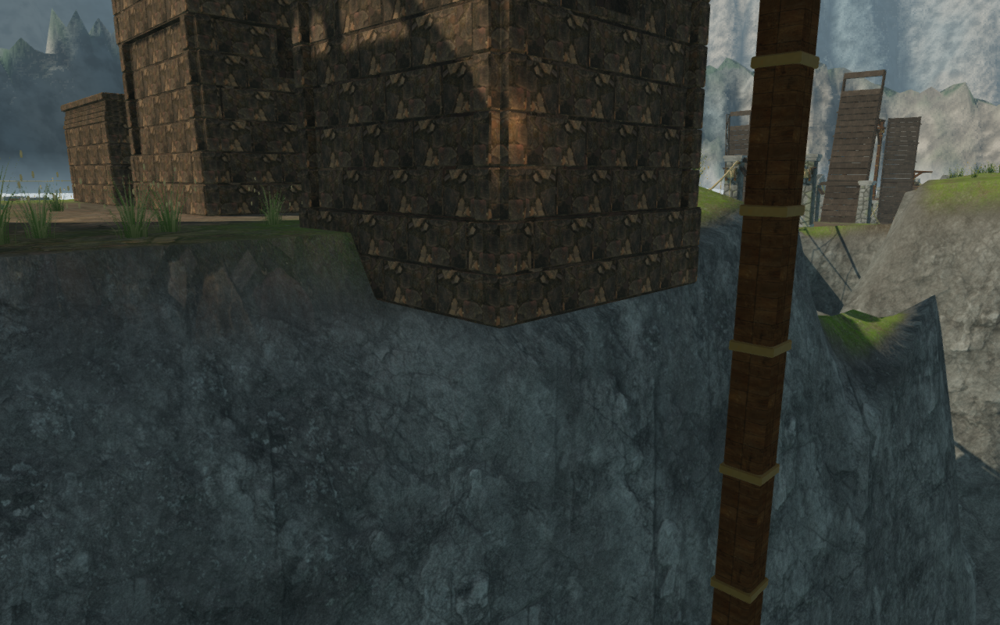
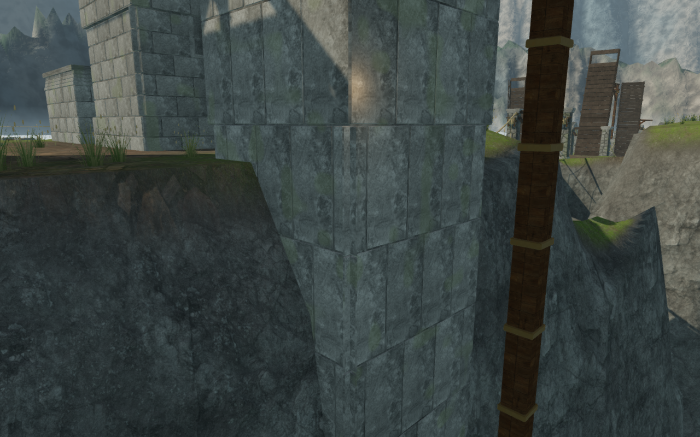
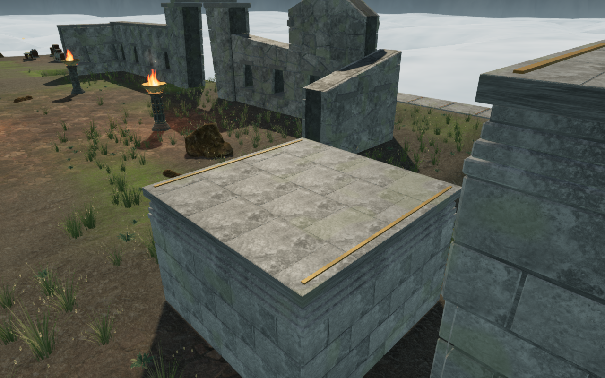
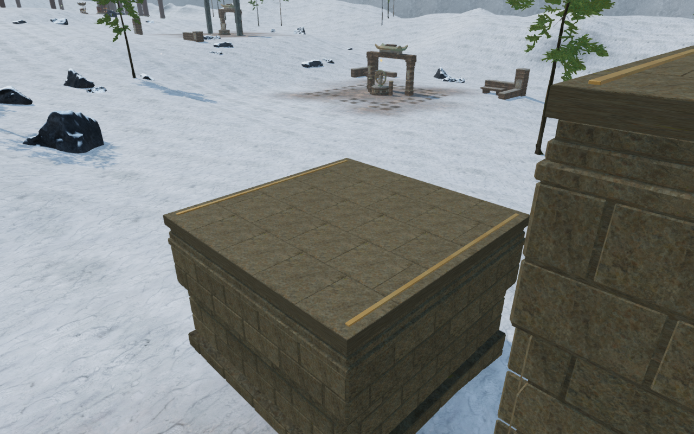

# Supported climbing roofs and grounded piers

The 21 climbing courses share five masonry ledges each. Their large chamfered
capstones had flat centers, but the physical standing squares extended beyond
the cap edges and corners. An actual browser audit of all 105 roofs found 420
empty corner rays and 4,620 differences larger than 15 mm across 17,745 probes.
The largest nonempty difference was 589.8 mm. The existing construction test
checked nine inner points and did not cover these edges.

Each roof now has individual bonded paving flags over a continuous square bed.
The flags have flat tops, tapered lower edges, metric texture coordinates and
subtle tone variation. Narrow joints sit 5 mm below the original standing
height. The full physical footprint remains covered.

Center-only pier placement also left undersides exposed above slopes. Across
2,625 actual lower-footprint rays, 92 sampled gaps exceeded 15 mm. The largest
was 8.845 m on the cliffward side of the later cloud-city course. Pier courses
and closed backing now extend 18 cm below the lowest vertices of every terrain
cell touched by the full footprint. Forty-two ground hoist bearings receive
the same complete-cell fitting, with closed cores and individual lower courses.
Finite low-bearing camera envelopes survive batching.

The climbing masonry now matches its surrounding chapter architecture:
jungle sanctuary stone, desert sandstone, mountain monastery stone, tidal
palace marble, volcanic foundry paving, cloud granite, wet cavern rock and
observatory stone. Existing material maps and shader treatments are retained.
Course sizes, top elevations, jump gaps, rope pivots, lengths and return cables
retain their existing plans.

The roof flags use simple closed geometry. Wall ashlars retain their exposed
chipped fronts and bevels; their buried rear faces are discarded against the
closed backing. All courses remain below the existing 180,000-vertex budget
and keep bounded material batches. Wall and coping bearing regressions verify
that the remaining joints do not open through the construction.

The final scoped construction run passes all 21 checks across climbing art,
furnished stations and delivered-character mantles. It includes 46,305 complete
roof rays, 2,625 pier-foundation rays, 378 hoist-footing rays, 42 low-bearing
camera checks and the existing summit camera, rope envelope, joint bearing and
positioned friction-loop regressions.

The actual browser worlds pass all 17,745 roof probes within 5.002 mm.
All 2,625 sampled pier undersides are buried more than 15 cm; the 378 hoist
footing probes have no gaps above the 15 mm tolerance. All 47 baseline and
47 final High construction views are reviewed, with linked shaders and no
recorded browser warnings or errors.

All 780 campaign checks pass in four bounded batches. An explicit file-list
audit verifies that all 122 test files ran exactly once, with no failures,
skips or cancellations. The production build passes in 34.34 seconds with
the existing bundle-size advisory.

Two completed browser batches exercise all 21 full climbing courses: both
initial mantles, the jump gap, rope catch, safe release, far landing, summit
mantle and return cable. The normal collision and rope simulation remain
active. The helper bypasses prerequisite field work and known-answer deduction.

Eight native production cases revisit completed courses: four keyboard/High
cases at 1280 × 800 and four touch/Low cases at 540 × 900. Native movement and
Jump reach the first roof in each chapter; roof reloads retain the exact
supported position. Crouching, manual camera turns and native backward descent
work, followed by a departure reload and a second stable reload. Completed
courses intentionally retain the roof through the saved position and omit an
active safety-line checkpoint. All other stored progress is retained, health
stays at 100, and previously revealed map cells remain. Camera angles survive
each reload without an arrival correction in these cases.

The delivered JavaScript and CSS resources match the final build. The cases
have no development hook, failed resources, browser errors, warnings or page
overflow. All 56 final production captures are reviewed; the manual-view
captures include the normal pause panel opening transition.

The later cloud course before the repair. The stone shell ends above the cliff.

The same observer after the repair, with terrain-fitted granite below the
original roof. Both captures use the same camera and target.

Individual bonded flags and a complete joint bed on a cloud-city roof.

The mountain course now uses its surrounding monastery stone. All four images
are lossless WebP conversions of actual construction captures, with decoded
RGBA pixels and dimensions verified identical to the originals.

These are assisted construction and traversal checks, with disposable progress
used to open routes and remove guardians. They do not establish full human
campaign playthroughs, consumer-device performance, subjective sound quality
or AAA graphics. Wider chamber composition, continuous eight-chapter routes
and listening/device acceptance remain open.
