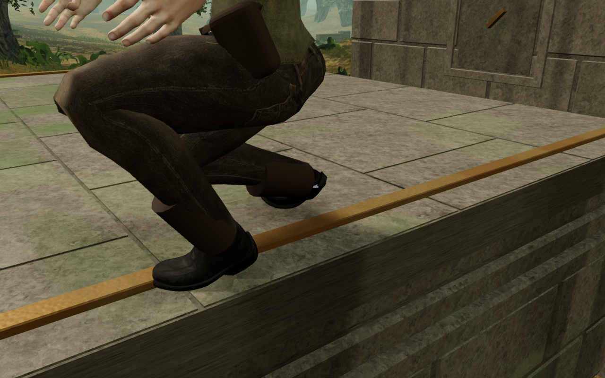
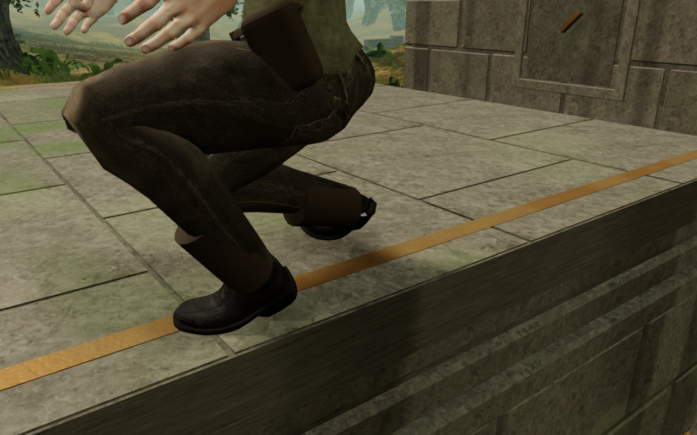
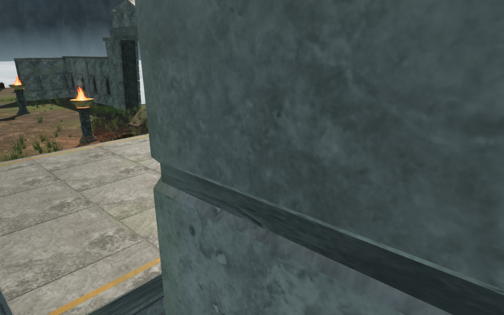
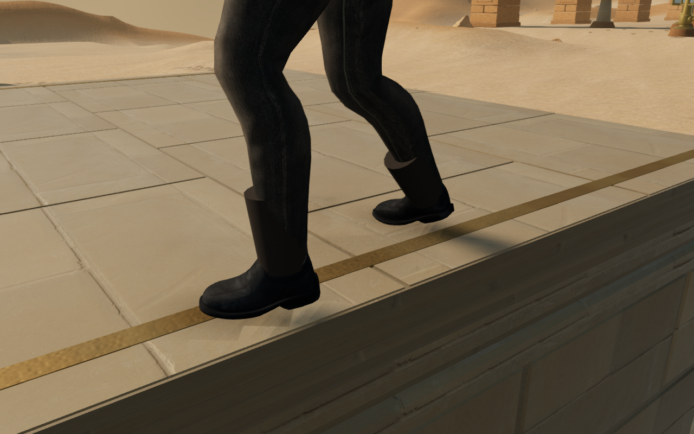

# Climbing ledge markers and boot contact

The 105 climbing ledges have two bronze edge markers each. Their old upper
faces stood 20.5 mm above the physical roof. An independent check of the
delivered character found eight deeply embedded crouched poses across the
eight chapters, with penetration reaching 18.275 mm. Actual browser poses
confirmed the same defect.

All 210 markers now sit in the full paving bed. Their lower faces meet the
joint floor 5 mm below the roof; their upper faces stand only 2 mm above it.
They retain their existing width, length, position and weathered metal.
Closed box geometry makes the inlay flat, and the original construction
seed sequence preserves all subsequent stone pieces. This change retains
the course plans, physical roofs, controls and saved positions.

The construction regression traces 13,860 actual top and bottom rays across
every marker. The complete 22-check climbing, station-solid and mantle run
passes, including existing bounded geometry, rope and furnished-landing checks.

The independent delivered-model check samples 128 poses: four edge offsets,
two headings and both standing and crouching in each chapter. Sixty-four
poses place sampled sole vertices over the markers. All now clear them; the
closest measured clearance is 0.467 mm. Eight actual browser worlds confirm
standing and crouching contact at the observed edge position, with more than
100 sampled sole points in every pose and no recorded errors or warnings.
All 32 before and 32 after construction images are reviewed.

A separate animated-model check samples 3,072 stride frames in both directions
over the marker line, using the normal 6 m/s gait and 2.2 m/s crouched gait.
It traces the actual marker geometry for all outsole points whose horizontal
positions can overlap the inlay. The 1,582 sampled frames meet the existing
15 mm contact tolerance; the largest shallow overlap is 1.191 mm. This is a
delivered-animation contact check, rather than a continuous browser route.

All 781 campaign checks pass in four bounded batches, with all 122 test files
accounted for exactly once and no failures, skips or cancellations. The
production build passes in 25.83 seconds with the existing bundle-size advisory.

Eight native production cases revisit completed courses, with four keyboard
cases on High at 1280 × 800 and four touch cases on Low at 540 × 900. Crouched
backward walks travel at least 1.65 m along the marker, then standing forward
walks return at least 1.975 m. All stay on the same marker line and roof, with
health 100. Movement retains other progress and every previously revealed
map cell. A midway reload, return reload and second stable reload preserve the
complete saved store apart from chapter timestamps and the documented moving
position, time and map reveal. The final cases need no arrival-camera correction.

The cases use ordinary keyboard or DOM/CDP touch input, without a development
hook. The loaded JavaScript and CSS match the final build, with no failed
resources, browser errors, warnings or page overflow. All 40 final production
captures are reviewed; walk-end captures include the normal pause-panel
opening transition used to inspect the saved position.

Before: the marker intersects the jungle explorer's crouched outsole.

After: the same pose and observer view clear the fitted inlay.

The cloud granite ledge retains its regional paving and bronze path markers.

The sandstone ledge uses the same shallow marker construction.
These four images are lossless WebP conversions of actual game captures;
decoded RGBA pixels and dimensions match their originals exactly.

Construction observers and disposable completed-course saves provide scoped
geometry evidence. They do not establish continuous human campaign
playthroughs, consumer-device performance, subjective audio quality or AAA
graphics. Wider course composition, continuous eight-chapter routes and
listening/device acceptance remain open.
