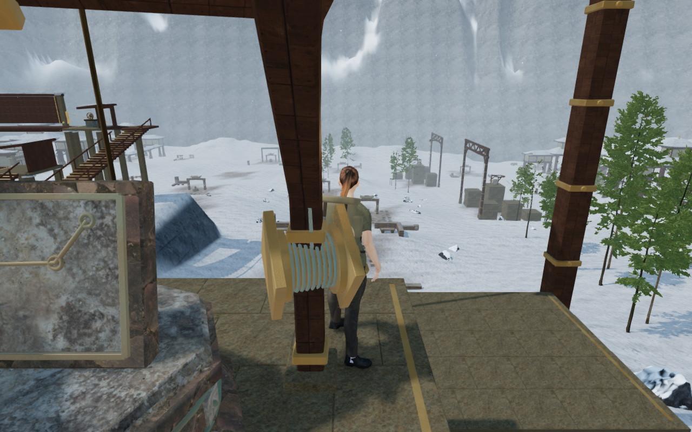
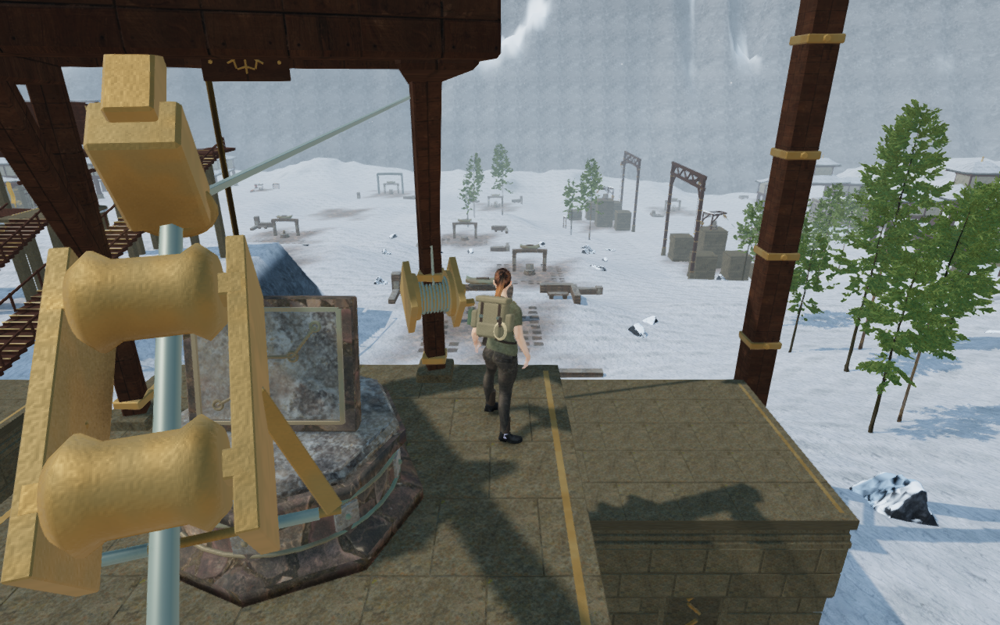
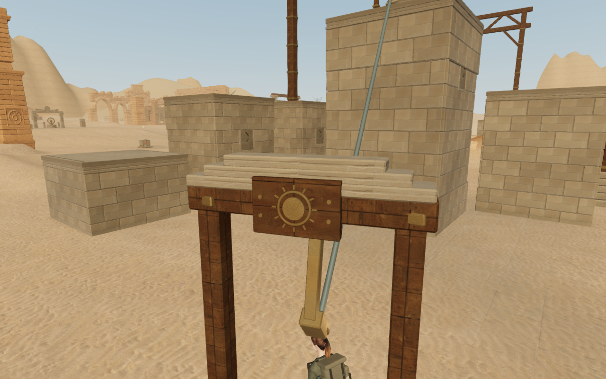
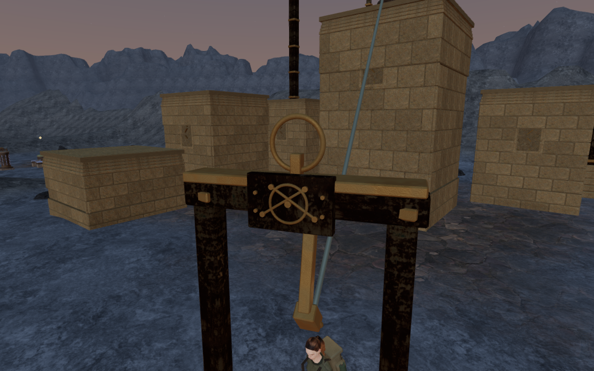

# Regional cable terminals and working clearance

The return-cable frames repeated the same low hoist construction across all
21 climbing courses. In six recorded snow and crystal summit views, the post
and winch hid much of the explorer even though the camera arm exceeded 3.2 m.
At both ends of every cable, parts of the trolley's sheaves also intersected
the fixed terminal frame.

The upper posts and winch now sit farther back on the supported summit roof.
Stayed arms connect them to higher crossheads, leaving the reading and boarding
edge open. The steel cable extends 65 cm beyond each trolley stop, so both
sheaves remain on steel while clearing the anchor clamp. The explorer's launch,
exit, ride height, travel time and saved traversal records retain their existing
behavior.

Both terminals now have regional header construction and backed bronze marks:

| Region | Header and mark |
| --- | --- |
| Canopy | Timber cap, curved corbels and botanical relief |
| Sands | Three sandstone courses and a radiating sun |
| Snow | Gabled frost cap and branching snowflake |
| Coast | Rolled metal cap and shell relief |
| Embers | Riveted iron flanges and an anvil mark |
| Clouds | Stepped granite and feather relief |
| Crystal | Three faceted mineral inlays and quartz marks |
| Meridian | Supported circular crest and constellation relief |

The new pieces retain fitted camera bounds through material batching. The
rotating drum and crank also retain their individual moving bounds. Physical
winch clearance contains the complete crank sweep; elevated solids leave the
space beneath them open. Lower post footplates extend below the terrain under
their actual footprints. The winch sound emitter follows the revised machine
position, with the existing distance range, gain and motion gating.

The original geometry observer found 4,609 of 16,800 sampled sheave vertices
inside fixed terminal primitives, with intersections at all 42 cable ends.
The revised regression samples both delivered sheaves at 33 positions on each
of the 21 paths: all 277,200 vertices clear the actual fixed construction.
Bounds only prune the search; two-sided, deduplicated triangle crossings test
whether each vertex is inside an individual primitive. Intentional contact with
the steel cable is excluded from this frame-intersection check.

The six recorded snow and crystal standing poses retain their feet and chosen
look angles. After ordinary player, decoration and camera updates, each has
zero blocked sampled body sight lines, compared with eleven of twenty-one
before the change. All six baseline and six final images are reviewed. The
construction regression rotates three reading positions through every course,
checking 1,323 body sight lines through the rendered static terminal geometry.
This samples body coverage; it does not measure penetration of the character's
skinned mesh.

Other regressions check the complete rotating crank sweep at 24 angles per
course, finite physical clearance, existing legal reading feet, and 4,914
underside rays plus the actual lower-facing footplate vertices. The terrain
fixture uses the same receiver-dependent ground-height method as the game,
covering the callback binding required by lower footplate construction.

All 84 baseline and 84 revised terminal observers are reviewed: both ends of
all 21 courses on High and Low. Sixteen closer views also cover the eight
regional caps and carvings on both settings. Their assigned construction
cameras retain the same observer geometry; these are not continuous playthroughs.
The actual browser worlds complete all 21 assisted climbing routes through the
two initial mantles, jump gap, rope catch/release, summit and return cable. The
public route helper now uses the normal player update during cable travel,
including the delivered animation, rather than advancing traversal alone.

All 786 campaign checks pass in four bounded batches. The run accounts for
all 122 test files exactly once, with no failures, cancellations or skips.
The production build passes in 3.07 seconds with the existing bundle-size
advisory.

Ten native production cases cover keyboard/High at 1280 × 800 and touch/Low
at 540 × 900. Eight regional reading cases exercise manual look, crouching and
brief supported movement; two cloud-city cases board the cable and reach its
expected ground exit. All retain health 100, other progress and previously
revealed map cells. Complete-store reloads retain the saved state apart from
chapter timestamps and eight arrival-camera adjustments. Each adjustment is
independently checked against the actual world and existing policy: obstructed
arms of 3.320–3.348 m become clear arms of 5.372 m. A second stable reload
matches the complete store apart from timestamps.

Two older snow/crystal saves placed inside the revised post/winch clearance
recover 1.5 m onto their supported summit roofs. Independent actual-world
checks confirm the original feet are blocked and the recovered feet are legal
at the retained 8.4 m elevation. Other stored progress is preserved; the second
reload matches the complete store apart from timestamps. All 36 native images
are reviewed. Movement, landing and initial recovery captures include the
ordinary pause/dialog panels used to inspect saved state.

These production cases use keyboard or DOM/CDP touch input without a
development game handle. Loaded JavaScript and CSS match the final production
build, with no failed resources, browser errors, warnings or page overflow in
the ten motion/boarding cases. Existing themed music is retained. Relocating
the winch retains its tested emitter behavior; this pass adds no subjective
listening evidence.

Before: the settled camera is clear of steel, but the fixed machine covers the
explorer at the recorded reading feet.

After: ordinary follow-camera response retains a clear view of the explorer.

These four images are lossless conversions of actual game captures. Decoded
RGBA pixels and dimensions match their originals exactly.

Wider landscape composition, repeated course forms, complete continuous routes
and subjective sound and consumer-device acceptance remain open in the
[visual audit](visual-audit.md). These construction and assisted route checks do
not establish AAA graphics or human playthrough quality.
