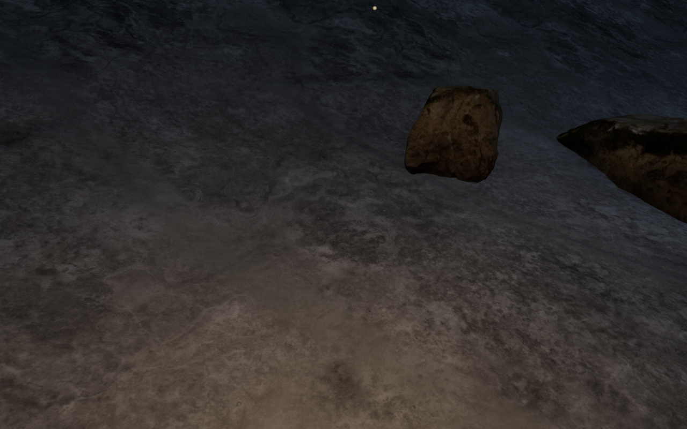
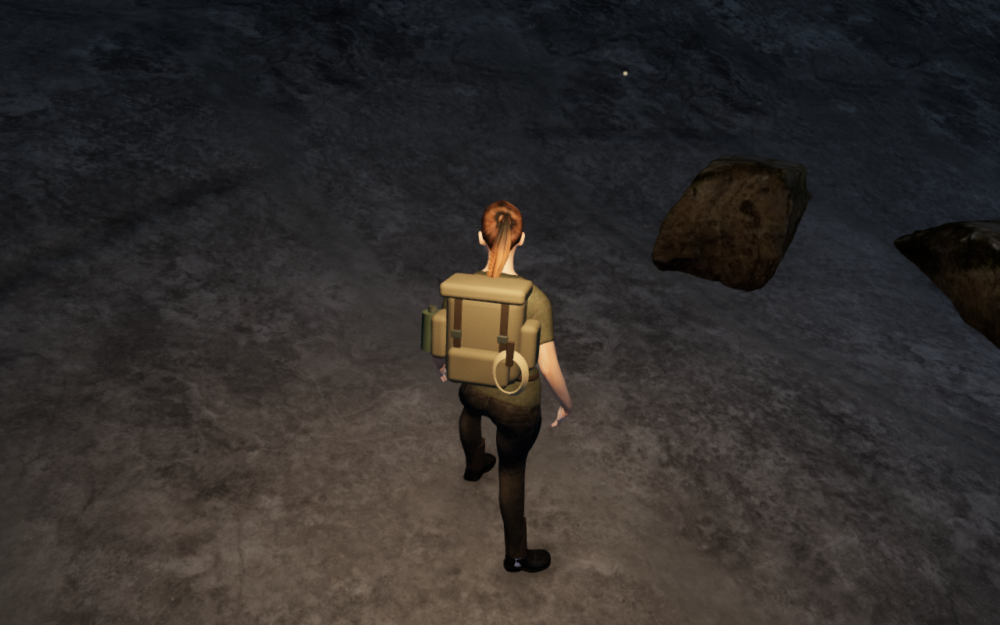
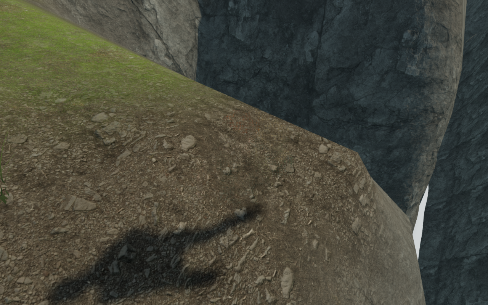
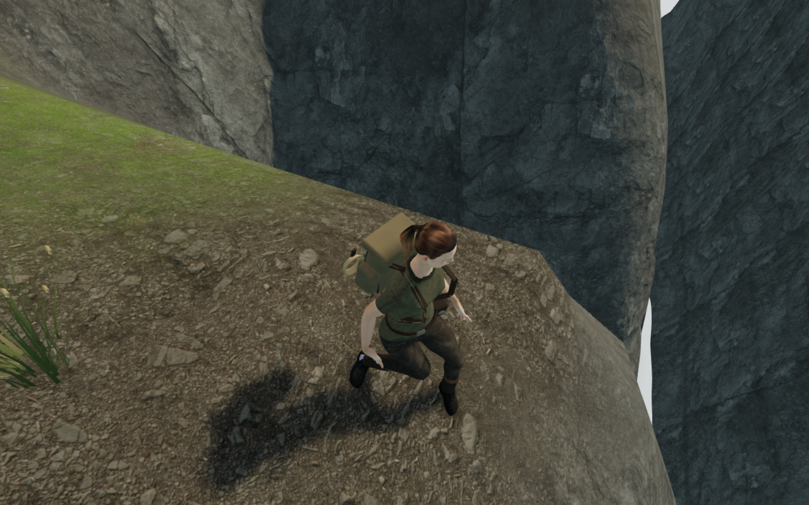
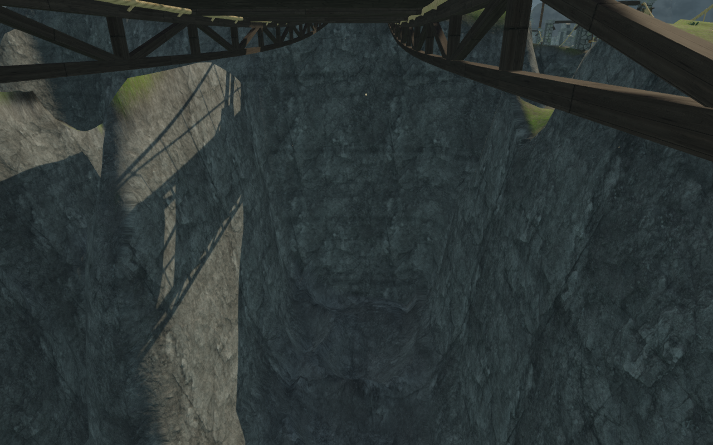
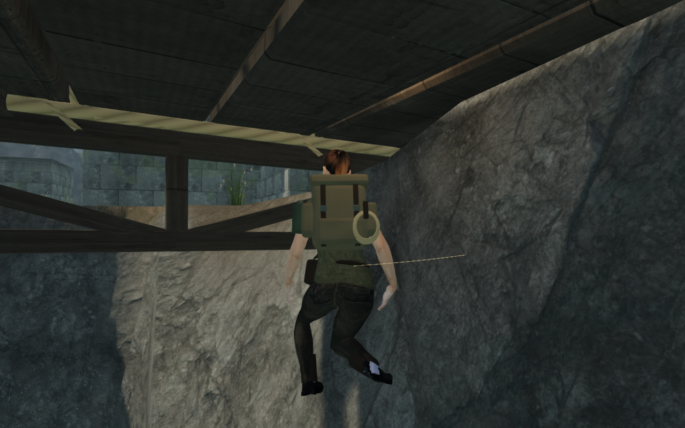
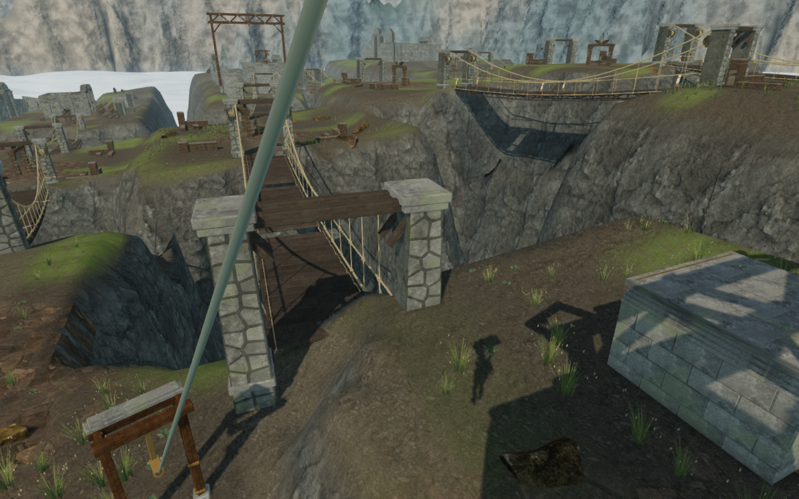
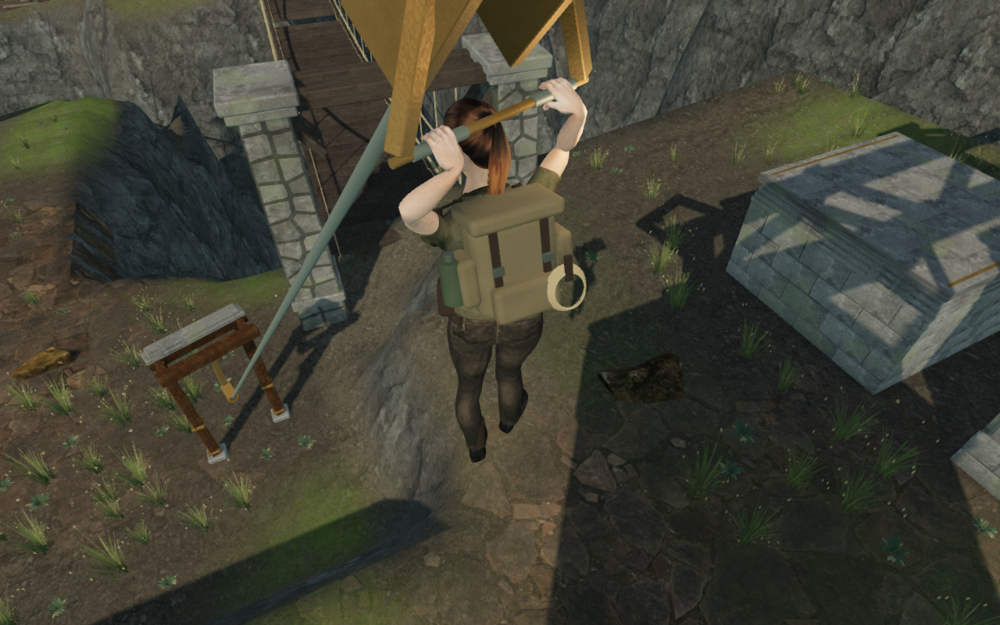

# Climbing approach and return-cable cameras

Continuous climbing loops exposed 24 camera updates that faded the explorer:
five on a crystal approach, two beside a cloud bank, twelve during a cloud
return-cable ride and five while returning beneath a bridge. These are separate
from the previously repaired [coastal approaches](coastal-walking-camera.md).

The crystal and cloud-bank turns need side views beyond the previous 1.5-radian
search. The recovery now searches up to 2.1 radians after the smaller neighborhood
fails. Beneath the recorded bridge, no comfortable 3.2 m ray fits the tested
neighborhood; a safe 3.175 m view exists. The search retains legal 2.2–3.2 m arms
as a fallback after looking for a longer view. Return-cable rides now use this
recovery too: their recorded obstructions have clear nearby pitch alternatives.

Every candidate still passes swept camera bounds, terrain and map checks.
Collision response retains the player's position and selected yaw/pitch.
Ordinary views above the comfortable distance and the existing aiming, water,
climbing and rope modes keep their previous follow behavior.

Eleven complete assisted loops pass on the revised runtime. Each uses one
supported initial placement, then normal controller movement through its
approach, mantles, jump gap, rope catch/release, summit, animated return cable
and ground return, without resetting position or progress between legs.
Across 22,583 camera updates there are no camera fades. All 347 final route
captures are reviewed. These are completed-expedition backtracking fixtures;
enemy AI and combat are not advanced. They do not establish a human campaign
playthrough or full visual acceptance.

Separate replays of all 24 recorded faded positions pass after one revised
camera update. Each retains controller feet, selected yaw/pitch and progress,
full camera opacity, an arm of at least 2.2 m with floating-point tolerance,
a legal camera position and a clear center ray against camera bounds. Walking
replays settle an idle pose; cable replays use the actual moving trolley and
grip pose. All 24 baseline and 24 final replay images are reviewed. A fresh
chapter load before the below-bridge poses removes preceding cable-animation
carryover. These checks do not measure full-body terrain penetration.

All 791 campaign checks pass across all 122 test files, with no failures,
cancellations or skips in the completed runs. One interrupted test group was
rerun to completion. The production build passes with the existing bundle-size
advisory. Four new camera regressions cover the delivered crystal and cloud
terrain, the deployed bridge and cable-mode recovery. The three recorded
walking cases check 120 updates each, legal camera positions, unobstructed
center rays against camera bounds, retained feet and chosen look.

Five native production cases pass: crystal and cloud-bank keyboard/High walks,
a cloud-bank touch/Low walk after bridge save recovery, and keyboard/High and
touch/Low boarding of the affected return cable. The walks exercise manual look,
crouching and brief grounded movement; both cable cases reach their grounded
exit. All retain health 100, progress and previously revealed map cells. Reloads
retain the complete store apart from timestamps and arrival corrections; the
second reload is stable. All seventeen native captures are reviewed. Loaded
JavaScript and CSS match the revised build, with no failed resources, browser
errors, warnings or page overflow.

A save beneath the bridge invokes the existing recovery policy: it resumes at
the nearest bank, 4.830 m from the recorded feet. Actual-scene queries independently
reproduce the bank position and the existing default heading after relocation.
The recorded arrival camera is a clear 5.334 m view. Three separate saved-angle
corrections are also independently proved: their preceding rays are too short
for the existing arrival policy, which selects the recorded clear 5.372 m views.
This native touch case exercises movement at the bank. It is not a native-input
check beneath the deck.

The remaining route composition, body/terrain contact, broader campaign routes,
subjective listening and device acceptance are still under review. Full camera
opacity and a clear center ray do not establish full-body visibility or absence
of skinned-model intersections.

Before images are captured moving frames. After images are stationary camera
replays at the recorded controller feet and look, with the pose setup described
above. They demonstrate camera response; they are not animation-identical pairs.

The subsequent [bridge approach-step repair](bridge-approach-steps.md) addresses
the body-contact issue observed during this camera review. Its normal-controller
walk and rendered sole queries identify and repair the bank-to-deck support
mismatch. Wider visual acceptance remains open.
