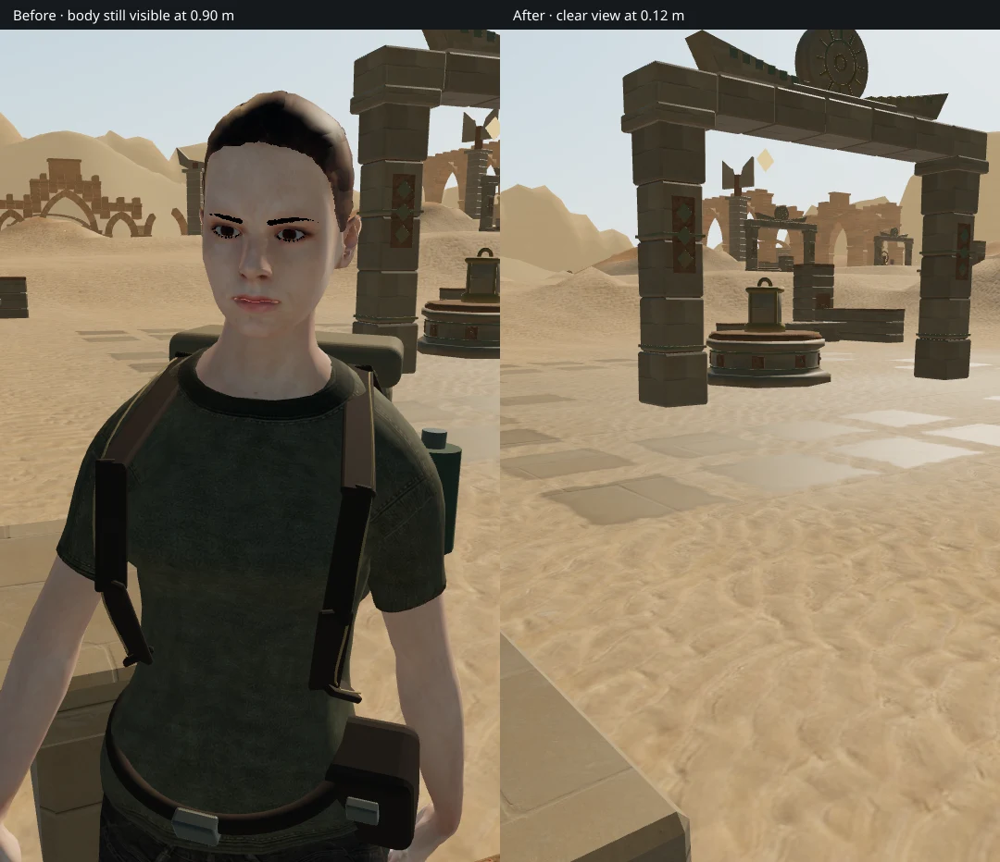
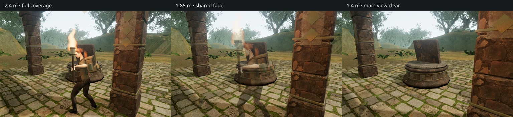

# Camera framing beside walls

Backing toward a courtyard pier could leave the explorer's face and torso
covering the view until the camera was less than 0.85 m from its target. At very
short distances, smoothing the camera's world position could also swing the
view sideways as the player slid along the wall.

The camera now follows player translation more directly as an obstruction
shortens its orbit. Both existing clearance sweeps remain active, and outward
recovery is damped. Ordinary movement keeps the player's chosen yaw and pitch.
Arrival still uses the separate saved-view clearance policy.

The explorer, equipment, weapon and carried flame fade together between 2.2 m
and 1.5 m from the camera target. At closer distances they leave the main view
clear. A common ordered pixel mask keeps overlapping body and clothing meshes
opaque at the same pixels, avoiding exposed eyes, teeth or inner clothing.
It can be seen in still frames during the short transition, especially on Low.
The normal shoulder aiming distance retains full character coverage.

The comparison uses the same player position, yaw, pitch and input frame. On
the left, the former camera is 0.90 m from its target with the body still fully
visible. On the right, the corrected view is 0.12 m away and body coverage is
zero. Both are direct browser renders from the reproduced wall slide.

## Lighting, equipment and special views

The fade leaves the explorer's physical shadow intact. A partially faded actor
is excluded from the contact-shading override so it cannot leave a full opaque
silhouette over the environment. Water reflections temporarily draw the full
character, then restore the main-view coverage even if capture fails.

The torch has an independent fire material while sharing the live animation
clock with world flames. Fading it cannot fade stationary fires. Its actual
flame position still supplies the light and environmental audio emitter;
visibility does not extinguish it. Combat and other actions that need both
hands retain their normal torch behavior.

Survey scopes continue to hide the explorer. Entering a focused instrument view
clears ordinary follow history; leaving it restores normal camera following.
Crouching lowers the target as before, and aiming still uses the actual camera
sightline.

These three High-setting material fixtures place the camera at 2.4, 1.85 and
1.4 m. The torch, body and equipment share coverage; the positioned fire source
and its light remain active throughout. These are controlled rendering fixtures,
not a claim about a particular route or subjective sound quality.

## Verification

All **631 automated tests** pass with concurrency limited to four workers.
New regressions exercise a moving target beside a wall, full orbit recovery,
shared skin/equipment masking, existing material hooks, fire-material isolation
and the live flame clock. Reflection checks cover coverage restoration during
normal captures and render failure. The production build succeeds with its
existing large-chunk warning.

The assisted movement review runs **185 controller frames in each of eight
chapters**, alternating High landscape and Low portrait views. It backs toward
a courtyard edge, pauses, walks away and settles. Player yaw and pitch remain
unchanged, health remains 100, and all eight views recover to approximately
5.35 m. Three routes enter the fade range: desert, crystal and eclipse. Their
short-arm heading deviations stay below 0.035 radians. The 35 route images were
reviewed in labeled sheets with close transitions also inspected at full size.

Additional browser checks cover:

- Six carried-fire fixtures across High and Low, verifying matched coverage,
  linked shaders, active positioned audio, light, animation and independent
  world-fire materials. The measured nearby fire voice gain stays 0.08887
  while coverage changes from one to zero.
- A native aimed shot that reduces a guardian's health from five to four;
  nearby standing, crouching, aiming and keyboard camera rotation.
- Survey-scope entry, instrument movement sound activity, cancellation and
  restoration of ordinary view state.
- A real coastal reflection capture that switches coverage from 0.5 to one
  and restores 0.5 afterward.
- Eight submerged-gallery fixtures: entrance, air bell, colonnade and memorial
  at High and Low. Each restores full coverage from a previously hidden body,
  keeps health at 100 and links all shaders. All eight images were inspected.

The final production bundle passes **ten native input cases**, five keyboard
and five touch, covering all eight chapters and two station interactions. All
retain health at 100. **Twenty reloads** retain every normalized save field
apart from timestamps; two also apply the existing camera-only arrival
correction. Independent geometry checks confirm that the requested desert and
crystal views were limited to approximately 0.126 m, and their corrected orbits
reach 5.33 m. The other eighteen reloads retain the exact camera angles.

The eight initial occupied-position fixtures are allowed to recover only
position and camera. The checks verify final bundle names, no development
hook, no viewport overflow, and no browser warnings, errors or failed requests.
All twenty production movement captures were reviewed, including the previously
crowded desert backing-up view. The tested JavaScript bundles are
`game-nSAqCRcz.js`, `index-BRJhNcnR.js` and `three-DQZTZ_dW.js`.

## Scope

This resolves the reproduced camera framing defect VA-13. It does not complete
the broader [playable-world visual audit](visual-audit.md): repeated court and
station composition, continuous approaches and return routes still need work.
The Low air-bell ceiling capture also exposed a rectangular, banded highlight
near the lamp. The subsequent [air-bell ceiling repair](air-bell-ceilings.md)
resolves VA-14 by separating the bronze liner from its stone backing.
The checks do not establish consumer-device performance, human chapter duration,
subjective audio quality or AAA parity. Raw captures, logs and disposable save
fixtures remain in ignored local staging. No external assets were added; the
character, environment and texture attribution remains in
[asset credits](asset-credits.md).
