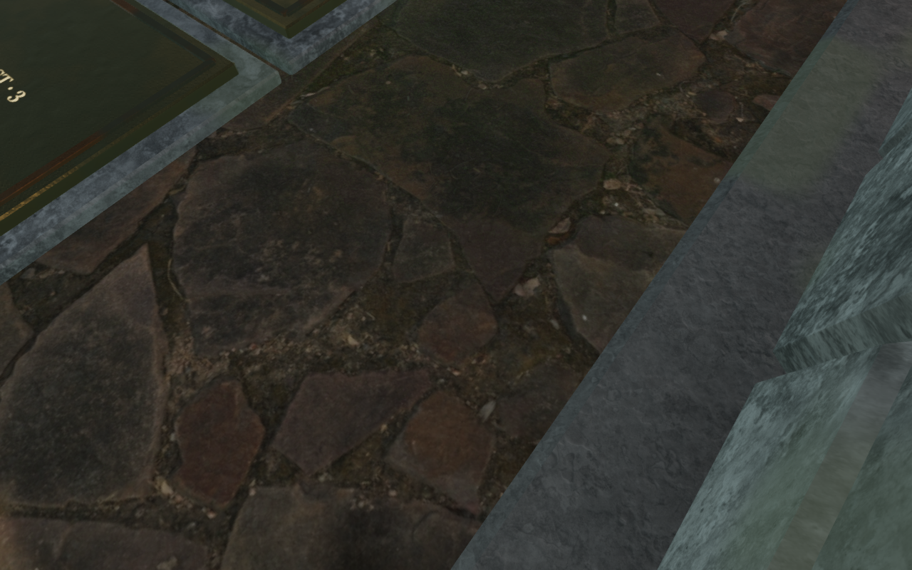
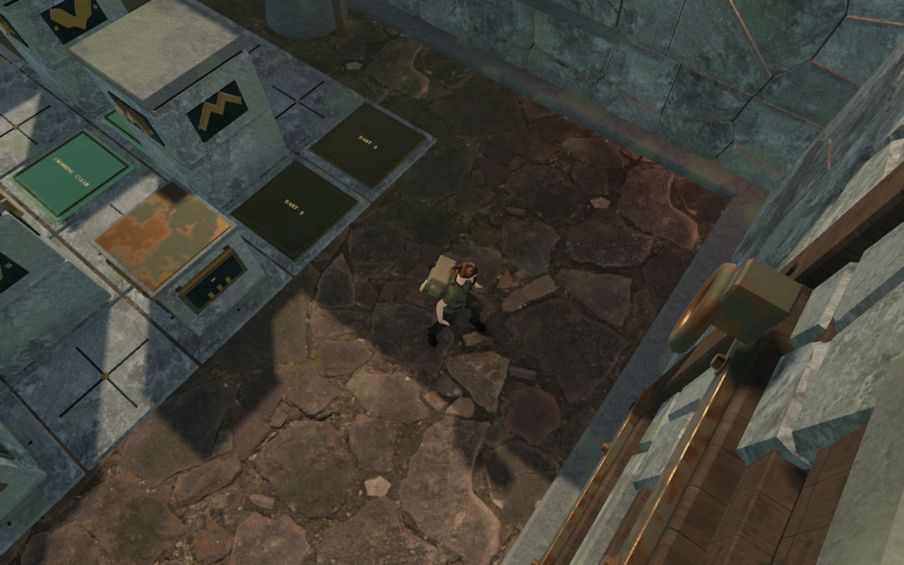
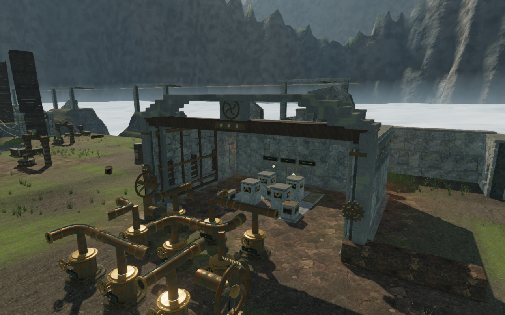
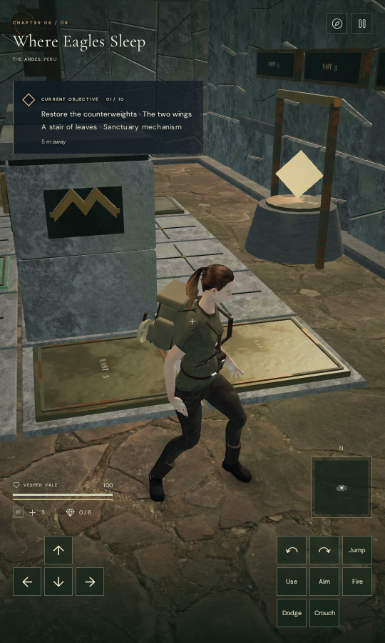

# Cloud chamber walking aisle

Walking beside the first cloud chamber's counterweight board could hide the
explorer after releasing a stone. The camera ray crossed the chamber's actual
side wall and folded door leaf. In the earlier High/Low replays, the arm ended
at 0.266 m and the character faded completely. This was VA-45, separate from
the accepted-grip and slide repair in [counterweight working views](counterweight-camera.md).

The first cloud court now spans 18 m instead of 13 m. Both side walls move
outward by 2.5 m. The back wall, lintels, crown bearings, hinges, drive assemblies
and door leaves are built for that span. Wider leaves use three framed louver
bays, extended straps and a fitted diagonal brace. Circular hinges, pins, wheels
and the central crest retain their dimensions. There is no whole-room scaling.

These views begin from the same settled two-move save and use the same camera
heading, pitch and quality. Each advances 24 ordinary walking ticks and 21 idle
follow-camera ticks. The updated walk reaches farther because the former side
wall no longer stops its lateral movement. The room change does not turn the
camera during free walking or disable its wall collision.

The five-by-five board, authored stone and wall cells, receivers, grip locations,
inscription and engine controls retain their positions and rules. Other gate
footprints retain their delivered widths. Walking and camera bounds follow the
wider construction and its inward-folding leaves. Exterior blind-bay backings
cover the longer folded panels, and foundation depths sample the moved walls'
complete terrain footprint. Positional drive emitters move with their visible
assemblies; the existing environmental soundscape and quiet scores remain.

## Verification

All **43 targeted tests pass** across sanctuary gates, counterweights and camera
collision. They cover all 69 gates, locked and restored thresholds, moving door
surfaces, fitted hinges, 180 regional walls, 27 cloud wall faces, buried footings
and sealed recesses. The new regression checks the wider locked doorway and
camera clearance along the recorded walking aisle. Both door widths retain
bounds around their transformed corners throughout the swing. All eight stone
trials still solve through the actual walking and gripping rules. The production
build and changed JavaScript formatting pass, with the existing chunk-size
advisory. The complete campaign suite was not rerun for this room change.

The updated High/Low walking replays contain **92 camera frames**. Their shortest
arm is **5.474 m**, with character coverage 1 throughout. All **eight baseline
and eight updated captures** are reviewed. The chamber's closed, partly swinging
and folded states and its three exterior faces contribute **22 reviewed views**
across High and Low. Recorded shaders link; these completed checks report no
browser errors or console warnings.

Two native production cases exercise keyboard High and portrait touch Low.
They accept legal stone pulls, release, walk and reload the local save. Their
net walking distances are 1.80 m and 2.10 m, and health remains 100. All **ten
production captures** are reviewed; the development hook is absent, portrait
layout has no horizontal overflow, no asset requests fail, and the loaded bundle
filenames match the current build. The keyboard case settles one move and the
touch case settles two; input is held until a saved move is observed.

Both reloads preserve the complete saved store apart from `lastPlayed` and one
existing arrival-camera correction in the touch case. An independent geometry
query measures its saved orbit at 3.709 m and the selected orbit at the full
5.381 m; the normal arrival selector matches the restored heading and pitch.
The heading changes by 45 degrees. A second reload retains the complete store
apart from timestamps. Restored feet agree within 5 cm, with stone positions,
field work, health, discoveries and chapter progress preserved.

A continuous assisted route starts from the earlier earned opening-route save,
walks to the inscription and board, solves all **14 stone moves**, turns the
first engine's physical controls, activates it through the UI, and returns into
the chamber and back to its inscription. It covers **185.349 m** at health 100,
with no stalled route or recorded ground step over 6.7 cm. All **64 route captures**
are reviewed, with linked shaders and no browser errors or console warnings.
Direction steering and puzzle solutions are assisted; this does not establish
an unassisted chapter playthrough or consumer-hardware performance.

Some free approach/return views remain close enough to fade the explorer,
including the final forecourt view near the inscription. The route verifies
playability; it does not establish full character visibility across all of those
approaches. They remain VA-46 in the wider camera/composition audit. A separate
stationary replay of that final position keeps its recorded heading and pitch
and advances 120 ordinary camera updates. The arm extends from the route's
1.739 m to 2.070 m, with character coverage 0.909. A fixed cylindrical wind
bearing in the forecourt remains in the desired camera segment; the chamber
side wall and folded leaf do not. The extra diagnostic capture is reviewed.

The later [inscription relocation](cloud-inscription.md) clears that recorded
reading/reset place and final return. Its repeated route retains a visible
explorer at the new tablet; other free approaches remain under review.

The verified production files are:

- `index-JIWf8hKd.js`
- `game-35pnPpOf.js`
- `three-mu_AYolc.js`
- `index-CQBT4VmC.css`

## Limits and provenance

This change addresses the recorded counterweight aisle. Arbitrary player-chosen
orbits can still meet a solid wall and use the existing close-camera fade. The
observatory approach finding VA-39 and broader chapter composition remain open.
The checks do not establish subjective sound quality or supported-device
performance, and the overall visual audit remains unfinished.

The construction is original procedural artwork using the existing credited
chapter masonry maps and wind metal/timber materials. No external model,
texture, sound or dependency was added. The four documentation images are
actual game captures converted losslessly to WebP, with decoded RGBA identity
verified. Test saves, browser profiles and raw captures remain under ignored
local staging.
