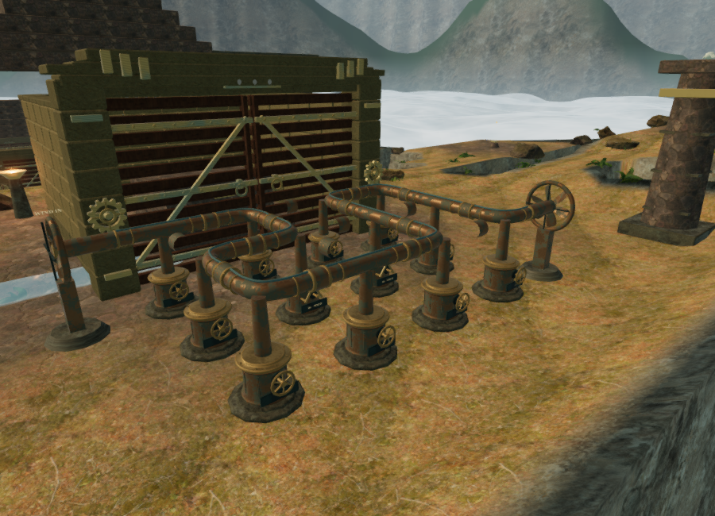
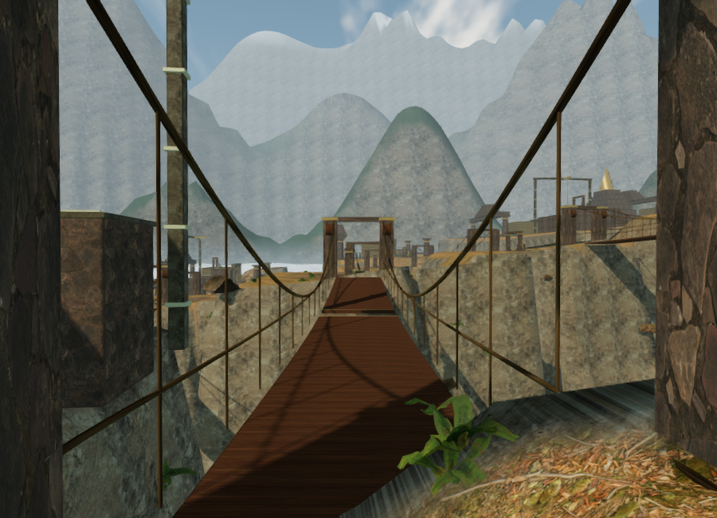
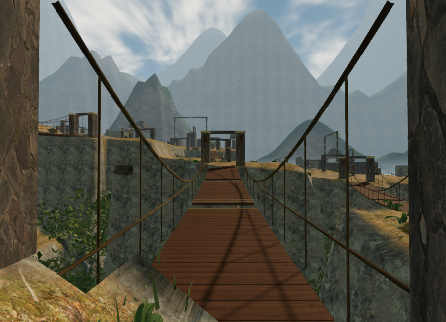

# Cloud-city atmosphere and distant landscape

The sky chapter now has three surrounding Andean-inspired ridge layers, drifting high clouds and a shaped cloud bank below its crossings. Cooler fill light and a lower, warmer sun give its stonework and bronze stronger separation. The visible sky and filtered reflection capture use the same sky shader.

## Landscape and light

The ridge height fields combine distinct authored peak placements, asymmetric slopes and eroded ribs. Their nearest vertices sit beyond every corner of the playable map. Rock uses the existing local rock map with three-way projection; slope and altitude blend vegetation, exposed rock and snow. Distance haze separates the layers, and mist softens their lower slopes. Vertex positions stay fixed in the world as the player moves, retaining parallax.

The three ranges contain 64,512 triangles. The cloud bank adds 32,768 triangles, for 97,280 triangles in four background meshes. They neither cast shadows nor enter contact-occlusion buffers. Ridges use background depth so their silhouettes remain visible beyond the gameplay camera's far range.

The bank uses animated surface displacement between −34 m and −11 m, shaded according to its shape and cloud noise. Its highest points remain below all crossing and objective approaches. It conceals the distant flat water backdrop; small reservoirs and waterfalls retain their surfaces and audio. Terrain heights, bridge foundations, map layout and collision stay at their existing positions.

High clouds use slowly moving noise layers. The sun direction is (−80, 88, −65), direct-light intensity is 2.2, hemisphere intensity is 0.55, and sky-reflection intensity is 0.6. Scene fog density is 0.0017. These are artistic lighting values, not a simulation of a particular real location or weather observation.

All new geometry and shading are original to this repository in `src/cloud-city.js`. Existing credited rock textures are reused; no new external assets were downloaded.

## Rendered views

The preceding High-quality court view:

The same court and camera with the new environment, in High quality:

Bridge views facing opposite sides of the valley, also in High quality:

`scripts/inspect-cloud-city-browser.js` reproduces the bridge cameras at 900 × 650. The checked eastward High view submitted 1,795 calls and 4,153,532 triangles across rendering passes; the westward view submitted 1,594 calls and 4,054,480 triangles. The final Low eastward view submitted 585 calls and 1,009,713 triangles. All linked their shaders. Different views, shadow coverage and detail-transition states change these counts; they are workload observations from ANGLE/SwiftShader software rendering, not consumer-hardware frame rates.

Advancing only the atmosphere clock from 10 to 610 left the player and camera coordinates unchanged while updating both cloud clocks. Screenshots showed changed cloud pixels; the inspected 560 × 240 upper region had a mean channel difference of 1.293 out of 255. This verifies visible animation, not its performance on supported hardware.

## Verification and limits

All 250 automated tests pass. New coverage checks finite upward-facing ridge surfaces, matching geometry and lighting at the circular seams, separation from the playable map, cloud clearance, unchanged terrain/map data and local reservoirs, world-space parallax, cloud timing and matching sun direction. The production build succeeds with the existing large Three.js chunk advisory.

Browser checks retained all 119 dry and clear wind controls, all 260 clear wind-source approaches, and all 119 local routes with swimming updates included. All 54 bank approach legs and 36 bidirectional bridge crossings passed. Native E turned and saved the second engine's first casting and started the corresponding hand-grip state. The development console reported no warnings or errors during the checked views.

The final High production build loaded `index-B2tJLFRy.js`, `game-CKw9iHBR.js`, `three-eUiOk3Oc.js` and `index-EpzmVKat.css`. Native E advanced the second engine's first casting from mask 3 to 6 and its move count from one to two. Native W changed the saved position to `(79.04505247147667, 122.96574100005053, height 0)`. Pausing recorded 142.51590000003577 active seconds at 100 health. Reloading while preparation was held and the tab lost focus restored that exact position, time, health, stage, field actions and both engine records. No asset requests failed, the development hook was absent, and the production console had no warnings or errors.

A live check at the second engine selected six fully loaded loop voices from 375 registered sky sources, within the twelve-voice cap. Its nearby wind collector remained unobstructed, while distant birds, ridge wind, fire and machinery retained obstruction filtering. The mix remained at 32% music, 80% ambience and 75% effects. This confirms integration with the existing soundscape; measured attenuation and adaptive-score behavior are documented in [audio verification](audio-verification.md) and [wind engine notes](wind-engines.md).

Switching to the crystal chapter disposed all five new geometries and five materials, plus the old sky reflection render target. The cloud-city update reference became null, and no wind sites, wind sources or old wind voices remained. The development console remained free of warnings and errors. Temporary development and production verification saves were cleared, and both origins returned to the title screen with empty chapter records and High quality selected.

These are assisted integration checks. Consumer-hardware performance, subjective sound quality, approximately one hour of unassisted gameplay per chapter and AAA graphics remain open requirements in [production status](production-status.md).
