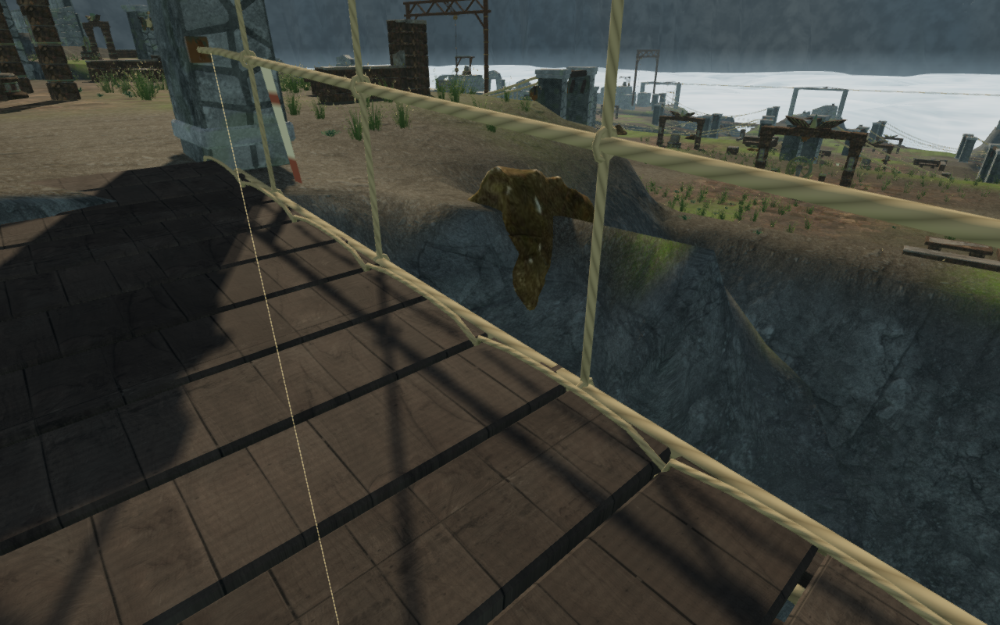
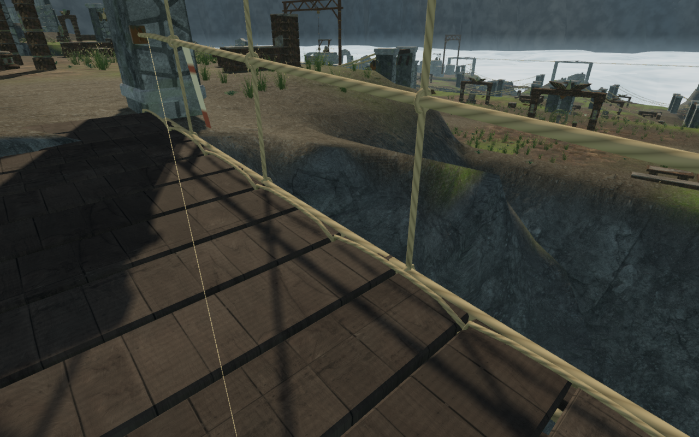

# Supported cloud-cliff stones

A pointed part of a scanned rock hung over the cliff beside cloud span 13.
The main body was buried in the ridge, and all 43 cached fitting samples sat
below the ground. Independent rays through the actual mesh found 27 of 678
underside samples more than 15 mm above the rendered terrain, including sixteen
above 25 cm. The largest measured gap was 61.968 cm.

Cloud rock fitting now adds upward rays at projected vertices and the centers
of downward-facing triangles. Each takes the first underside intersection and
caches it with the existing grid samples. This catches narrow scan edges that
fall between grid rays and avoids seating an upper internal concavity as a
separate root. The recorded specimen has 1,978 fitting samples. The cloud
chapter opts into this fitting; the six delivered scans retain their geometry,
UVs, textures and [asset attribution](asset-credits.md).

The recorded instance moves down 79.008 cm. Repeating the same 678 independent
underside rays against actual terrain triangles gives a highest root gap of
−17.040 cm. Its accepted placement still has a small exposed crown. From the
same bridge observer, the hanging point is concealed by the ridge.

The stronger fitting accepts 79 of 350 candidates, with 47 reserved and 224
rejected as unsupported. The preceding layout accepted 148 candidates. Scans
whose complete sampled underside cannot meet the terrain while leaving a
visible crown are omitted. Independent 31-by-31 world grids verify all 79
retained instances through 36,464 underside rays: every queried root lies at
least 51.366 mm below the delivered terrain triangles. This observer reads
the actual Float32 instance transforms and does not reuse the fitting samples.

The meadow regenerates around the retained stones with 12,727 plants in 376
batches. All 3,105,936 sampled roots per progress state remain below rendered
terrain, with a highest gap of −10.032 mm. Rock and plant matrices remain
identical after saving and restoring all nine open gates. Both progress states
have no recorded root, obstacle or door-envelope failures.

The delivered-model regression reproduces the hanging point even while every
old cached fitting sample is buried. It fails with the previous fitting and
passes with the expanded probes using independent dense world-space rays.
All 798 campaign checks across 122 files pass without failures, cancellations
or skips. The production build passes with its existing bundle-size advisory.

All eighteen banks are reviewed from both ends and sides in High, with six
additional Low observers: 78 views in total. All five complete cloud climbing
loops pass with health 100 and no camera fades across 7,634 updates. Each starts
at one supported placement, then uses continuous controller movement through its approach,
mantles, jump, rope, summit, animated return cable and ground return. These
completed-expedition fixtures do not advance enemy AI or combat.

All 129 loop captures are reviewed. A dark projection beside the third course
also receives a closer geometry check: its 444 independent underside rays and
485 downward-face centers remain below the ground, so it is a seated exposed
crown. The route review records a separate partial body obstruction behind a
bridge post as VA-67; camera opacity alone does not establish body visibility.

Gate checks retain nine clear thresholds, 59 feature approaches, eighteen
discovery stances and eighteen reachable sound fronts. All 119 wind-control
movement legs pass, and all 249 potentially audible wind-source fronts remain
clear. Eleven fixed bearings retain their recorded occlusion results and emit
no turning voice. Distance falloff and the themed music retain their behavior.

Both keyboard/High and touch/Low production cases verify manual look, crouched
ground movement, full health, retained progress and explored cells, and
complete-store reloads apart from chapter timestamps. The second reload is
stable, with no arrival-camera corrections. Loaded assets match the final
build; there are no browser errors, warnings, failed resources or horizontal
overflow. All six native captures are reviewed.

These lossless comparisons use the same bridge observer and High presentation.
They measure the recorded rock and sampled retained placements; they do not
establish complete landscape acceptance. Broader court and discovery
composition, campaign routes, subjective listening and device acceptance
remain open. The preceding [bridge-side path repair](bridge-side-paths.md)
retains its separate explorer-contact evidence.
