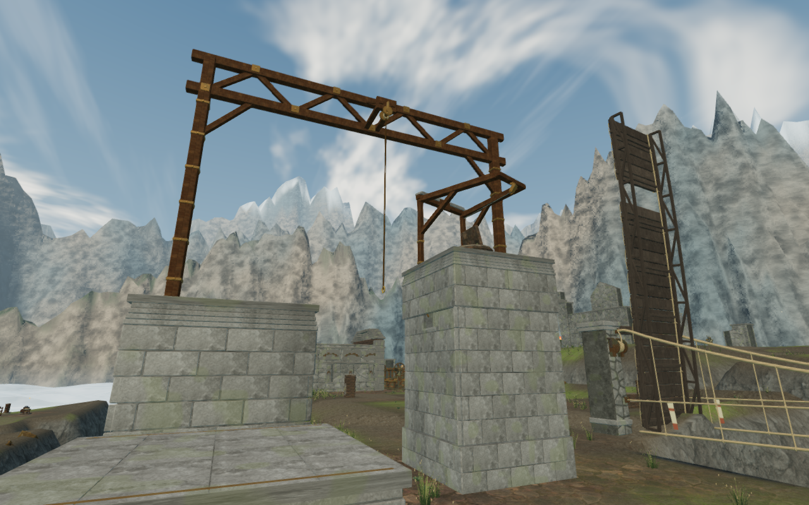
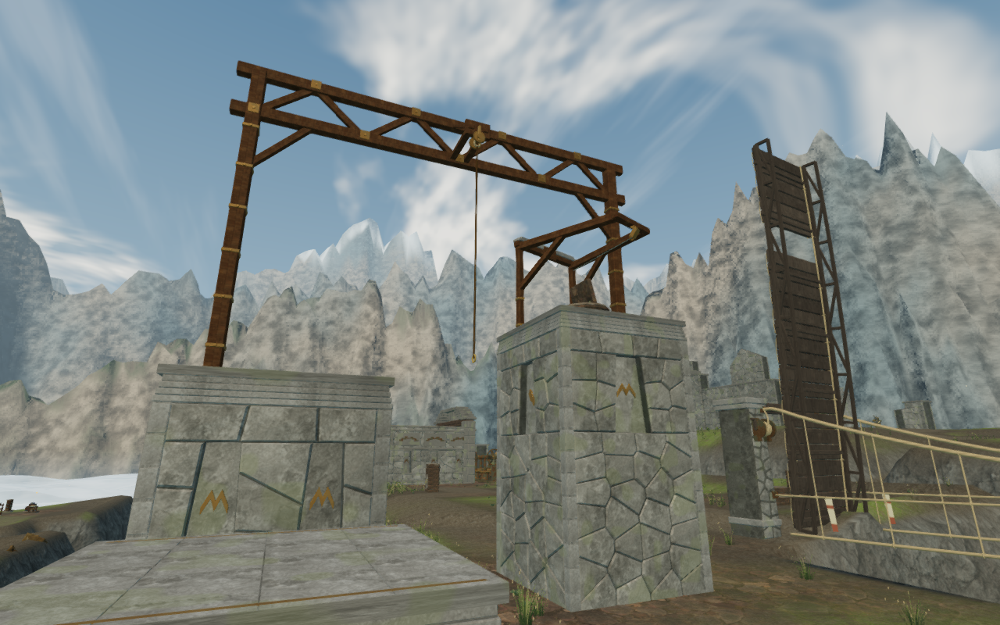
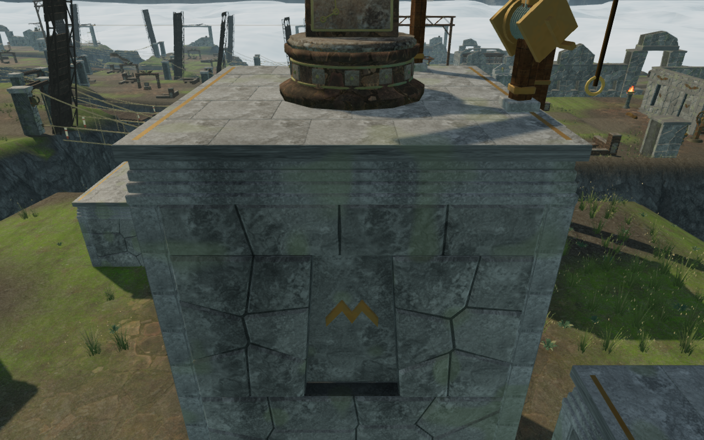

# Fitted cloud climbing piers

The cloud city's 25 climbing piers now use irregular fitted granite instead
of the repeated rectangular ashlar grid. Their tall faces have single or
paired tapered bays with physical reveals, sealed stone tablets and seated
bird, crosswind or terrace reliefs. Dressed corner stones have continuous
bearing behind their joints, and the facing stops at that corner construction.
The short first piers retain solid faces. This connects the climbing routes
with the chapter's existing citadels and carved wind chambers.

The treatment stays inside the existing pier solids. The five landing
locations, complete standing roofs, recessed bronze markers, coping bands,
rope pivots, lengths, terminal frames and return cables retain their geometry
and support heights. The construction preserves the seed sequence used by
those later pieces. It reuses the existing regional granite and bronze
materials and original code-built reliefs; [asset attribution](asset-credits.md)
is unchanged.

A denser construction observer exposed an unsupported thin facing edge during
development: a ray 3 cm inside a summit pier's outline first met stone 1.184 m
above the queried ground. The older foundation observer sampled farther in.
A full buried bearing bed now supports the outer facing as well as the center.
Its upper face is 2 cm below the terrain minimum used to fit that pier. A
regression reproduces the missing support before the bed and verifies all
3,025 independent border-inclusive foundation rays afterward. A second
regression checks actual recessed backing on all eighty tall pier faces;
the previous shallow panels fail its depth requirement.

The 802-check campaign suite across 122 files passes without failures,
cancellations or skips. All sixteen climbing checks are repeated after the
final corner refinement. They cover full roof edges and corners, terrain
bearing, backed wall/coping joints, bronze marker seating, terminal contact,
rope clearance, camera views and positioned hoist behavior. The production
build passes with its existing bundle-size advisory.

The final browser observer checks all 25 piers through 11,025 roof rays,
3,025 underside rays and 1,080 backing rays across 120 bays. Roofs retain
their narrow paving joints, and every sampled facing root and bay is backed.
The maximum roof difference is 5.002 mm; the highest sampled underside is
209.999 mm below queried ground. Bay backs sit 335.605–342.850 mm behind
the outer face. The fixed/detail buffers use 87,306–89,133 vertices per course,
compared with 57,732–58,776 before this treatment, while the complete course
still meets its existing 180,000-vertex test budget.

All 105 High construction views and ten additional Low views are reviewed,
along with 45 earlier comparison views. Some external observers have
foreground terrain; these views do not establish every possible walking view.

All five complete cloud climbing loops pass with health 100 and no camera
fades across 7,758 updates. Each uses one supported starting placement and
continuous controller movement through its approach, mantles, jump, rope,
summit, animated return cable and ground return. The recorded positions,
camera positions, chosen angles and traversal states match the preceding
post-clearance routes exactly. All 131 final route images are reviewed.
These completed-expedition fixtures do not advance enemy AI or combat.

Both keyboard/High and portrait touch/Low production cases climb the first
pier through native input, crouch and look on its supported roof, then
descend to ground. Health, progress, explored cells and complete-store
reloads remain stable apart from chapter timestamps, with no arrival-camera
corrections. Loaded bundles match the final build; no development hook,
browser errors, warnings, failed
resources or horizontal overflow are present. All fourteen native captures
are reviewed.

These lossless High images use the same course observers. The new faces are a
regional art improvement; the basic five-pier traversal layout still repeats.
Broader court, discovery and landscape composition, campaign visual coverage,
subjective sound/mix review and device acceptance remain open. The positioned
hoist sources and quiet climbing arrangement retain their existing movement
and distance behavior.
